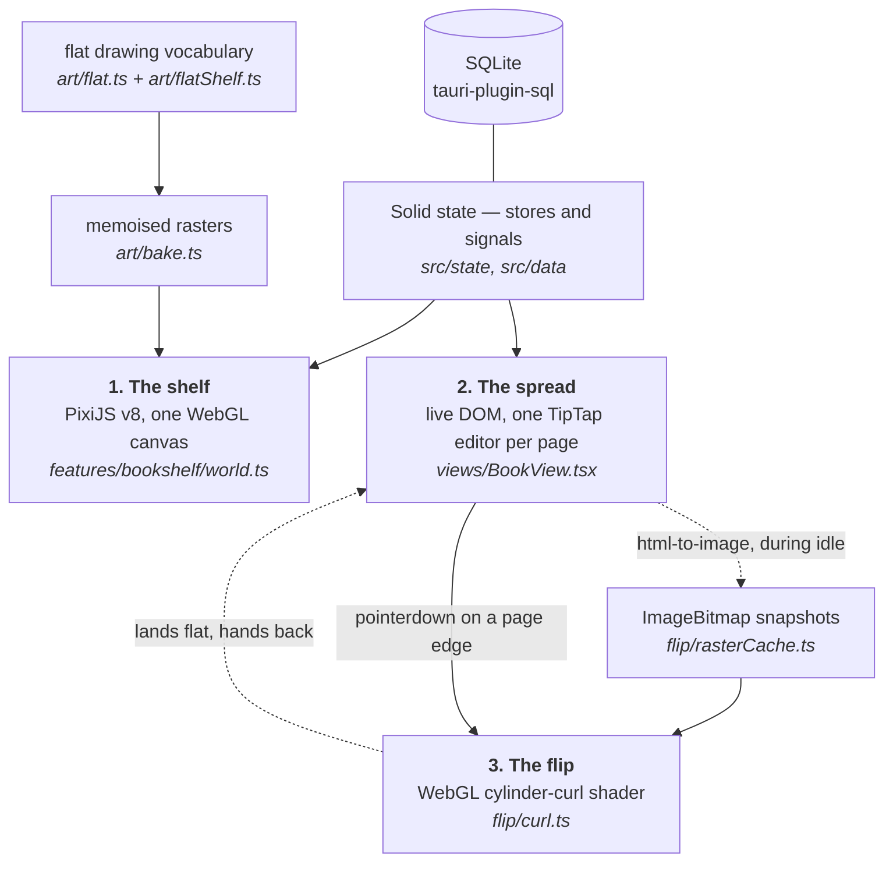
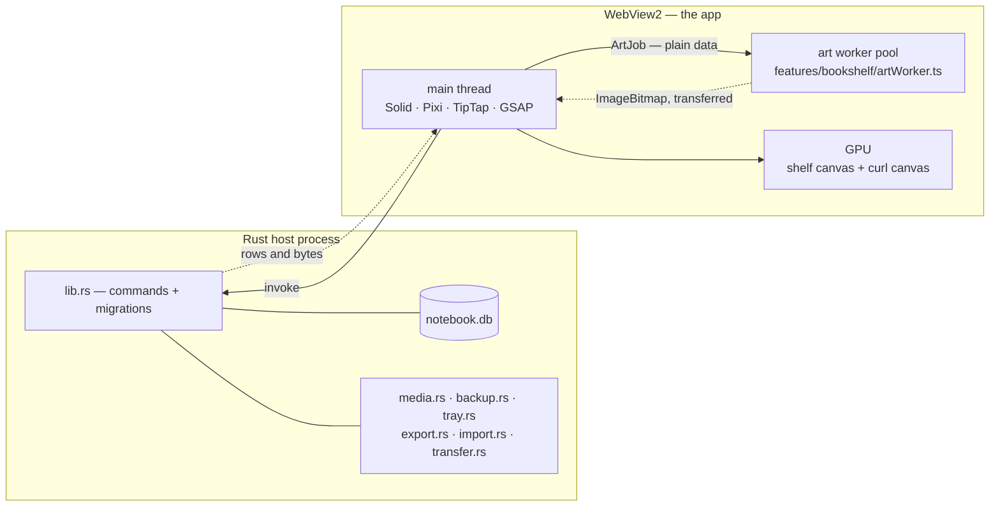

<p align="center">
  
</p>

<!--
  The badge strip below is GENERATED — `npm run readme:build` composes it from
  the version in package.json, so a release bump moves the badge, the download
  filenames and the release table together. Edit scripts/gen-readme.mjs, not
  this block.

  Two badges are deliberately static images rather than live shields endpoints:
  the repository is private, so shields cannot read its releases or its actions
  and would render "inaccessible" instead of a fact. When it goes public, swap
  the first two in renderBadges() for:

  https://img.shields.io/github/v/release/AkshitIreddy/alcove
  https://img.shields.io/github/actions/workflow/status/AkshitIreddy/alcove/release.yml
-->

<!-- gen:badges -->
<p align="center">
  <a href="https://github.com/AkshitIreddy/alcove/releases/latest"></a>
  
  
  
  
</p>
<!-- /gen -->

<h1 align="center">Alcove</h1>

<p align="center">
  <b>A Windows notes app that puts your notes on a bookshelf you can walk around in.</b>
</p>

<p align="center">
  <a href="#download-and-install"><b>▸ Download</b></a>
  &nbsp;·&nbsp;
  <a href="#the-first-ten-minutes"><b>▸ Start here</b></a>
  &nbsp;·&nbsp;
  <a href="#for-developers"><b>▸ For developers</b></a>
</p>

---

Alcove keeps what you write in books standing on shelves in a hand-drawn room,
instead of in a list of filenames. You pan and zoom around that room, pull a
book off its floor, and it opens as a two-page spread you write in with a block
editor of the kind you already know — slash menu, drag handles, right-click
menu, tables, callouts, code, diagrams.

Everything is one SQLite file on your own disk: no account to make, nothing to
sign into, and no network call unless you ask for one. It is built with
[Tauri 2](https://tauri.app/) (Rust) and [SolidJS](https://www.solidjs.com/),
draws its shelf on [PixiJS](https://pixijs.com/) and its pages with
[TipTap](https://tiptap.dev/), and ships as a Windows installer that borrows the
system webview instead of bundling a browser — so the download is small, and
nothing runs in the background once you close the window unless you switch on
tray quick capture.

<p align="center">
  
  
</p>

**This page is the whole manual.** Everything a reader needs is written out
below rather than linked to — install, first run, every block a page can hold,
the whole customisation vocabulary, the keyboard, backups, and the developer
half's essentials. The deep design records stay in
[`docs/design/`](docs/design/) for people changing the code.

<!-- gen:contents -->
**On this page:** [What is actually in the box](#what-is-actually-in-the-box) ·
[Download and install](#download-and-install) · [Release notes](#release-notes) ·
[The first ten minutes](#the-first-ten-minutes) · [A tour](#a-tour) ·
[Writing in a book](#writing-in-a-book) · [Notebook Script](#notebook-script) ·
[Making it yours](#making-it-yours) · [Sound](#sound) ·
[The keyboard](#the-keyboard) ·
[Backups, export and import](#backups-export-and-import) · [Questions](#questions) ·
[For developers](#for-developers) · [How it's built](#how-its-built) ·
[Getting it running](#getting-it-running) ·
[The map of the app](#the-map-of-the-app) ·
[Building and releasing](#building-and-releasing) · [Non-goals](#non-goals) ·
[The repo at a glance](#the-repo-at-a-glance) · [Deeper reading](#deeper-reading) ·
[How this page stays honest](#how-this-page-stays-honest) ·
[Licence and credits](#licence-and-credits)
<!-- /gen -->

## What is actually in the box

- **A bookshelf world.** A WebGL room you pan and zoom through, with as many
  bookcases as you care to build and <!--f:defaultFloors-->10<!--/f--> floors
  per case to start with. Books are drawn objects, not rows in a list — you
  recognise yours by its binding.
- **Pages that never scroll.** A page is a fixed leaf of paper. When you fill
  it, the trailing blocks flow onto the next page, and a new page is made if
  there isn't one. Turning a page is a page turn, not a scroll.
- **Notebook Script.** A small Markdown dialect you can hand to any chatbot.
  Ask it for a note, paste the reply into *Insert script*, and it becomes
  formatted pages — including trees, graphs and timelines drawn as hand-drawn
  diagrams.
- **Customisation that goes further than a colour picker.**
  <!--f:roomPresets-->69<!--/f--> named rooms,
  <!--f:shelfPresets-->113<!--/f--> named bookcase designs,
  <!--f:wallpaperPapers-->126<!--/f--> wallpapers,
  <!--f:bookPresets-->189<!--/f--> book bindings,
  <!--f:stickers-->50<!--/f--> stickers,
  <!--f:effectAxes-->11<!--/f--> axes of block decoration.
- **The quiet infrastructure.** Full-text search, a `Ctrl+K` switcher, scheduled
  backups, an export bundle that another copy of the app can import, a tray icon
  for capturing a thought without opening the window, and a sound for everything
  you touch.

Every number on this page was read out of the module that defines it and
wrapped in a marker `npx vitest run` recomputes — see
[How this page stays honest](#how-this-page-stays-honest).

> [!NOTE]
> **Where this stands, so you can judge it before installing.**
> - **Windows only.** Windows 10 or 11, x64. The macOS and Linux rows of the
>   table below say "not built yet" rather than linking to something that is not
>   there. There is no mobile app and no browser version.
> - **Pre-1.0.** This is the first release. The app is finished enough to write
>   in every day — that is what it is used for — but the version number is
>   honest about how long it has been in anybody else's hands.
> - **Your library is one local SQLite file.** No account, no sync, no cloud, no
>   telemetry — `telemetry` is typed as the literal `false` in
>   [`src/data/types.ts`](src/data/types.ts), so it is not a setting that can be
>   turned on. That is a deliberate design, not a missing feature, and it means
>   the scheduled backups are your only copies.
> - **Two things touch the network, and both because you asked.** Searching for
>   a picture (`::fetch` in Notebook Script) and previewing a link you pasted.
>   Both are https-only, refuse private and loopback addresses, time out fast
>   and cap what they will download. Nothing else leaves the machine.

<!-- gen:lift-download -->
## Download and install

Alcove is one installer you double-click. It does not ask for an administrator,
it does not bring a browser along with it, and there is no account to make.

| Platform | Download | What you get |
| --- | --- | --- |
| **Windows 10 / 11** · x64 | [`Alcove_0.1.0_x64-setup.exe`](https://github.com/AkshitIreddy/alcove/releases/latest) · about 15 MB | The one to take. Installs for **the current user**, so Windows never asks for an administrator, and lands in `%LOCALAPPDATA%\Alcove`. |
| **macOS** · universal | not built yet | The release job builds one universal `.dmg` carrying both the Apple-silicon and the Intel slice, so there is nothing for a reader to choose between — but it has never produced one. |
| **Linux** · x64 | not built yet | The same job builds a `.deb`, an `.rpm` and an AppImage on `ubuntu-22.04`, so they start on 22.04 and anything later. Also never produced. |

Beside the installer sits `Alcove_0.1.0_x64_en-US.msi` — the same app as an MSI, for anyone who deploys software with a policy rather than a double-click. Everything is attached to the GitHub Release by `.github/workflows/release.yml` when the version tag is pushed, with a `SHA256SUMS.txt`, and **nothing is signed on any platform** — so Windows shows a SmartScreen warning the first time and macOS will quarantine the first launch. If the Releases page is empty, that tag has not landed yet: `npm run tauri build` writes the same artefacts for whichever platform you are on, into `src-tauri/target/release/bundle/`.

The one requirement is the Microsoft Edge **WebView2** runtime — already present
on Windows 11 and on any up-to-date Windows 10, and fetched by the installer if
it is missing. Alcove is a [Tauri](https://tauri.app/) app, so it uses that
system webview instead of shipping a browser of its own: the download stays
small, and nothing runs in the background when the window is closed unless you
turn on tray quick capture.

### What the installer does, and where things end up

The NSIS build is configured with `installMode: currentUser`
([`src-tauri/tauri.conf.json`](src-tauri/tauri.conf.json)), which is the whole
reason there is no administrator prompt: the program is written into your own
user profile rather than into `C:\Program Files`.

| | Where |
| --- | --- |
| **The program** | `%LOCALAPPDATA%\Alcove\` — your account only, no elevation, no machine-wide registry keys |
| **Your library** | `%APPDATA%\com.alcove.app\notebook.db` (plus `notebook.db-wal` and `notebook.db-shm` while the app is running) |
| **Pictures you paste or fetch** | `%APPDATA%\com.alcove.app\assets\` |
| **Backups** | `%APPDATA%\com.alcove.app\backups\`, or the folder you choose in *Settings → System* |

The two roots are deliberately separate, and that separation is the useful part:
**uninstalling removes the program and leaves your notes alone.**

### The first time you open it

Nothing to configure, nothing to sign into, no splash screen. In order:

1. **A library is created** at the path above and seeded with exactly one book —
   *Welcome to Alcove ✎* ([`src/data/seed.ts`](src/data/seed.ts)) — which is a
   real book you can edit, rename or crumple like any other. It is also a worked
   example: every page of it is authored in Notebook Script.
2. **You are asked four questions about your taste** — how much colour you want,
   what kind of room, and so on — and the whole library is dressed from your
   answers, so what you see next is a room you chose rather than a demo.
3. **The guided tour runs**, <!--f:tourSteps-->21<!--/f--> steps in a long or a
   short version, each asking for one concrete action and turning green when it
   sees you do it. Skip it if you would rather poke at it yourself; *Settings →
   Help → replay the tour* starts it again later.
4. **The room is quiet until you touch it.** A fireplace bed is mixed low under
   everything by default, and the webview's autoplay policy holds it until your
   first click — so the app is never making noise at somebody who has not
   touched it yet. One switch turns it off for good.

What you land on is the shelf itself, which is where [the first ten
minutes](#the-first-ten-minutes) picks up.

### Uninstalling

Settings → Apps → Installed apps → Alcove → Uninstall, or run the uninstaller in
the install folder above. Your library is not in that folder, so it survives. If
you want it gone as well, delete `%APPDATA%\com.alcove.app` afterwards — and take
a `.nbk` bundle first if there is any chance you will want it back.

### Building it yourself

You do not have to take the published build. `npm install` then
`npm run tauri build` writes the same artefacts for whichever platform you are
on, into `src-tauri/target/release/bundle/`. The toolchain is Node plus a stable
Rust toolchain and nothing else; [Getting it
running](#getting-it-running) is the whole story.
<!-- /gen -->

## Release notes

### 0.1.0 — the first release

Everything named below is in the installer above. It is a first release rather
than a preview: the shelf, the editor, the script language, the two studios, the
backups and the transfer bundles are all finished and in daily use.

**The room.** A WebGL bookshelf you pan and zoom through, with as many bookcases
as you care to build. Books drag out of the shelf, move between cases, and carry
their own binding wherever they go. The customisation is the point of the
release: <!--f:roomPresets-->69<!--/f--> named rooms,
<!--f:shelfPresets-->113<!--/f--> bookcase carpentries,
<!--f:wallpaperPapers-->126<!--/f--> wallpapers and
<!--f:bookPresets-->189<!--/f--> bindings, plus
<!--f:roomThemes-->60<!--/f--> colour schemes on their own — and every long list
takes a hex code of your own, stars what you like and hides what you do not.

**The pages.** A block editor with <!--f:slashCommands-->99<!--/f--> slash
commands, <!--f:stickers-->50<!--/f--> stickers and
<!--f:effectAxes-->11<!--/f--> axes of block decoration carrying
<!--f:effectValues-->472<!--/f--> values. Pages are fixed leaves that never
scroll: fill one and the trailing blocks flow onto the next, carrying your caret
with them. The turn is a real page turn — live DOM at rest, a WebGL cylinder
curl during the gesture.

**Notebook Script.** A Markdown dialect small enough that a chatbot writes it
correctly first time, with <!--f:scriptContainers-->24<!--/f--> containers and
<!--f:scriptDiagrams-->5<!--/f--> kinds of drawn diagram. *Copy AI spec* puts
the whole generated grammar on your clipboard; *Insert script* previews what it
recognised before it lands.

**The quiet infrastructure.** Full-text search and a `Ctrl+K` switcher across
every bookcase, scheduled ZIP backups, `.nbk` bundles that import additively
with a restore point, Markdown in and out, tray quick capture, and
<!--f:soundSets-->28<!--/f--> sound sets over
<!--f:ambienceBeds-->10<!--/f--> ambience beds.
<!--f:settingsOptions-->40<!--/f--> settings and
<!--f:rebindableKeys-->24<!--/f--> rebindable shortcuts.

**Known edges in this release.**

- **The template gallery, Markdown import, PDF export and PNG export have no
  button yet.** The code is finished and covered end to end by the Playwright
  suite, which drives it through a development hook rather than through the UI.
  Until a rail entry is wired, they are not reachable from the installed app.
- **Windows only, for now.** The release job builds macOS and Linux as well, but
  neither has ever been produced — the table above says so rather than linking
  to a file that does not exist. Nothing is signed on any platform.
- **No CI badge.** The only workflow fires on a version tag, so nothing runs
  `tsc` or `vitest` on an ordinary push yet. The gates run locally, and again at
  the tag.

<!-- gen:lift-manual -->
## The first ten minutes

1. **You arrive at the shelf.** One bookcase, <!--f:defaultFloors-->10<!--/f-->
   floors, one book on it. The
   plain mouse wheel **zooms**, shift+wheel pans, and dragging bare wall moves
   the camera. (If you would rather the wheel scrolled and the shift key zoomed,
   swap them in *Settings → Library & shelf*.)
2. **Pull the book off.** Drag it out of its slot — a plain click works too, as a
   quick pull. `Escape` puts it back and returns the camera to the shelf, from
   anywhere in the app.
3. **Write something.** Click any ruled line and start typing. Clicking empty
   paper below your last line starts a new line there rather than doing nothing.
4. **Press `/`.** The block menu opens on an empty line:
   <!--f:slashCommands-->99<!--/f--> commands, filtered as you type. `head`
   finds the headings, `tab` finds the table, `cat` finds the cat sticker.
5. **Right-click a block.** Turn it into something else, colour its ink, wash it
   in a highlight, split it into columns, duplicate it, or copy it out as script.
6. **Look at the left rail.** Every book-level tool lives there as a hand-drawn
   icon with its own tooltip: customise the book, change the paper, browse the
   catalogue, the table of contents, page history, ribbons, focus mode,
   thumbnails, insert script, export script, copy the AI spec, add a page.
   There is no top bar anywhere in the app — the space goes to the pages.
7. **Make a second book.** Back on the shelf (`Escape`), the left dock has *new
   book*, *template*, *studio*, *add floor* and *trash*. Right-clicking bare
   plank offers four of those — a new book, one from a template, a floor and
   the studio — at the spot you clicked.

If you would rather be shown, the guided tour does exactly this walk inside the
app: <!--f:tourSteps-->21<!--/f--> steps, each asking for one concrete action and
turning green when it sees you do it, in a long or a short version. It opens by
asking four questions about your taste and dressing the whole library from the
answers, so the rest of the walk is through your own room. It runs on
first launch, and *Settings → Help → replay the tour* starts it again
([`src/features/tutorial/steps.ts`](src/features/tutorial/steps.ts)).

## A tour

Each picture below is a real capture of the running app, taken by the harness in
[`shots-now/`](shots-now/) — no mock-ups, no compositing. Each one is there to
prove the sentence above it.

### The shelf is the file browser

Books stand on floors of a bookcase, and the bookcase is the only file browser
there is: no tree, no list view, no "all notes". A floor is a shelf you can see
along, a slot is where a book stands, and the dashed outline at the end of a row
is the next free one. Camera and dock are as described in [the first ten
minutes](#the-first-ten-minutes) above.

![The Alcove shelf at 80% zoom: a dark walnut bookcase with a plain slab cornice, a chain of gilt rings running the length of every board and upright, and an ogee arch cut into the back of every recess, standing against cream wallpaper netted with a fine gold trellis. Three floors carry thirty-three books and no two spines are alike — cream label plates, gilt bands, raised cords, a green plate reading Field Notes, a leather one reading Sourdough, one book leaning against its neighbour — and a dashed outline with a plus in it marks the next free slot at the end of Floor 1. A fourth floor starts below them, empty. A cream dock on the left offers new book, template, studio, add floor and trash, its top button washed pale green; a zoom control reading 80% sits at the foot, and a moss-green settings seal in the bottom corner.](docs/readme/img/shelf.png)

Nothing here is a rectangle with a gradient on it: every spine is drawn from the
book's own seed through [`src/art/bookDesign.ts`](src/art/bookDesign.ts), baked
once to a texture and packed into an atlas. Floors you cannot see are not drawn,
so a case with three hundred books costs about what a case with three costs. The
camera, the virtualisation and the level-of-detail rules live in
[`src/features/bookshelf/`](src/features/bookshelf/) and are specified in
[`docs/design/bookshelf-rendering.md`](docs/design/bookshelf-rendering.md).

Right-clicking a spine gives you the book's own verbs — take it out, rename,
dress it, duplicate, move it along the shelf, send it to another bookcase, or
crumple it into the trash.

Pull back and the whole case is one object — <!--f:defaultFloors-->10<!--/f-->
floors as standard, up to <!--f:maxFloors-->60<!--/f--> when you keep pressing
*add floor*, and as many separate bookcases as you want to build.


### A book opens as a spread, and turns like a book

Two pages side by side, ruled paper, a tool rail down the left edge, and a word
count at its foot. Arrow keys turn pages; so does dragging the outer edge or a
corner of a leaf, which lets you take the turn at your own speed and change your
mind halfway.

![The Welcome book open on its first spread, its title on a little tab above the covers. The left page carries "Welcome to Alcove" in a large handwriting face with a gold star beside it, a paragraph with an amber-highlighted phrase, a green callout, a four-item bulleted list, and a green banner reading "The rest of this book is a tour of what the paper can do." The right page is headed Writing and shows bold, italic, code, struck-out text, a yellow highlight and a blue-grey colour wash; three checkboxes, the last ticked and crossed through; a yellow sticky note with a curled corner; and a strip of pink striped washi tape. A vertical rail of hand-drawn tool icons runs down the left edge with a word count at its foot.](docs/readme/img/spread.png)

Mid-turn, the leaf lifts off the spread and you can see the next page under it:


At rest the pages are live DOM, so text stays selectable and crisp. The moment
you start a turn, the app swaps to a WebGL cylinder-curl shader fed by
pre-rasterised snapshots of the two pages, then swaps back. That trade — and the
CSS fallback used when WebGL is unavailable — is written up in
[`docs/design/page-flip.md`](docs/design/page-flip.md) and implemented in
[`src/flip/`](src/flip/).

### Writing: a slash menu, and a catalogue of everything

Press `/` on an empty line for the menu. There are
<!--f:slashCommands-->99<!--/f--> commands in it, in three sections — the blocks
(diagram starters among them), the stickers, and *turn into* for changing what
the current line already is. It is defined in
[`src/editor/slash/registry.ts`](src/editor/slash/registry.ts), and the fuzzy
filter ranks a title prefix above a word-start above a substring, so short
queries land where you expect.


If you would rather browse than type, the rail's **Catalogue** shows everything
the pages can hold, shelved by kind — paper and cards, text blocks, callouts,
diagrams, tape and trim, lettering, stickers — with a search box across the top
for when you already know the word.

![The Catalogue panel open down the left edge, pushing the spread to the right rather than covering it. A box reading "search the catalogue…" sits at the top, then eight filter chips — everything (selected), paper & cards, text blocks, callouts, diagrams, tape & trim, lettering, stickers. Below them, a three-column grid under "paper & cards — things stuck to the page" holds twenty labelled tiles: Sticky note, Polaroid, Washi box, Card, Quote card, Banner, Spoiler, Index card, Envelope, Stamp, Tag, Margin note, Pressed flower, Ticket stub, Postcard, Ledger, Photo corners, Wax seal, Map pin and Columns. A second grid, "text blocks — the ordinary furniture", gets as far as Text, Heading 1, Heading 2, Heading 3, Bullet list and Numbered list before running off the bottom of the panel.](docs/readme/img/catalogue.png)

The catalogue and the slash menu read the *same* registry, so a block that
exists in one is in the other. That was not always true, and the day it stopped
being true is the most instructive bug in the repo — see [Things that were
harder than they
look](docs/readme/part-2-developers.md#things-that-were-harder-than-they-look) in Part 2.

### The studios: this is how deep the customisation goes

The **library studio** dresses the room. A room preset sets the colours, the
carpentry and the paper together, and every one of those stays yours to change
afterwards.

![The library studio open down the left edge, pushing the shelf to the right rather than covering it. The panel is headed "Library studio" and has "this library" and "your own" tabs; under "bookcases" a card shows a little drawing of the current case, "My Library", "33 books · 10 floors" and rename, clone and delete buttons, then "add bookcase" and "add a floor" and a line reading "this bookcase has 10 floors. everything below is dressed here." Under "presets — the house room" is a grid of room thumbnails, each a tiny painting of that whole room — The House Room (selected, ringed amber), Gilt Salon, Card Room, Carnival and a teal one running off the bottom edge — beside a dashed tile reading "64 more…". To the right stands the dark walnut bookcase against its gold trellis wallpaper, with the new book / template / studio / add floor / trash dock between them, studio lit, and a zoom control reading 80% at the foot.](docs/readme/img/studio.png)

The **book studio** dresses one book, and only that book: a binding follows its
book into every room, which is what lets you recognise it after you have
repainted the walls.

![The "Customize this book" panel open down the left edge beside the spread, with three tabs — "this book" (selected), "this library" and "your own". A large preview shows the Welcome book's plum spine, divided into panels by raised cords, with gilt rules, striped headbands at head and tail, and a gold label plate carrying the title. Spine and cover toggles sit beneath it, then "binding — read to death", the current binding drawn standing on a walnut shelf tile, and a grid of seven alternative bindings ending in a dashed "182 more…" tile.](docs/readme/img/book-studio.png)

Both are covered properly under [Making it yours](#making-it-yours).

### Finding things

`Ctrl+K` opens the switcher. It jumps to books and headings by fuzzy match,
weighted by what you have opened recently, and `>` (or the Tab key, or the tab
at the top) flips it into full-text search across every page in every bookcase.
Activating a search result opens the book, turns to the page and pulses the
match so you can see where it was.


Search deliberately ignores which bookcase you are standing in front of. You
open it because something you wrote is somewhere, and the one thing you reliably
do not remember is which room it was in.

## Writing in a book

### What a page can hold

Everything below is a real block type, reachable from the slash menu, the
catalogue or Notebook Script.

| | |
| --- | --- |
| **The ordinary furniture** | paragraphs, three heading levels, bullet and numbered lists, to-do lists with checkboxes, quotes, dividers, code blocks with syntax highlighting, tables |
| **Asides** | callouts (info, tip, warn, star), toggles that remember whether they were open, spoilers that hide an answer until clicked |
| **Paper and keepsakes** | sticky notes, polaroids, washi boxes, cards, quote cards, banners, index cards, envelopes, stamps, luggage tags, margin notes, postcards, ledgers, pressed flowers, ticket stubs, photo corners, wax seals, map pins |
| **Structure** | two or three columns, page links that list themselves back on the page they point at, footnotes |
| **Maths** | inline `$x^2$` and display equations |
| **Diagrams** | tree, mindmap, flowchart, graph, timeline |
| **Pictures** | paste or drop an image, image rows, link cards with a title and favicon |
| **Decoration** | <!--f:stickers-->50<!--/f--> stickers, and <!--f:effectAxes-->11<!--/f--> axes of block decoration carrying <!--f:effectValues-->472<!--/f--> values between them |

### The right-click menu

Right-click any block for the Notion-style context menu
([`src/editor/menu/registry.ts`](src/editor/menu/registry.ts)): **Turn into**,
**Color** for the ink, **Highlight** for the washes, **Columns**, **Effects**,
then insert above, insert below, duplicate, *copy block as script*, and delete.
Blocks can be dragged by the handle that appears in the margin, and dropping one
settles it into place rather than teleporting.

### Pages never scroll, and that is the point

A page is a fixed leaf of paper. When what you have written exceeds it, the
editor peels the trailing blocks off the end and hands them to the next page,
creating one if there isn't one — and it carries your caret across the break, so
you can keep typing straight through the join without noticing you crossed it.
Deleting from a full page pulls the blocks back.

It would be easier to put a scrollbar in a page. The reason there isn't one:

- **A page you can see all of is a page you can find things on.** A book of
  fifty short pages is navigable — thumbnails, a table of contents, a page
  number, a spread you can take in at a glance. One page of infinite length is a
  rope you have to pull.
- **The turn means something.** A page turn is a real boundary, and a
  page-curl animation over a scrolling div would be decoration. Here it moves
  you a real distance.
- **Footnotes can be at the foot of the page**, because there is a foot.
- **A blank page can be deliberate.** Leave one empty and it stays empty.

The contract lives in [`src/editor/pagination.ts`](src/editor/pagination.ts),
where the arithmetic is DOM-free and unit-tested, and it is the rule the rest of
the editor is built around: a footnote's text is stored *on the marker* rather
than in a table at the page level, precisely so that a footnote which flows to
the next page arrives with its note already attached
([`src/editor/nodes/footnote.ts`](src/editor/nodes/footnote.ts)).

Focus mode is a ladder rather than a switch
([`src/views/rail/focusLevels.ts`](src/views/rail/focusLevels.ts)): off, then
the chrome goes, then the book goes and leaves two bare leaves, then one leaf
alone edge to edge. There is a zoom on top of it, and it is a transform rather
than a bigger box — deliberately, because growing the leaf would change how much
fits on a page and repaginate your book behind your back.

### Maths, without a webfont

`$x^2$` inline, or an equation block on its own line. The renderer is a
documented TeX subset written for this app
([`src/editor/nodes/mathTex.ts`](src/editor/nodes/mathTex.ts)) — superscripts and
subscripts, `\frac`, `\sqrt`, big operators with limits, delimiters that grow,
the Greek alphabet and the usual relations and arrows, upright function names,
`\text{}` — rendered as plain HTML in the page's own serif face rather than
through KaTeX's Computer Modern.

It does not do matrices, alignment, cases or arrays, and says so: those are
documents rather than afterthoughts, and half a matrix renderer is worse than
none. Like the script parser, it never throws — an unknown macro renders as its
own name in a muted colour and you keep typing.

### Diagrams

<!--f:scriptDiagrams-->5<!--/f--> kinds, drawn rather than embedded: **tree**,
**mindmap**, **flowchart**, **graph** and **timeline**. Each arrives from the
slash menu with a small worked example already in it, and each is edited as a
few lines of text — the layout algorithms and the hand-drawn SVG renderers are
in [`src/diagrams/`](src/diagrams/).

![A later spread of the Welcome book. The left page runs from a note about resizing a picture into "Two up, and things that fold" — two columns of text side by side, a closed fold reading "A fold. Click it.", and a spoiler reading "psst… click to reveal" with its answer still hidden under a solid tan bar — and ends on the heading "Diagrams, drawn by hand". The right page carries a hand-drawn tree: Alcove branching to A library and A book, A library on to Bookcases and Floors, A book on to a wider Pages box captioned "this thing you are reading". Below it the heading "Arrows" and a three-step flowchart running downward — Write, edge labelled "wherever", Decorate, edge labelled "eventually", Turn.](docs/readme/img/diagrams.png)

### Pictures and links

Paste or drop an image and it is stored under your library's `assets/` folder
and inserted; several at once become an image row. Paste a bare URL on an
empty line and you get a link card, which fills itself in with the page's title,
description and favicon a moment later, and degrades to a plain link chip if the
site does not answer. Both fetches are https-only and refuse private addresses
([`src/editor/media/urlGuard.ts`](src/editor/media/urlGuard.ts) mirrors the Rust
guard).

Pages can also point at each other: type `[[` for the page picker, and the page
you pointed at lists yours back at the bottom
([`src/editor/backlinks/`](src/editor/backlinks/)).

### The rail, end to end

| Tool | What it opens |
| --- | --- |
| Customize this book | the book studio — binding, cover, ribbon, paper |
| Page style | ruled, grid, dotted or blank, plus the line spacing |
| Catalogue | everything you can put on a page, browsable and searchable |
| Table of contents | every heading in the book, click to jump |
| Page history | the autosave snapshots of this page, with a one-line preview each |
| Ribbon this page | marks the page in one press, and opens the ribbon plate to choose which ribbon |
| Focus mode | the rungs of the ladder, and the zoom |
| Thumbnails | the strip of little pages along the bottom |
| Insert script | paste Notebook Script and see it previewed before it lands |
| Export script | copy this page back out as script |
| Copy AI spec | the whole grammar on your clipboard, for a chatbot |
| Add a page | a new page after this one |

Page history deserves a note: it is a ring of recent autosave snapshots merged
with the persisted tail, newest first, each labelled *3:41 pm · Jul 30* with a
line of its own ink for a preview
([`src/editor/history/pageHistory.ts`](src/editor/history/pageHistory.ts)). It is
not version control, and it is not a substitute for the backups below — it is
for the ten seconds after you realise you have just wrecked a page.

### The daily page, and templates

`/today` finds or creates today's dated page in your Journal book
([`src/editor/journal.ts`](src/editor/journal.ts)).

There are <!--f:templates-->5<!--/f--> built-in templates — Cornell notes,
Lecture notes, Flashcard deck, Weekly planner, Reading log — and each is authored
as Notebook Script ([`src/features/templates/templates.ts`](src/features/templates/templates.ts)),
so the gallery preview, the inserted pages and *Export script* cannot disagree
about what a template is.

> [!IMPORTANT]
> **A known edge, stated plainly.** The template gallery, Markdown import, PDF
> export and PNG export are finished and have no button in the app yet.
> The code is complete and covered end to end by the Playwright suite, which
> drives it through a development-build hook rather than through the UI
> ([`src/features/templates/groupD.ts`](src/features/templates/groupD.ts)). Until
> a rail button is wired, they are not reachable by a person using the
> installed app. Everything else on this page is.

## Notebook Script

### Why a writer would care

Notebook Script is the reason the app has a *Copy AI spec* button. It is a
Markdown dialect small enough that any chatbot can write it correctly on the
first try, and expressive enough to produce a decorated page rather than a wall
of paragraphs.

The workflow it exists for is short. Press **Copy AI spec** — that puts
the whole grammar, [`src-tauri/resources/notebook-script-spec.md`](src-tauri/resources/notebook-script-spec.md),
<!--f:specLines-->777<!--/f--> lines of it, generated from the parser's own
vocabulary, on your clipboard. Paste it into a chatbot and ask for the note you
want. Paste the answer into *Insert script*.

Because the grammar is generated from the same tables the parser reads, the spec
cannot describe a language the app does not accept — that is checked by
`npm run spec:check` and a test, not by somebody remembering.

### A whole script, and the page it makes

````text
---
title: Field Notes — Week 3
paper: grid
wash: moss
---

# Photosynthesis {sticker=leaf}

Sunlight in, sugar out. The ==light-dependent=={color=amber} half runs in the thylakoid.

::: sticky-note {color=lemon, rotate=-2, tape=corner}
Exam **Friday** — learn both stages.
:::

```graph
Sun -> Leaf: light
Water -> Leaf
Leaf -> Glucose, Oxygen
Glucose {color=amber}
```

```timeline
1771: Priestley — air is "restored"
1779: Ingenhousz — only in the light
1845: Mayer — sunlight becomes chemical energy
```
````

*Insert script* previews as you paste, naming each piece it recognised — one
sticky note, a graph of four edges, a timeline of three entries — so you can see
the shape of the result before you commit it:

![The Insert script dialog over a dimmed book called Field Notes, subtitled "paste Notebook Script — from your AI, or your own pen". On the left the pasted script in a monospace box, scrolled to the sticky-note directive and the graph and timeline fences. On the right a live preview headed FIELD NOTES — WEEK 3: the Photosynthesis heading, the paragraph with its amber highlight, a yellow sticky-note block tagged "sticky-note", and two hatched placeholder cards tagged "graph" and "timeline" reading "4 edges" and "3 entries". "Copy spec for your AI" sits at the bottom left, Cancel and Insert at the bottom right.](docs/readme/img/script-dialog.png)

Insert, and it lands on the page as real editable blocks — the diagrams drawn,
not embedded as images:

![The left-hand page after inserting, on grid paper: "Photosynthesis" in large handwriting with a leaf sticker, the paragraph with "light-dependent" in an amber highlight, a tilted yellow sticky note with a curled corner reading "Exam Friday — learn both stages.", then a hand-drawn node graph — Sun by an edge labelled "light" and Water both flowing into Leaf, Leaf out to an amber-filled Glucose and to Oxygen — and below it a timeline of three cards stepping down a vertical spine: 1771 Priestley, 1779 Ingenhousz, 1845 Mayer. The right-hand page is still blank.](docs/readme/img/script-page.png)

### What the language has

- **Frontmatter** — the page's paper, ink and edge wash, set once at the top.
- **<!--f:scriptContainers-->24<!--/f--> containers** — sticky notes, polaroids,
  callouts, columns, index cards, envelopes, stamps, luggage tags, marginalia,
  pressed flowers, ticket stubs, postcards, ledgers, photo corners, wax seals,
  map pins, toggles — reachable under
  <!--f:scriptContainerAliases-->87<!--/f--> spellings, so `::: note`,
  `::: postit` and `::: Sticky Note` are all the same thing and nobody has to
  learn which one is canonical.
- **<!--f:scriptAttrKeys-->28<!--/f--> attribute keys** for decorating any block
  or span: `color`, `sticker`, `tape`, `washi`, `rotate`, `paper`, `shadow`,
  `underline`, `frame`, `font`, `ink`, `size`, `align`, `title`, `caption` and
  the rest.
- **<!--f:scriptDiagrams-->5<!--/f--> diagram fences** — `tree`, `mindmap`,
  `graph`, `flowchart`, `timeline` — each with a grammar you could teach someone
  in a sentence. A ` ```mermaid ` fence is accepted as a compatibility ramp and
  warned about.
- **`::let` variables and `::style` reusable decoration**, for notes that repeat
  themselves.
- **`::fetch` and `fetch:` lines** that ask the app to find and cache a picture
  for a query. This is the one construct that goes to the network, and it is
  openly-licensed images only.

Plain Markdown is a subset of it, so pasting ordinary Markdown just works.

### It does not fail

`parse()` is **total**: it never throws. A malformed line produces a diagnostic
naming the line, the column and what was expected, and the app renders your
intent anyway — near-miss spellings like `papper` and `microscop` are corrected
with a warning rather than dropped, because a chatbot's typo should not cost you
a page. That promise, and the grammar it guards, are specified in
[`docs/design/script-language.md`](docs/design/script-language.md) and
implemented in [`src/script/`](src/script/).

The script is kept alongside the page, so a note written this way can be edited
as script and re-run, or exported back out with **Export script**. A single
block can be copied out as script from the right-click menu.

## Making it yours

### Two studios, and what each one owns

The **library studio** dresses the room you are standing in: its colours, its
carpentry, its wallpaper, its floors, and the collection of bookcases. The
**book studio** dresses one book: its binding, its cover, its ribbon, its paper.

The split is deliberate and worth knowing, because it is what makes the
customisation survivable. A binding belongs to the book, so a book you bound in
oxblood leather is oxblood leather in every room — repaint the walls and you can
still find it. Repainting a room does not straighten its arches; rebuilding a
case does not repaint it.

A **room preset** is not the same thing as a colour theme. A preset bundles
colour *and* carpentry *and* paper into one named room; a theme is only the
colour half. Pick a preset to get somewhere good in one click, then change any
part of it without losing the rest.

### Counted from the modules themselves, not estimated

| What you choose | How many | Where it is defined |
| --- | --- | --- |
| Rooms (colours + carpentry + paper, as one pick) | **<!--f:roomPresets-->69<!--/f-->**, sorted by the kind of room they are | [`src/views/rail/designOptions.ts`](src/views/rail/designOptions.ts) |
| Colour schemes on their own | **<!--f:roomThemes-->60<!--/f-->** | [`src/art/themes.ts`](src/art/themes.ts) |
| Bookcase carpentry | **<!--f:shelfBuilds-->52<!--/f-->** builds × **<!--f:shelfPatterns-->50<!--/f-->** timber patterns, **<!--f:shelfPresets-->113<!--/f-->** named | [`src/art/shelfDesign.ts`](src/art/shelfDesign.ts) |
| Wallpaper | **<!--f:wallpaperMotifs-->50<!--/f-->** motifs, each with its own scale, relief, ink, tone and edge — **<!--f:wallpaperPapers-->126<!--/f-->** combinations named and hung | [`src/art/wallpaperDesign.ts`](src/art/wallpaperDesign.ts) |
| Book bindings | **<!--f:bookShapes-->50<!--/f-->** spine shapes × **<!--f:bookMaterials-->50<!--/f-->** materials × **<!--f:bookDecorations-->50<!--/f-->** decorations, **<!--f:bookPresets-->189<!--/f-->** named | [`src/art/bookDesign.ts`](src/art/bookDesign.ts) |
| Book cloths | **<!--f:bookCloths-->50<!--/f-->** pigments, each with a name that means something | [`src/art/flat.ts`](src/art/flat.ts) |
| Book covers | **<!--f:coverPigments-->50<!--/f-->** pigments, **<!--f:coverFrames-->50<!--/f-->** frames, **<!--f:coverMedallions-->50<!--/f-->** medallions | [`src/art/covers.ts`](src/art/covers.ts) |
| Bookmark ribbons | cloth × weight × tail × material × charm, **<!--f:ribbonPresets-->40<!--/f-->** named | [`src/views/bookmarks.ts`](src/views/bookmarks.ts) |
| Block decoration | **<!--f:effectAxes-->11<!--/f-->** axes, **<!--f:effectValues-->472<!--/f-->** values, applicable to **<!--f:blockEffectTypes-->35<!--/f-->** kinds of block | [`src/editor/effects/vocabulary.ts`](src/editor/effects/vocabulary.ts) |
| Stickers | **<!--f:stickers-->50<!--/f-->**, grouped by family, plus your own | [`src/editor/nodes/stickers.ts`](src/editor/nodes/stickers.ts) |
| Sound sets | **<!--f:soundSets-->28<!--/f-->**, voicing **<!--f:soundCues-->66<!--/f-->** cues | [`src/sound/soundSets.ts`](src/sound/soundSets.ts) |
| Ambience beds | **<!--f:ambienceBeds-->10<!--/f-->**, plus silence | [`src/sound/engine.ts`](src/sound/engine.ts) |
| Settings | **<!--f:settingsOptions-->40<!--/f-->**, across appearance, library & shelf, motion & feel, sound, writing, system, library files and help | [`src/data/defaults.ts`](src/data/defaults.ts) |

Two smaller choices sit in *Settings → Appearance* rather than in a studio: the
**pointer** — the app draws its own, in a set you pick, and hands the system one
back on its own under Windows High Contrast, where a drawn cursor is the wrong
answer — and the **nib** you write with.

### A colour of your own

Every colour chooser also takes a hex code. A vocabulary is the right shape for
browsing and the wrong shape for someone who already knows what they want, and
there is no number of curated colours that contains yours.

Committed colours are remembered and shared across every picker in the app
([`src/art/customColour.ts`](src/art/customColour.ts)), so a green you mixed for
a callout can bind a book. A half-typed hex is never overwritten with a default
while you are still typing it.

### Stars, and taking things off a list

Every long list in the studios — rooms, carpentries, papers, bindings, sound
sets — carries the same two gestures
([`src/data/shelfOfMine.ts`](src/data/shelfOfMine.ts)):

- **Stars.** One star pins an entry to the top of its own family; two lift it
  clear of the families to the top of the whole list.
- **Hide.** Take an entry off the list and the app stops offering it and stops
  rolling it at random. Nothing is destroyed: a restore drawer hands it back
  whenever you ask, with checkboxes.

A room you compose yourself can be saved, and a saved room is starrable and
hideable like any shipped one. Removing one is exactly as undoable as removing
anything else.

### More bookcases

A library is a collection of bookcases ([`src/data/bookcases.ts`](src/data/bookcases.ts)).
Each has its own name, its own room, its own floors and its own books, and each
is dressed independently — one case can be a green Athenaeum and the next a pale
card room. Books move between them from the spine's right-click menu. Search and
the `Ctrl+K` switcher deliberately span all of them.

### Bringing in your own work

The studios have a **your designs** section that takes packs you or a chatbot
made ([`src/features/packs/`](src/features/packs/)), in
<!--f:packCategories-->4<!--/f--> categories:

| Category | What you bring |
| --- | --- |
| Wallpaper | a recipe — motif, scale, relief, ink, tone and edge, out of the vocabulary the app already draws |
| Carpentry | a recipe — a build and a timber pattern |
| Stickers | actual SVG or PNG files |
| Sounds | actual audio files, mapped onto the cues you want to replace |

The dialog carries three things: an upload button, numbered instructions with no
model involved, and a **generated** AI prompt describing the exact format the
importer accepts. The prompt is derived from the schema rather than written by
hand, because a hand-written prompt describing a format the importer refuses is
worse than no prompt at all. There is a paste box beside the file button, since
JSON handed to you in a chat window is already on your clipboard. A refusal is a
list of problems with places and sentences, shown in the card where you can read
it twice — not a toast that is gone before you have finished reading it.

Wallpaper and carpentry are recipes rather than pictures for a stated reason:
the wall is one tile repeated across the widest surface on screen, seamless
because the app draws the tile, and an uploaded picture would show its join at
exactly the place you look at all day.

<!--f:packRefusals-->5<!--/f--> other categories are listed as **not** importable,
each with the reason ([`src/features/packs/categories.ts`](src/features/packs/categories.ts)) —
wall pictures, block effects, book bindings and fonts are drawing code or
bundled assets rather than data, and custom cursors are a "not yet" rather than a
"no". A list of what you cannot bring is worth more than silence about it.

Custom stickers and custom sound sets have their own routes as well:
[`userStickers.ts`](src/features/templates/userStickers.ts) imports PNG or SVG
files and registers them as `user:<name>`, usable from the palette *and* from
`{sticker=user:<name>}` in script; a sound set of your own
([`src/sound/userSoundSets.ts`](src/sound/userSoundSets.ts)) is a shipped set
plus your overrides, so a single recording gives you a working set instead of a
project — every role you did not fill is still voiced exactly as it was.

### The trash

Crumpled books go to one drawer for the whole library, not one per bookcase —
the same reasoning as [search](#finding-things), applied to the moment you
notice something is gone
([`src/features/bookshelf/TrashPanel.tsx`](src/features/bookshelf/TrashPanel.tsx)).
Every row is labelled with the bookcase it came from, restore puts the book back
where it stood, and *empty* counts what it is about to shred and names the scope
before it does. There is a scope toggle when you have more than one case.

### Favourites

Pin a book from its right-click menu and it gets a star charm on the spine, and
sorts first when *Settings → Library & shelf* is set to sort by favourites.

## Sound

Every interaction has a sound, and the whole set can be re-voiced.

A **sound set** is a named character every cue in the app is heard through — the
button, the panel, the checkbox, the page turn, the book coming off the shelf,
the crumple, the keystroke, the bell. There are
<!--f:soundSets-->28<!--/f--> of them, grouped by character — the house voicing
and its near neighbours, then paper, library, chamber, studio, hush and
whimsy — between them voicing <!--f:soundCues-->66<!--/f--> cues.

A set adds no new recordings. It conditions the ones that ship — substituting
which family voices a role, changing playback rate, trimming gain, layering a
second quieter cue underneath, drawing from a different pool of takes, scaling
the per-play wobble, and on a few of them a real filter chain. That is why
"as if it were all happening in the next room" is a set rather than a promise.

Underneath the cues there is an **ambience bed**:
<!--f:ambienceBeds-->10<!--/f--> of them — rain, storm, fireplace, crickets,
night, wind, stream, forest, shore, café — plus silence. A new install opens on
the fireplace, mixed low under the master volume, and the webview's autoplay
policy holds it until your first click, so the app is never making noise at
somebody who has not touched it yet. One switch turns it off; reduced sound and
mute both win over it.

There are separate volume sliders for interface, pages, shelf and ambience, a
*reduced sound* mode that drops the hover ticks and the typing sounds, an
optional typing sound, and an optional hourly chime.

**Credits.** Nothing you hear is synthesised: every cue is a real recording,
almost all of them public domain or CC0, with one CC BY 4.0 source among them.
You do not have to take that on trust or go looking for a text file — *Settings
→ Sound → sound credits* lists every recording, its author and its licence, and
that list is rebuilt on every build from the same table the audio itself plays
from. The full provenance is in
[Licence and credits](#licence-and-credits) and in
[`docs/design/sound.md`](docs/design/sound.md).

## The keyboard

Every shortcut in the app is in one registry
([`src/data/keybindings.ts`](src/data/keybindings.ts)), and that registry is what
draws the settings list, what draws the cheat sheet (`Ctrl+/`, or just `?` when
you are not typing) and what the one key handler matches on — so the list cannot
promise a key the app does not answer to.

**<!--f:rebindableKeys-->24<!--/f--> of them are rebindable**, from *Settings →
Input*. `Escape` deliberately is not: it is how you step back out of a book and
how every panel and dialog closes, and one key doing one thing everywhere is
worth more than that row being adjustable — the app says so in the row rather
than greying it out.

| Where you are | Keys |
| --- | --- |
| Anywhere | `Ctrl+K` jump to a book, heading or page · `Ctrl+Shift+F` search the words inside every page · `Ctrl+,` settings · `Ctrl+/` or `?` the cheat sheet · `Escape` back out |
| On the shelf | `Ctrl+Alt+N` new book · `Ctrl+Alt+S` the studio · `Ctrl+Alt+F` add a floor · `Ctrl+Alt+X` the trash · `+` `−` `0` zoom · arrows walk the shelf · `Enter` take the lit book · `Home` back to the first book |
| In a book | `Ctrl+N` add a page · `Ctrl+Alt+B` ribbon this page · `F9` focus mode · `Ctrl+Alt+T` contents · `Ctrl+Alt+A` catalogue · `Ctrl+Alt+L` page style · `Ctrl+Alt+D` dress this book · `Ctrl+Alt+M` thumbnails · `←` `→` turn the page · `[` `]` step focus · drag a page edge to curl it |
| While writing | `/` the block menu · `/today` today's journal page · `Ctrl+B` `Ctrl+I` bold and italic · right-click for the block menu · drag the dots to reorder · click bare paper to start a line there |
| The whole library | `Ctrl+Alt+I` insert script · `Ctrl+Alt+E` export this page as script · `Ctrl+Shift+E` pack books into one file · `Ctrl+Shift+I` add a bundle to this shelf |

Everything the app added for itself sits on `Ctrl+Alt`, which is the one
modifier pair neither the editor nor the webview had already claimed. A key with
no live command is left completely alone — which is why the shelf's bare `+`,
`−` and `0` and the editor's letters still work with the global handler
installed.

## Backups, export and import

Your library is a file on your disk and nothing is copying it anywhere. What
follows exists so that this is a design decision rather than a risk.

### Scheduled backups

On by default, weekly, into `%APPDATA%\com.alcove.app\backups\` or a folder you
choose ([`src/features/system/backup.ts`](src/features/system/backup.ts)). A
backup is a timestamped ZIP of the database — including its write-ahead sidecars,
so a WAL-mode database restores intact — and the whole `assets/` tree.

Restoring takes a safety copy of the *current* state first, then extracts over
the live files, and validates every entry name on the way out of the archive so
a hand-edited ZIP cannot write outside the two places it is allowed to.

### Bundles you can move (`.nbk`)

*Settings → Library files → export* (`Ctrl+Shift+E`) packs books into a single
`.nbk` file ([`src/features/transfer/`](src/features/transfer/)). You choose the
scope — the whole library, one bookcase, one floor, or a hand-picked selection —
and whether to include pictures, cover styling, the library theme and the
lossless document JSON.

Inside, a bundle is a plain ZIP: a manifest with a checksum, one Notebook Script
file per page, the lossless JSON beside it, the assets, and a snapshot of the
bookcases the books stood in — their names, heights and rooms — so importing a
library rebuilds the furniture it came from rather than tipping every book onto
one shelf ([`format.ts`](src/features/transfer/format.ts)).

**Import is additive.** Nothing is overwritten. When a book in the bundle
matches one you already have, you get a row-by-row conflict decision rather than
a single scary prompt, and the whole import is undoable from a **restore
point**, kept under a retention window you choose — by age, by count, or forever
([`restore.ts`](src/features/transfer/restore.ts)).

### Plain Markdown, in and out

Export the same scope as Markdown instead of a bundle and you get ordinary `.md`
files with no directives in them, one per page or one per book. In the other
direction, `.md`, `.markdown` and `.txt` files are read as Notebook Script —
which plain Markdown is a subset of — and become one new book per file, one page
per H1, with long headingless walls of text split by capacity. The file reader
handles UTF-16 and BOMs, because Windows Notepad happily writes both
([`src-tauri/src/import.rs`](src-tauri/src/import.rs)).

### PDF and PNG

A page can be rasterised at double resolution and saved as a PNG, or wrapped as
a one-page PDF; a whole book renders every page offscreen — no caret, no
selection chrome — and assembles into one PDF
([`src/editor/script/exporters/`](src/editor/script/exporters/)).

As noted above, PDF export, PNG export and the Markdown import currently have no
button in the app. They work, they are tested, and they are waiting on a rail
entry.

### Two more small things

**Tray quick capture** puts an icon in the notification area whose *Quick note*
action opens an `Inbox` book — created on demand — for one thought, without
hunting for the window ([`src/features/system/tray.ts`](src/features/system/tray.ts)).
Off by default; the app does not sit in your tray unless you ask it to.

**Launch into the last book** skips the shelf on startup and puts you back where
you were ([`src/features/system/launch.ts`](src/features/system/launch.ts)). Also
off by default.

## Questions

**Where is my data?**
`%APPDATA%\com.alcove.app\notebook.db`, with `notebook.db-wal` and
`notebook.db-shm` beside it while the app runs, pictures under `assets\` and
backups under `backups\`. Paste that path into the Explorer address bar and you
are there. It is an ordinary SQLite file — you can open it with any SQLite
browser and read your own words out of it.

**Is it offline?**
Yes. There is no account, no sync, no cloud and no telemetry, and `telemetry` is
typed as the literal `false` in the settings so it cannot be switched on. Two
features reach the network and only when you invoke them: searching for an
openly-licensed picture, and previewing a link you pasted. Both are https-only,
refuse private and loopback addresses, time out fast, and cap how many bytes
they will accept.

**How do I move my library to another machine?**
Two ways. Copy `%APPDATA%\com.alcove.app` wholesale with the app closed — that
is everything, database and pictures and backups. Or use *Settings → Library
files → export* for a `.nbk` bundle and import it on the other side, which is the
better option when the other machine already has notes on it, because import is
additive and never overwrites.

**Does uninstalling delete my notes?**
No. The program lives under `%LOCALAPPDATA%` and your library under `%APPDATA%`;
the uninstaller only removes the first. If you want the library gone too, delete
`%APPDATA%\com.alcove.app` yourself.

**Half my page just moved to the next page.**
That is the pagination contract working. A page is a fixed height and the
trailing blocks flow onward when it fills; deleting from a full page pulls them
back. See [Pages never scroll](#pages-never-scroll-and-that-is-the-point).

**The books look low-resolution and the shelf feels flat.**
The app probes for a software rasteriser at startup and drops into a reduced
mode when it finds one ([`src/features/bookshelf/env.ts`](src/features/bookshelf/env.ts)) —
usually a virtual machine, a remote desktop session, or a driver that has fallen
back to software rendering. Updating the graphics driver is the usual fix.

**It won't start.**
The most likely cause is a missing WebView2 runtime on an old Windows 10
install. The installer fetches it, but a blocked download leaves you with a
window that never paints. Installing the Microsoft Edge WebView2 Evergreen
Runtime by hand fixes it.

**The ambience does not play until I click.**
Browser autoplay policy, and the app leans on it rather than working around it —
see [Sound](#sound). One click anywhere releases the bed.

**Can I use it on my phone, or in a browser?**
No. The shelf assumes a pointer, a scroll wheel and a desktop-sized window.
There is a browser development build, but it is a harness for the test suite
rather than a product.

**Is there a plugin API?**
No. The design packs above are the extension route for art and sound; anything
else means editing the vocabularies, which [Adding a value, end to
end](docs/readme/part-2-developers.md#adding-a-value-end-to-end) walks through stop by stop.
<!-- /gen -->

## For developers

The rest of this page is the developer half's essentials — how the app draws
itself three different ways, how to get it running, where everything lives, and
how a release is cut. The parts that only matter once you are editing a
particular corner of it (the art pipeline, the vocabularies, the editor, the
flip, the parser, the data layer, the gates, the failure modes this codebase has
actually shipped) stay in [Part 2](docs/readme/part-2-developers.md) and are
listed under [Deeper reading](#deeper-reading).

<!-- gen:lift-build -->
## How it's built

Alcove is a [Tauri 2](https://tauri.app/) app: a Rust host process, a WebView2
window, and a [SolidJS](https://www.solidjs.com/) frontend built by Vite. Almost
everything interesting happens in the frontend. The Rust side is
<!--f:rustCommands-->13<!--/f--> commands — image assets, link previews, backups,
tray, PDF export, markdown import, bundle read/write — plus the SQLite
migrations, in <!--f:rustFiles-->8<!--/f--> files and
<!--f:rustLines-->2292<!--/f--> lines.

What makes the frontend unusual is that it draws itself three different ways at
once, and the three have to agree on what a page looks like.



**1. The shelf is a single WebGL canvas.** Every bookcase, spine, plaque and wall
is a Pixi sprite whose texture was drawn once into an `OffscreenCanvas` and kept.
The camera works in log-zoom space, floors outside the viewport are pooled and
recycled, and there are three LOD tiers with hysteresis so the tier cannot flicker
at a threshold ([`lod.ts`](src/features/bookshelf/lod.ts): tier 0 above zoom 0.7,
tier 1 down to 0.22, and below that whole floors collapse into a cached
render-texture stamp). The loop is render-on-demand — a settled shelf issues no
draw calls at all. Solid never diffs Pixi: components talk to the world through a
small callback surface and the world mutates its own non-reactive objects.
Rationale and the eliminated alternatives are in
[`docs/design/bookshelf-rendering.md`](docs/design/bookshelf-rendering.md).

**2. The opened book is ordinary DOM.** A two-page spread, one TipTap editor per
page, real contenteditable with a real caret and real IME. This is the reason the
flip is *not* implemented by a page-flip library: every candidate wants the pages
to be its own content, and a Notion-grade block editor cannot live inside
something that forwards clicks to `<a>` and `<button>`.

**3. The flip is a shader that borrows the DOM's pixels.** During idle time,
[`rasterCache.ts`](src/flip/rasterCache.ts) captures each page to an `ImageBitmap`
with `html-to-image` (pixel ratio capped at 2, or 1.5 when `deviceMemory` is under
8 GB; LRU of six; font-embed CSS computed once because it is the dominant
per-capture cost). On pointerdown the GL overlay appears in the same frame,
because the texture already exists. When the page lands flat, live DOM comes back.
A page may knowingly flip with a snapshot up to 300 ms stale — text is unreadable
mid-curl, and the landing swaps to the real thing.
[`docs/design/page-flip.md`](docs/design/page-flip.md) has the model.

### What runs where

Four execution contexts, and knowing which one you are in answers most "why can't
I just…" questions.



| Context | What lives there | The constraint it imposes |
|---|---|---|
| **Rust host** | SQLite and its migrations, the filesystem, the tray, the SSRF-guarded image fetcher, the PDF writer's file half, bundle read/write. | Everything crosses `invoke` and is therefore async and structured-clone-shaped. A command is the *only* way to touch a path outside the asset scope. |
| **Main thread** | All Solid state, all Pixi objects, every TipTap editor, GSAP timelines, the curl renderer. | It also runs the compositor for a contenteditable. A long task here is a frozen window, which is the whole reason the next row exists. |
| **Art workers** | Spine painting only. A pool sized from `hardwareConcurrency − 1`, capped at three ([`artOffload.ts`](src/features/bookshelf/artOffload.ts)). | Jobs are plain data, results are transferred `ImageBitmap`s (zero-copy). **Failure is never fatal** — no `Worker`, no `OffscreenCanvas`, a dead bundle or a timed-out job all resolve to `null` and the main thread draws the spine itself. |
| **GPU** | The shelf's sprite batches; the curl mesh and its ground pass. | No live SVG filters, no blend modes, no post-processing. The curl context carries a depth buffer, which is not decoration — see *the turning page had a shadow that wasn't drawn* below. |

The worker boundary is worth one more paragraph, because it is the only place
this app is genuinely concurrent. A cold shelf once measured **42.6 s of long
tasks and a single 15.5 s frozen frame** on the main thread; slicing finer could
not fix it because the atom is one spine and one spine was seconds of brush work.
Flat art made a spine cheap, but the shape stayed: the main thread's whole share
of a spine is now one `drawImage` of a finished bitmap into an atlas page. The
wire format is its own module ([`artJobs.ts`](src/features/bookshelf/artJobs.ts))
so neither side drags the other's dependencies in, and it carries an
`ART_PROTOCOL_VERSION` so a stale worker bundle is obvious rather than subtly
wrong.

### The stack, and why each piece is here

| Piece | Version | Why this one |
|---|---|---|
| [Tauri 2](https://tauri.app/) | 2.x | Ships the OS webview instead of bundling Chromium: a single-digit-MB installer and one process tree. Rust gets the things a webview cannot do — filesystem, SQLite, tray, an SSRF-guarded image fetcher. |
| [SolidJS](https://www.solidjs.com/) | ^1.9.3 | Fine-grained reactivity with no virtual DOM. That is not a benchmark preference here: the app mounts dozens of TipTap node views, and a VDOM diff over a node view is exactly the thing that fights ProseMirror for ownership of the DOM. |
| TypeScript + Vite | ~5.6 / ^6.0 | `strict`, plus `noUnusedLocals`/`noUnusedParameters`/`noFallthroughCasesInSwitch`. Vite's dev server is also the QA harness — see *Driving the running app*. |
| [PixiJS v8](https://pixijs.com/) | ^8.19 | Continuous zoom is the hard requirement, and it is what DOM loses on: Chromium rasterises a layer at a fixed scale, so animating `transform: scale()` on a big container gives blurry pixels during the zoom and a re-raster hitch at the end. A single SVG loses harder — filter-based linework is CPU-bound. |
| [TipTap v3](https://tiptap.dev/) | ^3.29 | `@tiptap/core` is genuinely framework-agnostic (core + `@tiptap/pm` only), so it runs under Solid with a thin binding layer. ProseMirror underneath supplies IME/composition handling and transaction-based undo against a strict schema, which is not cheaply replicable. In June 2025 Tiptap MIT-licensed ten formerly-Pro extensions, including the exact set this app needs: DragHandle, NodeRange, UniqueID, Details, Mathematics, TableOfContents. |
| Vendored Solid bindings | in-repo | [`src/editor/solid/`](src/editor/solid/) rather than a dependency, because there is no Solid adapter upstream worth taking and an editor binding is not a thing to upgrade by lockfile bump. Three files; see [The vendored Solid bindings](docs/readme/part-2-developers.md#the-vendored-solid-bindings). |
| SQLite via `tauri-plugin-sql` | ^2.4 | Migrations are registered on the Rust side in [`src-tauri/src/lib.rs`](src-tauri/src/lib.rs). No ORM; the repos in [`src/data/`](src/data/) speak SQL directly. |
| GSAP | ^3.15 | Every plugin is free as of 2024, including Flip, which is what makes a dragged block settle into its new position instead of teleporting. Transform/opacity only in hot paths. |
| Howler | ^2.2 | <!--f:soundCues-->66<!--/f--> cues and <!--f:ambienceBeds-->10<!--/f--> ambience beds, in four categories (`ui`, `pages`, `shelf`, `ambient`) each with its own volume under a master. Web Audio through one library rather than by hand, because the interesting part is the cue table, not the graph. Provenance and licensing are under [Licence and credits](#licence-and-credits); the design is [`docs/design/sound.md`](docs/design/sound.md). |
| `html-to-image` | ^1.11 | Page → `ImageBitmap` for the curl. The one library in the app with a bug worked around at length ([`svgSnapshot.ts`](src/flip/svgSnapshot.ts)). |
| `lowlight` | ^3.3 | Syntax highlighting inside code blocks, through `@tiptap/extension-code-block-lowlight`. |
| `simplex-noise`, `svg-path-properties` | ^4.0 / ^1.3 | Seeded noise for the drawing vocabulary; path resampling for the pre-distorted vector chrome in [`art/wobble.ts`](src/art/wobble.ts). |
| `@floating-ui/dom` | ^1.8 | Anchoring for the slash menu, the link suggestions, the block context menu, the drag handle and the selection toolbar. The app's *own* tooltip deliberately does not use it — see [`tests/tooltip.test.ts`](tests/tooltip.test.ts). |
| `roughjs` | ^4.6 | **Installed and unimported.** The hand-drawn diagram strokes are `art/wobble.ts`, not Rough. Left in `package.json` from an earlier approach; removing it is a safe cleanup nobody has done. |
| Vitest, Playwright, fast-check | ^4.1 / ^1.62 / ^4.9 | Unit, end-to-end, and property-based tests. fast-check drives the script parser's round-trip invariant and the ZIP codec. |

There is deliberately no state-management library, no CSS framework, no icon
package, no chart library and no markdown library. The parser, the ZIP codec, the
PDF writer, the fuzzy matcher and the diagram layouts are all in-repo — each is
under a few hundred lines and each has requirements a general-purpose dependency
would not meet (see [`src/features/transfer/zip.ts`](src/features/transfer/zip.ts)
for the reasoning in one concrete case).

## Getting it running

```bash
npm install
npm run tauri dev      # the real app
npm run dev            # frontend only, in a browser, on :1420
```

`npm run dev` works because [`src/data/db.ts`](src/data/db.ts) falls back to an
in-memory database stub outside Tauri — the same `select`/`execute` surface,
persisted to `localStorage`, degrading to empty results rather than throwing on
SQL it does not understand. A book created in the browser survives a reload. This
is not a toy path: it is what the entire Playwright harness runs against, and
[`tests/stub-persistence.test.ts`](tests/stub-persistence.test.ts) holds it to the
real thing's behaviour.

### The four checks

Cheapest first. Agents working in parallel should use `tsc` and `vitest` and
**not** run `npm run build` or `npm run tauri dev`.

| Command | Gates |
|---|---|
| `npx tsc --noEmit` | The frontend, in `strict` mode. Note it only covers `src/` — `tests/` is not in the `tsconfig` include, so a test file's type errors surface when Vitest transpiles it, not here. |
| `npx vitest run` | <!--f:unitTests-->76<!--/f--> unit-test files, node environment (jsdom is deliberately not installed; [`vitest.config.ts`](vitest.config.ts) pins the environment for exactly that reason). `tests/book-bindings.test.ts` takes ~110 s on its own; that is expected. |
| `cargo check --manifest-path src-tauri/Cargo.toml` | The Rust host. |
| `npm run e2e` | <!--f:e2eSpecs-->15<!--/f--> Playwright specs against a dev server on :1420. Running them, and reading a red run, is [`docs/e2e.md`](docs/e2e.md). |

Two generated artefacts have their own verify mode, and both are wired into the
test suite so a forgotten regeneration is a red test rather than a silent
divergence: `npm run spec:check` (the AI-facing Notebook Script spec) and
`npm run readme:check` (the front page and both halves of it). A third,
`python scripts/gen-icons.py --check`, exists and is honest about not being
wired in yet.

> [!WARNING]
> Headless Chromium runs on SwiftShader, so the app's software-renderer probe puts
> the shelf into degrade mode and you get lo-res untitled spines. **Append
> `?fx=force`** to override it. In the same environment `requestAnimationFrame` is
> throttled, so poll for state instead of waiting a fixed time — a `waitForTimeout`
> that passes on your machine will flake in CI. The override lives in
> [`features/bookshelf/env.ts`](src/features/bookshelf/env.ts) and is not to be
> removed; all visual QA depends on it.

The suite shares that dev server with everything else working in the repo, so a
red run is not automatically a product failure: a save in another window
full-reloads the page mid-test. The config allows one retry for exactly that and
keeps the trace of the attempt that failed, which is how you tell the two apart.
[`docs/e2e.md`](docs/e2e.md) is the whole story, including the honest determinism
check to run when the repo is quiet.

## The map of the app

Start with the directory, then the file. Every module in the tree opens with a
docstring stating what it is responsible for and — where a decision needed
defending — why it is that way and what it replaced.

| Path | What lives there |
|---|---|
| [`src/art/`](src/art/) | The drawing vocabulary. [`flat.ts`](src/art/flat.ts) is the palette and primitives; [`flatShelf.ts`](src/art/flatShelf.ts) the case parts; [`bake.ts`](src/art/bake.ts) the memoised rasters; [`atlas.ts`](src/art/atlas.ts) the sprite pages; [`wobble.ts`](src/art/wobble.ts) the pre-distorted vector linework; [`spines.ts`](src/art/spines.ts) one book's spine. |
| ↳ the vocabularies | [`shelfDesign.ts`](src/art/shelfDesign.ts) (carpentry), [`wallpaperDesign.ts`](src/art/wallpaperDesign.ts) (the wall), [`bookDesign.ts`](src/art/bookDesign.ts) (a book's binding), [`themes.ts`](src/art/themes.ts) (colour), [`covers.ts`](src/art/covers.ts) and [`charms.ts`](src/art/charms.ts). Orthogonal to colour and to each other. |
| [`src/features/bookshelf/`](src/features/bookshelf/) | The Pixi world: [`world.ts`](src/features/bookshelf/world.ts) (controller), [`camera.ts`](src/features/bookshelf/camera.ts), [`gestures.ts`](src/features/bookshelf/gestures.ts) (a pure input decision matrix), [`lod.ts`](src/features/bookshelf/lod.ts), [`virtualizer.ts`](src/features/bookshelf/virtualizer.ts), [`floorStamps.ts`](src/features/bookshelf/floorStamps.ts), [`textures.ts`](src/features/bookshelf/textures.ts), [`spineFactory.ts`](src/features/bookshelf/spineFactory.ts), [`artOffload.ts`](src/features/bookshelf/artOffload.ts) (worker pool; failure is never fatal). |
| [`src/views/`](src/views/) | The spread and the left icon rails. [`BookView.tsx`](src/views/BookView.tsx), [`rail/`](src/views/rail/) (studios and pickers), [`spread.ts`](src/views/spread.ts), [`bookmarks.ts`](src/views/bookmarks.ts). |
| [`src/editor/`](src/editor/) | TipTap setup ([`extensions.ts`](src/editor/extensions.ts)), one editor per page ([`PageEditor.tsx`](src/editor/PageEditor.tsx)), custom nodes ([`nodes/`](src/editor/nodes/)), slash and right-click menus, [`pagination.ts`](src/editor/pagination.ts), [`effects/`](src/editor/effects/), media paste, exporters, the vendored [`solid/`](src/editor/solid/) bindings. |
| [`src/flip/`](src/flip/) | The page-curl engine: [`curl.ts`](src/flip/curl.ts) (shaders), [`math.ts`](src/flip/math.ts) (pure, node-testable), [`rasterCache.ts`](src/flip/rasterCache.ts), [`gl.ts`](src/flip/gl.ts), [`cssFallback.ts`](src/flip/cssFallback.ts). |
| [`src/script/`](src/script/) | The Notebook Script parser and printer. Total by construction: `parse()` never throws. |
| [`src/diagrams/`](src/diagrams/) | Layout algorithms (tidy tree, layered DAG, timeline) and hand-drawn SVG renderers. |
| [`src/data/`](src/data/) | SQLite access and the persisted stores: [`bookcases.ts`](src/data/bookcases.ts), [`designPrefs.ts`](src/data/designPrefs.ts), [`settings.ts`](src/data/settings.ts), [`search.ts`](src/data/search.ts), [`keybindings.ts`](src/data/keybindings.ts). |
| [`src/features/transfer/`](src/features/transfer/) | Export/import bundles (`.nbk`), conflict resolution, restore points. |
| [`src/features/system/`](src/features/system/) | Backups, tray quick capture, launch behaviour, diagnostics, perf HUD. |
| [`src/features/packs/`](src/features/packs/), [`src/features/templates/`](src/features/templates/), [`src/features/tutorial/`](src/features/tutorial/), [`src/features/quickswitch/`](src/features/quickswitch/) | The reader's own uploads, the page templates, the guided tour, the `Ctrl+K` switcher. |
| [`src/sound/`](src/sound/) | The Howler engine, the named sound sets, and the in-app credits panel. |
| [`src-tauri/src/`](src-tauri/src/) | `media.rs`, `backup.rs`, `tray.rs`, `export.rs`, `import.rs`, `transfer.rs`, all registered in `lib.rs`. |

### What the source files document about themselves

<!--f:srcDocstrings-->274<!--/f--> of <!--f:srcFiles-->282<!--/f--> source files
open with a module docstring — <!--f:docstringLines-->6092<!--/f--> lines of it.
That is the largest single body of prose in the repo and it is deliberately not
copied here; this README's job is to point at it. The numbers are not asserted
either: `npm run readme:check` recomputes them from the tree and
`tests/readme.test.ts` fails if this sentence has drifted.

The convention:

1. First line is `path/file.ts — one sentence.`
2. A paragraph on what the file is responsible for, and what it is *not*.
3. `## Why it is this way` — only when there is a decision worth defending.
4. `## What this replaced` — only when something was deleted.
5. `## The rules` — prohibitions stated as prohibitions.
6. The reader's verbatim words, when a report drove the design. Search the tree
   for `*"` to find them.

If you read only one, read [`src/art/bake.ts`](src/art/bake.ts): it is short, it
carries real measurements, and it is the clearest example of the house style of
writing down a decision *and* the thing it replaced.
<!-- /gen -->

<!-- gen:lift-releasing -->
## Building and releasing

```bash
npm run build          # spec:check, then vite build → dist/
npm run tauri build    # the above, then the Rust bundle
```

`npm run tauri build` writes to `src-tauri/target/release/bundle/`:

| Artefact | Notes |
|---|---|
| `Alcove_<version>_x64-setup.exe` | NSIS, and the one a reader downloads. `installMode: currentUser`, so installing needs no administrator prompt. |
| `Alcove_<version>_x64_en-US.msi` | WiX. For policy deployment. |
| `alcove.exe` | The app itself, with the icon group compiled in by `tauri_winres`. |

`bundle.targets` is `"all"`, so the target list follows the host platform: on
Windows the two installers above, on macOS a `.app` and a `.dmg`, on Linux a
`.deb`, an `.rpm` and an `.AppImage`. CI builds all three — see
[Releases](#releases). The version in those filenames comes
from `package.json`, and `src-tauri/tauri.conf.json` has to carry the same one —
`scripts/gen-readme.mjs` refuses to compose the front page when the two
disagree, because the badge is written from the first and the filename from the
second.

### The icon pipeline

The master art is [`assets/brand/alcove-art.png`](assets/brand/alcove-art.png), a
rendered illustration supplied by the owner. It is **not** the drawing reference
for the app's interior — that is [`assets/brand/icon.svg`](assets/brand/icon.svg),
and confusing the two will send you the wrong way.

```bash
python scripts/gen-icons.py              # every PNG size, the .ico and the .icns
python scripts/gen-icons.py --ico-only   # repack just icon.ico
python scripts/gen-icons.py --icns-only  # repack just icon.icns
python scripts/gen-icons.py --check      # audit both containers, exit 1 if bad
```

[`scripts/gen-icons.py`](scripts/gen-icons.py) does two things a plain resize does
not. It **cuts the frame** — the artwork is painted inside a black rounded
rectangle, and an OS icon must not carry its own, so black is flooded in from the
corners (the surround is pure black and the darkest paint inside measures 11–19,
so the shape lifts exactly, with no radius fitting and no drift if the art is
replaced). And it **treats small sizes differently** — straight-downscaled to
32px the illustration is a dark square with one red speck, so every size at or
below `SMALL_AT` crops past the scene onto the book, lifts brightness and
contrast, and re-applies a rounded mask.

It also writes **both** OS containers by hand, `icon.ico` and `icon.icns`,
because the frame set is a decision and a library that takes one image and
downscales it cannot express it. For the `.ico` that is because Pillow's encoder
PNG-compresses every frame and always writes `wPlanes = 0`;
[`docs/packaging-icons.md`](docs/packaging-icons.md) is the long version, and it
is worth reading before touching any of this: `tauri_winres` quietly repairs
`wPlanes` for the app exe and **NSIS does not**, so the installer once shipped a
worse icon directory than the app did. That document also records, honestly, that
the defects it found were *not* the cause of the symptom that prompted the
investigation.

The `.icns` was added when CI grew a macOS build, and it was added because of
what that build would otherwise have shipped: the container had been generated
once by the Tauri CLI and never again, so it still carried the artwork from two
renames ago — 75/255 mean absolute difference from the master, a different
picture rather than a stale encode. `--check` now compares the largest `.icns`
frame against the master, so *old* fails as loudly as *malformed*.
[`docs/packaging-mac-linux.md`](docs/packaging-mac-linux.md) has the frame set, the
run-length encoding, and how the encoder was verified without a Mac to hand.

> [!NOTE]
> `npx @tauri-apps/cli icon` is no longer part of the pipeline — this one script
> writes every icon `bundle.icon` names. If you ever do run it, run it **before**
> `scripts/gen-icons.py`, never after: it regenerates the PNGs as plain
> downscales and clobbers the close-crops.

### Releases

Tag-driven, and now on all three platforms.
[`.github/workflows/release.yml`](.github/workflows/release.yml) fires when a
`v*` tag is pushed, or on manual dispatch against a tag that already exists. It
is three jobs rather than one matrix:

| Job | Runner | What it does |
|---|---|---|
| `gates` | `ubuntu-latest` | `tsc --noEmit`, `vitest run`, `spec:check`, `readme:check`, `gen-icons.py --check` |
| `build` ×3 | `windows-latest`, `macos-15`, `ubuntu-22.04` | the bundle, and nothing else |
| `release` | `ubuntu-latest` | notes, `SHA256SUMS.txt`, one GitHub Release |

**The gates run once.** None of them can fail differently on a different
operating system, so running them on all three runners would triple their cost
and buy three copies of the same red X — and putting them *before* the matrix
means a typo fails in two minutes rather than after three parallel Rust builds.
`build` is `fail-fast: false` so one broken platform still reports on the other
two; `release` needs all three, so a partial matrix never publishes with a
platform quietly missing.

macOS builds **one universal `.dmg`** carrying both arm64 and x86_64
(`--target universal-apple-darwin` on an Apple-silicon runner), rather than
making the reader choose. Linux builds on `ubuntu-22.04` deliberately: a `.deb`
and an AppImage link against the builder's glibc, so building on 24.04 would
produce packages that refuse to start on 22.04.
[`docs/packaging-mac-linux.md`](docs/packaging-mac-linux.md) is the operational
document — the system packages Linux needs and why each one, what a first run
should produce, and what to check when it does.

Notes come from [`scripts/release-notes.mjs`](scripts/release-notes.mjs) by
diffing against the previous tag. A tag containing `-` publishes as a prerelease.

Three honest edges. **Nothing is signed** on any platform, so Windows shows a
SmartScreen warning and macOS quarantines the first launch — which is why the
release carries checksums. **No tag has ever been pushed**, so nothing about any
of this has run in anger and the artefact filenames in that document are
predictions from the bundler's naming rules rather than observations. And it is
still the *only* workflow: it fires on tags, so nothing runs `tsc` or `vitest` on
an ordinary push.

> [!NOTE]
> There is consequently no CI badge to display yet. The gates run locally, and
> again at the tag — not on every commit. Wiring a push-triggered workflow is the
> prerequisite for earning that badge, not the other way round.
<!-- /gen -->

<!-- gen:lift-nongoals -->
## Non-goals

- **No sync and no accounts.** The database is a file on your disk. There is no
  server to sign in to and nothing to be logged out of.
- **No cloud anything.** The only outbound network traffic is image fetch and link
  preview, both explicitly requested by you and both behind an SSRF guard
  ([`src/editor/media/urlGuard.ts`](src/editor/media/urlGuard.ts) mirrors the Rust
  one in [`src-tauri/src/media.rs`](src-tauri/src/media.rs)).
- **No mobile, no web build.** Touch, small viewports and a shelf you cannot
  hover are three separate redesigns, not a media query. The browser dev server
  is a test harness, not a product.
- **No plugin API.** The vocabularies are extended by editing them; see
  [Adding a value, end to end](docs/readme/part-2-developers.md#adding-a-value-end-to-end).
- **No collaborative editing.** ProseMirror could support it; the storage model,
  the pagination contract and the whole single-reader framing do not.
- **No second visual language.** One flat vocabulary, one ink colour, one small
  palette. New surfaces join it rather than bringing their own.
- **No light model.** Flat colour, one ink colour on everything, rounded corners,
  edges that bow, and `contactShadow()` where an object meets a surface. Gradients
  are fine; a highlight placed to imply a lamp is not.
<!-- /gen -->

## The repo at a glance

Each of these is a marker recomputed from the tree.

| | | Where it is explained |
| --- | --- | --- |
| Frontend source | <!--f:srcFiles-->282<!--/f--> TypeScript files, <!--f:srcDocstrings-->274<!--/f--> of which open with a module docstring — <!--f:docstringLines-->6092<!--/f--> lines of prose | [What the source files document about themselves](#what-the-source-files-document-about-themselves) |
| Rust host | <!--f:rustFiles-->8<!--/f--> files, <!--f:rustLines-->2292<!--/f--> lines, <!--f:rustCommands-->13<!--/f--> commands, <!--f:dbMigrations-->2<!--/f--> migrations | [How it's built](#how-its-built) |
| Tests | <!--f:unitTests-->76<!--/f--> Vitest files and <!--f:e2eSpecs-->15<!--/f--> Playwright specs | [The gates](docs/readme/part-2-developers.md#the-gates) |
| QA against the running app | <!--f:probeScripts-->35<!--/f--> `probe-*.mjs` scripts | [Driving the running app](docs/readme/part-2-developers.md#driving-the-running-app) |
| Generated and checked in | <!--f:generatorScripts-->7<!--/f--> `gen-*` scripts, two of which are gated on regeneration | [The generated artefacts](docs/readme/part-2-developers.md#the-generated-artefacts) |
| Design record | <!--f:designDocs-->15<!--/f--> documents in [`docs/design/`](docs/design/), <!--f:supersededDesignDocs-->5<!--/f--> of them explicitly superseded and kept on purpose | [The design record](docs/readme/part-2-developers.md#the-design-record) |

## Deeper reading

Nothing below is required to use or build the app — it is the long form of what
is already on this page, plus the corners this page does not go into.

<!-- gen:deeper-reading -->
**[Part 1 — Using Alcove](docs/readme/part-1-users.md)** — everything above, as its own page.

**[Part 2 — Building Alcove](docs/readme/part-2-developers.md)** — the parts that are not on this page.

| Section | What you get |
| --- | --- |
| [The art pipeline](docs/readme/part-2-developers.md#the-art-pipeline) | Bake once, draw forever: atlas packing, LOD tiers, and the cache-key rule |
| [The design vocabularies](docs/readme/part-2-developers.md#the-design-vocabularies) | Colour, carpentry, wall and binding as four orthogonal axes — and adding a value end to end |
| [The editor](docs/readme/part-2-developers.md#the-editor) | The vendored Solid bindings, the pagination contract, block effects, and adding a block type step by step |
| [The flip](docs/readme/part-2-developers.md#the-flip) | The cylinder curl, the snapshot cache, and the library bug worked around at length |
| [Notebook Script](docs/readme/part-2-developers.md#notebook-script) | Why `parse()` is total, the round-trip invariant, and the generated spec |
| [The data layer](docs/readme/part-2-developers.md#the-data-layer) | The schema, the bookcase model, and why every read is validated |
| [The failure modes this codebase has actually shipped](docs/readme/part-2-developers.md#the-failure-modes-this-codebase-has-actually-shipped) | The three ways work here has looked finished and been unreachable, unreadable or wrong, with the real instances named |
| [The gates](docs/readme/part-2-developers.md#the-gates) | Every unit-test file and the specific class of bug it exists to stop |
| [Driving the running app](docs/readme/part-2-developers.md#driving-the-running-app) | Specimen boards, probes, end-to-end, and why a board proves less than it looks like it does |
| [Things that were harder than they look](docs/readme/part-2-developers.md#things-that-were-harder-than-they-look) | Five places the obvious implementation is wrong |
| [The design record](docs/readme/part-2-developers.md#the-design-record) | The ADR set in `docs/design/`, including which documents are superseded and why they are kept |
| [The generated artefacts](docs/readme/part-2-developers.md#the-generated-artefacts) | The `gen-*` scripts that write checked-in files, and which ones a forgotten regeneration actually fails |
| [How this document stays true](docs/readme/part-2-developers.md#how-this-document-stays-true) | The spec check and the README check: markers recomputed, links resolved, navigation composed rather than typed |
<!-- /gen -->

The five design records in [`docs/design/`](docs/design/) are the canonical
blueprints for the shelf renderer, the page flip, the block editor, the script
language and the art pipeline; several older documents there carry a superseded
banner and are kept on purpose. [`CLAUDE.md`](CLAUDE.md) is the binding rules
file for agents working in this repo — it states the constraints and
deliberately does not restate this page.

## How this page stays honest

A README that quotes numbers goes stale silently, so none of the numbers on this
page are typed as prose. Each is written inside an invisible marker —
`<!--f:wallpaperPapers-->126<!--/f-->`, which GitHub renders as `126` and
nothing else — and recomputed from the tree:

```bash
npm run readme:check   # recompute every marker, resolve every link and anchor
npm run readme:facts   # print the true values
npm run readme:build   # recompose this page from package.json and the halves
```

**Nor is the prose typed twice.** The manual above is *lifted* out of
[`docs/readme/part-1-users.md`](docs/readme/part-1-users.md) and
[`docs/readme/part-2-developers.md`](docs/readme/part-2-developers.md) by
[`scripts/gen-readme.mjs`](scripts/gen-readme.mjs): a half wraps a run of
sections in `<!--lift: name-->`, this page places `<!-- gen:lift-name -->` where
it wants them, and the lift retargets every relative link from `docs/readme/` to
the repo root, leaves code alone, and resolves bare `#fragment` links against
this page's own headings — keeping the ones whose heading came with the text and
pointing the rest back at the half. Two headings that would slug the same way
stop the build and name both lines. The badge strip and the download table are
composed the same way, from the version in
[`package.json`](package.json), cross-checked against
[`src-tauri/tauri.conf.json`](src-tauri/tauri.conf.json).

So editing a generated region by hand is a red test, not a divergence somebody
notices months later. [`tests/readme.test.ts`](tests/readme.test.ts) is the real
gate: it supplies the counts that need the TypeScript modules loaded, so a
vocabulary that grows while this page says otherwise is a failing test, and it
resolves every relative link the way a reader's browser would follow it.

The same discipline runs elsewhere in the repo: `npm run spec:check` regenerates
the AI-facing Notebook Script spec from the parser's own vocabulary and fails if
the checked-in copy differs. [How this document stays
true](docs/readme/part-2-developers.md#how-this-document-stays-true) is the long
version of both, and the place the procedure for adding a marker of your own is
written out.

<!-- gen:lift-credits -->
## Licence and credits

MIT — see [`LICENSE`](LICENSE).

**Fonts** are bundled through `@fontsource`, all under the SIL Open Font License:
Caveat (headings and book titles, 20px and up), Patrick Hand (body), Kalam
(accents), Architects Daughter (diagram labels), Nunito Sans (UI micro-copy below
13px), plus Crimson Pro, Lora, Gochi Hand and Shadows Into Light for the page-level
lettering vocabulary.

**Sound.** Every shipped cue is a real recording under a public-domain dedication
or CC0, sliced and conditioned by [`scripts/gen-sounds.mjs`](scripts/gen-sounds.mjs).
One source — the rain bed — is CC BY 4.0, and the attribution is discharged in the
UI rather than in a text file: *Settings → Sound → sound credits* reads
`public/sounds/CREDITS.json` at runtime and renders every recording, author and
licence. The manifest is rewritten from the same table that drives the audio on
every build, so a credit cannot drift from what actually shipped. Provenance for
all of it is in [`docs/design/sound.md`](docs/design/sound.md).

**Art.** [`assets/brand/icon.svg`](assets/brand/icon.svg) is the drawing reference
the whole app follows. [`assets/brand/alcove-art.png`](assets/brand/alcove-art.png)
is the shipped app and installer icon, supplied by the owner, and is deliberately a
different register from the app's interior — it is the source for
[`scripts/gen-icons.py`](scripts/gen-icons.py) and nothing else. Do not flatten the
mark to match the app, and do not add rendering to the app to match the mark.

**Upstream.** TipTap and ProseMirror (MIT), the Solid bindings in
[`src/editor/solid/`](src/editor/solid/) based on `@vrite/tiptap-solid` (MIT),
PixiJS (MIT), GSAP (standard licence, all plugins free), Howler (MIT), lowlight
and the `highlight.js` grammars (BSD-3-Clause / MIT), Tauri (MIT/Apache-2.0).
`roughjs` (MIT) is in `package.json` but nothing imports it — see
[the stack table](#the-stack-and-why-each-piece-is-here).
<!-- /gen -->
