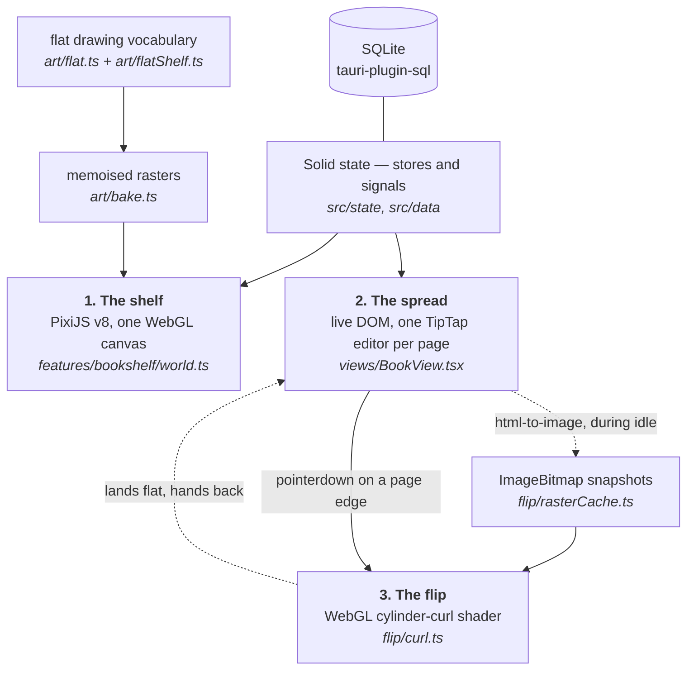
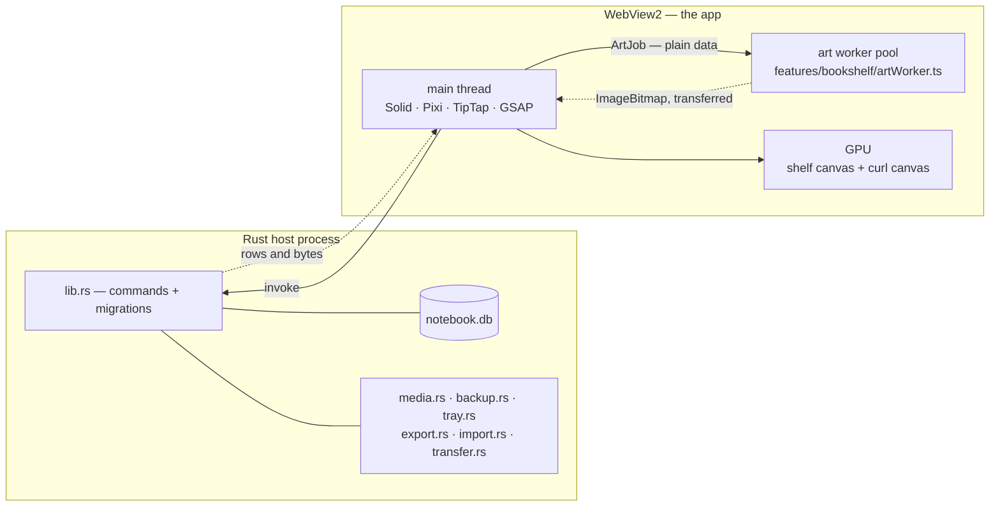
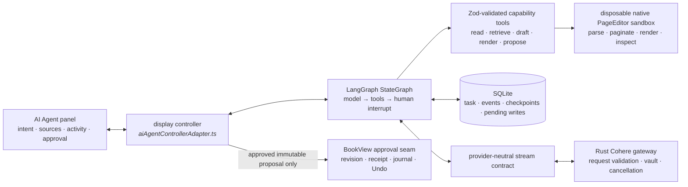

<p align="center">
  
</p>

<!--
  The badge strip below is GENERATED — `npm run readme:build` composes it from
  the version in package.json, so a release bump moves the badge, the download
  filenames and the release table together. Edit scripts/gen-readme.mjs, not
  this block.

  The first two are LIVE shields endpoints now that the repository is public:
  the real latest release and the real build status. While it was private they
  had to be static images, because shields cannot read a private repo and would
  have rendered "inaccessible" where a fact should be.
-->

<!-- gen:badges -->
<p align="center">
  <a href="https://github.com/AkshitIreddy/Alcove/releases/latest"></a>
  <a href="https://github.com/AkshitIreddy/Alcove/releases/latest"></a>
  <a href="https://github.com/AkshitIreddy/Alcove/actions/workflows/release.yml"></a>
  
  
  
</p>
<!-- /gen -->

<h1 align="center">Alcove</h1>

<p align="center">
  <b>Built like a storybook library, with cozy shelves and patterned walls. Open every book into notebook pages filled with diagrams, notes, tape, and stickers.</b>
</p>

<p align="center">
  <a href="#download-and-install"><b>▸ Download</b></a>
  &nbsp;·&nbsp;
  <a href="#a-tour"><b>▸ See it</b></a>
  &nbsp;·&nbsp;
  <a href="#written-with-an-ai"><b>▸ Write it with an AI</b></a>
  &nbsp;·&nbsp;
  <a href="docs/readme/releases.md"><b>▸ What's new</b></a>
  &nbsp;·&nbsp;
  <a href="#how-its-built"><b>▸ For developers</b></a>
</p>

<!--
  The demo is generated, not recorded by hand: `node shots-now/demo-gif.mjs`
  drives the real app with gifsmith and emits one animated WebP plus a seekable
  MP4 under qa/ for human review. It is a forward loop with no crossfade — the
  scene returns to the shelf it started on and the trim cuts between matching,
  visually seamless shelf holds.

  GitHub renders animated WebP inline, so generating a second copy as GIF only
  makes each demo refresh heavier for a repo people are meant to clone.
-->
<p align="center">
  
</p>

<p align="center">
  <sub>Every frame is the real app. The Agent beat replays frozen, human-vetted Cohere-authored demo data through Alcove's local renderer and reversible real insertion seam; it is not a live provider call. <a href="shots-now/demo-gif.mjs">How it is made</a> · built with <a href="https://www.npmjs.com/package/gifsmith">gifsmith</a></sub>
</p>

---

Alcove is built like a storybook library — cozy shelves and patterned walls you
pan through and dress: repaint the carpentry, swap the wallpaper, give every
spine its own binding. Open any book into notebook pages filled with diagrams,
notes, tape, and stickers — ruled leaves, block editor, callouts, and code.

Pages are real pages: a page is a fixed leaf that never scrolls, so filling one
flows your writing onto the next and turning it is a turn rather than a scroll.
The room is yours to dress, and much further than a colour picker goes. And
nothing is synced, stored in a cloud library or reported back — there is no
account and nothing to sign into. The optional in-book AI Agent uses your own
Cohere key. Once you start a task, it may send that task's instructions, the
pages it inspects from the current book, sources you attach and draft-review
renders; other books and unrelated writing remain local.

**And a page does not have to be typed by you.** Open the Agent glyph beside the
other book tools and ask for an outcome: it can study the chosen pages, images
and PDFs, plan the work, build real Alcove pages, render and inspect every page
it made, repair its own visual mistakes, then show you one polished preview for
placement and approval. Or keep using the key-free *Notebook Script* route:
hand its generated grammar to ChatGPT, Claude or any assistant, then preview the
downloaded `.md` in Alcove. Both routes land as editable pages with the sticky
notes, callouts, highlights and hand-drawn diagrams already made.
[The whole loop is a few inches down.](#written-with-an-ai)

<p align="center">
  
  
</p>

> ### This page has two halves, and they are for different people
>
> **▸ [Part 1 — Using Alcove](#whats-in-the-box) · for the person writing in it**
> <br>A short guide to downloading Alcove, opening a book, writing, using the
> optional Agent, and keeping your library safe.
>
> **▸ [Part 2 — Building Alcove](#how-its-built) · for a developer, or for an AI
> agent helping one**
> <br>The architecture, the stack, the gates, and how to add something without
> breaking the rest. If you are an assistant asked to contribute here, that half
> plus [`CLAUDE.md`](CLAUDE.md) is your brief.
>
> **Every technical fact lives in the second half** — including the ones a README
> usually opens with, like where the database is, what touches the network, and
> what runs in which process. None of it is needed to use the app, so none of it
> is above the line.
>
> Each half is also a page of its own under [`docs/readme/`](docs/readme/),
> carrying exactly the same words as the copy here.

**On this page**

<!-- gen:contents -->
**Part 1 — Using Alcove** — for the person writing in it. No code below this line.

- [What's in the box](#whats-in-the-box) — The five things that make this different from a folder of Markdown files
- [Download and install](#download-and-install) — Choose your platform, install Alcove and start writing
- [Written with an AI](#written-with-an-ai) — Ask the in-book Agent to answer questions or prepare reviewed pages
- [A tour](#a-tour) — The shelf, books, pages and the few controls worth knowing first
- [Writing in a book](#writing-in-a-book) — Fixed pages, the slash menu, the context menu and media
- [Notebook Script](#notebook-script) — A small Markdown-based format for complete Alcove pages
- [Making it yours](#making-it-yours) — Rooms, bindings, paper, colours and sound
- [The keyboard](#the-keyboard) — The shortcuts most readers use
- [Backups, export and import](#backups-export-and-import) — Keep another copy or move your library
- [Questions](#questions) — Privacy, updates, moving computers and getting help

**Part 2 — Building Alcove** — for a developer, or for an AI agent helping one. Nothing below is needed to use the app.

- [How it's built](#how-its-built) — The three ways the app draws itself, what runs in which execution context, and the stack table with a reason per row
- [Getting it running](#getting-it-running) — `npm run tauri dev`, the browser-only dev path, and the everyday checks
- [The map of the app](#the-map-of-the-app) — Directory by directory, plus the module-docstring convention this README points at instead of copying
- [Building and releasing](#building-and-releasing) — The bundle artefacts, the icon pipeline, and the tag-driven release workflow
- [Non-goals](#non-goals) — No sync or cloud storage, no mobile, no plugin API, no second visual language, no light model
- [The repo at a glance](#the-repo-at-a-glance) — Six measurements of the tree, every one recomputed rather than typed
- [Deeper reading](#deeper-reading) — The two halves as pages of their own, and every section of them this page does not already carry
- [How this page stays honest](#how-this-page-stays-honest) — Why no number here is typed, why no paragraph is written twice, and what the check does and does not do
- [Licence and credits](#licence-and-credits) — MIT, the bundled fonts, where the sound came from, and the two brand images that are not interchangeable
<!-- /gen -->

# Part 1 — Using Alcove
<!--nav: for the person writing in it. No code below this line.-->

## What's in the box
<!--nav: The five things that make this different from a folder of Markdown files-->

- A shelf of books instead of a folder tree.
- Fixed pages that flow naturally when they fill.
- Rich blocks: notes, tables, pictures, maths, diagrams and decoration.
- Rooms, bindings, paper and colours you can make your own.
- Local search, backups and portable exports, with no account required.
- An optional in-book AI Agent that shows a reviewed preview before inserting
  anything.

<!-- gen:lift-download -->
## Download and install
<!--nav: Choose your platform, install Alcove and start writing-->

Download the file for your computer from the latest release, open it, and follow
the installer. Alcove needs no account.

| Platform | Take |
| --- | --- |
| **Windows 10 / 11** | [`Alcove_0.7.6_x64-setup.exe`](https://github.com/AkshitIreddy/Alcove/releases/latest) · about 16 MB |
| **macOS 11+** | [`Alcove_0.7.6_universal.dmg`](https://github.com/AkshitIreddy/Alcove/releases/latest) · Apple silicon and Intel |
| **Linux** | [`.deb`, `.rpm` or `.AppImage`](https://github.com/AkshitIreddy/Alcove/releases/latest) |

Your library is stored separately from the app, so uninstalling Alcove does not
remove your notebooks. Alcove checks for updates automatically; you can also use
**Settings → System → Check for updates**.

**[See what changed in each release](docs/readme/releases.md).**
<!-- /gen -->

<!-- gen:lift-ai -->
## Written with an AI
<!--nav: Ask the in-book Agent to answer questions or prepare reviewed pages-->

The optional **AI Agent** lives in the book's left rail. Connect your own Cohere
key, then ask a question or describe what you want added.

- A normal question gets a normal answer in the panel.
- A notebook request creates pages in an isolated draft.
- Alcove validates, renders and visually reviews those pages before showing you
  a preview.
- Nothing enters the book until you choose **Insert**.


You can attach images, PDFs, office documents and text files, or drag them onto
the chat box. The Agent reads only the sources needed for that task. A pending
preview stays available while you ask a follow-up question, and you can still
insert it or ask for changes afterwards.

The Agent may ask one genuinely necessary question, but ordinary choices such
as layout, length and repair strategy are its job. If a tool call fails, the
failure is returned to the Agent so it can choose a better action; repeated
calls that make no progress are stopped safely.

Your Cohere key can stay only for the session or be stored in the operating
system credential vault. Other books are not sent to Cohere. For sensitive
work, review the provider's terms and use **Text veil** under
**Settings → AI & integrations** when local masking is appropriate.

### Using another assistant

You do not need to connect the in-book Agent. Open **In and out → Copy the
format for your AI**, give that Notebook Script guide to any assistant, then
preview its `.md` file in Alcove before inserting it.
<!-- /gen -->

<!-- gen:lift-tour -->
## A tour
<!--nav: The shelf, books, pages and the few controls worth knowing first-->

Alcove opens on a bookcase. Click or pull a book from the shelf, then choose
**Read it** to open its pages.

| What you want | What to do |
| --- | --- |
| Open a book | Click it, or drag it out of the shelf |
| Move around the shelf | Wheel to zoom; Shift+wheel to pan |
| Go back or close a panel | Press `Escape` |
| Write | Click a ruled line and type |
| Add something to a page | Type `/` on an empty line |
| Change an existing block | Right-click it |
| Find a book or heading | Press `Ctrl+K` |
| Change the room or book | Open **Studio** on the shelf or **Customize** in a book |


The first launch asks a few appearance questions and offers a guided tour. You
can skip it and replay it later from **Settings → Help**.

## Writing in a book
<!--nav: Fixed pages, the slash menu, the context menu and media-->

Pages are fixed leaves rather than scrolling documents. When one fills, Alcove
moves the trailing blocks onto the next page and creates another page when
needed. Resizing the window changes only the book's display size; it does not
move your writing between pages.


Use the slash menu for headings, lists, tables, callouts, sticky notes,
diagrams, pictures, code, maths and decoration. The Catalogue in the left rail
shows the same choices when you would rather browse.

Right-click a block to change its type or colour, add effects, duplicate it,
copy or download it, paste beside it, move it to the previous page, or delete
it. You can also drag pictures onto a page and drag blocks by their six-dot
handle.

The left rail contains the tools for the current book: page style, Catalogue,
AI Agent, contents, history, import/export, ribbons, focus mode, thumbnails and
new pages.

Pictures are copied into the library's `assets` folder. Links remain links, and
an expanded picture can be zoomed and panned without changing the page.
<!-- /gen -->

<!-- gen:lift-manual -->
## Notebook Script
<!--nav: A small Markdown-based format for complete Alcove pages-->

Notebook Script is Markdown with a few readable containers. It can describe
page breaks, cards, callouts, columns, diagrams, images and decoration while
remaining easy to save as a plain `.md` file.

```md
# Photosynthesis

Plants turn light into stored chemical energy.

:::callout {kind=tip title="Remember"}
Water + carbon dioxide + light → glucose + oxygen.
:::

::page

## Quick check

- Where does the light energy come from?
- Which gas is released?
```

Paste a script into **In and out → Insert script** to preview it. Alcove's
parser reports what it could not recognise instead of crashing or silently
discarding the rest.

## Making it yours
<!--nav: Rooms, bindings, paper, colours and sound-->

The shelf's **Studio** controls the room: bookcase, wallpaper, colours and
writing-desk background. **Customize this book** controls one book: its binding,
cover, page ruling and line spacing.

Choose from the included presets or enter your own colour. Star favourites,
hide options you do not use, and create more bookcases when you want separate
rooms. Sound sets, ambience and volume live under **Settings → Sound** and can
all be turned off.

## The keyboard
<!--nav: The shortcuts most readers use-->

| Shortcut | Action |
| --- | --- |
| `Escape` | Go back or close the current panel |
| `Ctrl+K` | Open the quick switcher |
| `/` | Open the block menu on an empty line |
| `Ctrl+Z` / `Ctrl+Y` | Undo / redo |
| `Ctrl+Alt+T` | Table of contents |
| `Ctrl+Alt+M` | Page thumbnails |

Shortcuts can be changed in **Settings → Keyboard**.

## Backups, export and import
<!--nav: Keep another copy or move your library-->

Alcove saves as you write. Scheduled backups create local ZIP files, and a
`.nbk` bundle moves a library between computers. **In and out** can also import
or export Markdown, create PDFs, save page images and copy pages as Notebook
Script.

Your library folder contains the notebook database, media assets and backups.
Its exact location is shown in **Settings → System**, where it can be opened
without memorising an operating-system path.

## Questions
<!--nav: Privacy, updates, moving computers and getting help-->

**Does Alcove need an account?** No.

**Does it work offline?** Writing, editing, search, customisation, backup and
export do. Updates and the optional AI Agent need a connection.

**Can I move to another computer?** Export a `.nbk` bundle and import it on the
other installation.

**Will uninstalling delete my work?** No. The app and library are stored
separately.

**Where can I report a problem?** Open a
**[GitHub issue](https://github.com/AkshitIreddy/Alcove/issues)** and include the
app version shown at the bottom of Settings. Agent failures also offer a copied
diagnostic that excludes the saved API key.
<!-- /gen -->

# Part 2 — Building Alcove
<!--nav: for a developer, or for an AI agent helping one. Nothing below is needed to use the app.-->

**Nothing below this line is needed to use Alcove.** Everything from here down is
for somebody changing the code — a developer, or an AI agent working on their
behalf — and it is where the facts a README usually opens with have been put
instead: the storage model, the explicit network boundaries, what runs in which
process.
It is the developer half's essentials: how the app draws itself three different
ways at once, what it is made of and why, how to get it running, where
everything lives, and how a release is cut.

The parts that only matter once you are editing a particular corner of it — the
art pipeline, the vocabularies, the editor, the flip, the parser, the data
layer, the gates, and the failure modes this codebase has actually shipped —
stay in [Part 2](docs/readme/part-2-developers.md) and are listed under
[Deeper reading](#deeper-reading).

<!-- gen:lift-build -->
## How it's built
<!--nav: The three ways the app draws itself, what runs in which execution context, and the stack table with a reason per row-->

Alcove is a [Tauri 2](https://tauri.app/) app: a Rust host process, a system
webview window, and a [SolidJS](https://www.solidjs.com/) frontend built by
Vite. Almost everything interesting happens in the frontend. The Rust side is
<!--f:rustCommands-->29<!--/f--> commands — image assets, link previews, backups,
tray, PDF export, Markdown import, bundle read/write, and the narrow Cohere and
AI-attachment gateway — plus the SQLite
migrations, in <!--f:rustFiles-->11<!--/f--> files and
<!--f:rustLines-->7879<!--/f--> lines.

### The shape of the thing, in four facts

These are the constraints every decision below is downstream of. They are stated
here rather than at the top of the front page on purpose: a reader deciding
whether to install Alcove does not need the storage model first, and the
one who does need it is you.

- **One SQLite file, on the reader's own disk.** `notebook.db` in the app data
  directory, opened through `tauri-plugin-sql`, with `assets/` beside it for
  pictures and `backups/` for the scheduled ZIPs. There is no server half of
  this app to write.
- **No account, no sync, no telemetry.** `telemetry` is typed as the literal
  `false` in [`src/data/types.ts`](src/data/types.ts), so it is not a
  setting somebody can flip — it is a type error to try. An unrelated feature
  cannot quietly turn that into cloud sync or analytics.
- **Outbound calls are narrow, visible and reader-initiated.** Searching for an
  openly licensed picture (`::fetch`) and previewing a pasted link both go
  through an SSRF guard that is written twice on purpose —
  [`src-tauri/src/media.rs`](src-tauri/src/media.rs) is the real one and
  [`src/editor/media/urlGuard.ts`](src/editor/media/urlGuard.ts) mirrors
  it — https only, private and loopback addresses refused, fast timeouts, capped
  body size. The optional AI Agent adds an explicit Cohere path: it is inert
  without the reader's key and crosses a typed Rust gateway that accepts Cohere
  endpoints and request shapes rather than arbitrary URLs. After a task starts,
  it may send its instructions, current-book pages it inspects, attached sources
  and draft-review renders; other books remain local.
- **The webview is the OS's, not ours.** That is what makes the installer about
  sixteen megabytes rather than ten times that, and it is also why the app
  inherits the platform's autoplay policy, its IME and its font stack rather
  than choosing them.

What makes the frontend unusual is that it draws itself three different ways at
once, and the three have to agree on what a page looks like.



**1. The shelf is a single WebGL canvas.** Every bookcase, spine, plaque and wall
is a Pixi sprite whose texture was drawn once into an `OffscreenCanvas` and kept.
The camera works in log-zoom space, floors outside the viewport are pooled and
recycled, and there are three LOD tiers with hysteresis so the tier cannot flicker
at a threshold ([`lod.ts`](src/features/bookshelf/lod.ts): tier 0 above zoom 0.7,
tier 1 down to 0.22, and below that whole floors collapse into a cached
render-texture stamp). The loop is render-on-demand — a settled shelf issues no
draw calls at all. Solid never diffs Pixi: components talk to the world through a
small callback surface and the world mutates its own non-reactive objects.
Rationale and the eliminated alternatives are in
[`docs/design/bookshelf-rendering.md`](docs/design/bookshelf-rendering.md).

**2. The opened book is ordinary DOM.** A two-page spread, one TipTap editor per
page, real contenteditable with a real caret and real IME. This is the reason the
flip is *not* implemented by a page-flip library: every candidate wants the pages
to be its own content, and a Notion-grade block editor cannot live inside
something that forwards clicks to `<a>` and `<button>`.

**3. The flip is a shader that borrows the DOM's pixels.** During idle time,
[`rasterCache.ts`](src/flip/rasterCache.ts) captures each page to an `ImageBitmap`
with `html-to-image` (pixel ratio capped at 2, or 1.5 when `deviceMemory` is under
8 GB; LRU of six; font-embed CSS computed once because it is the dominant
per-capture cost). On pointerdown the GL overlay appears in the same frame,
because the texture already exists. When the page lands flat, live DOM comes back.
A page may knowingly flip with a snapshot up to 300 ms stale — text is unreadable
mid-curl, and the landing swaps to the real thing.
[`docs/design/page-flip.md`](docs/design/page-flip.md) has the model.

### What runs where

Four execution contexts, and knowing which one you are in answers most "why can't
I just…" questions.



| Context | What lives there | The constraint it imposes |
|---|---|---|
| **Rust host** | SQLite and its migrations, the filesystem, the tray, the SSRF-guarded image fetcher, the PDF writer's file half, bundle read/write. | Everything crosses `invoke` and is therefore async and structured-clone-shaped. A command is the *only* way to touch a path outside the asset scope. |
| **Main thread** | All Solid state, all Pixi objects, every TipTap editor, GSAP timelines, the curl renderer. | It also runs the compositor for a contenteditable. A long task here is a frozen window, which is the whole reason the next row exists. |
| **Art workers** | Spine painting only. A pool sized from `hardwareConcurrency − 1`, capped at three ([`artOffload.ts`](src/features/bookshelf/artOffload.ts)). | Jobs are plain data, results are transferred `ImageBitmap`s (zero-copy). **Failure is never fatal** — no `Worker`, no `OffscreenCanvas`, a dead bundle or a timed-out job all resolve to `null` and the main thread draws the spine itself. |
| **GPU** | The shelf's sprite batches; the curl mesh and its ground pass. | No live SVG filters, no blend modes, no post-processing. The curl context carries a depth buffer, which is not decoration — see *the turning page had a shadow that wasn't drawn* below. |

The worker boundary is worth one more paragraph, because it is the only place
this app is genuinely concurrent. A cold shelf once measured **42.6 s of long
tasks and a single 15.5 s frozen frame** on the main thread; slicing finer could
not fix it because the atom is one spine and one spine was seconds of brush work.
Flat art made a spine cheap, but the shape stayed: the main thread's whole share
of a spine is now one `drawImage` of a finished bitmap into an atlas page. The
wire format is its own module ([`artJobs.ts`](src/features/bookshelf/artJobs.ts))
so neither side drags the other's dependencies in, and it carries an
`ART_PROTOCOL_VERSION` so a stale worker bundle is obvious rather than subtly
wrong.

### The Agent is a capability graph, not a privileged chat box

The optional in-book Agent adds one more cross-process path, but no general
network or mutation primitive. [`BookView.tsx`](src/views/BookView.tsx) is
the composition root: it wires a provider-neutral runtime to read-only notebook
and source adapters, the disposable page renderer, SQLite persistence and the
Cohere provider. The panel receives a display controller assembled by
[`aiAgentControllerAdapter.ts`](src/views/rail/aiAgentControllerAdapter.ts);
it never imports Cohere, sees a saved key, owns checkpoint state or receives an
unrestricted editor callback.



The graph in [`graph.ts`](src/features/aiAgent/graph.ts) has only three
nodes: `model`, `tools` and a statically checkpointed `human` breakpoint. That
small topology is intentional. The autonomy lives in the model choosing among
typed capabilities, while deterministic code owns every permission and exit
condition. The model can inspect the current notebook, read or retrieve anchored
source units, keep a coverage ledger, write Notebook Script, run validation,
render disposable pages, inspect their images and propose a reviewed patch. It
cannot execute SQL, open a path or URL, dispatch a TipTap transaction, manufacture
an idempotency key or skip the reader's approval.

Every tool starts as a strict Zod object in
[`tools.ts`](src/features/aiAgent/tools.ts). The same definition becomes a
sanitised Cohere tool-use JSON Schema, and returned arguments are parsed again
against the full local schema before execution. Optional values travel through
Cohere as required-but-nullable fields, then null sentinels are removed locally;
unknown fields remain errors. Tool effects are labelled `read`, `draft`,
`interrupt` or `propose`, but that label is metadata rather than authority—the
runtime's phase, call budget, source capability, generation hashes and policy
gate decide whether a call can run.

The provider seam is deliberately narrower than a LangChain model class.
[`provider.ts`](src/features/aiAgent/provider.ts) accepts normalized
messages and emits only public-text deltas, tool-plan deltas, complete typed tool
calls, citations, usage and finish. [`cohereProvider.ts`](src/features/aiAgent/cohereProvider.ts)
maps that contract to Cohere V2 and preserves the exact assistant `tool_plan`,
tool-call ids and the contiguous result set required by the following turn.
Rendered/source images are one-turn observations: only the trailing unanswered
tool-result group is reattached, in batches of at most twenty, so checkpoint
replay does not resend every old private bitmap. Rust then validates the bounded
request vocabulary and fixed `https://api.cohere.com` origin, streams typed SSE
events back through a Tauri channel, and owns the cancellation registry and API
key. The WebView gets neither a bearer token nor a general `fetch` escape hatch.

Resumability is real rather than a transcript illusion. All domain state in
[`types.ts`](src/features/aiAgent/types.ts) is serialisable plain data;
credentials, attachment bytes, editor/database handles, `AbortSignal`s, object
URLs and image data are forbidden from it. The custom
[`SqliteAgentCheckpointSaver`](src/data/aiAgentPersistence.ts) persists
LangGraph checkpoints and pending writes beside task summaries and the ordered
activity log. An interrupt is a durable turn boundary: if a model emits an
approval/question call with parallel siblings, the siblings are discarded and
the assistant call list is trimmed before pause, because they were authored
without the reader's answer. Resume therefore returns one result to the exact
call that caused the checkpoint rather than replaying work or creating an
invalid partial tool-result history.

Drafting still grants no write capability. The sandbox mounts the production
TipTap schema and `PageEditor` with persistence and live-editor registration
disabled, lets the fixed-page overflow contract settle across stable animation
frames, captures native-size pages, and records structural/layout digests. The
proposal gate requires current draft, validation, render and visual-review
hashes to agree; every current page image must actually have been exposed to a
later model turn, and no blocking finding may remain. With the opt-in text veil,
the model reviews masked pixels first; Alcove restores values locally and runs a
second parser/layout render before constructing the final preview.

Only the preview's explicit reader approval reaches
`applyApprovedAiProposal` in `BookView`. That seam freezes the live editors,
recomputes the book revision, verifies the reviewed receipt and target page,
prepares media/schema work, writes a whole-book rollback snapshot, and claims a
durable idempotency key before the first page changes. After the edit it waits
for pagination to settle and hashes every resulting reviewed page. A failure
restores the snapshot; success converts the journal into one whole-operation
`Ctrl+Z` receipt. Startup recovery also restores any journal left in `applying`
or `undoing`, so “atomic” describes the reader-visible book even though the page
operations span multiple asynchronous editor writes.

The complete contracts, source formats, privacy transform and failure rules are
in [The in-book AI Agent](docs/readme/part-2-developers.md#the-in-book-ai-agent) below and
[`docs/design/ai-agent.md`](docs/design/ai-agent.md).

### The stack, and why each piece is here

| Piece | Version | Why this one |
|---|---|---|
| [Tauri 2](https://tauri.app/) | 2.x | Ships the OS webview instead of bundling Chromium: a 16 MB installer rather than ten times that, and one process tree. Rust gets the things a webview cannot do — filesystem, SQLite, tray, an SSRF-guarded image fetcher. |
| [SolidJS](https://www.solidjs.com/) | ^1.9.3 | Fine-grained reactivity with no virtual DOM. That is not a benchmark preference here: the app mounts dozens of TipTap node views, and a VDOM diff over a node view is exactly the thing that fights ProseMirror for ownership of the DOM. |
| TypeScript + Vite | ~5.6 / ^6.0 | `strict`, plus `noUnusedLocals`/`noUnusedParameters`/`noFallthroughCasesInSwitch`. Vite also provides the browser-only development path on port 1420. |
| [PixiJS v8](https://pixijs.com/) | ^8.19 | Continuous zoom is the hard requirement, and it is what DOM loses on: Chromium rasterises a layer at a fixed scale, so animating `transform: scale()` on a big container gives blurry pixels during the zoom and a re-raster hitch at the end. A single SVG loses harder — filter-based linework is CPU-bound. |
| [TipTap v3](https://tiptap.dev/) | ^3.29 | `@tiptap/core` is genuinely framework-agnostic (core + `@tiptap/pm` only), so it runs under Solid with a thin binding layer. ProseMirror underneath supplies IME/composition handling and transaction-based undo against a strict schema, which is not cheaply replicable. In June 2025 Tiptap MIT-licensed ten formerly-Pro extensions, including the exact set this app needs: DragHandle, NodeRange, UniqueID, Details, Mathematics, TableOfContents. |
| Vendored Solid bindings | in-repo | [`src/editor/solid/`](src/editor/solid/) rather than a dependency, because there is no Solid adapter upstream worth taking and an editor binding is not a thing to upgrade by lockfile bump. Three files; see [The vendored Solid bindings](docs/readme/part-2-developers.md#the-vendored-solid-bindings). |
| SQLite via `tauri-plugin-sql` | ^2.4 | Migrations are registered on the Rust side in [`src-tauri/src/lib.rs`](src-tauri/src/lib.rs). No ORM; the repos in [`src/data/`](src/data/) speak SQL directly. |
| [`sqlite-vec`](https://github.com/asg017/sqlite-vec) | 0.1.9, pinned | A statically linked `vec0` accelerator for the Agent's 512-float embeddings. It is registered into the same SQLite ABI before plugin-sql opens its pool; canonical source rows remain ordinary SQLite, and an extension/index failure falls back to the in-WebView scorer. FTS5 supplies lexical candidates in the same database. |
| GSAP | ^3.15 | Every plugin is free as of 2024, including Flip, which is what makes a dragged block settle into its new position instead of teleporting. Transform/opacity only in hot paths. |
| [`@pixi/sound`](https://pixijs.io/sound/) | ^6.0 | <!--f:soundCues-->64<!--/f--> cues and <!--f:ambienceBeds-->10<!--/f--> ambience beds, in four categories (`ui`, `pages`, `shelf`, `ambient`) with category volumes under one master. It shares the app's Pixi runtime and provides pooled Web Audio playback without maintaining a second audio framework. Provenance and licensing are under [Licence and credits](#licence-and-credits); the design is [`docs/design/sound.md`](docs/design/sound.md). |
| `html-to-image` | ^1.11 | Page → `ImageBitmap` for the curl. The one library in the app with a bug worked around at length ([`svgSnapshot.ts`](src/flip/svgSnapshot.ts)). |
| `lowlight` | ^3.3 | Syntax highlighting inside code blocks, through `@tiptap/extension-code-block-lowlight`. |
| `simplex-noise`, `svg-path-properties` | ^4.0 / ^1.3 | Seeded noise for the drawing vocabulary; path resampling for the pre-distorted vector chrome in [`art/wobble.ts`](src/art/wobble.ts). |
| `@floating-ui/dom` | ^1.8 | Anchoring for the slash menu, the link suggestions, the block context menu, the drag handle and the selection toolbar. The app's *own* delegated tooltip deliberately does not use it — see [`Tooltip.tsx`](src/views/Tooltip.tsx). |
| `@langchain/langgraph` + `@langchain/langgraph-checkpoint` | ^1.4 / ^1.1 | A resumable provider-neutral `StateGraph` and saver contract for the Agent's model/tool/interrupt loop. The saver is implemented against Alcove's browser-safe async SQLite surface; no LangGraph service or remote checkpoint store is involved. |
| Zod | ^4.4 | One strict local schema per Agent tool, reused to derive its conservative Cohere tool-use JSON Schema and then applied again to returned arguments before a capability executes. |
| Vitest | ^4.1 | Runs an explicit high-signal Node allow-list through [`vitest.smoke.config.ts`](vitest.smoke.config.ts); the broad suite remains opt-in. |

There is deliberately no state-management library, no CSS framework, no icon
package, no chart library and no markdown library. The parser, the ZIP codec, the
PDF writer, the fuzzy matcher and the diagram layouts are all in-repo — each is
under a few hundred lines and each has requirements a general-purpose dependency
would not meet (see [`src/features/transfer/zip.ts`](src/features/transfer/zip.ts)
for the reasoning in one concrete case).

## Getting it running
<!--nav: `npm run tauri dev`, the browser-only dev path, and the everyday checks-->

```bash
npm install
npm run tauri dev      # the real app
npm run dev            # frontend only, in a browser, on :1420
```

`npm run dev` works because [`src/data/db.ts`](src/data/db.ts) falls back to an
in-memory database stub outside Tauri — the same `select`/`execute` surface,
persisted to `localStorage`, degrading to empty results rather than throwing on
SQL it does not understand. A book created in the browser survives a reload. It
coalesces each JavaScript task's mutation burst into one storage snapshot, then
flushes a still-pending snapshot on `pagehide`; renumbering a large book must
not synchronously rewrite the complete browser library once per page. It is a
convenient development path, not a substitute for the Tauri host.

### The everyday gate

The owner performs visual and audio acceptance directly. The two commands below
are the bounded everyday gate; broader suites are targeted or release-only.

| Command | What it checks |
|---|---|
| `npx tsc --noEmit` | Frontend type safety in strict mode. |
| `npm test` | Exactly the explicit file allow-list in `vitest.smoke.config.ts`: the current script/media/release, book-appearance, hydration and sound regressions. |

The fast suite is the explicit file allow-list in
[`vitest.smoke.config.ts`](vitest.smoke.config.ts), including but no
longer limited to [`tests/smoke.test.ts`](tests/smoke.test.ts). The
Agent-focused suites are not silently included by that command;
they must be run explicitly until the release gate deliberately adds them. The
fast suite does not boot a browser, capture pixels, occupy port 1420 or claim
anything about what the app looks or sounds like.

## The map of the app
<!--nav: Directory by directory, plus the module-docstring convention this README points at instead of copying-->

Start with the directory, then the file. Every module in the tree opens with a
docstring stating what it is responsible for and — where a decision needed
defending — why it is that way and what it replaced.

| Path | What lives there |
|---|---|
| [`src/art/`](src/art/) | The drawing vocabulary. [`flat.ts`](src/art/flat.ts) is the palette and primitives; [`flatShelf.ts`](src/art/flatShelf.ts) the case parts; [`bake.ts`](src/art/bake.ts) the memoised rasters; [`atlas.ts`](src/art/atlas.ts) the sprite pages; [`wobble.ts`](src/art/wobble.ts) the pre-distorted vector linework; [`spines.ts`](src/art/spines.ts) one book's spine. |
| ↳ the vocabularies | [`shelfDesign.ts`](src/art/shelfDesign.ts) (carpentry), [`wallpaperDesign.ts`](src/art/wallpaperDesign.ts) (the wall), [`bookDesign.ts`](src/art/bookDesign.ts) (a book's binding), [`themes.ts`](src/art/themes.ts) (colour), [`covers.ts`](src/art/covers.ts) and [`charms.ts`](src/art/charms.ts). Orthogonal to colour and to each other. |
| [`src/features/bookshelf/`](src/features/bookshelf/) | The Pixi world: [`world.ts`](src/features/bookshelf/world.ts) (controller), [`camera.ts`](src/features/bookshelf/camera.ts), [`gestures.ts`](src/features/bookshelf/gestures.ts) (a pure input decision matrix), [`lod.ts`](src/features/bookshelf/lod.ts), [`virtualizer.ts`](src/features/bookshelf/virtualizer.ts), [`floorStamps.ts`](src/features/bookshelf/floorStamps.ts), [`textures.ts`](src/features/bookshelf/textures.ts), [`spineFactory.ts`](src/features/bookshelf/spineFactory.ts), [`artOffload.ts`](src/features/bookshelf/artOffload.ts) (worker pool; failure is never fatal). |
| [`src/views/`](src/views/) | The spread and the left icon rails. [`BookView.tsx`](src/views/BookView.tsx), [`rail/`](src/views/rail/) (studios and pickers), [`spread.ts`](src/views/spread.ts), [`bookmarks.ts`](src/views/bookmarks.ts). |
| [`src/editor/`](src/editor/) | TipTap setup ([`extensions.ts`](src/editor/extensions.ts)), one editor per page ([`PageEditor.tsx`](src/editor/PageEditor.tsx)), custom nodes ([`nodes/`](src/editor/nodes/)), slash and right-click menus, [`pagination.ts`](src/editor/pagination.ts), [`effects/`](src/editor/effects/), media paste, exporters, the vendored [`solid/`](src/editor/solid/) bindings. |
| [`src/flip/`](src/flip/) | The page-curl engine: [`curl.ts`](src/flip/curl.ts) (shaders), [`math.ts`](src/flip/math.ts) (pure, node-testable), [`rasterCache.ts`](src/flip/rasterCache.ts), [`gl.ts`](src/flip/gl.ts), [`cssFallback.ts`](src/flip/cssFallback.ts). |
| [`src/script/`](src/script/) | The Notebook Script parser and printer. Total by construction: `parse()` never throws. |
| [`src/features/aiAgent/`](src/features/aiAgent/) | The provider-neutral LangGraph runtime: serialisable contracts, tool policy, complete-source coverage, retrieval, Cohere adapter, supplied-material composition/image intent, draft sandbox and proposal gate. |
| [`src/diagrams/`](src/diagrams/) | Layout algorithms (tidy tree, layered DAG, timeline) and hand-drawn SVG renderers. |
| [`src/data/`](src/data/) | SQLite access and the persisted stores: books, design, search and settings, plus agent checkpoints, canonical sources, the derived [`aiAgentRetrievalIndex.ts`](src/data/aiAgentRetrievalIndex.ts) FTS5/vec0 accelerator, idempotent apply receipts, the Rust-owned credential boundary and normalized provider gateway. |
| [`src/features/transfer/`](src/features/transfer/) | Export/import bundles (`.nbk`), conflict resolution, restore points. |
| [`src/features/system/`](src/features/system/) | Backups, tray quick capture, launch behaviour, diagnostics, perf HUD. |
| [`src/features/packs/`](src/features/packs/), [`src/features/templates/`](src/features/templates/), [`src/features/tutorial/`](src/features/tutorial/), [`src/features/quickswitch/`](src/features/quickswitch/) | The reader's own uploads, the page templates, the guided tour, the `Ctrl+K` switcher. |
| [`src/sound/`](src/sound/) | The `@pixi/sound` engine, named sound sets, and the in-app credits panel. |
| [`src/search/`](src/search/) | The fuzzy matcher and the full-text index behind `Ctrl+K` and `Ctrl+Shift+F`. In-repo, because the ranking rules are the product. |
| [`src/state/`](src/state/) | Which scene the shell is showing, and which book is open. One file, deliberately: everything else that persists is a store under `src/data/`. |
| [`src/assets/`](src/assets/) | Source-owned static media which must ship with a feature, including the frozen, locally stored kitten illustration used by the deterministic Agent demo. |
| [`src/features/settings/`](src/features/settings/) | The settings sheet, the appearance rules it applies, and the drawn pointer sets. |
| [`src-tauri/src/`](src-tauri/src/) | `media.rs`, `backup.rs`, `tray.rs`, `export.rs`, `import.rs`, `transfer.rs`, `ai.rs` and `vector_index.rs`, all registered in `lib.rs`. `ai.rs` owns credentials, Cohere HTTPS, attachment bytes and local source extraction; `vector_index.rs` statically registers sqlite-vec before plugin-sql opens SQLite. |

### What the source files document about themselves

<!--f:srcDocstrings-->348<!--/f--> of <!--f:srcFiles-->388<!--/f--> source files
open with a module docstring — <!--f:docstringLines-->7350<!--/f--> lines of it.
That is the largest single body of prose in the repo and it is deliberately not
copied here; this README's job is to point at it. The numbers are not asserted
either: `npm run readme:check` recomputes them from the tree and reports drift.

The convention:

1. First line is `path/file.ts — one sentence.`
2. A paragraph on what the file is responsible for, and what it is *not*.
3. `## Why it is this way` — only when there is a decision worth defending.
4. `## What this replaced` — only when something was deleted.
5. `## The rules` — prohibitions stated as prohibitions.
6. The reader's verbatim words, when a report drove the design. Search the tree
   for `*"` to find them.

If you read only one, read [`src/art/bake.ts`](src/art/bake.ts): it is short, it
carries real measurements, and it is the clearest example of the house style of
writing down a decision *and* the thing it replaced.
<!-- /gen -->

<!-- gen:lift-releasing -->
## Building and releasing
<!--nav: The bundle artefacts, the icon pipeline, and the tag-driven release workflow-->

```bash
npm run build          # spec:check, then vite build → dist/
npm run tauri build    # the above, then the Rust bundle
```

`npm run tauri build` writes to `src-tauri/target/release/bundle/`:

| Artefact | Notes |
|---|---|
| `Alcove_<version>_x64-setup.exe` | NSIS, and the one a reader downloads. `installMode: currentUser`, so installing needs no administrator prompt. |
| `Alcove_<version>_x64-setup.exe.sig` | The updater signature for that exact NSIS installer. |
| `Alcove_<version>_x64_en-US.msi` | WiX. For policy deployment. |
| `alcove.exe` | The app itself, with the icon group compiled in by `tauri_winres`. |

`bundle.targets` is `"all"`, so the target list follows the host platform: on
Windows the two installers above, on macOS a `.app` and a `.dmg`, on Linux a
`.deb`, an `.rpm` and an `.AppImage`. CI builds all three — see
[Releases](#releases). The version in those filenames comes
from `package.json`, and `src-tauri/tauri.conf.json` has to carry the same one —
`scripts/gen-readme.mjs` refuses to compose the front page when the two
disagree, because the badge is written from the first and the filename from the
second.

### The icon pipeline

The master art is [`assets/brand/alcove-art.png`](assets/brand/alcove-art.png), a
rendered illustration supplied by the owner. It is **not** the drawing reference
for the app's interior — that is [`assets/brand/icon.svg`](assets/brand/icon.svg),
and confusing the two will send you the wrong way.

```bash
python scripts/gen-icons.py              # every PNG size, the .ico and the .icns
python scripts/gen-icons.py --ico-only   # repack just icon.ico
python scripts/gen-icons.py --icns-only  # repack just icon.icns
python scripts/gen-icons.py --check      # audit both containers, exit 1 if bad
```

[`scripts/gen-icons.py`](scripts/gen-icons.py) does two things a plain resize does
not. It **cuts the frame** — the artwork is painted inside a black rounded
rectangle, and an OS icon must not carry its own, so black is flooded in from the
corners (the surround is pure black and the darkest paint inside measures 11–19,
so the shape lifts exactly, with no radius fitting and no drift if the art is
replaced). And it **treats small sizes differently** — straight-downscaled to
32px the illustration is a dark square with one red speck, so every size at or
below `SMALL_AT` crops past the scene onto the book, lifts brightness and
contrast, and re-applies a rounded mask.

It also writes **both** OS containers by hand, `icon.ico` and `icon.icns`,
because the frame set is a decision and a library that takes one image and
downscales it cannot express it. For the `.ico` that is because Pillow's encoder
PNG-compresses every frame and always writes `wPlanes = 0`;
[`docs/packaging-icons.md`](docs/packaging-icons.md) is the long version, and it
is worth reading before touching any of this: `tauri_winres` quietly repairs
`wPlanes` for the app exe and **NSIS does not**, so the installer once shipped a
worse icon directory than the app did. That document also records, honestly, that
the defects it found were *not* the cause of the symptom that prompted the
investigation.

The `.icns` was added when CI grew a macOS build, and it was added because of
what that build would otherwise have shipped: the container had been generated
once by the Tauri CLI and never again, so it still carried the artwork from two
renames ago — 75/255 mean absolute difference from the master, a different
picture rather than a stale encode. `--check` now compares the largest `.icns`
frame against the master, so *old* fails as loudly as *malformed*.
[`docs/packaging-mac-linux.md`](docs/packaging-mac-linux.md) has the frame set, the
run-length encoding, and how the encoder was verified without a Mac to hand.

> [!NOTE]
> `npx @tauri-apps/cli icon` is no longer part of the pipeline — this one script
> writes every icon `bundle.icon` names. If you ever do run it, run it **before**
> `scripts/gen-icons.py`, never after: it regenerates the PNGs as plain
> downscales and clobbers the close-crops.

### Releases

Tag-driven, and now on all three platforms.
[`.github/workflows/release.yml`](.github/workflows/release.yml) fires when a
`v*` tag is pushed, or on manual dispatch against a tag that already exists. It
is three jobs rather than one matrix:

| Job | Runner | What it does |
|---|---|---|
| `gates` | `ubuntu-latest` | `tsc --noEmit`, `npm test`, `spec:check`, `readme:check`, `gen-icons.py --check` |
| `build` ×3 | `windows-latest`, `macos-15`, `ubuntu-22.04` | the bundle, and nothing else |
| `release` | `ubuntu-latest` | notes, signed `latest.json`, checksums, one GitHub Release |

**The gates run once.** None of them can fail differently on a different
operating system, so running them on all three runners would triple their cost
and buy three copies of the same red X — and putting them *before* the matrix
means a typo fails in two minutes rather than after three parallel Rust builds.
`build` is `fail-fast: false` so one broken platform still reports on the other
two; `release` needs all three, so a partial matrix never publishes with a
platform quietly missing.

macOS builds **one universal `.dmg`** carrying both arm64 and x86_64
(`--target universal-apple-darwin` on an Apple-silicon runner), rather than
making the reader choose. Linux builds on `ubuntu-22.04` deliberately: a `.deb`
and an AppImage link against the builder's glibc, so building on 24.04 would
produce packages that refuse to start on 22.04.
[`docs/packaging-mac-linux.md`](docs/packaging-mac-linux.md) is the operational
document — the system packages Linux needs and why each one, what a first run
should produce, and what to check when it does.

Reader-facing notes are written for the completed version in
[`release-notes/vX.Y.Z.md`](release-notes/README.md). The gates reject a
missing, tiny or placeholder-filled note before the platform builds start;
[`scripts/release-notes.mjs`](scripts/release-notes.mjs) then adds stable
branding, history links and download guidance. A tag containing `-` publishes
as a prerelease.

The main build receives `TAURI_SIGNING_PRIVATE_KEY` from a GitHub Actions secret
and emits the NSIS, AppImage and universal macOS updater payloads with their
signatures. The release job writes `latest.json` with immutable tag URLs and the
signature contents, then uploads it beside those files. Installed copies check
that stable endpoint after launch; **Update now** downloads the matching payload,
verifies it, installs it and relaunches Alcove. The private key is ignored locally
and never belongs in git; [`docs/packaging-mac-linux.md`](docs/packaging-mac-linux.md)
has the one-time secret setup.

One bootstrap is unavoidable: v0.4.0 predates the updater, so a v0.4.0 install
must take the first updater-enabled release manually. Every release after that
can use the in-app path.

Two honest edges remain. The updater payloads are signed, but the applications
are not Authenticode-signed or Apple-notarised, so Windows can still show a
SmartScreen warning and macOS can still quarantine a manual download. And this
is still the *only* workflow: it fires on tags, so nothing runs `tsc` or `npm
test` on an ordinary push. Check the first cross-platform run against the
predicted artefact names in `docs/packaging-mac-linux.md` before quoting one at a
reader.

> [!NOTE]
> There is consequently no CI badge to display yet. The gates run locally, and
> again at the tag — not on every commit. Wiring a push-triggered workflow is the
> prerequisite for earning that badge, not the other way round.
<!-- /gen -->

<!-- gen:lift-nongoals -->
## Non-goals
<!--nav: No sync or cloud storage, no mobile, no plugin API, no second visual language, no light model-->

- **No sync and no accounts.** The database is a file on your disk. There is no
  server to sign in to and nothing to be logged out of.
- **No cloud storage or background model service.** Image fetch and link preview
  are explicit requests behind an SSRF guard
  ([`src/editor/media/urlGuard.ts`](src/editor/media/urlGuard.ts) mirrors the Rust
  one in [`src-tauri/src/media.rs`](src-tauri/src/media.rs)). The optional AI
  Agent calls Cohere only after the reader supplies a key and sends a task; it
  does not sync the library, run in the background or make ordinary editing
  depend on a model.
- **No mobile, no web build.** Touch, small viewports and a shelf you cannot
  hover are three separate redesigns, not a media query. The browser dev server
  is a test harness, not a product.
- **No plugin API.** The vocabularies are extended by editing them; see
  [Adding a value, end to end](docs/readme/part-2-developers.md#adding-a-value-end-to-end).
- **No collaborative editing.** ProseMirror could support it; the storage model,
  the pagination contract and the whole single-reader framing do not.
- **No second visual language.** One flat vocabulary, one ink colour, one small
  palette. New surfaces join it rather than bringing their own.
- **No light model.** Flat colour, one ink colour on everything, rounded corners,
  edges that bow, and `contactShadow()` where an object meets a surface. Gradients
  are fine; a highlight placed to imply a lamp is not.
<!-- /gen -->

## The repo at a glance
<!--nav: Six measurements of the tree, every one recomputed rather than typed-->

| | | Where it is explained |
| --- | --- | --- |
| Frontend source | <!--f:srcFiles-->388<!--/f--> TypeScript files, <!--f:srcDocstrings-->348<!--/f--> of which open with a module docstring — <!--f:docstringLines-->7350<!--/f--> lines of prose | [What the source files document about themselves](#what-the-source-files-document-about-themselves) |
| Rust host | <!--f:rustFiles-->11<!--/f--> files, <!--f:rustLines-->7879<!--/f--> lines, <!--f:rustCommands-->29<!--/f--> commands, <!--f:dbMigrations-->2<!--/f--> migrations | [How it's built](#how-its-built) |
| Everyday checks | The explicit `vitest.smoke.config.ts` allow-list plus strict TypeScript compilation | [The gate](docs/readme/part-2-developers.md#the-gate) |
| Visual and audio acceptance | Performed directly by the owner, with targeted automation used when the changed surface warrants it | [The everyday gate](docs/readme/part-2-developers.md#the-everyday-gate) |
| Generated and checked in | <!--f:generatorScripts-->7<!--/f--> `gen-*` scripts, two of which are gated on regeneration | [The generated artefacts](docs/readme/part-2-developers.md#the-generated-artefacts) |
| Design record | <!--f:designDocs-->16<!--/f--> documents in [`docs/design/`](docs/design/), <!--f:supersededDesignDocs-->5<!--/f--> of them explicitly superseded and kept on purpose | [The design record](docs/readme/part-2-developers.md#the-design-record) |

## Deeper reading
<!--nav: The two halves as pages of their own, and every section of them this page does not already carry-->

Nothing below is required to use or build the app — it is the long form of what
is already on this page, plus the corners this page does not go into.

<!-- gen:deeper-reading -->
**[Part 1 — Using Alcove](docs/readme/part-1-users.md)** — *for the person writing in it.* The whole user manual, as a page of its own — everything in Part 1 above.

**[Part 2 — Building Alcove](docs/readme/part-2-developers.md)** — *for a developer, or for an AI agent helping one.* The long form of Part 2 above, plus every corner this page does not go into.

| Section | What you get |
| --- | --- |
| [The art pipeline](docs/readme/part-2-developers.md#the-art-pipeline) | Bake once, draw forever: atlas packing, LOD tiers, and the cache-key rule |
| [The design vocabularies](docs/readme/part-2-developers.md#the-design-vocabularies) | Colour, carpentry, wall and binding as four orthogonal axes — and adding a value end to end |
| [The editor](docs/readme/part-2-developers.md#the-editor) | The vendored Solid bindings, the pagination contract, block effects, and adding a block type step by step |
| [Protected page and whole-book history](docs/readme/part-2-developers.md#protected-page-and-whole-book-history) | Why Alcove keeps separate generous leaf versions and structural notebook checkpoints, and how each restores without consuming the current state |
| [The flip](docs/readme/part-2-developers.md#the-flip) | The cylinder curl, the snapshot cache, and the library bug worked around at length |
| [Notebook Script](docs/readme/part-2-developers.md#notebook-script) | Why `parse()` is total, the round-trip invariant, and the generated spec |
| [The in-book AI Agent](docs/readme/part-2-developers.md#the-in-book-ai-agent) | Provider-neutral LangGraph orchestration, source policy, native-render self-review and the approval-only mutation seam |
| [The data layer](docs/readme/part-2-developers.md#the-data-layer) | The schema, the bookcase model, and why every read is validated |
| [The failure modes this codebase has actually shipped](docs/readme/part-2-developers.md#the-failure-modes-this-codebase-has-actually-shipped) | The four ways work here has looked finished and been unreachable, unreadable, wrong or buttonless, with the real instances named |
| [The gate](docs/readme/part-2-developers.md#the-gate) | The bounded high-signal suite and proportionate release gates |
| [Things that were harder than they look](docs/readme/part-2-developers.md#things-that-were-harder-than-they-look) | Five places the obvious implementation is wrong |
| [The design record](docs/readme/part-2-developers.md#the-design-record) | The ADR set in `docs/design/`, including which documents are superseded and why they are kept |
| [The generated artefacts](docs/readme/part-2-developers.md#the-generated-artefacts) | The `gen-*` scripts that write checked-in files, and which ones a forgotten regeneration actually fails |
| [How this document stays true](docs/readme/part-2-developers.md#how-this-document-stays-true) | The spec check and the README check: markers recomputed, links resolved, navigation composed rather than typed |
<!-- /gen -->

The canonical records in [`docs/design/`](docs/design/) cover the shelf
renderer, page flip, block editor, script language, art pipeline and AI Agent;
several older documents there carry a superseded banner and are kept
on purpose. [`CLAUDE.md`](CLAUDE.md) is the binding rules file for agents
working in this repo — it states the constraints and deliberately does not
restate this page.

## How this page stays honest
<!--nav: Why no number here is typed, why no paragraph is written twice, and what the check does and does not do-->

A README that quotes numbers goes stale silently, so none of the numbers on this
page are typed as prose. Each is written inside an invisible marker —
`<!--f:wallpaperPapers-->126<!--/f-->`, which GitHub renders as `126` and
nothing else — and recomputed from the tree. So are the
<!--f:readmeShots-->26<!--/f--> screenshots: each one records the app it
photographed and the room it stood in, so a picture that has outlived what it
shows says so rather than quietly lying.

```bash
npm run readme:check   # fail on mechanical drift; report coverage gaps
npm run readme:facts   # print the true values
npm run readme:build   # recompose this page from package.json and the halves
```

**The check blocks mechanical drift, and it never rewrites a sentence.** It
prints a grouped list — numbers that no longer match the tree, links that go
nowhere, pictures that no longer show this app, and generated regions that are
out of date — then exits red. Things that are in the repo but on no page at all
remain coverage notes: what a page *ought* to say is a judgement, and a script
should not be making it. Those documentation facts, links and screenshot
identities belong to `npm run readme:check`; the deliberately bounded
`npm test` allow-list does not silently duplicate that gate.

**Nor is the prose typed twice.** The manual above is *lifted* out of
[`docs/readme/part-1-users.md`](docs/readme/part-1-users.md) and
[`docs/readme/part-2-developers.md`](docs/readme/part-2-developers.md) by
[`scripts/gen-readme.mjs`](scripts/gen-readme.mjs): a half wraps a run of
sections in `<!--lift: name-->`, this page places `<!-- gen:lift-name -->` where
it wants them, and the lift retargets every relative link from `docs/readme/` to
the repo root, leaves code alone, and resolves bare `#fragment` links against
this page's own headings — keeping the ones whose heading came with the text and
pointing the rest back at the half. Two headings that would slug the same way
stop the build and name both lines. The badge strip, the download table and
every contents list on every page are composed the same way, from the version in
[`package.json`](package.json), cross-checked against
[`src-tauri/tauri.conf.json`](src-tauri/tauri.conf.json).

So editing a generated region by hand is a red check, not a divergence somebody
notices months later. [`scripts/check-readme.mjs`](scripts/check-readme.mjs)
is the focused gate: strict mode checks the file-derived facts and resolves
every relative link the way a reader's browser would follow it.
[How this document stays true](docs/readme/part-2-developers.md#how-this-document-stays-true)
is the long version, and the place the procedure for adding a marker of your own
is written out.

<!-- gen:lift-credits -->
## Licence and credits
<!--nav: MIT, the bundled fonts, where the sound came from, and the two brand images that are not interchangeable-->

MIT — see [`LICENSE`](LICENSE).

**Fonts** are bundled through `@fontsource`, all under the SIL Open Font License:
Caveat (headings and book titles, 20px and up), Patrick Hand (body), Kalam
(accents), Architects Daughter (diagram labels), Nunito Sans (UI micro-copy below
13px), plus Crimson Pro, Lora, Gochi Hand and Shadows Into Light for the page-level
lettering vocabulary.

**Sound.** Every shipped cue is a real recording under a public-domain dedication
or CC0, sliced and conditioned by [`scripts/gen-sounds.mjs`](scripts/gen-sounds.mjs).
One source — the rain bed — is CC BY 4.0, and the attribution is discharged in the
UI rather than in a text file: *Settings → Sound → sound credits* reads
`public/sounds/CREDITS.json` at runtime and renders every recording, author and
licence. The manifest is rewritten from the same table that drives the audio on
every build, so a credit cannot drift from what actually shipped. Provenance for
all of it is in [`docs/design/sound.md`](docs/design/sound.md).

**Art.** [`assets/brand/icon.svg`](assets/brand/icon.svg) is the drawing reference
the whole app follows. [`assets/brand/alcove-art.png`](assets/brand/alcove-art.png)
is the shipped app and installer icon, supplied by the owner, and is deliberately a
different register from the app's interior — it is the source for
[`scripts/gen-icons.py`](scripts/gen-icons.py) and nothing else. Do not flatten the
mark to match the app, and do not add rendering to the app to match the mark.

**Upstream.** TipTap and ProseMirror (MIT), the Solid bindings in
[`src/editor/solid/`](src/editor/solid/) based on `@vrite/tiptap-solid` (MIT),
PixiJS and `@pixi/sound` (MIT), GSAP (standard licence, all plugins free), lowlight
and the `highlight.js` grammars (BSD-3-Clause / MIT), Tauri (MIT/Apache-2.0).
<!-- /gen -->
