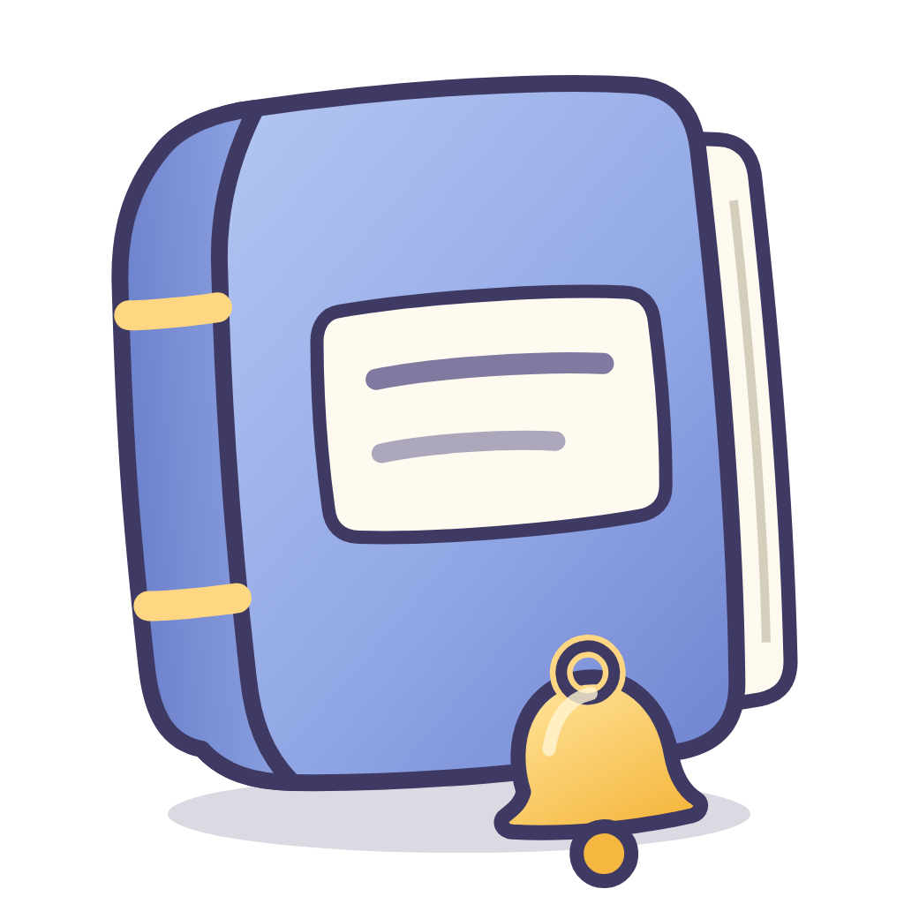

# Bellanote

A Windows desktop notes app built around a bookshelf. Books stand on shelves
that go on forever; drag one off and it opens into pages you write on with a
block editor. Everything is stored locally in SQLite — no account, no sync, no
network unless you ask for one.

<p align="center">
  
</p>

## What it does

**The shelf.** An endless bookcase you pan and zoom through. Books are pulled
off by dragging (a click works too). Floors are added as you need them, and the
whole world is virtualised, so a library of hundreds costs the same to render
as a library of five.

**The pages.** Each book opens as a two-page spread with a WebGL page-curl
flip. Writing is Notion-style block editing built on TipTap — a slash menu,
drag handles, a right-click block menu, tables, callouts, toggles, stickers and
effects. Pages are a fixed height and never scroll: when a page fills up,
trailing blocks flow onto the next one, and a new page is created if there
isn't one. You can deliberately leave pages blank.

**Notebook Script.** A small Markdown-plus-directives language for handing to a
chatbot: ask any AI to write it, paste the result into *Insert Script*, and it
becomes formatted pages — including trees, graphs and timelines rendered as
hand-drawn diagrams. The script is kept as the source, so it can be re-edited
and re-run. The parser is total: it never throws, and returns diagnostics
instead of failing.

**Finding things.** Full-text search across every page, plus a `Ctrl+K` quick
switcher.

**Everything else.** Custom sound design for every interaction, a guided
tutorial, export/import bundles with restore points, scheduled backups, a
system tray with quick capture, and a settings panel of roughly twenty-five
options.

## The look

Flat illustration: solid colour, one dark outline on everything, rounded
corners, and edges that bow slightly so nothing reads as machine-drawn. The
whole visual language lives in [`src/art/flat.ts`](src/art/flat.ts) — a small
palette and three primitives — and is applied in
[`src/art/flatShelf.ts`](src/art/flatShelf.ts).

Depth comes from a darker flat face beside a lighter one and a single soft
contact shadow. There is deliberately no lighting model, no texture and no
gradient anywhere in the shelf world.

This replaced three earlier attempts at realism — a CPU brush engine, generated
SDXL materials, and ControlNet-composed photoreal art. Each was slower than the
last and none of them looked good, because a half-simulated surface sits in the
gap between drawing and photograph and gets credit from neither. Flat art makes
no promise it can't keep, and costs a few dozen path fills per floor.

Run `specimen.html` against the dev server to see the vocabulary on its own.

## Stack

- **[Tauri 2](https://tauri.app/)** (Rust) — ~10 MB installer, native webview,
  low idle memory. Chosen over Electron on measured startup and footprint.
- **[SolidJS](https://www.solidjs.com/)** + TypeScript + Vite — fine-grained
  reactivity, no virtual DOM.
- **[PixiJS v8](https://pixijs.com/)** — WebGL for the shelf world, with a DOM
  overlay for the focused book so text stays crisp.
- **[TipTap v3](https://tiptap.dev/)** — the editor, with vendored Solid
  bindings in `src/editor/solid/`.
- **SQLite** via `tauri-plugin-sql`, migrations registered in the builder.
- **GSAP** for animation; **Howler** for sound.

## Layout

| Path | What lives there |
|---|---|
| `src/art/` | The flat drawing vocabulary and the shelf's shapes |
| `src/features/bookshelf/` | Pixi world, camera, gestures, layout, studio |
| `src/views/` | Book spread, left icon rails, TOC, thumbnails |
| `src/editor/` | TipTap setup, custom nodes, menus, pagination, exporters |
| `src/flip/` | WebGL page-curl engine and its snapshot cache |
| `src/script/` | Notebook Script parser and printer |
| `src/diagrams/` | Layout algorithms and hand-drawn SVG renderers |
| `src/search/` | Full-text index and quick switcher |
| `src/sound/` | Howler engine; every WAV is synthesised by `scripts/gen-sounds.mjs` |
| `src-tauri/src/` | Rust commands: media, backup, tray, export, import |
| `docs/design/` | The binding design documents — read before working in an area |

## Developing

```bash
npm install
npm run tauri dev
```

Checks, in the order they are cheapest to run:

```bash
npx tsc --noEmit
npx vitest run
npm run e2e
cargo check --manifest-path src-tauri/Cargo.toml
```

`npm run e2e` drives Playwright against a dev server on port 1420. Headless
runs use SwiftShader, so append `?fx=force` to exercise the full shelf and poll
for state rather than waiting a fixed time — `requestAnimationFrame` is
throttled there.

For anything visual, capture a screenshot and look at it before calling the
change done.

## Releasing

Push a version tag and GitHub Actions builds the NSIS installer and drafts a
release with a generated changelog.
