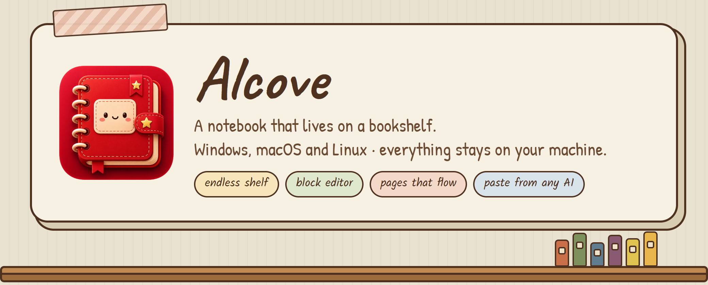
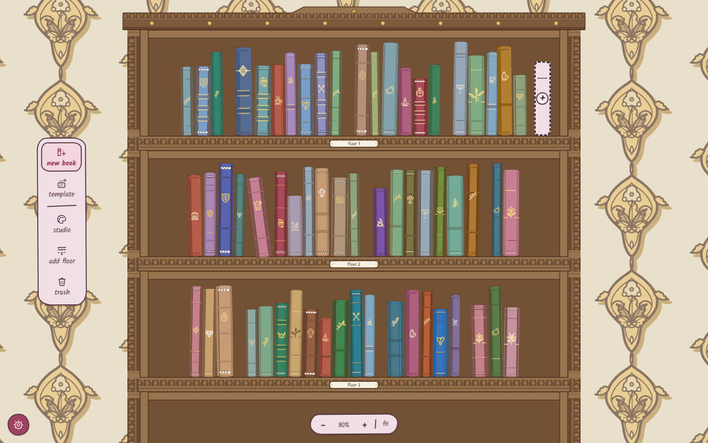
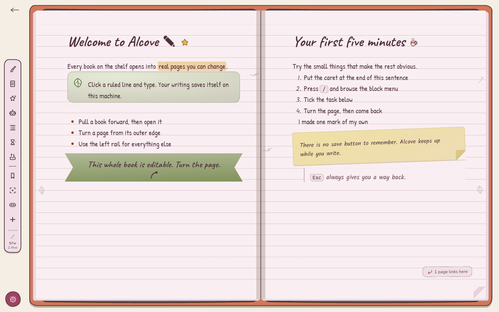
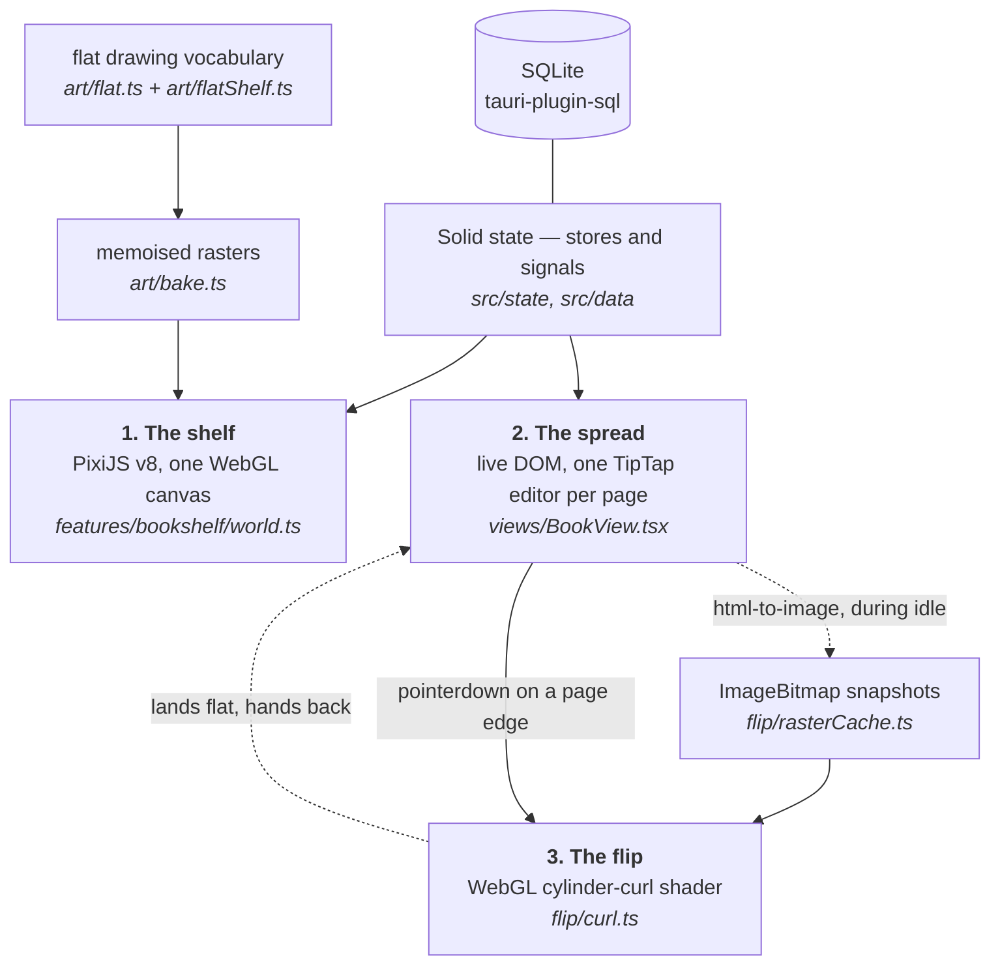
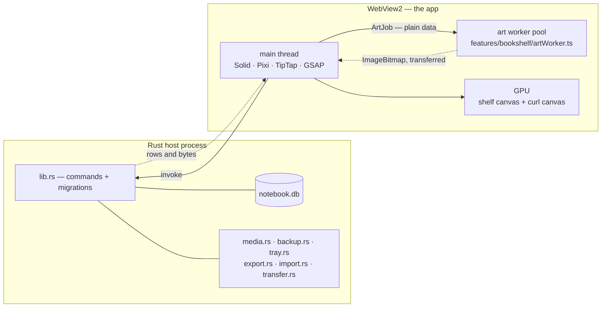

<p align="center">
  
</p>

<!--
  The badge strip below is GENERATED — `npm run readme:build` composes it from
  the version in package.json, so a release bump moves the badge, the download
  filenames and the release table together. Edit scripts/gen-readme.mjs, not
  this block.

  The first two are LIVE shields endpoints now that the repository is public:
  the real latest release and the real build status. While it was private they
  had to be static images, because shields cannot read a private repo and would
  have rendered "inaccessible" where a fact should be.
-->

<!-- gen:badges -->
<p align="center">
  <a href="https://github.com/AkshitIreddy/Alcove/releases/latest"></a>
  <a href="https://github.com/AkshitIreddy/Alcove/releases/latest"></a>
  <a href="https://github.com/AkshitIreddy/Alcove/actions/workflows/release.yml"></a>
  
  
  
</p>
<!-- /gen -->

<h1 align="center">Alcove</h1>

<p align="center">
  <b>Built like a storybook library, with cozy shelves and patterned walls. Open every book into notebook pages filled with diagrams, notes, tape, and stickers.</b>
</p>

<p align="center">
  <a href="#download-and-install"><b>▸ Download</b></a>
  &nbsp;·&nbsp;
  <a href="#a-tour"><b>▸ See it</b></a>
  &nbsp;·&nbsp;
  <a href="#written-with-an-ai"><b>▸ Write it with an AI</b></a>
  &nbsp;·&nbsp;
  <a href="docs/readme/releases.md"><b>▸ What's new</b></a>
  &nbsp;·&nbsp;
  <a href="#how-its-built"><b>▸ For developers</b></a>
</p>

<!--
  The demo is generated, not recorded by hand: `node shots-now/demo-gif.mjs`
  drives the real app with gifsmith and emits one animated WebP. It is a forward
  loop with no crossfade — the scene returns to the shelf it started on and the
  trim cuts between matching, visually seamless shelf holds.

  GitHub renders animated WebP inline, so generating a second copy as GIF only
  makes each demo refresh heavier for a repo people are meant to clone.
-->
<p align="center">
  
</p>

<p align="center">
  <sub>Every frame is the real app. <a href="shots-now/demo-gif.mjs">How it is made</a> · built with <a href="https://www.npmjs.com/package/gifsmith">gifsmith</a></sub>
</p>

---

Alcove is built like a storybook library — cozy shelves and patterned walls you
pan through and dress: repaint the carpentry, swap the wallpaper, give every
spine its own binding. Open any book into notebook pages filled with diagrams,
notes, tape, and stickers — ruled leaves, block editor, callouts, and code.

Pages are real pages: a page is a fixed leaf that never scrolls, so filling one
flows your writing onto the next and turning it is a turn rather than a scroll.
The room is yours to dress, and much further than a colour picker goes. And
nothing you write leaves your machine — there is no account and nothing to sign
into.

**And a page does not have to be typed by you.** Alcove reads *Notebook Script*,
a small Markdown dialect any chatbot can write once it has been handed the
grammar — which is one button, *copy the format for your AI*. Ask ChatGPT or
Claude or whatever you already use for revision notes; paste the answer into
*paste a script in*; it lands as real editable pages, with the sticky notes, the
callouts, the highlights and the hand-drawn diagrams already made. No API key,
no model inside the app, nothing sent anywhere: you carry the text there and
back yourself, which is why it works with an assistant that has never heard of
Alcove. [The whole loop is a few inches down.](#written-with-an-ai)

<p align="center">
  
  
</p>

> ### This page has two halves, and they are for different people
>
> **▸ [Part 1 — Using Alcove](#whats-in-the-box) · for the person writing in it**
> <br>The whole user manual: how to get it, what it does, and how to use every
> part of it. It starts immediately below, it assumes nothing about code, and it
> is the longer half.
>
> **▸ [Part 2 — Building Alcove](#how-its-built) · for a developer, or for an AI
> agent helping one**
> <br>The architecture, the stack, the gates, and how to add something without
> breaking the rest. If you are an assistant asked to contribute here, that half
> plus [`CLAUDE.md`](CLAUDE.md) is your brief.
>
> **Every technical fact lives in the second half** — including the ones a README
> usually opens with, like where the database is, what touches the network, and
> what runs in which process. None of it is needed to use the app, so none of it
> is above the line.
>
> Each half is also a page of its own under [`docs/readme/`](docs/readme/),
> carrying exactly the same words as the copy here.

**On this page**

<!-- gen:contents -->
**Part 1 — Using Alcove** — for the person writing in it. No code below this line.

- [What's in the box](#whats-in-the-box) — The five things that make this different from a folder of Markdown files
- [Written with an AI](#written-with-an-ai) — Notebook Script is a language a chatbot can write for you, the spec is one button, and the design packs generate their own prompt
- [Download and install](#download-and-install) — The installer, what it puts where, what the first launch looks like, and how to uninstall without losing your notes
- [A tour](#a-tour) — The shelf, the spread, the page turn, the slash menu, the catalogue, the two studios, the switcher
- [Writing in a book](#writing-in-a-book) — Every block a page can hold, the right-click menu, why pages never scroll, maths, diagrams, pictures, the rail end to end
- [Notebook Script](#notebook-script) — The language itself — a whole worked script, the page it makes, and everything it can say
- [Making it yours](#making-it-yours) — The two studios, every vocabulary counted, custom colours, stars and hiding, more bookcases, your own packs
- [Sound](#sound) — Sound sets, ambience beds, the volume model, and the in-app credits
- [The keyboard](#the-keyboard) — Every shortcut, grouped by where you are standing, and which ones you can rebind
- [Backups, export and import](#backups-export-and-import) — Scheduled backups, `.nbk` bundles, Markdown in and out, PDF and PNG, tray capture
- [Questions](#questions) — Where the data is, whether it is offline, moving machines, and the failure modes worth naming

**Part 2 — Building Alcove** — for a developer, or for an AI agent helping one. Nothing below is needed to use the app.

- [How it's built](#how-its-built) — The three ways the app draws itself, what runs in which execution context, and the stack table with a reason per row
- [Getting it running](#getting-it-running) — `npm run tauri dev`, the browser-only dev path, and the two bare-bones checks
- [The map of the app](#the-map-of-the-app) — Directory by directory, plus the module-docstring convention this README points at instead of copying
- [Building and releasing](#building-and-releasing) — The bundle artefacts, the icon pipeline, and the tag-driven release workflow
- [Non-goals](#non-goals) — No sync, no cloud, no mobile, no plugin API, no second visual language, no light model
- [The repo at a glance](#the-repo-at-a-glance) — Six measurements of the tree, every one recomputed rather than typed
- [Deeper reading](#deeper-reading) — The two halves as pages of their own, and every section of them this page does not already carry
- [How this page stays honest](#how-this-page-stays-honest) — Why no number here is typed, why no paragraph is written twice, and what the check does and does not do
- [Licence and credits](#licence-and-credits) — MIT, the bundled fonts, where the sound came from, and the two brand images that are not interchangeable
<!-- /gen -->

# Part 1 — Using Alcove
<!--nav: for the person writing in it. No code below this line.-->

## What's in the box
<!--nav: The five things that make this different from a folder of Markdown files-->

- **A bookshelf world.** A room you pan and zoom through, with as many bookcases
  as you care to build and <!--f:defaultFloors-->10<!--/f--> floors per case to
  start with. Books are drawn objects, not rows in a list — you recognise yours
  by its binding.
- **A language an AI can write for you.** *Copy the format for your AI* puts
  <!--f:specLines-->907<!--/f--> lines of generated grammar on your clipboard;
  any chatbot then writes you a note in it, and *paste a script in* turns that
  answer into formatted pages — sticky notes, callouts, highlights, and trees,
  graphs and timelines drawn as real diagrams rather than pasted as pictures.
  Pages come back out in the same language, so one an assistant wrote can be
  handed back to it. [The whole story is below](#written-with-an-ai).
- **Pages that never scroll.** A page is a fixed leaf of paper. When you fill
  it, the trailing blocks flow onto the next page, and a new page is made if
  there isn't one. Turning a page is a page turn.
- **Customisation that goes much further than a colour picker.**
  <!--f:roomPresets-->69<!--/f--> named rooms,
  <!--f:shelfPresets-->113<!--/f--> named bookcase designs,
  <!--f:wallpaperPapers-->126<!--/f--> wallpapers,
  <!--f:bookPresets-->67<!--/f--> authored book bindings,
  <!--f:stickers-->50<!--/f--> stickers,
  <!--f:effectAxes-->11<!--/f--> axes of block decoration — and a hex box in
  every picker, for when none of them is the colour you meant.
- **The quiet infrastructure.** Full-text search, a `Ctrl+K` switcher, scheduled
  backups, an export bundle another copy of the app can import, a tray icon for
  capturing a thought without opening the window, and a sound for everything you
  touch.

Every number on this page was read out of the module that defines it and wrapped
in a marker `npx vitest run` recomputes — see
[How this page stays honest](#how-this-page-stays-honest).

<!-- gen:lift-ai -->
## Written with an AI
<!--nav: Notebook Script is a language a chatbot can write for you, the spec is one button, and the design packs generate their own prompt-->

Most assistants hand you plain text. Alcove is built so an
assistant can write the **whole page** — the sticky notes, the callouts, the
diagrams — and so you never have to teach it how.


**Take the grammar** — *download the format for your AI* saves
<!--f:specLines-->907<!--/f--> lines generated from the parser's own tables, so
it cannot describe a language the app would refuse. **Ask for a note** in your
own words and have the assistant return an attached `.md` file. **Open it
directly in Alcove**; downloading preserves TeX backslashes and code fences
that browser copy/paste can alter. The dialog previews what it recognised
before anything lands on the page. A `::page` line starts a protected page, so
overflow from an earlier large image creates spill pages before it instead of
shifting every later section.

Nothing is sent anywhere — no API key, no model in the app, no request to
anybody's server. You carry the text to whichever assistant you already use and
carry the answer back, which is why it works with a chatbot that has never heard
of Alcove. And it reads back out: *copy this page as script* hands a page to an
assistant for revision.

The same idea runs through the customisation — the *your designs* dialog hands
you a prompt for making a pack, generated from the importer's own schema
([`src/features/packs/prompt.ts`](src/features/packs/prompt.ts)), so it
cannot describe a format the importer would reject.
<!-- /gen -->

<!-- gen:lift-download -->
## Download and install
<!--nav: The installer, what it puts where, what the first launch looks like, and how to uninstall without losing your notes-->

One file you double-click. No account, no browser bundled inside it, and
nothing left running when you close the window.

| Platform | Take |
| --- | --- |
| **Windows 10 / 11** | [`Alcove_0.6.2_x64-setup.exe`](https://github.com/AkshitIreddy/Alcove/releases/latest) · about 16 MB |
| **macOS 11+** | [`Alcove_0.6.2_universal.dmg`](https://github.com/AkshitIreddy/Alcove/releases/latest) · Apple silicon and Intel |
| **Linux** | [`.deb`, `.rpm` or `.AppImage`](https://github.com/AkshitIreddy/Alcove/releases/latest) |

An MSI, an offline installer and a `SHA256SUMS.txt` are on the [Release page](https://github.com/AkshitIreddy/Alcove/releases/latest) too, along with what each one is for.

Starting with the first updater-enabled release, Alcove checks that same Release
page after launch and offers newer signed versions in the app. If you installed
v0.4.0, install the next release manually once; v0.4.0 predates the updater, so
it cannot discover that first upgrade by itself.

**[What is new in this version](docs/readme/releases.md)**

And this is the whole of what arrives — one bookcase, ten floors, one book:


### Where your writing lives

The **program** goes in one place and your **library** in another, so removing
the app never touches what you wrote.

| | Windows | macOS | Linux |
| --- | --- | --- | --- |
| **The program** | `%LOCALAPPDATA%\Alcove\` | `/Applications/Alcove.app` | your package manager's usual place |
| **Your library** | `%APPDATA%\com.alcove.app\` | `~/Library/Application Support/com.alcove.app/` | `~/.local/share/com.alcove.app/` |

In the library folder: `notebook.db` is everything you have written, `assets/`
every picture you pasted, `backups/` the scheduled ZIPs.

### The first time you open it

Nothing to configure, nothing to sign into, no splash screen. In order:

1. **A library is created** at the path above and seeded with exactly one book —
   *Welcome to Alcove ✎* ([`src/data/seed.ts`](src/data/seed.ts)) — which is a
   real book you can edit, rename or crumple like any other. It is also a worked
   example: every page of it is authored in Notebook Script.
2. **You are asked <!--f:tasteQuestions-->5<!--/f--> questions about your
   taste** — which room you would rather sit in, how much colour you want, what
   the paper should be — and the whole library is dressed from your answers, so
   what you see next is a room you chose rather than a demo.

   ![The first taste question on a cream sheet over the library, headed "Where would you rather be sitting?" with "question 1 of 5" above it and "I'll pick later" in the top-left corner. Under it, eight choices in two rows, and each one is a real little painting of that room rather than a word or a swatch — a reading room in dark squared cabinet work, a chapter house with pointed bays, a plain desk of board and uprights, the good parlour in soft pink, a glasshouse of slender bars and ferns, a room by the water in harbour blue, a toy box in shouting colours, and a workshop of sawn boards and pegs — each with its name and a line describing it. Five progress dots and a "next" button sit at the foot.](docs/readme/img/first-run.png)

3. **The guided tour runs**, <!--f:tourSteps-->21<!--/f--> steps in a long or a
   short version, each asking for one concrete action and turning green when it
   sees you do it. Skip it if you would rather poke at it yourself; *Settings →
   Help → replay the tour* starts it again later.

   ![The tour's first card over a dimmed first-launch shelf — one small book on an otherwise empty bookcase, which is exactly what a new library holds. The card reads "step 1 of 21", is headed "Welcome to Alcove", and explains that each step asks you to try one thing and turns green once you have. Under a key hint reading "Enter to go on · Esc to leave" are the two lengths to choose between: "the short way — 11 steps — open a book, write, find things" and "the full rundown — 21 steps — every tool on both rails". A row of twenty-one step dots runs beneath, the first one filled, with "skip the tour" bottom-left and back and next bottom-right.](docs/readme/img/tour.png)
4. **The room is quiet until you touch it.** A fireplace bed is mixed low under
   everything by default, and the webview's autoplay policy holds it until your
   first click — so the app is never making noise at somebody who has not
   touched it yet. One switch turns it off for good.

What you land on is the shelf itself, which is where [A tour](#a-tour) picks up.
<!-- /gen -->

<!-- gen:lift-tour -->
## A tour
<!--nav: The shelf, the spread, the page turn, the slash menu, the catalogue, the two studios, the switcher-->

| To do this | Do that |
| --- | --- |
| Move around the room | wheel **zooms**, shift+wheel pans, dragging bare wall moves the camera — and the two can be swapped in *Settings → Library & shelf* |
| Open a book | drag it out of its slot, or just click it for a quick pull |
| Go back | `Escape`, from anywhere in the app |
| Write | click any ruled line and type; clicking bare paper below your last line starts a line there |
| Reach for a block | `/` on an empty line, or right-click a block you have already written |
| Reach for a tool | the left rail inside a book, the left dock on the shelf. There is no top bar anywhere in the app |

Or let the app show you: the guided tour is
<!--f:tourSteps-->21<!--/f--> steps, long or short, each asking for one
action and turning green when it sees you do it.

### The shelf is the file browser

Books stand on floors of a bookcase, and the bookcase is the only file browser
there is: no tree, no list view, no "all notes". A floor is a shelf you can see
along, a slot is where a book stands, and the dashed outline at the end of a row
is the next free one.


Nothing here is a rectangle with a gradient on it: every spine is drawn from the
book's own seed through [`src/art/bookDesign.ts`](src/art/bookDesign.ts), baked
once to a texture and packed into an atlas. Floors you cannot see are not drawn,
so a case with three hundred books costs about what a case with three costs. The
camera, the virtualisation and the level-of-detail rules live in
[`src/features/bookshelf/`](src/features/bookshelf/) and are specified in
[`docs/design/bookshelf-rendering.md`](docs/design/bookshelf-rendering.md).

Right-clicking a spine gives you the book's own verbs — take it out, rename,
dress it, duplicate, move it along the shelf, send it to another bookcase, or
crumple it into the trash. You can also pull a book out and drop it directly on
the trash dock.

Pull back and the whole case is one object — <!--f:defaultFloors-->10<!--/f-->
floors as standard, up to <!--f:maxFloors-->60<!--/f--> when you keep pressing
*add floor*, and as many separate bookcases as you want to build.

![The same bookcase pulled all the way back to 38%, much more of it in frame now and small against the wall: the slab cornice, then seven complete floors and the top of an eighth running off the bottom of the window. Only the top three hold books — three tight rows of colour — and the rest are ranks of empty ogee-arched recesses waiting to be filled. The gold trellis wallpaper runs away on both sides and above, gone to a fine net at this size, which is what a library with room left in it actually looks like.](docs/readme/img/shelf-zoomout.png)

### A book opens as a spread, and turns like a book

Two pages side by side, ruled paper, a tool rail down the left edge, and a word
count at its foot. You turn a page by dragging its outer edge or the corner
curl, which lets you take the turn at your own speed and change your mind
halfway. To jump rather than turn, the table of contents (`Ctrl+Alt+T`) and the
thumbnail strip (`Ctrl+Alt+M`) both open with a key and are walked with Tab and
Enter.


Mid-turn, the leaf lifts off the spread and you can see the next page under it:


At rest the pages are live DOM, so text stays selectable and crisp. The moment
you start a turn, the app swaps to a WebGL cylinder-curl shader fed by
pre-rasterised snapshots of the two pages, then swaps back. That trade — and the
CSS fallback used when WebGL is unavailable — is written up in
[`docs/design/page-flip.md`](docs/design/page-flip.md) and implemented in
[`src/flip/`](src/flip/).

### Writing: a slash menu, and a catalogue of everything

Press `/` on an empty line for the menu. There are
<!--f:slashCommands-->110<!--/f--> commands in it, in three sections — the blocks
(diagram starters among them), the stickers, and *turn into* for changing what
the current line already is. It is defined in
[`src/editor/slash/registry.ts`](src/editor/slash/registry.ts), and the fuzzy
filter ranks a title prefix above a word-start above a substring, so short
queries land where you expect.


If you would rather browse than type, the rail's **Catalogue** shows everything
the pages can hold, shelved by kind — paper and cards, text blocks, callouts,
diagrams, tape and trim, lettering, stickers — with a search box across the top
for when you already know the word.

![The Catalogue panel open down the left edge, pushing the spread to the right rather than covering it. A box reading "search the catalogue…" sits at the top, then eight filter chips — everything (selected), paper & cards, text blocks, callouts, diagrams, tape & trim, lettering, stickers. Below them, a three-column grid under "paper & cards — things stuck to the page" holds twenty labelled tiles: Sticky note, Polaroid, Washi box, Card, Quote card, Banner, Spoiler, Index card, Envelope, Stamp, Tag, Margin note, Pressed flower, Ticket stub, Postcard, Ledger, Photo corners, Wax seal, Map pin and Columns. A second grid, "text blocks — the ordinary furniture", gets as far as Text, Heading 1, Heading 2, Heading 3, Bullet list and Numbered list before running off the bottom of the panel.](docs/readme/img/catalogue.png)

The catalogue and the slash menu read the *same* registry, so a block that
exists in one is in the other. That was not always true, and the day it stopped
being true is the most instructive bug in the repo — see [Things that were
harder than they
look](docs/readme/part-2-developers.md#things-that-were-harder-than-they-look) in Part 2.

### The studios: this is how deep the customisation goes

The **library studio** dresses the room. A room preset sets the colours, the
carpentry and the paper together, and every one of those stays yours to change
afterwards.

![The library studio open down the left edge, pushing the shelf to the right rather than covering it. The panel is headed "Library studio" and has "this library" and "your own" tabs; under "bookcases" a card shows a little drawing of the current case, "My Library", "61 books · 10 floors" and rename, clone and delete buttons, then "add bookcase" and "add a floor" and a line reading "this bookcase has 10 floors. everything below is dressed here." Under "presets — the house room" is a grid of room thumbnails, each a tiny painting of that whole room rather than a swatch — The House Room (selected, ringed amber), Gilt Salon, Card Room, Carnival and a teal one running off the bottom edge — beside a dashed tile reading "64 more…". To the right stands the walnut bookcase against its gold trellis wallpaper, three floors full, with the new book / template / studio / add floor / trash dock between them, studio lit, and a zoom control reading 80% at the foot.](docs/readme/img/studio.png)

The **book studio** dresses one book, and only that book: a binding follows its
book into every room, which is what lets you recognise it after you have
repainted the walls.


Both are covered properly under [Making it yours](#making-it-yours).

### Finding things

`Ctrl+K` opens the switcher. On the shelf it jumps across the whole library;
inside a book it stays inside that book. It finds books, headings and UI
commands by fuzzy match, weighted by what you have opened recently, and `>`
(or the Tab key, or the tab at the top) flips it into full-text search over the
same current scope.
Activating a search result opens the book, turns to the page and pulses the
match so you can see where it was.


Shelf search deliberately ignores which bookcase you are standing in front of:
something you wrote may be in any room. Once a book is open, the scope narrows
to that book so similarly named pages elsewhere cannot get in the way.

## Writing in a book
<!--nav: Every block a page can hold, the right-click menu, why pages never scroll, maths, diagrams, pictures, the rail end to end-->

### What a page can hold

Everything below is a real block type, reachable from the slash menu, the
catalogue or Notebook Script.

| | |
| --- | --- |
| **The ordinary furniture** | paragraphs, three heading levels, bullet and numbered lists, to-do lists with checkboxes, quotes, dividers, code blocks with syntax highlighting, tables |
| **Asides** | callouts (info, tip, warn, star), toggles that remember whether they were open, spoilers that hide an answer until clicked |
| **Paper and keepsakes** | sticky notes, polaroids, washi boxes, cards, quote cards, banners, index cards, envelopes, stamps, luggage tags, margin notes, postcards, ledgers, pressed flowers, ticket stubs, photo corners, wax seals, map pins |
| **Structure** | two or three columns, page links that list themselves back on the page they point at, footnotes |
| **Maths** | inline `$x^2$` and display equations |
| **Diagrams** | tree, mindmap, flowchart, graph, timeline |
| **Pictures** | paste or drop an image, image rows, link cards with a title and favicon |
| **Decoration** | <!--f:stickers-->50<!--/f--> stickers, and <!--f:effectAxes-->11<!--/f--> axes of block decoration carrying <!--f:effectValues-->472<!--/f--> values between them |

### The right-click menu

Right-click any block for the Notion-style context menu
([`src/editor/menu/registry.ts`](src/editor/menu/registry.ts)): **Turn into**,
**Color** for the ink, **Highlight** for the washes, **Columns**, **Effects**,
then insert above, insert below, duplicate, *copy block as script*, and delete.
Blocks can be dragged by the handle that appears in the margin, and dropping one
settles it into place rather than teleporting.

### Pages never scroll, and that is the point

A page is a fixed leaf of paper. When what you have written exceeds it, the
editor peels the trailing blocks off the end and hands them to the next page,
creating one if there isn't one — and it carries your caret across the break, so
you can keep typing straight through the join without noticing you crossed it.
Deleting from a full page pulls the blocks back.

It would be easier to put a scrollbar in a page. The reason there isn't one:

- **A page you can see all of is a page you can find things on.** A book of
  fifty short pages is navigable — thumbnails, a table of contents, a page
  number, a spread you can take in at a glance. One page of infinite length is a
  rope you have to pull.
- **The turn means something.** A page turn is a real boundary, and a
  page-curl animation over a scrolling div would be decoration. Here it moves
  you a real distance.
- **Footnotes can be at the foot of the page**, because there is a foot.
- **A blank page can be deliberate.** Leave one empty and it stays empty.

The contract lives in [`src/editor/pagination.ts`](src/editor/pagination.ts),
where the arithmetic is DOM-free and unit-tested, and it is the rule the rest of
the editor is built around: a footnote's text is stored *on the marker* rather
than in a table at the page level, precisely so that a footnote which flows to
the next page arrives with its note already attached
([`src/editor/nodes/footnote.ts`](src/editor/nodes/footnote.ts)).

Focus mode is a ladder rather than a switch
([`src/views/rail/focusLevels.ts`](src/views/rail/focusLevels.ts)): off, then
the chrome goes, then the book goes and leaves two bare leaves, then one leaf
alone edge to edge. There is a zoom on top of it, and it is a transform rather
than a bigger box — deliberately, because growing the leaf would change how much
fits on a page and repaginate your book behind your back.


### Maths, without a webfont

`$x^2$` inline, or an equation block on its own line. The renderer is a
documented TeX subset written for this app
([`src/editor/nodes/mathTex.ts`](src/editor/nodes/mathTex.ts)) — superscripts and
subscripts, `\frac`, `\sqrt`, big operators with limits, delimiters that grow,
the Greek alphabet and the usual relations and arrows, upright function names,
`\text{}` — rendered as plain HTML in the page's own serif face rather than
through KaTeX's Computer Modern.

It does not do matrices, alignment, cases or arrays, and says so: those are
documents rather than afterthoughts, and half a matrix renderer is worse than
none. Like the script parser, it never throws — an unknown macro renders as its
own name in a muted colour and you keep typing.

### Diagrams

<!--f:scriptDiagrams-->5<!--/f--> kinds, drawn rather than embedded: **tree**,
**mindmap**, **flowchart**, **graph** and **timeline**. Each arrives from the
slash menu with a small worked example already in it, and each is edited as a
few lines of text — the layout algorithms and the hand-drawn SVG renderers are
in [`src/diagrams/`](src/diagrams/).

![The Welcome book open where its diagram chapter begins, every box and join drawn with a pen wobble. The left page is headed "Diagrams, drawn by hand" and opens "Indentation alone makes a `tree`: two spaces to a level, `|` for a note". Under it stands the tree it describes — Alcove branching to "A library" and "A book", the library on to "Bookcases · one per subject" and "Floors", the book on to "Pages · this thing you are reading" and "Ribbons". A tan card below names the five fences in italic handwriting — tree, mindmap, graph, flowchart, timeline — then says "Five fences, no library: every line is drawn by hand." The right page is headed "Thrown outward" and explains that a `mindmap` reads like a `tree` but lays its branches around the middle. Its mindmap fans out from Bookbinding through Tools, Sewing and Covering to Bone folder, Kettle stitch, Long stitch, Quarter leather and Cloth, with a banner at the foot reading "Swap the word and it redraws."](docs/readme/img/diagrams.png)

### Pictures and links

Paste or drop an image and it is stored under your library's `assets/` folder
and inserted; several at once become an image row. Paste a bare URL on an
empty line and you get a link card, which fills itself in with the page's title,
description and favicon a moment later, and degrades to a plain link chip if the
site does not answer. Those two moments are the only times the app reaches the
internet at all, they only happen because you asked, and neither of them sends
anything you wrote.

Pages can also point at each other: type `[[` for the page picker, and the page
you pointed at lists yours back at the bottom
([`src/editor/backlinks/`](src/editor/backlinks/)).


### The rail, end to end

Ten hand-drawn icons down the left edge, each with its own tooltip. The first
six open a panel; after a divider, four that just do something.

![The spread with the icon rail down its left edge, and a hand-drawn tooltip out beside the fourth icon reading "Table of contents" with a Ctrl+Alt+T key cap on it. Ten glyphs in all: the paintbrush that dresses the book, page style, the catalogue's star, contents — lit, because that is the one being pointed at — page history, and the tray that opens "in and out". Then a short rule, and after it the bookmark that ribbons the page, focus mode, thumbnails and add-a-page. A nib and a word count sit at the foot below a dashed line.](docs/readme/img/rail.png)

| Tool | What it opens |
| --- | --- |
| Customize this book | the book studio — binding, cover title, emblem, frame and page edges |
| Page style | ruled, grid, dotted or blank, plus the line spacing |
| Catalogue | everything you can put on a page, browsable and searchable |
| Table of contents | every heading in the book, click to jump |
| Page history | the autosave snapshots of this page, a line of preview each |
| **In and out** | the one sheet where writing enters and leaves |
| Ribbon this page | marks it in one press, and opens the plate to pick a ribbon |
| Focus mode | the rungs of the ladder, and the zoom |
| Thumbnails | the strip of little pages along the bottom |
| Add a page | a new page after this one |

Every row carries its own key cap, read from your keymap rather than printed,
and calls the same opener the keyboard calls — so a button and its shortcut
cannot drift apart.

To remove a leaf, right-click anywhere on that page and choose **Delete this
page**. The option is deliberately absent when it is the book's only page.

### The daily page, and templates

`/today` finds or creates today's dated page in your Journal book
([`src/editor/journal.ts`](src/editor/journal.ts)).

There are <!--f:templates-->5<!--/f--> built-in templates — Cornell notes,
Lecture notes, Flashcard deck, Weekly planner, Reading log — and each is authored
as Notebook Script ([`src/features/templates/templates.ts`](src/features/templates/templates.ts)),
so the gallery preview, the inserted pages and the script it copies back out
about what a template is. The gallery is the *template* button on the shelf's
left dock, and the same entry sits on the bare-plank right-click menu, because
a template is a way of starting a book rather than a thing you do to one.
<!-- /gen -->

<!-- gen:lift-manual -->
## Notebook Script
<!--nav: The language itself — a whole worked script, the page it makes, and everything it can say-->

The language behind [Written with an AI](#written-with-an-ai) above: a Markdown
dialect small enough that a chatbot writes it correctly on the first try, and
expressive enough to produce a decorated page rather than a wall of paragraphs.
Plain Markdown is a subset of it, so you can write it yourself and never learn a
directive.

### A whole script, and the page it makes

````text
---
title: Field Notes — Week 3
paper: grid
wash: moss
---

# Photosynthesis {sticker=leaf}

Sunlight in, sugar out. The ==light-dependent=={color=amber} half runs in the thylakoid.

::: sticky-note {color=lemon, rotate=-2, tape=corner}
Exam **Friday** — learn both stages.
:::

```graph
Sun -> Leaf: light
Water -> Leaf
Leaf -> Glucose, Oxygen
Glucose {color=amber}
```

```timeline
1771: Priestley — air is "restored"
1779: Ingenhousz — only in the light
1845: Mayer — sunlight becomes chemical energy
```
````

The paste box previews as you paste, naming each piece it recognised — one
sticky note, a graph of four edges, a timeline of three entries — so you can see
the shape of the result before you commit it:

![The Insert script dialog over a dimmed book called Field Notes, subtitled "paste Notebook Script — from your AI, or your own pen". On the left the pasted script in a monospace box, scrolled to the sticky-note directive and the graph and timeline fences. On the right a live preview headed FIELD NOTES — WEEK 3: the Photosynthesis heading, the paragraph with its amber highlight, a yellow sticky-note block tagged "sticky-note", and two hatched placeholder cards tagged "graph" and "timeline" reading "4 edges" and "3 entries". "Copy the format for your AI" sits at the bottom left, Cancel and Insert at the bottom right.](docs/readme/img/script-dialog.png)

Insert, and it lands on the page as real editable blocks — the diagrams drawn,
not embedded as images:

![The page after inserting, on grid paper: "Photosynthesis" in large handwriting with a leaf sticker, the paragraph with "light-dependent" in an amber highlight, a yellow sticky note with a curled corner reading "Exam Friday — learn both stages.", then a hand-drawn node graph — Sun by an edge labelled "light" and Water both flowing into Leaf, Leaf out to an amber-filled Glucose and to Oxygen — and below it a timeline hung on a vertical spine with three dated cards off it: 1771 Priestley — air is "restored", 1779 Ingenhousz — only in the light, 1845 Mayer — sunlight becomes chemical energy. The facing page is still blank ruled paper, because the script was inserted into an empty book.](docs/readme/img/script-page.png)

### What the language has

Everything a page can hold, said in plain text:


### It does not fail

`parse()` is **total**: it never throws. A malformed line produces a diagnostic
naming the line, the column and what was expected, and the app renders your
intent anyway — near-miss spellings like `papper` and `microscop` are corrected
with a warning rather than dropped. That promise, and the grammar it guards, are
specified in [`docs/design/script-language.md`](docs/design/script-language.md)
and implemented in [`src/script/`](src/script/).

The script is kept alongside the page, so a note written this way can be edited
as script and re-run, or copied back out with *copy this page as script*. A
single block comes out the same way from the right-click menu.

## Making it yours
<!--nav: The two studios, every vocabulary counted, custom colours, stars and hiding, more bookcases, your own packs-->

### Two studios, and what each one owns

The **library studio** dresses the room you are standing in: its colours, its
carpentry, its wallpaper, its floors, and the collection of bookcases. The
**book studio** dresses one book: its straight binding, complete cover title,
lettering hand, unified emblem, frame, page-edge finish and sewn endband. Page style and bookmark ribbons remain
their own page tools.

The split is deliberate and worth knowing, because it is what makes the
customisation survivable. A binding belongs to the book, so a book you bound in
oxblood leather is oxblood leather in every room — repaint the walls and you can
still find it. Repainting a room does not straighten its arches; rebuilding a
case does not repaint it.

A **room preset** is not the same thing as a colour theme. A preset bundles
colour *and* carpentry *and* paper into one named room; a theme is only the
colour half. Pick a preset to get somewhere good in one click, then change any
part of it without losing the rest.

### Counted from the modules themselves, not estimated

| What you choose | How many | Where it is defined |
| --- | --- | --- |
| Rooms (colours + carpentry + paper, as one pick) | **<!--f:roomPresets-->69<!--/f-->**, sorted by the kind of room they are | [`src/views/rail/designOptions.ts`](src/views/rail/designOptions.ts) |
| Colour schemes on their own | **<!--f:roomThemes-->60<!--/f-->** | [`src/art/themes.ts`](src/art/themes.ts) |
| Bookcase carpentry | **<!--f:shelfBuilds-->52<!--/f-->** builds × **<!--f:shelfPatterns-->50<!--/f-->** timber patterns, **<!--f:shelfPresets-->113<!--/f-->** named | [`src/art/shelfDesign.ts`](src/art/shelfDesign.ts) |
| Wallpaper | **<!--f:wallpaperMotifs-->50<!--/f-->** motifs, each with its own scale, relief, ink, tone and edge — **<!--f:wallpaperPapers-->126<!--/f-->** combinations named and hung | [`src/art/wallpaperDesign.ts`](src/art/wallpaperDesign.ts) |
| Book bindings | **<!--f:bookShapes-->3<!--/f-->** straight spine shapes, **<!--f:bookMaterials-->18<!--/f-->** construction-led materials and **<!--f:bookDecorations-->59<!--/f-->** authored spine programmes, **<!--f:bookPresets-->67<!--/f-->** named bindings | [`src/art/bookDesign.ts`](src/art/bookDesign.ts) |
| Book cloths | **<!--f:bookCloths-->50<!--/f-->** pigments, each with a name that means something | [`src/art/flat.ts`](src/art/flat.ts) |
| Book covers | **<!--f:coverPigments-->50<!--/f-->** pigments, **<!--f:coverFrames-->12<!--/f-->** continuous frames, **<!--f:coverMedallions-->16<!--/f-->** shelf-legible emblems, 15 title treatments, 10 lettering hands, 6 page edges and 3 endbands | [`src/art/covers.ts`](src/art/covers.ts) |
| Bookmark ribbons | cloth × weight × tail × material × charm, **<!--f:ribbonPresets-->40<!--/f-->** named | [`src/views/bookmarks.ts`](src/views/bookmarks.ts) |
| Block decoration | **<!--f:effectAxes-->11<!--/f-->** axes, **<!--f:effectValues-->472<!--/f-->** values, applicable to **<!--f:blockEffectTypes-->35<!--/f-->** kinds of block | [`src/editor/effects/vocabulary.ts`](src/editor/effects/vocabulary.ts) |
| Stickers | **<!--f:stickers-->50<!--/f-->**, grouped by family, plus your own | [`src/editor/nodes/stickers.ts`](src/editor/nodes/stickers.ts) |
| Sound sets | **<!--f:soundSets-->28<!--/f-->**, voicing **<!--f:soundCues-->64<!--/f-->** cues | [`src/sound/soundSets.ts`](src/sound/soundSets.ts) |
| Ambience beds | **<!--f:ambienceBeds-->10<!--/f-->**, plus silence | [`src/sound/engine.ts`](src/sound/engine.ts) |
| Settings | **<!--f:settingsOptions-->44<!--/f-->**, across appearance, library & shelf, motion & feel, sound, writing, system, library files and help | [`src/data/defaults.ts`](src/data/defaults.ts) |

Some of it is not in a studio at all. *Settings → Appearance* is where the
choices that belong to the whole app live rather than to one room — the theme,
the hand every page is written in, how big the reading type is and what colour
the ink is — and two smaller ones sit with them: the **pointer**, which the app
draws itself in a set you pick and hands back to the system on its own under
Windows High Contrast, where a drawn cursor is the wrong answer, and the **nib**
you write with.

![The settings sheet open down the right-hand edge over three full floors of the bookcase, its ✕ in the sheet's own top-left corner and a search box under the "Settings" heading. The Appearance section: "choose my look again — 5 questions, and the whole library takes after your answers" with a start button; "surprise me — parchment · sepia ink · the room's own paper · everyday hand" with "roll a whole look"; a "theme" row, "the room this app is drawn in", whose nine chips each carry their own colour — parchment (ticked), honeycomb, apricot, blossom, peony, botanical, verdigris, night, midnight — over "more theme · 21 more, in 4 shelves · show all 30"; a "hand" row, "the face every page is written in", whose six chips are each drawn IN the face they name — everyday hand (ticked), quick note, brush hand, drafting hand, marker, book serif — over "more hand · 21 more, in 3 shelves · show all 27"; a body-size slider reading 18px; and an "ink" row of coloured chips, sepia ticked, then graphite, fountain blue, iron gall, walnut, burgundy, forest, navy, teal and indigo.](docs/readme/img/appearance.png)

### A colour of your own

Every colour chooser also takes a hex code. A vocabulary is the right shape for
browsing and the wrong shape for someone who already knows what they want, and
there is no number of curated colours that contains yours.

Committed colours are remembered and shared across every picker in the app
([`src/art/customColour.ts`](src/art/customColour.ts)), so a green you mixed for
a callout can bind a book. A half-typed hex is never overwritten with a default
while you are still typing it.

### Stars, and taking things off a list

Every long list in the studios — rooms, carpentries, papers, bindings, sound
sets — carries the same two gestures
([`src/data/shelfOfMine.ts`](src/data/shelfOfMine.ts)):

- **Stars.** One star pins an entry to the top of its own family; two lift it
  clear of the families to the top of the whole list.
- **Hide.** Take an entry off the list and the app stops offering it and stops
  rolling it at random. Nothing is destroyed: a restore drawer hands it back
  whenever you ask, with checkboxes.

A room you compose yourself can be saved, and a saved room is starrable and
hideable like any shipped one. Removing one is exactly as undoable as removing
anything else.

### More bookcases

A library is a collection of bookcases ([`src/data/bookcases.ts`](src/data/bookcases.ts)).
Each has its own name, its own room, its own floors and its own books, and each
is dressed independently — one case can be a green Athenaeum and the next a pale
card room. Books move between them from the spine's right-click menu. Search and
the `Ctrl+K` switcher deliberately span all of them.

### Bringing in your own work

The studios have a **your designs** section that takes packs you or a chatbot
made ([`src/features/packs/`](src/features/packs/)), in
<!--f:packCategories-->4<!--/f--> categories:

| Category | What you bring |
| --- | --- |
| Wallpaper | a recipe — motif, scale, relief, ink, tone and edge, out of the vocabulary the app already draws |
| Carpentry | a recipe — a build and a timber pattern |
| Stickers | actual SVG or PNG files |
| Sounds | actual audio files, mapped onto the cues you want to replace |

The dialog gives you an upload button, a paste box beside it — JSON handed to
you in a chat window is already on your clipboard — and a **generated** prompt
describing the exact format the importer accepts, derived from the schema rather
than written by hand. A refusal is a list of problems with places and sentences,
shown where you can read it twice.

Wallpaper and carpentry are recipes rather than pictures for a reason: the wall
is one tile repeated across the widest surface on screen, seamless because the
app draws it, and an uploaded picture would show its join at exactly the place
you look at all day.

<!--f:packRefusals-->5<!--/f--> other categories are listed as **not**
importable, each with its reason — a list of what you cannot bring is worth more
than silence about it.

### The trash

Crumpled books go to one drawer for the whole library, not one per bookcase —
the same reasoning as [search](#finding-things), applied to the moment you
notice something is gone
([`src/features/bookshelf/TrashPanel.tsx`](src/features/bookshelf/TrashPanel.tsx)).
Every row is labelled with the bookcase it came from, restore puts the book back
where it stood, and *empty* counts what it is about to shred and names the scope
before it does. There is a scope toggle when you have more than one case.

### Favourites

Pin a book from its right-click menu and it sorts first when *Settings →
Library & shelf* is set to sort by favourites. Pinning changes organisation,
not the binding you carefully chose.

## Sound
<!--nav: Sound sets, ambience beds, the volume model, and the in-app credits-->

Every interaction has a sound, and the whole set can be re-voiced.

![The settings sheet open down the right-hand edge, scrolled to its Sound section, over the bookcase at 80% — one book-filled floor is visible near the top and the lower floors are empty. Under the heading: a "sound set" row reading "House — the set as recorded — warm, even, nothing pushed" over seven chips, House ticked, then Loose Leaf, Reading Room, Brass Bell, Drafting Table, Quiet Hours and Paper Birds — one per character — with "more sound sets · 21 more, in 7 characters · show all 28" beside a button, and "add your own set · your sound files — name each one after the cue it replaces" beside "choose files…". Then five sliders, each with its own percentage: master volume 80%, little clicks & pops 70%, page sounds 80%, bookshelf sounds 70%, ambient bed 35%. Then "mute everything" (off) and "play ambience — run the chosen soundscape underneath" (on), a "soundscape" row of eleven chips with fireplace ticked — rain, storm, fireplace, crickets, night, wind, stream, forest, shore, cafe, none — and below them "typing sounds — soft pencil scratches as you type" and the top of "hourly chime" running off the bottom edge.](docs/readme/img/settings.png)

A **sound set** is a named character every cue in the app is heard through — the
button, the panel, the checkbox, the page turn, the book coming off the shelf,
the crumple, the keystroke, the bell. There are
<!--f:soundSets-->28<!--/f--> of them, grouped by character — the house voicing
and its near neighbours, then paper, library, chamber, studio, hush and
whimsy — between them voicing <!--f:soundCues-->64<!--/f--> cues.

A set adds no new recordings. It conditions the ones that ship — substituting
which family voices a role, changing playback rate, trimming gain, layering a
second quieter cue underneath, drawing from a different pool of takes, scaling
the per-play wobble, and on a few of them a real filter chain. That is why
"as if it were all happening in the next room" is a set rather than a promise.

Underneath the cues there is an **ambience bed**:
<!--f:ambienceBeds-->10<!--/f--> of them — rain, storm, fireplace, crickets,
night, wind, stream, forest, shore, café — plus silence. A new install opens on
the fireplace, mixed low under the master volume, and the webview's autoplay
policy holds it until your first click, so the app is never making noise at
somebody who has not touched it yet. One switch turns it off; reduced sound and
mute both win over it.

There are separate volume sliders for interface, pages, shelf and ambience, a
*reduced sound* mode that drops the hover ticks and the typing sounds, an
optional typing sound, and an optional hourly chime.

**Credits.** Nothing you hear is synthesised: every cue is a real recording,
almost all of them public domain or CC0, with one CC BY 4.0 source among them.
You do not have to take that on trust or go looking for a text file — *Settings
→ Sound → sound credits* lists every recording, its author and its licence, and
that list is rebuilt on every build from the same table the audio itself plays
from. The full provenance is in
[Licence and credits](#licence-and-credits) and in
[`docs/design/sound.md`](docs/design/sound.md).

## The keyboard
<!--nav: Every shortcut, grouped by where you are standing, and which ones you can rebind-->

Every shortcut in the app is in one registry
([`src/data/keybindings.ts`](src/data/keybindings.ts)), and that registry is what
draws the settings list, what draws the cheat sheet (`Ctrl+/`, or just `?` when
you are not typing) and what the one key handler matches on — so the list cannot
promise a key the app does not answer to.

![The cheat sheet over the spread: a wide cream card headed "keyboard spells", the shortcuts laid out in three columns and grouped by where you are standing — "Finding your way / anywhere in the app", "On the shelf / while the bookcase is in front of you", "In a book / while a book is open", "While writing / with the pen on the page", and "The whole library / scripts, bundles, files". Every row pairs a drawn key cap with plain English: Ctrl+K jump to a book, a heading or a page; Enter take the lit book off the shelf; F9 focus mode — just you and the paper; / the block &amp; sticker menu; drag a page edge curl a page by hand. A footnote runs along the bottom: "press ? or Esc to close · every key here can be changed in Settings".](docs/readme/img/keyboard.png)

**<!--f:rebindableKeys-->24<!--/f--> of them are rebindable**, from *Settings →
Input*. `Escape` deliberately is not: it is how you step back out of a book and
how every panel and dialog closes, and one key doing one thing everywhere is
worth more than that row being adjustable — the app says so in the row rather
than greying it out.

| Where you are | Keys |
| --- | --- |
| Anywhere | `Ctrl+K` jump to a book, heading or page · `Ctrl+Shift+F` search the words inside every page · `Ctrl+,` settings · `Ctrl+/` or `?` the cheat sheet · `Escape` back out |
| On the shelf | `Ctrl+Alt+N` new book · `Ctrl+Alt+S` the studio · `Ctrl+Alt+F` add a floor · `Ctrl+Alt+X` the trash · `+` `−` `0` zoom · arrows walk the shelf · `Enter` take the lit book · `Home` back to the first book |
| In a book | `Ctrl+N` add a page · `Ctrl+Alt+B` ribbon this page · `F9` focus mode · `Ctrl+Alt+T` contents · `Ctrl+Alt+A` catalogue · `Ctrl+Alt+L` page style · `Ctrl+Alt+D` dress this book · `Ctrl+Alt+M` thumbnails · `[` `]` step focus · drag a page edge or the corner curl to turn a page |
| While writing | `/` the block menu · `/today` today's journal page · `Ctrl+B` `Ctrl+I` bold and italic · right-click for the block menu · drag the dots to reorder · click bare paper to start a line there |
| In and out | `Ctrl+Alt+I` paste a script in · `Ctrl+Alt+E` copy this page out as script · `Ctrl+Alt+G` start from a template · `Ctrl+Alt+P` export as PDF · `Ctrl+Shift+Alt+P` this page as a picture · `Ctrl+Shift+Alt+M` bring Markdown in · `Ctrl+Shift+E` pack books into one file · `Ctrl+Shift+I` add a bundle to this shelf |

Everything the app added for itself sits on `Ctrl+Alt`, which is the one
modifier pair neither the editor nor the webview had already claimed. A key with
no live command is left completely alone — which is why the shelf's bare `+`,
`−` and `0` and the editor's letters still work with the global handler
installed.

## Backups, export and import
<!--nav: Scheduled backups, `.nbk` bundles, Markdown in and out, PDF and PNG, tray capture-->

Your library is a file on your disk and nothing is copying it anywhere. What
follows exists so that this is a design decision rather than a risk.

![The "In and out" sheet open down the left edge, pushing the spread aside rather than covering it. Its rows are grouped under three headings that answer three different questions. "Bring something in": paste a script in (Ctrl+Alt+I), bring Markdown in — a book per file, a page per # heading (Ctrl+Shift+Alt+M), start from a template (Ctrl+Alt+G). "Take this page, or this book, out": export as PDF — rendered at 2× (Ctrl+Alt+P), this page as a picture (Ctrl+Shift+Alt+P), the parcel desk — whole bundles in and out, and undo an import (Ctrl+Shift+E). "For an assistant": copy the format for your AI, and copy this page as script (Ctrl+Alt+E). Each row carries a hand-drawn glyph, a line of hint text and its own key cap, and a footnote at the bottom reads "taking something out is always a copy — the book itself is never touched."](docs/readme/img/share.png)

### Scheduled backups

On by default, weekly, into the `backups/` folder beside your library or a
folder you choose
([`src/features/system/backup.ts`](src/features/system/backup.ts)). A
backup is a timestamped ZIP of the database — including its write-ahead sidecars,
so a WAL-mode database restores intact — and the whole `assets/` tree.

Restoring takes a safety copy of the *current* state first, then extracts over
the live files, and validates every entry name on the way out of the archive so
a hand-edited ZIP cannot write outside the two places it is allowed to.

### Bundles you can move (`.nbk`)

The **parcel desk** — the rail's *In and out* sheet, or `Ctrl+Shift+E` — packs
books into a single `.nbk` file. You pick the scope and what rides along.


Inside, a bundle is a plain ZIP: a manifest with a checksum, one Notebook Script
file per page, the lossless JSON beside it, the selected pages' pictures and
videos, and a snapshot of the bookcases the books stood in — so importing
rebuilds the furniture rather than tipping every book onto one shelf. Local
media carries a path relative to the parcel, never the old machine's library
folder, in both lossless and script-only bundles.

**Import is additive** and nothing is overwritten: a book that matches one you
already have gets a row-by-row conflict decision, and the whole import is
undoable from a **restore point**
([`restore.ts`](src/features/transfer/restore.ts)).

### Plain Markdown, in and out

Export the same scope as Markdown instead of a bundle and you get ordinary `.md`
files with no directives in them, one per page or one per book. In the other
direction, `.md`, `.markdown` and `.txt` files are read as Notebook Script —
which plain Markdown is a subset of — and become one new book per file, one page
per H1, with long headingless walls of text split by capacity. The file reader
handles UTF-16 and BOMs, because Windows Notepad happily writes both
([`src-tauri/src/import.rs`](src-tauri/src/import.rs)).

### PDF and PNG

A page can be rasterised at double resolution and saved as a PNG, or wrapped as
a one-page PDF; a whole book renders every page offscreen — no caret, no
selection chrome — and assembles into one PDF
([`src/editor/script/exporters/`](src/editor/script/exporters/)).

Both live on the rail's **In and out** sheet, beside the Markdown import and the
parcel desk.

### Two more small things

**Tray quick capture** puts an icon in the notification area whose *Quick note*
action opens an `Inbox` book — created on demand — for one thought, without
hunting for the window ([`src/features/system/tray.ts`](src/features/system/tray.ts)).
Off by default; the app does not sit in your tray unless you ask it to.

**Launch into the last book** skips the shelf on startup and puts you back where
you were ([`src/features/system/launch.ts`](src/features/system/launch.ts)). Also
off by default.

## Questions
<!--nav: Where the data is, whether it is offline, moving machines, and the failure modes worth naming-->

**Where is my data?**
The library folder in [the table above](#where-your-writing-lives). Copy that
folder and you have copied your library. The parcel desk also exports every page
as ordinary Markdown, which any editor reads without Alcove installed.

**Is it offline?**
Yes. No account, no sync, no cloud, nothing reporting back. Two things reach the
internet and only when you ask: finding an openly-licensed picture, and filling
in the card for a link you pasted. How that is *enforced* rather than intended
is in [the developer half](#how-its-built).

**Does uninstalling delete my notes?**
No. The program and the library are separate folders and the uninstaller only
removes the first.

**Half my page just moved to the next page.**
The pagination contract working — see
[Pages never scroll](#pages-never-scroll-and-that-is-the-point).

**The shelf looks flat and the books low-resolution.**
The app found a software rasteriser at startup and dropped to a reduced mode —
usually a virtual machine, a remote session, or a driver that has fallen back.
Updating the graphics driver is the usual fix.

**It won't start.**
On Windows, most likely a missing WebView2 runtime on an old Windows 10:
install the Microsoft Edge WebView2 Evergreen Runtime by hand. On Linux, a
missing `webkit2gtk`.

**Can I use it on my phone, or in a browser?**
No. The shelf assumes a pointer, a wheel and a desktop-sized window.
<!-- /gen -->

# Part 2 — Building Alcove
<!--nav: for a developer, or for an AI agent helping one. Nothing below is needed to use the app.-->

**Nothing below this line is needed to use Alcove.** Everything from here down is
for somebody changing the code — a developer, or an AI agent working on their
behalf — and it is where the facts a README usually opens with have been put
instead: the storage model, the two outbound calls, what runs in which process.
It is the developer half's essentials: how the app draws itself three different
ways at once, what it is made of and why, how to get it running, where
everything lives, and how a release is cut.

The parts that only matter once you are editing a particular corner of it — the
art pipeline, the vocabularies, the editor, the flip, the parser, the data
layer, the gates, and the failure modes this codebase has actually shipped —
stay in [Part 2](docs/readme/part-2-developers.md) and are listed under
[Deeper reading](#deeper-reading).

<!-- gen:lift-build -->
## How it's built
<!--nav: The three ways the app draws itself, what runs in which execution context, and the stack table with a reason per row-->

Alcove is a [Tauri 2](https://tauri.app/) app: a Rust host process, a system
webview window, and a [SolidJS](https://www.solidjs.com/) frontend built by
Vite. Almost everything interesting happens in the frontend. The Rust side is
<!--f:rustCommands-->15<!--/f--> commands — image assets, link previews, backups,
tray, PDF export, markdown import, bundle read/write — plus the SQLite
migrations, in <!--f:rustFiles-->9<!--/f--> files and
<!--f:rustLines-->2635<!--/f--> lines.

### The shape of the thing, in four facts

These are the constraints every decision below is downstream of. They are stated
here rather than at the top of the front page on purpose: a reader deciding
whether to install Alcove does not need the storage model first, and the
one who does need it is you.

- **One SQLite file, on the reader's own disk.** `notebook.db` in the app data
  directory, opened through `tauri-plugin-sql`, with `assets/` beside it for
  pictures and `backups/` for the scheduled ZIPs. There is no server half of
  this app to write.
- **No account, no sync, no telemetry.** `telemetry` is typed as the literal
  `false` in [`src/data/types.ts`](src/data/types.ts), so it is not a
  setting somebody can flip — it is a type error to try. Adding a network
  dependency to a feature is therefore an architectural change, not a
  convenience.
- **Exactly two outbound calls, both reader-initiated.** Searching for an
  openly-licensed picture (`::fetch`) and previewing a pasted link. Both go
  through an SSRF guard that is written twice on purpose —
  [`src-tauri/src/media.rs`](src-tauri/src/media.rs) is the real one and
  [`src/editor/media/urlGuard.ts`](src/editor/media/urlGuard.ts) mirrors
  it — https only, private and loopback addresses refused, fast timeouts, capped
  body size.
- **The webview is the OS's, not ours.** That is what makes the installer about
  sixteen megabytes rather than ten times that, and it is also why the app
  inherits the platform's autoplay policy, its IME and its font stack rather
  than choosing them.

What makes the frontend unusual is that it draws itself three different ways at
once, and the three have to agree on what a page looks like.



**1. The shelf is a single WebGL canvas.** Every bookcase, spine, plaque and wall
is a Pixi sprite whose texture was drawn once into an `OffscreenCanvas` and kept.
The camera works in log-zoom space, floors outside the viewport are pooled and
recycled, and there are three LOD tiers with hysteresis so the tier cannot flicker
at a threshold ([`lod.ts`](src/features/bookshelf/lod.ts): tier 0 above zoom 0.7,
tier 1 down to 0.22, and below that whole floors collapse into a cached
render-texture stamp). The loop is render-on-demand — a settled shelf issues no
draw calls at all. Solid never diffs Pixi: components talk to the world through a
small callback surface and the world mutates its own non-reactive objects.
Rationale and the eliminated alternatives are in
[`docs/design/bookshelf-rendering.md`](docs/design/bookshelf-rendering.md).

**2. The opened book is ordinary DOM.** A two-page spread, one TipTap editor per
page, real contenteditable with a real caret and real IME. This is the reason the
flip is *not* implemented by a page-flip library: every candidate wants the pages
to be its own content, and a Notion-grade block editor cannot live inside
something that forwards clicks to `<a>` and `<button>`.

**3. The flip is a shader that borrows the DOM's pixels.** During idle time,
[`rasterCache.ts`](src/flip/rasterCache.ts) captures each page to an `ImageBitmap`
with `html-to-image` (pixel ratio capped at 2, or 1.5 when `deviceMemory` is under
8 GB; LRU of six; font-embed CSS computed once because it is the dominant
per-capture cost). On pointerdown the GL overlay appears in the same frame,
because the texture already exists. When the page lands flat, live DOM comes back.
A page may knowingly flip with a snapshot up to 300 ms stale — text is unreadable
mid-curl, and the landing swaps to the real thing.
[`docs/design/page-flip.md`](docs/design/page-flip.md) has the model.

### What runs where

Four execution contexts, and knowing which one you are in answers most "why can't
I just…" questions.



| Context | What lives there | The constraint it imposes |
|---|---|---|
| **Rust host** | SQLite and its migrations, the filesystem, the tray, the SSRF-guarded image fetcher, the PDF writer's file half, bundle read/write. | Everything crosses `invoke` and is therefore async and structured-clone-shaped. A command is the *only* way to touch a path outside the asset scope. |
| **Main thread** | All Solid state, all Pixi objects, every TipTap editor, GSAP timelines, the curl renderer. | It also runs the compositor for a contenteditable. A long task here is a frozen window, which is the whole reason the next row exists. |
| **Art workers** | Spine painting only. A pool sized from `hardwareConcurrency − 1`, capped at three ([`artOffload.ts`](src/features/bookshelf/artOffload.ts)). | Jobs are plain data, results are transferred `ImageBitmap`s (zero-copy). **Failure is never fatal** — no `Worker`, no `OffscreenCanvas`, a dead bundle or a timed-out job all resolve to `null` and the main thread draws the spine itself. |
| **GPU** | The shelf's sprite batches; the curl mesh and its ground pass. | No live SVG filters, no blend modes, no post-processing. The curl context carries a depth buffer, which is not decoration — see *the turning page had a shadow that wasn't drawn* below. |

The worker boundary is worth one more paragraph, because it is the only place
this app is genuinely concurrent. A cold shelf once measured **42.6 s of long
tasks and a single 15.5 s frozen frame** on the main thread; slicing finer could
not fix it because the atom is one spine and one spine was seconds of brush work.
Flat art made a spine cheap, but the shape stayed: the main thread's whole share
of a spine is now one `drawImage` of a finished bitmap into an atlas page. The
wire format is its own module ([`artJobs.ts`](src/features/bookshelf/artJobs.ts))
so neither side drags the other's dependencies in, and it carries an
`ART_PROTOCOL_VERSION` so a stale worker bundle is obvious rather than subtly
wrong.

### The stack, and why each piece is here

| Piece | Version | Why this one |
|---|---|---|
| [Tauri 2](https://tauri.app/) | 2.x | Ships the OS webview instead of bundling Chromium: a 16 MB installer rather than ten times that, and one process tree. Rust gets the things a webview cannot do — filesystem, SQLite, tray, an SSRF-guarded image fetcher. |
| [SolidJS](https://www.solidjs.com/) | ^1.9.3 | Fine-grained reactivity with no virtual DOM. That is not a benchmark preference here: the app mounts dozens of TipTap node views, and a VDOM diff over a node view is exactly the thing that fights ProseMirror for ownership of the DOM. |
| TypeScript + Vite | ~5.6 / ^6.0 | `strict`, plus `noUnusedLocals`/`noUnusedParameters`/`noFallthroughCasesInSwitch`. Vite also provides the browser-only development path on port 1420. |
| [PixiJS v8](https://pixijs.com/) | ^8.19 | Continuous zoom is the hard requirement, and it is what DOM loses on: Chromium rasterises a layer at a fixed scale, so animating `transform: scale()` on a big container gives blurry pixels during the zoom and a re-raster hitch at the end. A single SVG loses harder — filter-based linework is CPU-bound. |
| [TipTap v3](https://tiptap.dev/) | ^3.29 | `@tiptap/core` is genuinely framework-agnostic (core + `@tiptap/pm` only), so it runs under Solid with a thin binding layer. ProseMirror underneath supplies IME/composition handling and transaction-based undo against a strict schema, which is not cheaply replicable. In June 2025 Tiptap MIT-licensed ten formerly-Pro extensions, including the exact set this app needs: DragHandle, NodeRange, UniqueID, Details, Mathematics, TableOfContents. |
| Vendored Solid bindings | in-repo | [`src/editor/solid/`](src/editor/solid/) rather than a dependency, because there is no Solid adapter upstream worth taking and an editor binding is not a thing to upgrade by lockfile bump. Three files; see [The vendored Solid bindings](docs/readme/part-2-developers.md#the-vendored-solid-bindings). |
| SQLite via `tauri-plugin-sql` | ^2.4 | Migrations are registered on the Rust side in [`src-tauri/src/lib.rs`](src-tauri/src/lib.rs). No ORM; the repos in [`src/data/`](src/data/) speak SQL directly. |
| GSAP | ^3.15 | Every plugin is free as of 2024, including Flip, which is what makes a dragged block settle into its new position instead of teleporting. Transform/opacity only in hot paths. |
| [`@pixi/sound`](https://pixijs.io/sound/) | ^6.0 | <!--f:soundCues-->64<!--/f--> cues and <!--f:ambienceBeds-->10<!--/f--> ambience beds, in four categories (`ui`, `pages`, `shelf`, `ambient`) with category volumes under one master. It shares the app's Pixi runtime and provides pooled Web Audio playback without maintaining a second audio framework. Provenance and licensing are under [Licence and credits](#licence-and-credits); the design is [`docs/design/sound.md`](docs/design/sound.md). |
| `html-to-image` | ^1.11 | Page → `ImageBitmap` for the curl. The one library in the app with a bug worked around at length ([`svgSnapshot.ts`](src/flip/svgSnapshot.ts)). |
| `lowlight` | ^3.3 | Syntax highlighting inside code blocks, through `@tiptap/extension-code-block-lowlight`. |
| `simplex-noise`, `svg-path-properties` | ^4.0 / ^1.3 | Seeded noise for the drawing vocabulary; path resampling for the pre-distorted vector chrome in [`art/wobble.ts`](src/art/wobble.ts). |
| `@floating-ui/dom` | ^1.8 | Anchoring for the slash menu, the link suggestions, the block context menu, the drag handle and the selection toolbar. The app's *own* delegated tooltip deliberately does not use it — see [`Tooltip.tsx`](src/views/Tooltip.tsx). |
| Vitest | ^4.1 | Runs the single retained smoke file, [`tests/smoke.test.ts`](tests/smoke.test.ts), in Node. |

There is deliberately no state-management library, no CSS framework, no icon
package, no chart library and no markdown library. The parser, the ZIP codec, the
PDF writer, the fuzzy matcher and the diagram layouts are all in-repo — each is
under a few hundred lines and each has requirements a general-purpose dependency
would not meet (see [`src/features/transfer/zip.ts`](src/features/transfer/zip.ts)
for the reasoning in one concrete case).

## Getting it running
<!--nav: `npm run tauri dev`, the browser-only dev path, and the two bare-bones checks-->

```bash
npm install
npm run tauri dev      # the real app
npm run dev            # frontend only, in a browser, on :1420
```

`npm run dev` works because [`src/data/db.ts`](src/data/db.ts) falls back to an
in-memory database stub outside Tauri — the same `select`/`execute` surface,
persisted to `localStorage`, degrading to empty results rather than throwing on
SQL it does not understand. A book created in the browser survives a reload. It
is a convenient development path, not a substitute for the Tauri host.

### The bare-bones gate

The owner performs visual and audio acceptance directly. Automated verification
is deliberately limited to the two commands below.

| Command | What it checks |
|---|---|
| `npx tsc --noEmit` | Frontend type safety in strict mode. |
| `npm test` | Three smoke invariants: Notebook Script remains total, pagination keeps one block, and package/Tauri versions agree. |

The smoke suite is [`tests/smoke.test.ts`](tests/smoke.test.ts), selected by
[`vitest.smoke.config.ts`](vitest.smoke.config.ts). It does not boot a
browser, capture pixels, inspect audio, occupy port 1420 or claim anything about
what the app looks or sounds like.

## The map of the app
<!--nav: Directory by directory, plus the module-docstring convention this README points at instead of copying-->

Start with the directory, then the file. Every module in the tree opens with a
docstring stating what it is responsible for and — where a decision needed
defending — why it is that way and what it replaced.

| Path | What lives there |
|---|---|
| [`src/art/`](src/art/) | The drawing vocabulary. [`flat.ts`](src/art/flat.ts) is the palette and primitives; [`flatShelf.ts`](src/art/flatShelf.ts) the case parts; [`bake.ts`](src/art/bake.ts) the memoised rasters; [`atlas.ts`](src/art/atlas.ts) the sprite pages; [`wobble.ts`](src/art/wobble.ts) the pre-distorted vector linework; [`spines.ts`](src/art/spines.ts) one book's spine. |
| ↳ the vocabularies | [`shelfDesign.ts`](src/art/shelfDesign.ts) (carpentry), [`wallpaperDesign.ts`](src/art/wallpaperDesign.ts) (the wall), [`bookDesign.ts`](src/art/bookDesign.ts) (a book's binding), [`themes.ts`](src/art/themes.ts) (colour), [`covers.ts`](src/art/covers.ts) and [`charms.ts`](src/art/charms.ts). Orthogonal to colour and to each other. |
| [`src/features/bookshelf/`](src/features/bookshelf/) | The Pixi world: [`world.ts`](src/features/bookshelf/world.ts) (controller), [`camera.ts`](src/features/bookshelf/camera.ts), [`gestures.ts`](src/features/bookshelf/gestures.ts) (a pure input decision matrix), [`lod.ts`](src/features/bookshelf/lod.ts), [`virtualizer.ts`](src/features/bookshelf/virtualizer.ts), [`floorStamps.ts`](src/features/bookshelf/floorStamps.ts), [`textures.ts`](src/features/bookshelf/textures.ts), [`spineFactory.ts`](src/features/bookshelf/spineFactory.ts), [`artOffload.ts`](src/features/bookshelf/artOffload.ts) (worker pool; failure is never fatal). |
| [`src/views/`](src/views/) | The spread and the left icon rails. [`BookView.tsx`](src/views/BookView.tsx), [`rail/`](src/views/rail/) (studios and pickers), [`spread.ts`](src/views/spread.ts), [`bookmarks.ts`](src/views/bookmarks.ts). |
| [`src/editor/`](src/editor/) | TipTap setup ([`extensions.ts`](src/editor/extensions.ts)), one editor per page ([`PageEditor.tsx`](src/editor/PageEditor.tsx)), custom nodes ([`nodes/`](src/editor/nodes/)), slash and right-click menus, [`pagination.ts`](src/editor/pagination.ts), [`effects/`](src/editor/effects/), media paste, exporters, the vendored [`solid/`](src/editor/solid/) bindings. |
| [`src/flip/`](src/flip/) | The page-curl engine: [`curl.ts`](src/flip/curl.ts) (shaders), [`math.ts`](src/flip/math.ts) (pure, node-testable), [`rasterCache.ts`](src/flip/rasterCache.ts), [`gl.ts`](src/flip/gl.ts), [`cssFallback.ts`](src/flip/cssFallback.ts). |
| [`src/script/`](src/script/) | The Notebook Script parser and printer. Total by construction: `parse()` never throws. |
| [`src/diagrams/`](src/diagrams/) | Layout algorithms (tidy tree, layered DAG, timeline) and hand-drawn SVG renderers. |
| [`src/data/`](src/data/) | SQLite access and the persisted stores: [`bookcases.ts`](src/data/bookcases.ts), [`designPrefs.ts`](src/data/designPrefs.ts), [`settings.ts`](src/data/settings.ts), [`search.ts`](src/data/search.ts), [`keybindings.ts`](src/data/keybindings.ts). |
| [`src/features/transfer/`](src/features/transfer/) | Export/import bundles (`.nbk`), conflict resolution, restore points. |
| [`src/features/system/`](src/features/system/) | Backups, tray quick capture, launch behaviour, diagnostics, perf HUD. |
| [`src/features/packs/`](src/features/packs/), [`src/features/templates/`](src/features/templates/), [`src/features/tutorial/`](src/features/tutorial/), [`src/features/quickswitch/`](src/features/quickswitch/) | The reader's own uploads, the page templates, the guided tour, the `Ctrl+K` switcher. |
| [`src/sound/`](src/sound/) | The `@pixi/sound` engine, named sound sets, and the in-app credits panel. |
| [`src/search/`](src/search/) | The fuzzy matcher and the full-text index behind `Ctrl+K` and `Ctrl+Shift+F`. In-repo, because the ranking rules are the product. |
| [`src/state/`](src/state/) | Which scene the shell is showing, and which book is open. One file, deliberately: everything else that persists is a store under `src/data/`. |
| [`src/features/settings/`](src/features/settings/) | The settings sheet, the appearance rules it applies, and the drawn pointer sets. |
| [`src-tauri/src/`](src-tauri/src/) | `media.rs`, `backup.rs`, `tray.rs`, `export.rs`, `import.rs`, `transfer.rs`, all registered in `lib.rs`. |

### What the source files document about themselves

<!--f:srcDocstrings-->316<!--/f--> of <!--f:srcFiles-->325<!--/f--> source files
open with a module docstring — <!--f:docstringLines-->7099<!--/f--> lines of it.
That is the largest single body of prose in the repo and it is deliberately not
copied here; this README's job is to point at it. The numbers are not asserted
either: `npm run readme:check` recomputes them from the tree and reports drift.

The convention:

1. First line is `path/file.ts — one sentence.`
2. A paragraph on what the file is responsible for, and what it is *not*.
3. `## Why it is this way` — only when there is a decision worth defending.
4. `## What this replaced` — only when something was deleted.
5. `## The rules` — prohibitions stated as prohibitions.
6. The reader's verbatim words, when a report drove the design. Search the tree
   for `*"` to find them.

If you read only one, read [`src/art/bake.ts`](src/art/bake.ts): it is short, it
carries real measurements, and it is the clearest example of the house style of
writing down a decision *and* the thing it replaced.
<!-- /gen -->

<!-- gen:lift-releasing -->
## Building and releasing
<!--nav: The bundle artefacts, the icon pipeline, and the tag-driven release workflow-->

```bash
npm run build          # spec:check, then vite build → dist/
npm run tauri build    # the above, then the Rust bundle
```

`npm run tauri build` writes to `src-tauri/target/release/bundle/`:

| Artefact | Notes |
|---|---|
| `Alcove_<version>_x64-setup.exe` | NSIS, and the one a reader downloads. `installMode: currentUser`, so installing needs no administrator prompt. |
| `Alcove_<version>_x64-setup.exe.sig` | The updater signature for that exact NSIS installer. |
| `Alcove_<version>_x64_en-US.msi` | WiX. For policy deployment. |
| `alcove.exe` | The app itself, with the icon group compiled in by `tauri_winres`. |

`bundle.targets` is `"all"`, so the target list follows the host platform: on
Windows the two installers above, on macOS a `.app` and a `.dmg`, on Linux a
`.deb`, an `.rpm` and an `.AppImage`. CI builds all three — see
[Releases](#releases). The version in those filenames comes
from `package.json`, and `src-tauri/tauri.conf.json` has to carry the same one —
`scripts/gen-readme.mjs` refuses to compose the front page when the two
disagree, because the badge is written from the first and the filename from the
second.

### The icon pipeline

The master art is [`assets/brand/alcove-art.png`](assets/brand/alcove-art.png), a
rendered illustration supplied by the owner. It is **not** the drawing reference
for the app's interior — that is [`assets/brand/icon.svg`](assets/brand/icon.svg),
and confusing the two will send you the wrong way.

```bash
python scripts/gen-icons.py              # every PNG size, the .ico and the .icns
python scripts/gen-icons.py --ico-only   # repack just icon.ico
python scripts/gen-icons.py --icns-only  # repack just icon.icns
python scripts/gen-icons.py --check      # audit both containers, exit 1 if bad
```

[`scripts/gen-icons.py`](scripts/gen-icons.py) does two things a plain resize does
not. It **cuts the frame** — the artwork is painted inside a black rounded
rectangle, and an OS icon must not carry its own, so black is flooded in from the
corners (the surround is pure black and the darkest paint inside measures 11–19,
so the shape lifts exactly, with no radius fitting and no drift if the art is
replaced). And it **treats small sizes differently** — straight-downscaled to
32px the illustration is a dark square with one red speck, so every size at or
below `SMALL_AT` crops past the scene onto the book, lifts brightness and
contrast, and re-applies a rounded mask.

It also writes **both** OS containers by hand, `icon.ico` and `icon.icns`,
because the frame set is a decision and a library that takes one image and
downscales it cannot express it. For the `.ico` that is because Pillow's encoder
PNG-compresses every frame and always writes `wPlanes = 0`;
[`docs/packaging-icons.md`](docs/packaging-icons.md) is the long version, and it
is worth reading before touching any of this: `tauri_winres` quietly repairs
`wPlanes` for the app exe and **NSIS does not**, so the installer once shipped a
worse icon directory than the app did. That document also records, honestly, that
the defects it found were *not* the cause of the symptom that prompted the
investigation.

The `.icns` was added when CI grew a macOS build, and it was added because of
what that build would otherwise have shipped: the container had been generated
once by the Tauri CLI and never again, so it still carried the artwork from two
renames ago — 75/255 mean absolute difference from the master, a different
picture rather than a stale encode. `--check` now compares the largest `.icns`
frame against the master, so *old* fails as loudly as *malformed*.
[`docs/packaging-mac-linux.md`](docs/packaging-mac-linux.md) has the frame set, the
run-length encoding, and how the encoder was verified without a Mac to hand.

> [!NOTE]
> `npx @tauri-apps/cli icon` is no longer part of the pipeline — this one script
> writes every icon `bundle.icon` names. If you ever do run it, run it **before**
> `scripts/gen-icons.py`, never after: it regenerates the PNGs as plain
> downscales and clobbers the close-crops.

### Releases

Tag-driven, and now on all three platforms.
[`.github/workflows/release.yml`](.github/workflows/release.yml) fires when a
`v*` tag is pushed, or on manual dispatch against a tag that already exists. It
is three jobs rather than one matrix:

| Job | Runner | What it does |
|---|---|---|
| `gates` | `ubuntu-latest` | `tsc --noEmit`, `npm test`, `spec:check`, `readme:check`, `gen-icons.py --check` |
| `build` ×3 | `windows-latest`, `macos-15`, `ubuntu-22.04` | the bundle, and nothing else |
| `release` | `ubuntu-latest` | notes, signed `latest.json`, checksums, one GitHub Release |

**The gates run once.** None of them can fail differently on a different
operating system, so running them on all three runners would triple their cost
and buy three copies of the same red X — and putting them *before* the matrix
means a typo fails in two minutes rather than after three parallel Rust builds.
`build` is `fail-fast: false` so one broken platform still reports on the other
two; `release` needs all three, so a partial matrix never publishes with a
platform quietly missing.

macOS builds **one universal `.dmg`** carrying both arm64 and x86_64
(`--target universal-apple-darwin` on an Apple-silicon runner), rather than
making the reader choose. Linux builds on `ubuntu-22.04` deliberately: a `.deb`
and an AppImage link against the builder's glibc, so building on 24.04 would
produce packages that refuse to start on 22.04.
[`docs/packaging-mac-linux.md`](docs/packaging-mac-linux.md) is the operational
document — the system packages Linux needs and why each one, what a first run
should produce, and what to check when it does.

Notes come from [`scripts/release-notes.mjs`](scripts/release-notes.mjs) by
diffing against the previous tag. A tag containing `-` publishes as a prerelease.

The main build receives `TAURI_SIGNING_PRIVATE_KEY` from a GitHub Actions secret
and emits the NSIS, AppImage and universal macOS updater payloads with their
signatures. The release job writes `latest.json` with immutable tag URLs and the
signature contents, then uploads it beside those files. Installed copies check
that stable endpoint after launch; **Update now** downloads the matching payload,
verifies it, installs it and relaunches Alcove. The private key is ignored locally
and never belongs in git; [`docs/packaging-mac-linux.md`](docs/packaging-mac-linux.md)
has the one-time secret setup.

One bootstrap is unavoidable: v0.4.0 predates the updater, so a v0.4.0 install
must take the first updater-enabled release manually. Every release after that
can use the in-app path.

Two honest edges remain. The updater payloads are signed, but the applications
are not Authenticode-signed or Apple-notarised, so Windows can still show a
SmartScreen warning and macOS can still quarantine a manual download. And this
is still the *only* workflow: it fires on tags, so nothing runs `tsc` or `npm
test` on an ordinary push. Check the first cross-platform run against the
predicted artefact names in `docs/packaging-mac-linux.md` before quoting one at a
reader.

> [!NOTE]
> There is consequently no CI badge to display yet. The gates run locally, and
> again at the tag — not on every commit. Wiring a push-triggered workflow is the
> prerequisite for earning that badge, not the other way round.
<!-- /gen -->

<!-- gen:lift-nongoals -->
## Non-goals
<!--nav: No sync, no cloud, no mobile, no plugin API, no second visual language, no light model-->

- **No sync and no accounts.** The database is a file on your disk. There is no
  server to sign in to and nothing to be logged out of.
- **No cloud anything.** The only outbound network traffic is image fetch and link
  preview, both explicitly requested by you and both behind an SSRF guard
  ([`src/editor/media/urlGuard.ts`](src/editor/media/urlGuard.ts) mirrors the Rust
  one in [`src-tauri/src/media.rs`](src-tauri/src/media.rs)).
- **No mobile, no web build.** Touch, small viewports and a shelf you cannot
  hover are three separate redesigns, not a media query. The browser dev server
  is a test harness, not a product.
- **No plugin API.** The vocabularies are extended by editing them; see
  [Adding a value, end to end](docs/readme/part-2-developers.md#adding-a-value-end-to-end).
- **No collaborative editing.** ProseMirror could support it; the storage model,
  the pagination contract and the whole single-reader framing do not.
- **No second visual language.** One flat vocabulary, one ink colour, one small
  palette. New surfaces join it rather than bringing their own.
- **No light model.** Flat colour, one ink colour on everything, rounded corners,
  edges that bow, and `contactShadow()` where an object meets a surface. Gradients
  are fine; a highlight placed to imply a lamp is not.
<!-- /gen -->

## The repo at a glance
<!--nav: Six measurements of the tree, every one recomputed rather than typed-->

| | | Where it is explained |
| --- | --- | --- |
| Frontend source | <!--f:srcFiles-->325<!--/f--> TypeScript files, <!--f:srcDocstrings-->316<!--/f--> of which open with a module docstring — <!--f:docstringLines-->7099<!--/f--> lines of prose | [What the source files document about themselves](#what-the-source-files-document-about-themselves) |
| Rust host | <!--f:rustFiles-->9<!--/f--> files, <!--f:rustLines-->2635<!--/f--> lines, <!--f:rustCommands-->15<!--/f--> commands, <!--f:dbMigrations-->2<!--/f--> migrations | [How it's built](#how-its-built) |
| Bare-bones checks | One Vitest smoke file plus strict TypeScript compilation | [The gate](docs/readme/part-2-developers.md#the-gate) |
| Visual and audio acceptance | Performed directly by the owner; no automated browser, pixel, frame or waveform gate | [The bare-bones gate](docs/readme/part-2-developers.md#the-bare-bones-gate) |
| Generated and checked in | <!--f:generatorScripts-->7<!--/f--> `gen-*` scripts, two of which are gated on regeneration | [The generated artefacts](docs/readme/part-2-developers.md#the-generated-artefacts) |
| Design record | <!--f:designDocs-->15<!--/f--> documents in [`docs/design/`](docs/design/), <!--f:supersededDesignDocs-->5<!--/f--> of them explicitly superseded and kept on purpose | [The design record](docs/readme/part-2-developers.md#the-design-record) |

## Deeper reading
<!--nav: The two halves as pages of their own, and every section of them this page does not already carry-->

Nothing below is required to use or build the app — it is the long form of what
is already on this page, plus the corners this page does not go into.

<!-- gen:deeper-reading -->
**[Part 1 — Using Alcove](docs/readme/part-1-users.md)** — *for the person writing in it.* The whole user manual, as a page of its own — everything in Part 1 above.

**[Part 2 — Building Alcove](docs/readme/part-2-developers.md)** — *for a developer, or for an AI agent helping one.* The long form of Part 2 above, plus every corner this page does not go into.

| Section | What you get |
| --- | --- |
| [The art pipeline](docs/readme/part-2-developers.md#the-art-pipeline) | Bake once, draw forever: atlas packing, LOD tiers, and the cache-key rule |
| [The design vocabularies](docs/readme/part-2-developers.md#the-design-vocabularies) | Colour, carpentry, wall and binding as four orthogonal axes — and adding a value end to end |
| [The editor](docs/readme/part-2-developers.md#the-editor) | The vendored Solid bindings, the pagination contract, block effects, and adding a block type step by step |
| [The flip](docs/readme/part-2-developers.md#the-flip) | The cylinder curl, the snapshot cache, and the library bug worked around at length |
| [Notebook Script](docs/readme/part-2-developers.md#notebook-script) | Why `parse()` is total, the round-trip invariant, and the generated spec |
| [The data layer](docs/readme/part-2-developers.md#the-data-layer) | The schema, the bookcase model, and why every read is validated |
| [The failure modes this codebase has actually shipped](docs/readme/part-2-developers.md#the-failure-modes-this-codebase-has-actually-shipped) | The four ways work here has looked finished and been unreachable, unreadable, wrong or buttonless, with the real instances named |
| [The gate](docs/readme/part-2-developers.md#the-gate) | The deliberately tiny smoke suite |
| [Things that were harder than they look](docs/readme/part-2-developers.md#things-that-were-harder-than-they-look) | Five places the obvious implementation is wrong |
| [The design record](docs/readme/part-2-developers.md#the-design-record) | The ADR set in `docs/design/`, including which documents are superseded and why they are kept |
| [The generated artefacts](docs/readme/part-2-developers.md#the-generated-artefacts) | The `gen-*` scripts that write checked-in files, and which ones a forgotten regeneration actually fails |
| [How this document stays true](docs/readme/part-2-developers.md#how-this-document-stays-true) | The spec check and the README check: markers recomputed, links resolved, navigation composed rather than typed |
<!-- /gen -->

The five design records in [`docs/design/`](docs/design/) are the canonical
blueprints for the shelf renderer, the page flip, the block editor, the script
language and the art pipeline; several older documents there carry a superseded
banner and are kept on purpose. [`CLAUDE.md`](CLAUDE.md) is the binding rules
file for agents working in this repo — it states the constraints and
deliberately does not restate this page.

## How this page stays honest
<!--nav: Why no number here is typed, why no paragraph is written twice, and what the check does and does not do-->

A README that quotes numbers goes stale silently, so none of the numbers on this
page are typed as prose. Each is written inside an invisible marker —
`<!--f:wallpaperPapers-->126<!--/f-->`, which GitHub renders as `126` and
nothing else — and recomputed from the tree. So are the
<!--f:readmeShots-->25<!--/f--> screenshots: each one records the app it
photographed and the room it stood in, so a picture that has outlived what it
shows says so rather than quietly lying.

```bash
npm run readme:check   # fail on mechanical drift; report coverage gaps
npm run readme:facts   # print the true values
npm run readme:build   # recompose this page from package.json and the halves
```

**The check blocks mechanical drift, and it never rewrites a sentence.** It
prints a grouped list — numbers that no longer match the tree, links that go
nowhere, pictures that no longer show this app, and generated regions that are
out of date — then exits red. Things that are in the repo but on no page at all
remain coverage notes: what a page *ought* to say is a judgement, and a script
should not be making it. The retained Vitest gate checks the same facts, links
and screenshot identity as part of `npm test`.

**Nor is the prose typed twice.** The manual above is *lifted* out of
[`docs/readme/part-1-users.md`](docs/readme/part-1-users.md) and
[`docs/readme/part-2-developers.md`](docs/readme/part-2-developers.md) by
[`scripts/gen-readme.mjs`](scripts/gen-readme.mjs): a half wraps a run of
sections in `<!--lift: name-->`, this page places `<!-- gen:lift-name -->` where
it wants them, and the lift retargets every relative link from `docs/readme/` to
the repo root, leaves code alone, and resolves bare `#fragment` links against
this page's own headings — keeping the ones whose heading came with the text and
pointing the rest back at the half. Two headings that would slug the same way
stop the build and name both lines. The badge strip, the download table and
every contents list on every page are composed the same way, from the version in
[`package.json`](package.json), cross-checked against
[`src-tauri/tauri.conf.json`](src-tauri/tauri.conf.json).

So editing a generated region by hand is a red check, not a divergence somebody
notices months later. [`scripts/check-readme.mjs`](scripts/check-readme.mjs)
is the focused gate: strict mode checks the file-derived facts and resolves
every relative link the way a reader's browser would follow it.
[How this document stays true](docs/readme/part-2-developers.md#how-this-document-stays-true)
is the long version, and the place the procedure for adding a marker of your own
is written out.

<!-- gen:lift-credits -->
## Licence and credits
<!--nav: MIT, the bundled fonts, where the sound came from, and the two brand images that are not interchangeable-->

MIT — see [`LICENSE`](LICENSE).

**Fonts** are bundled through `@fontsource`, all under the SIL Open Font License:
Caveat (headings and book titles, 20px and up), Patrick Hand (body), Kalam
(accents), Architects Daughter (diagram labels), Nunito Sans (UI micro-copy below
13px), plus Crimson Pro, Lora, Gochi Hand and Shadows Into Light for the page-level
lettering vocabulary.

**Sound.** Every shipped cue is a real recording under a public-domain dedication
or CC0, sliced and conditioned by [`scripts/gen-sounds.mjs`](scripts/gen-sounds.mjs).
One source — the rain bed — is CC BY 4.0, and the attribution is discharged in the
UI rather than in a text file: *Settings → Sound → sound credits* reads
`public/sounds/CREDITS.json` at runtime and renders every recording, author and
licence. The manifest is rewritten from the same table that drives the audio on
every build, so a credit cannot drift from what actually shipped. Provenance for
all of it is in [`docs/design/sound.md`](docs/design/sound.md).

**Art.** [`assets/brand/icon.svg`](assets/brand/icon.svg) is the drawing reference
the whole app follows. [`assets/brand/alcove-art.png`](assets/brand/alcove-art.png)
is the shipped app and installer icon, supplied by the owner, and is deliberately a
different register from the app's interior — it is the source for
[`scripts/gen-icons.py`](scripts/gen-icons.py) and nothing else. Do not flatten the
mark to match the app, and do not add rendering to the app to match the mark.

**Upstream.** TipTap and ProseMirror (MIT), the Solid bindings in
[`src/editor/solid/`](src/editor/solid/) based on `@vrite/tiptap-solid` (MIT),
PixiJS and `@pixi/sound` (MIT), GSAP (standard licence, all plugins free), lowlight
and the `highlight.js` grammars (BSD-3-Clause / MIT), Tauri (MIT/Apache-2.0).
<!-- /gen -->
