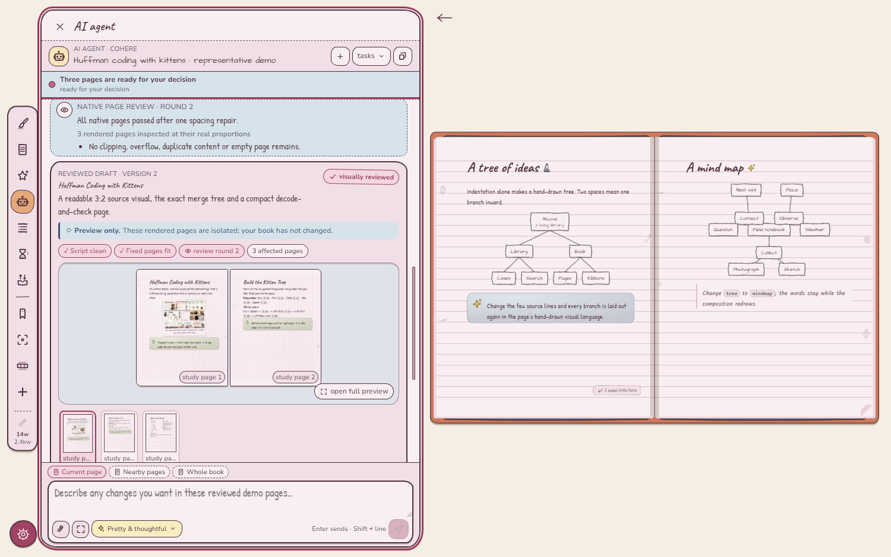

<p align="right"><i>
  <a href="../../README.md">← Alcove</a> ·
  Part 1 of 2 ·
  <a href="part-2-developers.md">Part 2 — Building Alcove →</a>
</i></p>

# Part 1 — Using Alcove

**Alcove is a notebook built as a storybook library.** The shelf, the books and
the pages are the product: a room you can make your own, bindings you recognise,
and fixed leaves filled with handwriting, diagrams, pictures, cards and tape.


**The short version**

- **Build a library, not a folder tree.** Add bookcases and floors, move books
  between rooms, search the whole shelf and recognise each book by its binding.
- **Dress the room.** Choose the bookcase carpentry, timber, wallpaper, colour
  scheme and writing-desk colour independently, or start from a complete room.
- **Dress every book.** Pick its cloth or leather, spine rules, emblem, cover,
  page ruling, paper colour, line spacing and edges. A book keeps its identity
  when it moves to another room.
- **Write on real pages.** Pages never scroll; text flows onto the next leaf.
  Use paragraphs, lists, tables, code, maths, callouts, keepsakes, pictures,
  columns and hand-drawn diagrams from the slash menu or Catalogue.
- **Make it feel personal.** Choose sounds and ambience, ribbons, stickers,
  handwriting, decorative effects, favourites and your own imported packs.
- **Keep it practical.** Full-text search, templates, history, scheduled local
  backups, portable library bundles, Markdown, PDF and page-image export are
  built in. There is no account and your library stays on your computer.
- **AI help is optional.** If you connect your own Cohere key, one extra rail
  tool can answer questions or prepare reviewed pages. Alcove works without it.

The rest of this page is the illustrated user guide. Technical architecture and
contributor instructions live in **[Part 2 — Building Alcove](part-2-developers.md)**.

**On this page**

<!-- gen:contents-part-1 -->
- [Download and install](#download-and-install) — Choose your platform, install Alcove and start writing
- [A tour](#a-tour) — The shelf, the spread, the page turn, the slash menu, the catalogue, the two studios, the switcher
- [Writing in a book](#writing-in-a-book) — Every block a page can hold, the right-click menu, why pages never scroll, maths, diagrams, pictures, the rail end to end
- [Notebook Script](#notebook-script) — The language itself — a whole worked script, the page it makes, and everything it can say
- [Making it yours](#making-it-yours) — The two studios, every vocabulary counted, custom colours, stars and hiding, more bookcases, your own packs
- [Sound](#sound) — Sound sets, ambience beds, the volume model, and the in-app credits
- [The keyboard](#the-keyboard) — Every shortcut, grouped by where you are standing, and which ones you can rebind
- [Backups, export and import](#backups-export-and-import) — Scheduled backups, `.nbk` bundles, Markdown in and out, PDF and PNG, tray capture
- [Questions](#questions) — Where the data is, whether it is offline, moving machines, and the failure modes worth naming
- [Optional AI help](#optional-ai-help) — One extra tool for questions and reviewed page drafts
<!-- /gen -->

<!--lift: download-->
## Download and install
<!--nav: Choose your platform, install Alcove and start writing-->

Download the file for your computer from the latest release, open it, and follow
the installer. Alcove needs no account.

<!-- gen:downloads -->
| Platform | Take |
| --- | --- |
| **Windows 10 / 11** | [`Alcove_0.7.8_x64-setup.exe`](https://github.com/AkshitIreddy/Alcove/releases/latest) · about 16 MB |
| **macOS 11+** | [`Alcove_0.7.8_universal.dmg`](https://github.com/AkshitIreddy/Alcove/releases/latest) · Apple silicon and Intel |
| **Linux** | [`.deb`, `.rpm` or `.AppImage`](https://github.com/AkshitIreddy/Alcove/releases/latest) |
<!-- /gen -->

Your library is stored separately from the app, so uninstalling Alcove does not
remove your notebooks. Alcove checks for updates automatically; you can also use
**Settings → System → Check for updates**.

**[See what changed in each release](releases.md).**
<!--/lift-->


<!--lift: tour-->
## A tour
<!--nav: The shelf, the spread, the page turn, the slash menu, the catalogue, the two studios, the switcher-->

| To do this | Do that |
| --- | --- |
| Move around the room | wheel **zooms**, shift+wheel pans, dragging bare wall moves the camera — and the two can be swapped in *Settings → Library & shelf* |
| Open a book | drag it out of its slot, or just click it for a quick pull |
| Go back | `Escape`, from anywhere in the app |
| Write | click any ruled line and type; clicking bare paper below your last line starts a line there |
| Reach for a block | `/` on an empty line, or right-click a block you have already written |
| Reach for a tool | the left rail inside a book, the left dock on the shelf. There is no top bar anywhere in the app |

Or let the app show you: the guided tour is
<!--f:tourSteps-->21<!--/f--> steps, long or short, each asking for one
action and turning green when it sees you do it.

### The shelf is the file browser

Books stand on floors of a bookcase, and the bookcase is the only file browser
there is: no tree, no list view, no "all notes". A floor is a shelf you can see
along, a slot is where a book stands, and the dashed outline at the end of a row
is the next free one.


Nothing here is a rectangle with a gradient on it: every spine is drawn from the
book's own seed through [`src/art/bookDesign.ts`](../../src/art/bookDesign.ts), baked
once to a texture and packed into an atlas. Floors you cannot see are not drawn,
so a case with three hundred books costs about what a case with three costs. The
camera, the virtualisation and the level-of-detail rules live in
[`src/features/bookshelf/`](../../src/features/bookshelf/) and are specified in
[`docs/design/bookshelf-rendering.md`](../design/bookshelf-rendering.md).

Right-clicking a spine gives you the book's own verbs — take it out, rename,
dress it, duplicate, move it along the shelf, send it to another bookcase, or
crumple it into the trash. You can also pull a book out and drop it directly on
the trash dock.

Pull back and the whole case is one object — <!--f:defaultFloors-->10<!--/f-->
floors as standard, up to <!--f:maxFloors-->60<!--/f--> when you keep pressing
*add floor*, and as many separate bookcases as you want to build.

![The same bookcase pulled all the way back to 38%, much more of it in frame now and small against the wall: the slab cornice, then seven complete floors and the top of an eighth running off the bottom of the window. Only the top three hold books — three tight rows of colour — and the rest are ranks of empty ogee-arched recesses waiting to be filled. The gold trellis wallpaper runs away on both sides and above, gone to a fine net at this size, which is what a library with room left in it actually looks like.](img/shelf-zoomout.png)

### A book opens as a spread, and turns like a book

Two pages side by side, ruled paper, a tool rail down the left edge, and a word
count at its foot. You turn a page by dragging its outer edge or the corner
curl, which lets you take the turn at your own speed and change your mind
halfway. To jump rather than turn, the table of contents (`Ctrl+Alt+T`) and the
thumbnail strip (`Ctrl+Alt+M`) both open with a key and are walked with Tab and
Enter.


Mid-turn, the leaf lifts off the spread and you can see the next page under it:


At rest the pages are live DOM, so text stays selectable and crisp. The moment
you start a turn, the app swaps to a WebGL cylinder-curl shader fed by
pre-rasterised snapshots of the two pages, then swaps back. That trade — and the
CSS fallback used when WebGL is unavailable — is written up in
[`docs/design/page-flip.md`](../design/page-flip.md) and implemented in
[`src/flip/`](../../src/flip/).

### Writing: a slash menu, and a catalogue of everything

Press `/` on an empty line for the menu. There are
<!--f:slashCommands-->110<!--/f--> commands in it, in three sections — the blocks
(diagram starters among them), the stickers, and *turn into* for changing what
the current line already is. It is defined in
[`src/editor/slash/registry.ts`](../../src/editor/slash/registry.ts), and the fuzzy
filter ranks a title prefix above a word-start above a substring, so short
queries land where you expect.


If you would rather browse than type, the rail's **Catalogue** shows everything
the pages can hold, shelved by kind — paper and cards, text blocks, callouts,
diagrams, tape and trim, lettering, stickers — with a search box across the top
for when you already know the word.

![The Catalogue panel open down the left edge, pushing the spread to the right rather than covering it. A box reading "search the catalogue…" sits at the top, then eight filter chips — everything (selected), paper & cards, text blocks, callouts, diagrams, tape & trim, lettering, stickers. Below them, a three-column grid under "paper & cards — things stuck to the page" holds twenty labelled tiles: Sticky note, Polaroid, Washi box, Card, Quote card, Banner, Spoiler, Index card, Envelope, Stamp, Tag, Margin note, Pressed flower, Ticket stub, Postcard, Ledger, Photo corners, Wax seal, Map pin and Columns. A second grid, "text blocks — the ordinary furniture", gets as far as Text, Heading 1, Heading 2, Heading 3, Bullet list and Numbered list before running off the bottom of the panel.](img/catalogue.png)

The catalogue and the slash menu read the *same* registry, so a block that
exists in one is in the other. That was not always true, and the day it stopped
being true is the most instructive bug in the repo — see [Things that were
harder than they
look](part-2-developers.md#things-that-were-harder-than-they-look) in Part 2.

### The studios: this is how deep the customisation goes

The **library studio** dresses the room. A room preset sets the colours, the
carpentry and the paper together, and every one of those stays yours to change
afterwards.

![The library studio open down the left edge, pushing the shelf to the right rather than covering it. The panel is headed "Library studio" and has "this library" and "your own" tabs; under "bookcases" a card shows a little drawing of the current case, "My Library", "61 books · 10 floors" and rename, clone and delete buttons, then "add bookcase" and "add a floor" and a line reading "this bookcase has 10 floors. everything below is dressed here." Under "presets — the house room" is a grid of room thumbnails, each a tiny painting of that whole room rather than a swatch — The House Room (selected, ringed amber), Gilt Salon, Card Room, Carnival and a teal one running off the bottom edge — beside a dashed tile reading "64 more…". To the right stands the walnut bookcase against its gold trellis wallpaper, three floors full, with the new book / template / studio / add floor / trash dock between them, studio lit, and a zoom control reading 80% at the foot.](img/studio.png)

The **book studio** dresses one book, and only that book: a binding follows its
book into every room, which is what lets you recognise it after you have
repainted the walls.


Both are covered properly under [Making it yours](#making-it-yours).

### Finding things

`Ctrl+K` opens the switcher. On the shelf it jumps across the whole library;
inside a book it stays inside that book. It finds books, headings and UI
commands by fuzzy match, weighted by what you have opened recently, and `>`
(or the Tab key, or the tab at the top) flips it into full-text search over the
same current scope.
Activating a search result opens the book, turns to the page and pulses the
match so you can see where it was.


Shelf search deliberately ignores which bookcase you are standing in front of:
something you wrote may be in any room. Once a book is open, the scope narrows
to that book so similarly named pages elsewhere cannot get in the way.

## Writing in a book
<!--nav: Every block a page can hold, the right-click menu, why pages never scroll, maths, diagrams, pictures, the rail end to end-->

### What a page can hold

Everything below is a real block type, reachable from the slash menu, the
catalogue or Notebook Script.

| | |
| --- | --- |
| **The ordinary furniture** | paragraphs, three heading levels, bullet and numbered lists, to-do lists with checkboxes, quotes, dividers, code blocks with syntax highlighting, tables |
| **Asides** | callouts (info, tip, warn, star), toggles that remember whether they were open, spoilers that hide an answer until clicked |
| **Paper and keepsakes** | sticky notes, polaroids, washi boxes, cards, quote cards, banners, index cards, envelopes, stamps, luggage tags, margin notes, postcards, ledgers, pressed flowers, ticket stubs, photo corners, wax seals, map pins |
| **Structure** | two or three columns, page links that list themselves back on the page they point at, footnotes |
| **Maths** | inline `$x^2$` and display equations |
| **Diagrams** | tree, mindmap, flowchart, graph, timeline |
| **Pictures** | paste or drop an image, image rows, link cards with a title and favicon |
| **Decoration** | <!--f:stickers-->50<!--/f--> stickers, and <!--f:effectAxes-->11<!--/f--> axes of block decoration carrying <!--f:effectValues-->472<!--/f--> values between them |

### The right-click menu

Right-click any block for the Notion-style context menu
([`src/editor/menu/registry.ts`](../../src/editor/menu/registry.ts)): **Turn into**,
**Color** for the ink, **Highlight** for the washes, **Columns**, **Effects**,
then insert above, insert below, duplicate, *copy block as script*, and delete.
Blocks can be dragged by the handle that appears in the margin, and dropping one
settles it into place rather than teleporting.

A right-click inside a selection spanning several blocks keeps that selection
intact while opening the menu. The same resolver follows custom blocks such as
equations, code, diagrams and media back to their owning page block, so these do
not fall through to the browser menu. On any page after the first, Backspace at
the very beginning of its first block pulls that block onto the previous leaf
when it fits; the context menu exposes the same action explicitly.

The same menu also has **Copy content** and **Download / save…**. Pictures copy
as real PNG clipboard pixels and save in their original format; videos save as
their original file (and copy directly when the operating-system clipboard
supports that video type); tables copy as both TSV and HTML for spreadsheets or
documents and download as CSV; code copies as source text and saves with its
language extension. Every other Alcove block falls back to portable Notebook
Script, so a crafted card or diagram still has a useful way out.

Plain-text paste is structure-aware too. Tabular spreadsheet text, quoted CSV
and arrays of JSON records become native tables; fenced Markdown and Notebook
Script become their real Alcove blocks; JSON objects and recognisable source
code become code blocks. Rich HTML from a browser or spreadsheet still follows
the editor's normal rich-paste path, and ordinary prose is left as prose rather
than being “helpfully” misclassified.

### Pages never scroll, and that is the point

A page is a fixed leaf of paper. When what you have written exceeds it, the
editor peels the trailing blocks off the end and hands them to the next page,
creating one if there isn't one — and it carries your caret across the break, so
you can keep typing straight through the join without noticing you crossed it.
Deleting from a full page pulls the blocks back.

Resizing the window or opening a panel changes only how the fixed book is drawn.
It does not rewrite which blocks belong to which page. This is intentionally
separate from real intrinsic growth such as an image finishing its load, which
does still flow through the normal pagination contract.

It would be easier to put a scrollbar in a page. The reason there isn't one:

- **A page you can see all of is a page you can find things on.** A book of
  fifty short pages is navigable — thumbnails, a table of contents, a page
  number, a spread you can take in at a glance. One page of infinite length is a
  rope you have to pull.
- **The turn means something.** A page turn is a real boundary, and a
  page-curl animation over a scrolling div would be decoration. Here it moves
  you a real distance.
- **Footnotes can be at the foot of the page**, because there is a foot.
- **A blank page can be deliberate.** Leave one empty and it stays empty.

The contract lives in [`src/editor/pagination.ts`](../../src/editor/pagination.ts),
where the arithmetic is DOM-free and unit-tested, and it is the rule the rest of
the editor is built around: a footnote's text is stored *on the marker* rather
than in a table at the page level, precisely so that a footnote which flows to
the next page arrives with its note already attached
([`src/editor/nodes/footnote.ts`](../../src/editor/nodes/footnote.ts)).

Focus mode is a ladder rather than a switch
([`src/views/rail/focusLevels.ts`](../../src/views/rail/focusLevels.ts)): off, then
the chrome goes, then the book goes and leaves two bare leaves, then one leaf
alone edge to edge. There is a zoom on top of it, and it is a transform rather
than a bigger box — deliberately, because growing the leaf would change how much
fits on a page and repaginate your book behind your back.


### Maths, without a webfont

`$x^2$` inline, or an equation block on its own line. The renderer is a
documented TeX subset written for this app
([`src/editor/nodes/mathTex.ts`](../../src/editor/nodes/mathTex.ts)) — superscripts and
subscripts, `\frac`, `\sqrt`, big operators with limits, delimiters that grow,
the Greek alphabet and the usual relations and arrows, upright function names,
`\text{}`, plus TeX classification commands such as `\mathrel` and `\mathbin`
— rendered as plain HTML in the page's own serif face rather than
through KaTeX's Computer Modern.

It does not do matrices, alignment, cases or arrays, and says so: those are
documents rather than afterthoughts, and half a matrix renderer is worse than
none. Like the script parser, it never throws — an unknown macro renders as its
own name in a muted colour and you keep typing.

### Diagrams

<!--f:scriptDiagrams-->5<!--/f--> kinds, drawn rather than embedded: **tree**,
**mindmap**, **flowchart**, **graph** and **timeline**. Each arrives from the
slash menu with a small worked example already in it, and each is edited as a
few lines of text — the layout algorithms and the hand-drawn SVG renderers are
in [`src/diagrams/`](../../src/diagrams/).

![The Welcome book open where its diagram chapter begins, every box and join drawn with a pen wobble. The left page is headed "Diagrams, drawn by hand" and opens "Indentation alone makes a `tree`: two spaces to a level, `|` for a note". Under it stands the tree it describes — Alcove branching to "A library" and "A book", the library on to "Bookcases · one per subject" and "Floors", the book on to "Pages · this thing you are reading" and "Ribbons". A tan card below names the five fences in italic handwriting — tree, mindmap, graph, flowchart, timeline — then says "Five fences, no library: every line is drawn by hand." The right page is headed "Thrown outward" and explains that a `mindmap` reads like a `tree` but lays its branches around the middle. Its mindmap fans out from Bookbinding through Tools, Sewing and Covering to Bone folder, Kettle stitch, Long stitch, Quarter leather and Cloth, with a banner at the foot reading "Swap the word and it redraws."](img/diagrams.png)

### Pictures and links

Paste or drop an image and it is stored under your library's `assets/` folder
and inserted; several at once become an image row. Paste a bare URL on an
empty line and you get a link card, which fills itself in with the page's title,
description and favicon a moment later, and degrades to a plain link chip if the
site does not answer. These requests happen only because you asked, and neither
of them sends anything you wrote. The optional AI Agent is the other networked
feature: only after you connect your own Cohere key and start a task may it send
the task instructions, current-book pages it inspects, attached sources and
draft-review renders. Other books remain local.

An image's expand control opens it in a large viewer. Wheel or the `+` and `−`
buttons zoom, dragging moves around the enlarged image, and reset returns to
100%. Local pictures resolve from the library again after restarting rather
than depending on a temporary browser URL.

Pages can also point at each other: type `[[` for the page picker, and the page
you pointed at lists yours back at the bottom
([`src/editor/backlinks/`](../../src/editor/backlinks/)).


### The rail, end to end

Eleven hand-drawn icons down the left edge, each with its own tooltip. Seven
open a panel; after a divider, four that just do something.


| Tool | What it opens |
| --- | --- |
| Customize this book | the book studio — binding, cover title, emblem, frame and page edges |
| Page style | ruled, grid, dotted or blank, plus the line spacing |
| Catalogue | everything you can put on a page, browsable and searchable |
| **AI Agent** | a native workspace that studies sources, plans, drafts, visually reviews and previews pages before it may insert them |
| Table of contents | every heading in the book, click to jump |
| Page history | generous durable versions for this page, plus whole-book checkpoints that preserve page order and deletions |
| **In and out** | the one sheet where writing enters and leaves |
| Ribbon this page | marks it in one press, and opens the plate to pick a ribbon |
| Focus mode | the rungs of the ladder, and the zoom |
| Thumbnails | the strip of little pages along the bottom |
| Add a page | a new page after this one |

Every row carries its own key cap, read from your keymap rather than printed,
and calls the same opener the keyboard calls — so a button and its shortcut
cannot drift apart.

Protected history is on by default. It keeps dense recent page versions and
progressively spaced older recovery points, together with full-book checkpoints
for structural accidents. Restoring a page or book first preserves the state
you are leaving, so turning back does not consume the route forward. It can be
disabled under **Settings → System → protected history**, but only after a
warning; disabling stops new checkpoints and does not silently delete existing
ones. This local history complements scheduled library backups rather than
replacing them.

To remove a leaf, right-click anywhere on that page and choose **Delete this
page**. The option is deliberately absent when it is the book's only page.

### The daily page, and templates

`/today` finds or creates today's dated page in your Journal book
([`src/editor/journal.ts`](../../src/editor/journal.ts)).

There are <!--f:templates-->5<!--/f--> built-in templates — Cornell notes,
Lecture notes, Flashcard deck, Weekly planner, Reading log — and each is authored
as Notebook Script ([`src/features/templates/templates.ts`](../../src/features/templates/templates.ts)),
so the gallery preview, the inserted pages and the script it copies back out
about what a template is. The gallery is the *template* button on the shelf's
left dock, and the same entry sits on the bare-plank right-click menu, because
a template is a way of starting a book rather than a thing you do to one.
<!--/lift-->

<!--lift: manual-->
## Notebook Script
<!--nav: The language itself — a whole worked script, the page it makes, and everything it can say-->

Notebook Script is Alcove's portable page format: a Markdown dialect small
enough to write by hand and expressive enough to produce a decorated page
rather than a wall of paragraphs. Plain Markdown is a subset of it, so you can
use the ordinary syntax and learn a directive only when you want a richer block.

### A whole script, and the page it makes

````text
---
title: Field Notes — Week 3
paper: grid
wash: moss
---

# Photosynthesis {sticker=leaf}

Sunlight in, sugar out. The ==light-dependent=={color=amber} half runs in the thylakoid.

::: sticky-note {color=lemon, rotate=-2, tape=corner}
Exam **Friday** — learn both stages.
:::

```graph
Sun -> Leaf: light
Water -> Leaf
Leaf -> Glucose, Oxygen
Glucose {color=amber}
```

```timeline
1771: Priestley — air is "restored"
1779: Ingenhousz — only in the light
1845: Mayer — sunlight becomes chemical energy
```
````

The paste box previews as you paste, naming each piece it recognised — one
sticky note, a graph of four edges, a timeline of three entries — so you can see
the shape of the result before you commit it:

![The Insert script dialog over a dimmed book called Field Notes, subtitled "paste Notebook Script — from your AI, or your own pen". On the left the pasted script in a monospace box, scrolled to the sticky-note directive and the graph and timeline fences. On the right a live preview headed FIELD NOTES — WEEK 3: the Photosynthesis heading, the paragraph with its amber highlight, a yellow sticky-note block tagged "sticky-note", and two hatched placeholder cards tagged "graph" and "timeline" reading "4 edges" and "3 entries". "Copy the format for your AI" sits at the bottom left, Cancel and Insert at the bottom right.](img/script-dialog.png)

Insert, and it lands on the page as real editable blocks — the diagrams drawn,
not embedded as images:

![The page after inserting, on grid paper: "Photosynthesis" in large handwriting with a leaf sticker, the paragraph with "light-dependent" in an amber highlight, a yellow sticky note with a curled corner reading "Exam Friday — learn both stages.", then a hand-drawn node graph — Sun by an edge labelled "light" and Water both flowing into Leaf, Leaf out to an amber-filled Glucose and to Oxygen — and below it a timeline hung on a vertical spine with three dated cards off it: 1771 Priestley — air is "restored", 1779 Ingenhousz — only in the light, 1845 Mayer — sunlight becomes chemical energy. The facing page is still blank ruled paper, because the script was inserted into an empty book.](img/script-page.png)

### What the language has

Everything a page can hold, said in plain text:


### It does not fail

`parse()` is **total**: it never throws. A malformed line produces a diagnostic
naming the line, the column and what was expected, and the app renders your
intent anyway — near-miss spellings like `papper` and `microscop` are corrected
with a warning rather than dropped. That promise, and the grammar it guards, are
specified in [`docs/design/script-language.md`](../design/script-language.md)
and implemented in [`src/script/`](../../src/script/).

When an assistant does make several slips, **Copy errors** turns the complete
diagnostic list into one clean clipboard block ready to paste back into that
chat.

The script is kept alongside the page, so a note written this way can be edited
as script and re-run, or copied back out with *copy this page as script*. A
single block comes out the same way from the right-click menu.

## Making it yours
<!--nav: The two studios, every vocabulary counted, custom colours, stars and hiding, more bookcases, your own packs-->

### Two studios, and what each one owns

The **library studio** dresses the room you are standing in: its colours, its
carpentry, its wallpaper, its floors, and the collection of bookcases. The
**book studio** dresses one book: its straight binding, complete cover title,
lettering hand, unified emblem, frame, page-edge finish and sewn endband. Page style and bookmark ribbons remain
their own page tools.

The split is deliberate and worth knowing, because it is what makes the
customisation survivable. A binding belongs to the book, so a book you bound in
oxblood leather is oxblood leather in every room — repaint the walls and you can
still find it. Repainting a room does not straighten its arches; rebuilding a
case does not repaint it.

A **room preset** is not the same thing as a colour theme. A preset bundles
colour *and* carpentry *and* paper into one named room; a theme is only the
colour half. Pick a preset to get somewhere good in one click, then change any
part of it without losing the rest.

### Counted from the modules themselves, not estimated

| What you choose | How many | Where it is defined |
| --- | --- | --- |
| Rooms (colours + carpentry + paper, as one pick) | **<!--f:roomPresets-->69<!--/f-->**, sorted by the kind of room they are | [`src/views/rail/designOptions.ts`](../../src/views/rail/designOptions.ts) |
| Colour schemes on their own | **<!--f:roomThemes-->60<!--/f-->** | [`src/art/themes.ts`](../../src/art/themes.ts) |
| Bookcase carpentry | **<!--f:shelfBuilds-->52<!--/f-->** builds × **<!--f:shelfPatterns-->50<!--/f-->** timber patterns, **<!--f:shelfPresets-->113<!--/f-->** named | [`src/art/shelfDesign.ts`](../../src/art/shelfDesign.ts) |
| Wallpaper | **<!--f:wallpaperMotifs-->50<!--/f-->** motifs, each with its own scale, relief, ink, tone and edge — **<!--f:wallpaperPapers-->126<!--/f-->** combinations named and hung | [`src/art/wallpaperDesign.ts`](../../src/art/wallpaperDesign.ts) |
| Book bindings | **<!--f:bookShapes-->3<!--/f-->** straight spine shapes, **<!--f:bookMaterials-->18<!--/f-->** construction-led materials and **<!--f:bookDecorations-->59<!--/f-->** authored spine programmes, **<!--f:bookPresets-->67<!--/f-->** named bindings | [`src/art/bookDesign.ts`](../../src/art/bookDesign.ts) |
| Book cloths | **<!--f:bookCloths-->50<!--/f-->** pigments, each with a name that means something | [`src/art/flat.ts`](../../src/art/flat.ts) |
| Book covers | **<!--f:coverPigments-->50<!--/f-->** pigments, **<!--f:coverFrames-->12<!--/f-->** continuous frames, **<!--f:coverMedallions-->16<!--/f-->** shelf-legible emblems, 15 title treatments, 10 lettering hands, 6 page edges and 3 endbands | [`src/art/covers.ts`](../../src/art/covers.ts) |
| Bookmark ribbons | cloth × weight × tail × material × charm, **<!--f:ribbonPresets-->40<!--/f-->** named | [`src/views/bookmarks.ts`](../../src/views/bookmarks.ts) |
| Block decoration | **<!--f:effectAxes-->11<!--/f-->** axes, **<!--f:effectValues-->472<!--/f-->** values, applicable to **<!--f:blockEffectTypes-->35<!--/f-->** kinds of block | [`src/editor/effects/vocabulary.ts`](../../src/editor/effects/vocabulary.ts) |
| Stickers | **<!--f:stickers-->50<!--/f-->**, grouped by family, plus your own | [`src/editor/nodes/stickers.ts`](../../src/editor/nodes/stickers.ts) |
| Sound sets | **<!--f:soundSets-->28<!--/f-->**, voicing **<!--f:soundCues-->64<!--/f-->** cues | [`src/sound/soundSets.ts`](../../src/sound/soundSets.ts) |
| Ambience beds | **<!--f:ambienceBeds-->10<!--/f-->**, plus silence | [`src/sound/engine.ts`](../../src/sound/engine.ts) |
| Settings | **<!--f:settingsOptions-->44<!--/f-->**, across appearance, library & shelf, motion & feel, sound, writing, system, library files and help | [`src/data/defaults.ts`](../../src/data/defaults.ts) |

Some of it is not in a studio at all. *Settings → Appearance* is where the
choices that belong to the whole app live rather than to one room — the theme,
the hand every page is written in, how big the reading type is and what colour
the ink is — and two smaller ones sit with them: the **pointer**, which the app
draws itself in a set you pick and hands back to the system on its own under
Windows High Contrast, where a drawn cursor is the wrong answer, and the **nib**
you write with.

![The settings sheet open down the right-hand edge over three full floors of the bookcase, its ✕ in the sheet's own top-left corner and a search box under the "Settings" heading. The Appearance section: "choose my look again — 5 questions, and the whole library takes after your answers" with a start button; "surprise me — parchment · sepia ink · the room's own paper · everyday hand" with "roll a whole look"; a "theme" row, "the room this app is drawn in", whose nine chips each carry their own colour — parchment (ticked), honeycomb, apricot, blossom, peony, botanical, verdigris, night, midnight — over "more theme · 21 more, in 4 shelves · show all 30"; a "hand" row, "the face every page is written in", whose six chips are each drawn IN the face they name — everyday hand (ticked), quick note, brush hand, drafting hand, marker, book serif — over "more hand · 21 more, in 3 shelves · show all 27"; a body-size slider reading 18px; and an "ink" row of coloured chips, sepia ticked, then graphite, fountain blue, iron gall, walnut, burgundy, forest, navy, teal and indigo.](img/appearance.png)

### A colour of your own

Every colour chooser also takes a hex code. A vocabulary is the right shape for
browsing and the wrong shape for someone who already knows what they want, and
there is no number of curated colours that contains yours.

Committed colours are remembered and shared across every picker in the app
([`src/art/customColour.ts`](../../src/art/customColour.ts)), so a green you mixed for
a callout can bind a book. A half-typed hex is never overwritten with a default
while you are still typing it.

Colour wells also have **copy** and **paste** actions. Copy a cover blue once,
then paste it into the spine, tooling or emblem picker without retyping its hex;
the app keeps an internal fallback even when the system clipboard is denied.

### Stars, and taking things off a list

Every long list in the studios — rooms, carpentries, papers, bindings, sound
sets — carries the same two gestures
([`src/data/shelfOfMine.ts`](../../src/data/shelfOfMine.ts)):

- **Stars.** One star pins an entry to the top of its own family; two lift it
  clear of the families to the top of the whole list.
- **Hide.** Take an entry off the list and the app stops offering it and stops
  rolling it at random. Nothing is destroyed: a restore drawer hands it back
  whenever you ask, with checkboxes.

A room you compose yourself can be saved, and a saved room is starrable and
hideable like any shipped one. Removing one is exactly as undoable as removing
anything else.

### More bookcases

A library is a collection of bookcases ([`src/data/bookcases.ts`](../../src/data/bookcases.ts)).
Each has its own name, its own room, its own floors and its own books, and each
is dressed independently — one case can be a green Athenaeum and the next a pale
card room. Books move between them from the spine's right-click menu. Search and
the `Ctrl+K` switcher deliberately span all of them.

### Bringing in your own work

The studios have a **your designs** section that takes packs you or a chatbot
made ([`src/features/packs/`](../../src/features/packs/)), in
<!--f:packCategories-->4<!--/f--> categories:

| Category | What you bring |
| --- | --- |
| Wallpaper | a recipe — motif, scale, relief, ink, tone and edge, out of the vocabulary the app already draws |
| Carpentry | a recipe — a build and a timber pattern |
| Stickers | actual SVG or PNG files |
| Sounds | actual audio files, mapped onto the cues you want to replace |

The dialog gives you an upload button, a paste box beside it — JSON handed to
you in a chat window is already on your clipboard — and a **generated** prompt
describing the exact format the importer accepts, derived from the schema rather
than written by hand. A refusal is a list of problems with places and sentences,
shown where you can read it twice.

Wallpaper and carpentry are recipes rather than pictures for a reason: the wall
is one tile repeated across the widest surface on screen, seamless because the
app draws it, and an uploaded picture would show its join at exactly the place
you look at all day.

<!--f:packRefusals-->5<!--/f--> other categories are listed as **not**
importable, each with its reason — a list of what you cannot bring is worth more
than silence about it.

### The trash

Crumpled books go to one drawer for the whole library, not one per bookcase —
the same reasoning as [search](#finding-things), applied to the moment you
notice something is gone
([`src/features/bookshelf/TrashPanel.tsx`](../../src/features/bookshelf/TrashPanel.tsx)).
Every row is labelled with the bookcase it came from, restore puts the book back
where it stood, and *empty* counts what it is about to shred and names the scope
before it does. There is a scope toggle when you have more than one case.

### Favourites

Pin a book from its right-click menu and it sorts first when *Settings →
Library & shelf* is set to sort by favourites. Pinning changes organisation,
not the binding you carefully chose.

## Sound
<!--nav: Sound sets, ambience beds, the volume model, and the in-app credits-->

Every interaction has a sound, and the whole set can be re-voiced.

![The settings sheet open down the right-hand edge, scrolled to its Sound section, over the bookcase at 80% — one book-filled floor is visible near the top and the lower floors are empty. Under the heading: a "sound set" row reading "House — the set as recorded — warm, even, nothing pushed" over seven chips, House ticked, then Loose Leaf, Reading Room, Brass Bell, Drafting Table, Quiet Hours and Paper Birds — one per character — with "more sound sets · 21 more, in 7 characters · show all 28" beside a button, and "add your own set · your sound files — name each one after the cue it replaces" beside "choose files…". Then five sliders, each with its own percentage: master volume 80%, little clicks & pops 70%, page sounds 80%, bookshelf sounds 70%, ambient bed 35%. Then "mute everything" (off) and "play ambience — run the chosen soundscape underneath" (on), a "soundscape" row of eleven chips with fireplace ticked — rain, storm, fireplace, crickets, night, wind, stream, forest, shore, cafe, none — and below them "typing sounds — soft pencil scratches as you type" and the top of "hourly chime" running off the bottom edge.](img/settings.png)

A **sound set** is a named character every cue in the app is heard through — the
button, the panel, the checkbox, the page turn, the book coming off the shelf,
the crumple, the keystroke, the bell. There are
<!--f:soundSets-->28<!--/f--> of them, grouped by character — the house voicing
and its near neighbours, then paper, library, chamber, studio, hush and
whimsy — between them voicing <!--f:soundCues-->64<!--/f--> cues.

A set adds no new recordings. It conditions the ones that ship — substituting
which family voices a role, changing playback rate, trimming gain, layering a
second quieter cue underneath, drawing from a different pool of takes, scaling
the per-play wobble, and on a few of them a real filter chain. That is why
"as if it were all happening in the next room" is a set rather than a promise.

Underneath the cues there is an **ambience bed**:
<!--f:ambienceBeds-->10<!--/f--> of them — rain, storm, fireplace, crickets,
night, wind, stream, forest, shore, café — plus silence. A new install opens on
the fireplace, mixed low under the master volume, and the webview's autoplay
policy holds it until your first click, so the app is never making noise at
somebody who has not touched it yet. One switch turns it off; reduced sound and
mute both win over it.

There are separate volume sliders for interface, pages, shelf and ambience, a
*reduced sound* mode that drops the hover ticks and the typing sounds, an
optional typing sound, and an optional hourly chime.

**Credits.** Nothing you hear is synthesised: every cue is a real recording,
almost all of them public domain or CC0, with one CC BY 4.0 source among them.
You do not have to take that on trust or go looking for a text file — *Settings
→ Sound → sound credits* lists every recording, its author and its licence, and
that list is rebuilt on every build from the same table the audio itself plays
from. The full provenance is in
[Licence and credits](part-2-developers.md#licence-and-credits) and in
[`docs/design/sound.md`](../design/sound.md).

## The keyboard
<!--nav: Every shortcut, grouped by where you are standing, and which ones you can rebind-->

Every shortcut in the app is in one registry
([`src/data/keybindings.ts`](../../src/data/keybindings.ts)), and that registry is what
draws the settings list, what draws the cheat sheet (`Ctrl+/`, or just `?` when
you are not typing) and what the one key handler matches on — so the list cannot
promise a key the app does not answer to.

![The cheat sheet over the spread: a wide cream card headed "keyboard spells", the shortcuts laid out in three columns and grouped by where you are standing — "Finding your way / anywhere in the app", "On the shelf / while the bookcase is in front of you", "In a book / while a book is open", "While writing / with the pen on the page", and "The whole library / scripts, bundles, files". Every row pairs a drawn key cap with plain English: Ctrl+K jump to a book, a heading or a page; Enter take the lit book off the shelf; F9 focus mode — just you and the paper; / the block &amp; sticker menu; drag a page edge curl a page by hand. A footnote runs along the bottom: "press ? or Esc to close · every key here can be changed in Settings".](img/keyboard.png)

**<!--f:rebindableKeys-->24<!--/f--> of them are rebindable**, from *Settings →
Input*. `Escape` deliberately is not: it is how you step back out of a book and
how every panel and dialog closes, and one key doing one thing everywhere is
worth more than that row being adjustable — the app says so in the row rather
than greying it out.

| Where you are | Keys |
| --- | --- |
| Anywhere | `Ctrl+K` jump to a book, heading or page · `Ctrl+Shift+F` search the words inside every page · `Ctrl+,` settings · `Ctrl+/` or `?` the cheat sheet · `Escape` back out |
| On the shelf | `Ctrl+Alt+N` new book · `Ctrl+Alt+S` the studio · `Ctrl+Alt+F` add a floor · `Ctrl+Alt+X` the trash · `+` `−` `0` zoom · arrows walk the shelf · `Enter` take the lit book · `Home` back to the first book |
| In a book | `Ctrl+N` add a page · `Ctrl+Alt+B` ribbon this page · `F9` focus mode · `Ctrl+Alt+T` contents · `Ctrl+Alt+A` catalogue · `Ctrl+Alt+L` page style · `Ctrl+Alt+D` dress this book · `Ctrl+Alt+M` thumbnails · `[` `]` step focus · drag a page edge or the corner curl to turn a page |
| While writing | `/` the block menu · `/today` today's journal page · `Ctrl+B` `Ctrl+I` bold and italic · right-click for the block menu · drag the dots to reorder · click bare paper to start a line there |
| In and out | `Ctrl+Alt+I` paste a script in · `Ctrl+Alt+E` copy this page out as script · `Ctrl+Alt+G` start from a template · `Ctrl+Alt+P` export as PDF · `Ctrl+Shift+Alt+P` this page as a picture · `Ctrl+Shift+Alt+M` bring Markdown in · `Ctrl+Shift+E` pack books into one file · `Ctrl+Shift+I` add a bundle to this shelf |

Everything the app added for itself sits on `Ctrl+Alt`, which is the one
modifier pair neither the editor nor the webview had already claimed. A key with
no live command is left completely alone — which is why the shelf's bare `+`,
`−` and `0` and the editor's letters still work with the global handler
installed.

## Backups, export and import
<!--nav: Scheduled backups, `.nbk` bundles, Markdown in and out, PDF and PNG, tray capture-->

Your library is a file on your disk and nothing is copying it anywhere. What
follows exists so that this is a design decision rather than a risk.

![The "In and out" sheet open down the left edge, pushing the spread aside rather than covering it. Its rows are grouped under three headings that answer three different questions. "Bring something in": paste a script in (Ctrl+Alt+I), bring Markdown in — a book per file, a page per # heading (Ctrl+Shift+Alt+M), start from a template (Ctrl+Alt+G). "Take this page, or this book, out": export as PDF — rendered at 2× (Ctrl+Alt+P), this page as a picture (Ctrl+Shift+Alt+P), the parcel desk — whole bundles in and out, and undo an import (Ctrl+Shift+E). "For an assistant": copy the format for your AI, and copy this page as script (Ctrl+Alt+E). Each row carries a hand-drawn glyph, a line of hint text and its own key cap, and a footnote at the bottom reads "taking something out is always a copy — the book itself is never touched."](img/share.png)

### Scheduled backups

On by default, weekly, into the `backups/` folder beside your library or a
folder you choose
([`src/features/system/backup.ts`](../../src/features/system/backup.ts)). A
backup is a timestamped ZIP of the database — including its write-ahead sidecars,
so a WAL-mode database restores intact — and the whole `assets/` tree.

Restoring takes a safety copy of the *current* state first, then extracts over
the live files, and validates every entry name on the way out of the archive so
a hand-edited ZIP cannot write outside the two places it is allowed to.

### Bundles you can move (`.nbk`)

The **parcel desk** — the rail's *In and out* sheet, or `Ctrl+Shift+E` — packs
books into a single `.nbk` file. You pick the scope and what rides along.


Inside, a bundle is a plain ZIP: a manifest with a checksum, one Notebook Script
file per page, the lossless JSON beside it, the selected pages' pictures and
videos, and a snapshot of the bookcases the books stood in — so importing
rebuilds the furniture rather than tipping every book onto one shelf. Local
media carries a path relative to the parcel, never the old machine's library
folder, in both lossless and script-only bundles.

**Import is additive** and nothing is overwritten: a book that matches one you
already have gets a row-by-row conflict decision, and the whole import is
undoable from a **restore point**
([`restore.ts`](../../src/features/transfer/restore.ts)).

### Plain Markdown, in and out

Export the same scope as Markdown instead of a bundle and you get ordinary `.md`
files with no directives in them, one per page or one per book. In the other
direction, `.md`, `.markdown` and `.txt` files are read as Notebook Script —
which plain Markdown is a subset of — and become one new book per file, one page
per H1, with long headingless walls of text split by capacity. The file reader
handles UTF-16 and BOMs, because Windows Notepad happily writes both
([`src-tauri/src/import.rs`](../../src-tauri/src/import.rs)).

### PDF and PNG

A page can be rasterised at double resolution and saved as a PNG, or wrapped as
a one-page PDF; a whole book renders every page offscreen — no caret, no
selection chrome — and assembles into one PDF
([`src/editor/script/exporters/`](../../src/editor/script/exporters/)).

Both live on the rail's **In and out** sheet, beside the Markdown import and the
parcel desk.

### Two more small things

**Tray quick capture** puts an icon in the notification area whose *Quick note*
action opens an `Inbox` book — created on demand — for one thought, without
hunting for the window ([`src/features/system/tray.ts`](../../src/features/system/tray.ts)).
Off by default; the app does not sit in your tray unless you ask it to.

**Launch into the last book** skips the shelf on startup and puts you back where
you were ([`src/features/system/launch.ts`](../../src/features/system/launch.ts)). Also
off by default.

## Questions
<!--nav: Where the data is, whether it is offline, moving machines, and the failure modes worth naming-->

**Where is my data?**
Open **Settings → System** to reveal the library folder. Copy that folder and
you have copied your library. The parcel desk also exports every page as
ordinary Markdown, which any editor reads without Alcove installed.

**Is it offline?**
Yes for the library itself: no account, sync, cloud storage or telemetry is
required, and writing, editing, search, export and the outside-assistant
Notebook Script route work without a connection. Finding an openly licensed
picture and filling in a pasted link card are explicit network actions. The
optional AI Agent is another: after you connect your own Cohere key and start a
task, it sends task instructions, the current-book pages it inspects, attached
evidence and its draft-review images; other books remain local. Trial keys carry
the privacy caveat described under [Optional AI help](#optional-ai-help). How those
boundaries are enforced is in [the developer
half](part-2-developers.md#how-its-built).

**Does uninstalling delete my notes?**
No. The program and the library are separate folders and the uninstaller only
removes the first.

**Half my page just moved to the next page.**
The pagination contract working — see
[Pages never scroll](#pages-never-scroll-and-that-is-the-point).

**The shelf looks flat and the books low-resolution.**
The app found a software rasteriser at startup and dropped to a reduced mode —
usually a virtual machine, a remote session, or a driver that has fallen back.
Updating the graphics driver is the usual fix.

**It won't start.**
On Windows, most likely a missing WebView2 runtime on an old Windows 10:
install the Microsoft Edge WebView2 Evergreen Runtime by hand. On Linux, a
missing `webkit2gtk`.

**Can I use it on my phone, or in a browser?**
No. The shelf assumes a pointer, a wheel and a desktop-sized window.

<!--/lift-->

<!--lift: ai-->
## Optional AI help
<!--nav: One extra tool for questions and reviewed page drafts-->

Alcove is complete without an AI connection. If you want help with a particular
book, the **AI Agent** is one optional tool in that book's left rail. Connect
your own Cohere key, then ask a question or describe pages you want prepared.

- A normal question gets a normal answer in the panel.
- A notebook request is drafted away from your book, rendered as real Alcove
  pages and checked before you see it.
- The result remains a preview until you choose **Insert**.
- Images, PDFs, office documents and text files can be attached or dragged into
  the composer for that task.



The Agent may inspect pages from the current book when the task needs them, but
other books stay local. Your key can be session-only or stored in the operating
system credential vault. **Settings → AI & integrations** also contains the
connection controls and optional local Text veil.

If you prefer another assistant—or none inside Alcove—Notebook Script remains a
plain, portable way to preview complete generated pages before inserting them.
<!--/lift-->

---

<p align="center">
  <a href="../../README.md">← Back to the front page</a> ·
  <b><a href="part-2-developers.md">Part 2 — Building Alcove →</a></b>
</p>
