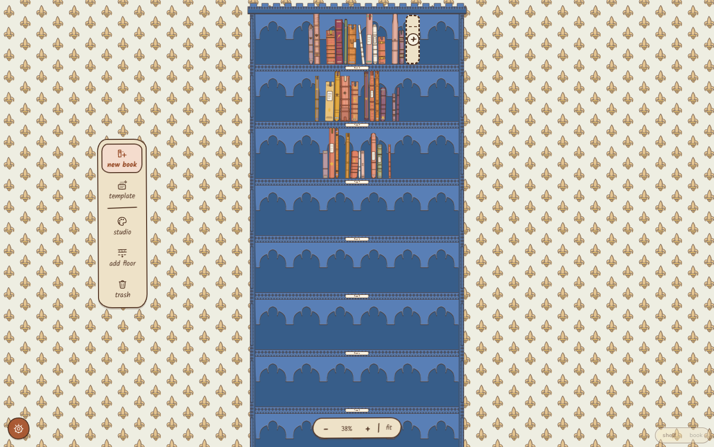
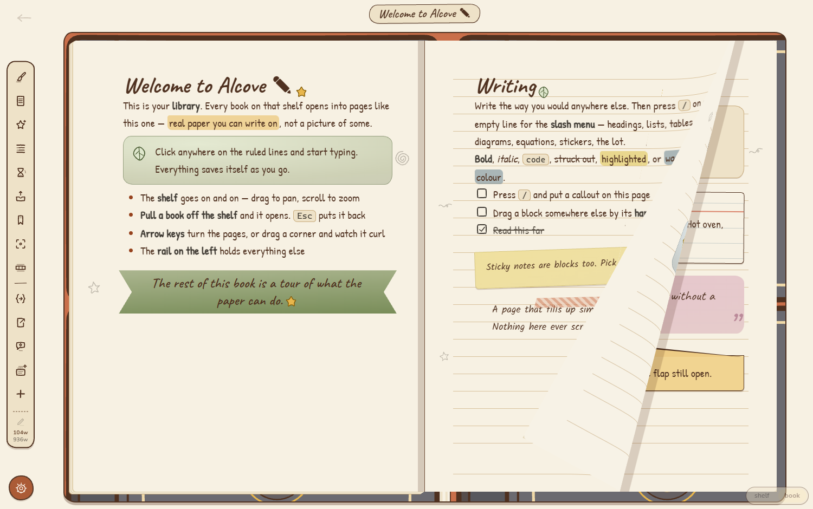
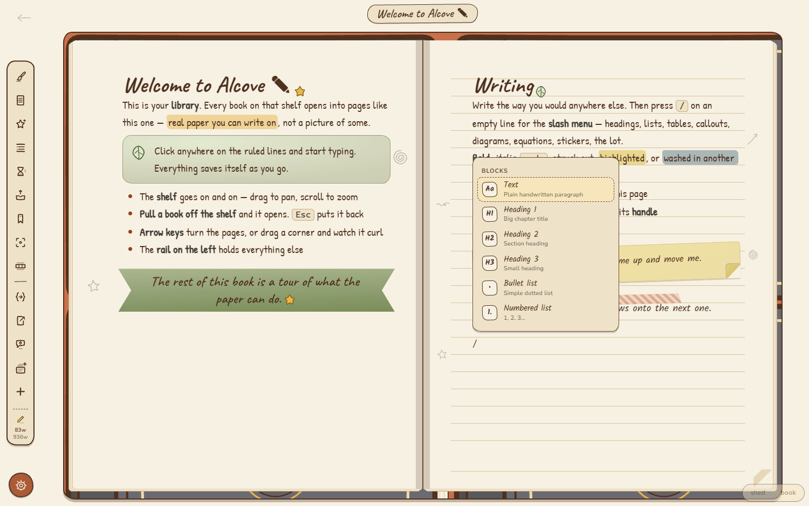

<p align="right"><i>
  <a href="../../README.md">← Alcove</a> ·
  Part 1 of 2 ·
  <a href="part-2-developers.md">Part 2 — Building Alcove →</a>
</i></p>

# Part 1 — Using Alcove

**A Windows notes app that puts your notes on a bookshelf you can walk around
in.** This half is for the person using it: what the download is, what the
installer does, and how every part of the app works. The other half,
[Building Alcove](part-2-developers.md), is for the person changing it.

Every section below is also on the [front page](../../README.md), which carries
this text inline rather than linking to it, so read whichever one you landed on.
The two cannot disagree: `scripts/gen-readme.mjs` lifts these sections into it
and `npx vitest run` fails when the copy has drifted. Every count is read out of
the module that defines it and wrapped in a marker the same run recomputes, so a
vocabulary that grows while this page does not is a failing test.

**On this page:** [Download and install](#download-and-install) ·
[The first ten minutes](#the-first-ten-minutes) · [A tour](#a-tour) ·
[Writing in a book](#writing-in-a-book) · [Notebook Script](#notebook-script) ·
[Making it yours](#making-it-yours) · [Sound](#sound) ·
[The keyboard](#the-keyboard) ·
[Backups, export and import](#backups-export-and-import) ·
[Questions](#questions)

<!--lift: download-->
## Download and install
<!--nav: The installer, what it puts where, what the first launch looks like, and how to uninstall without losing your notes-->

Alcove is one installer you double-click. It does not ask for an administrator,
it does not bring a browser along with it, and there is no account to make.

<!-- gen:downloads -->
| Platform | Download | What you get |
| --- | --- | --- |
| **Windows 10 / 11** · x64 | [`Alcove_0.1.0_x64-setup.exe`](https://github.com/AkshitIreddy/alcove/releases/latest) · about 15 MB | The one to take. Installs for **the current user**, so Windows never asks for an administrator, and lands in `%LOCALAPPDATA%\Alcove`. |
| **macOS** · universal | not built yet | The release job builds one universal `.dmg` carrying both the Apple-silicon and the Intel slice, so there is nothing for a reader to choose between — but it has never produced one. |
| **Linux** · x64 | not built yet | The same job builds a `.deb`, an `.rpm` and an AppImage on `ubuntu-22.04`, so they start on 22.04 and anything later. Also never produced. |

Beside the installer sits `Alcove_0.1.0_x64_en-US.msi` — the same app as an MSI, for anyone who deploys software with a policy rather than a double-click. Everything is attached to the GitHub Release by `.github/workflows/release.yml` when the version tag is pushed, with a `SHA256SUMS.txt`, and **nothing is signed on any platform** — so Windows shows a SmartScreen warning the first time and macOS will quarantine the first launch. If the Releases page is empty, that tag has not landed yet: `npm run tauri build` writes the same artefacts for whichever platform you are on, into `src-tauri/target/release/bundle/`.
<!-- /gen -->

The one requirement is the Microsoft Edge **WebView2** runtime — already present
on Windows 11 and on any up-to-date Windows 10, and fetched by the installer if
it is missing. Alcove is a [Tauri](https://tauri.app/) app, so it uses that
system webview instead of shipping a browser of its own: the download stays
small, and nothing runs in the background when the window is closed unless you
turn on tray quick capture.

### What the installer does, and where things end up

The NSIS build is configured with `installMode: currentUser`
([`src-tauri/tauri.conf.json`](../../src-tauri/tauri.conf.json)), which is the whole
reason there is no administrator prompt: the program is written into your own
user profile rather than into `C:\Program Files`.

| | Where |
| --- | --- |
| **The program** | `%LOCALAPPDATA%\Alcove\` — your account only, no elevation, no machine-wide registry keys |
| **Your library** | `%APPDATA%\com.alcove.app\notebook.db` (plus `notebook.db-wal` and `notebook.db-shm` while the app is running) |
| **Pictures you paste or fetch** | `%APPDATA%\com.alcove.app\assets\` |
| **Backups** | `%APPDATA%\com.alcove.app\backups\`, or the folder you choose in *Settings → System* |

The two roots are deliberately separate, and that separation is the useful part:
**uninstalling removes the program and leaves your notes alone.**

### The first time you open it

Nothing to configure, nothing to sign into, no splash screen. In order:

1. **A library is created** at the path above and seeded with exactly one book —
   *Welcome to Alcove ✎* ([`src/data/seed.ts`](../../src/data/seed.ts)) — which is a
   real book you can edit, rename or crumple like any other. It is also a worked
   example: every page of it is authored in Notebook Script.
2. **You are asked four questions about your taste** — how much colour you want,
   what kind of room, and so on — and the whole library is dressed from your
   answers, so what you see next is a room you chose rather than a demo.
3. **The guided tour runs**, <!--f:tourSteps-->21<!--/f--> steps in a long or a
   short version, each asking for one concrete action and turning green when it
   sees you do it. Skip it if you would rather poke at it yourself; *Settings →
   Help → replay the tour* starts it again later.
4. **The room is quiet until you touch it.** A fireplace bed is mixed low under
   everything by default, and the webview's autoplay policy holds it until your
   first click — so the app is never making noise at somebody who has not
   touched it yet. One switch turns it off for good.

What you land on is the shelf itself, which is where [the first ten
minutes](#the-first-ten-minutes) picks up.

### Uninstalling

Settings → Apps → Installed apps → Alcove → Uninstall, or run the uninstaller in
the install folder above. Your library is not in that folder, so it survives. If
you want it gone as well, delete `%APPDATA%\com.alcove.app` afterwards — and take
a `.nbk` bundle first if there is any chance you will want it back.

### Building it yourself

You do not have to take the published build. `npm install` then
`npm run tauri build` writes the same artefacts for whichever platform you are
on, into `src-tauri/target/release/bundle/`. The toolchain is Node plus a stable
Rust toolchain and nothing else; [Getting it
running](part-2-developers.md#getting-it-running) is the whole story.
<!--/lift-->

<!--lift: manual-->
## The first ten minutes
<!--nav: Seven steps from arriving at the shelf to making a second book, plus the in-app guided tour-->

1. **You arrive at the shelf.** One bookcase, <!--f:defaultFloors-->10<!--/f-->
   floors, one book on it. The
   plain mouse wheel **zooms**, shift+wheel pans, and dragging bare wall moves
   the camera. (If you would rather the wheel scrolled and the shift key zoomed,
   swap them in *Settings → Library & shelf*.)
2. **Pull the book off.** Drag it out of its slot — a plain click works too, as a
   quick pull. `Escape` puts it back and returns the camera to the shelf, from
   anywhere in the app.
3. **Write something.** Click any ruled line and start typing. Clicking empty
   paper below your last line starts a new line there rather than doing nothing.
4. **Press `/`.** The block menu opens on an empty line:
   <!--f:slashCommands-->99<!--/f--> commands, filtered as you type. `head`
   finds the headings, `tab` finds the table, `cat` finds the cat sticker.
5. **Right-click a block.** Turn it into something else, colour its ink, wash it
   in a highlight, split it into columns, duplicate it, or copy it out as script.
6. **Look at the left rail.** Every book-level tool lives there as a hand-drawn
   icon with its own tooltip: customise the book, change the paper, browse the
   catalogue, the table of contents, page history, ribbons, focus mode,
   thumbnails, insert script, export script, copy the AI spec, add a page.
   There is no top bar anywhere in the app — the space goes to the pages.
7. **Make a second book.** Back on the shelf (`Escape`), the left dock has *new
   book*, *studio*, *add floor* and *trash*. Right-clicking bare plank does the
   same three things where you clicked.

If you would rather be shown, the guided tour does exactly this walk inside the
app: <!--f:tourSteps-->21<!--/f--> steps, each asking for one concrete action and
turning green when it sees you do it, in a long or a short version. It opens by
asking four questions about your taste and dressing the whole library from the
answers, so the rest of the walk is through your own room. It runs on
first launch, and *Settings → Help → replay the tour* starts it again
([`src/features/tutorial/steps.ts`](../../src/features/tutorial/steps.ts)).

## A tour
<!--nav: The shelf, the spread, the page turn, the slash menu, the catalogue, the two studios, the switcher-->

Each picture below is a real capture of the running app, taken by the harness in
[`shots-now/`](../../shots-now/) — no mock-ups, no compositing. Each one is there to
prove the sentence above it.

### The shelf is the file browser

Books stand on floors of a bookcase, and the bookcase is the only file browser
there is: no tree, no list view, no "all notes". A floor is a shelf you can see
along, a slot is where a book stands, and the dashed outline at the end of a row
is the next free one. Camera and dock are as described in [the first ten
minutes](#the-first-ten-minutes) above.


Nothing here is a rectangle with a gradient on it: every spine is drawn from the
book's own seed through [`src/art/bookDesign.ts`](../../src/art/bookDesign.ts), baked
once to a texture and packed into an atlas. Floors you cannot see are not drawn,
so a case with three hundred books costs about what a case with three costs. The
camera, the virtualisation and the level-of-detail rules live in
[`src/features/bookshelf/`](../../src/features/bookshelf/) and are specified in
[`docs/design/bookshelf-rendering.md`](../design/bookshelf-rendering.md).

Right-clicking a spine gives you the book's own verbs — take it out, rename,
dress it, duplicate, move it along the shelf, send it to another bookcase, or
crumple it into the trash.

Pull back and the whole case is one object — <!--f:defaultFloors-->10<!--/f-->
floors as standard, up to <!--f:maxFloors-->60<!--/f--> when you keep pressing
*add floor*, and as many separate bookcases as you want to build.



### A book opens as a spread, and turns like a book

Two pages side by side, ruled paper, a tool rail down the left edge, and a word
count at its foot. Arrow keys turn pages; so does dragging the outer edge or a
corner of a leaf, which lets you take the turn at your own speed and change your
mind halfway.


Mid-turn, the leaf lifts off the spread and you can see the next page under it:



At rest the pages are live DOM, so text stays selectable and crisp. The moment
you start a turn, the app swaps to a WebGL cylinder-curl shader fed by
pre-rasterised snapshots of the two pages, then swaps back. That trade — and the
CSS fallback used when WebGL is unavailable — is written up in
[`docs/design/page-flip.md`](../design/page-flip.md) and implemented in
[`src/flip/`](../../src/flip/).

### Writing: a slash menu, and a catalogue of everything

Press `/` on an empty line for the menu. There are
<!--f:slashCommands-->99<!--/f--> commands in it, in three sections — the blocks
(diagram starters among them), the stickers, and *turn into* for changing what
the current line already is. It is defined in
[`src/editor/slash/registry.ts`](../../src/editor/slash/registry.ts), and the fuzzy
filter ranks a title prefix above a word-start above a substring, so short
queries land where you expect.



If you would rather browse than type, the rail's **Catalogue** shows everything
the pages can hold, shelved by kind — paper and cards, text blocks, callouts,
diagrams, tape and trim, lettering, stickers — with a search box across the top
for when you already know the word.


The catalogue and the slash menu read the *same* registry, so a block that
exists in one is in the other. That was not always true, and the day it stopped
being true is the most instructive bug in the repo — see [Things that were
harder than they
look](part-2-developers.md#things-that-were-harder-than-they-look) in Part 2.

### The studios: this is how deep the customisation goes

The **library studio** dresses the room. A room preset sets the colours, the
carpentry and the paper together, and every one of those stays yours to change
afterwards.

![The library studio open down the left edge, pushing the shelf to the right rather than covering it. The panel has 'this library' and 'your own' tabs; under 'bookcases' a card shows a little drawing of the current case, 'My Library', '19 books · 10 floors' and rename, clone and delete buttons, then 'add bookcase' and 'add a floor'. Under 'presets — the house room' is a grid of room thumbnails, each a tiny painting of that whole room, labelled Chapter House, The House Room (selected), Card Room and Carnival, ending in a 'more…' tile counting the rest. To the right the shelf itself is a blue arcaded bookcase against gold fleur-de-lys wallpaper, with the new book / studio / add floor / trash dock between them and a zoom control reading 80% at the foot.](img/studio.png)

The **book studio** dresses one book, and only that book: a binding follows its
book into every room, which is what lets you recognise it after you have
repainted the walls.


Both are covered properly under [Making it yours](#making-it-yours).

### Finding things

`Ctrl+K` opens the switcher. It jumps to books and headings by fuzzy match,
weighted by what you have opened recently, and `>` (or the Tab key, or the tab
at the top) flips it into full-text search across every page in every bookcase.
Activating a search result opens the book, turns to the page and pulses the
match so you can see where it was.


Search deliberately ignores which bookcase you are standing in front of. You
open it because something you wrote is somewhere, and the one thing you reliably
do not remember is which room it was in.

## Writing in a book
<!--nav: Every block a page can hold, the right-click menu, why pages never scroll, maths, diagrams, pictures, the rail end to end-->

### What a page can hold

Everything below is a real block type, reachable from the slash menu, the
catalogue or Notebook Script.

| | |
| --- | --- |
| **The ordinary furniture** | paragraphs, three heading levels, bullet and numbered lists, to-do lists with checkboxes, quotes, dividers, code blocks with syntax highlighting, tables |
| **Asides** | callouts (info, tip, warn, star), toggles that remember whether they were open, spoilers that hide an answer until clicked |
| **Paper and keepsakes** | sticky notes, polaroids, washi boxes, cards, quote cards, banners, index cards, envelopes, stamps, luggage tags, margin notes, postcards, ledgers, pressed flowers, ticket stubs, photo corners, wax seals, map pins |
| **Structure** | two or three columns, page links that list themselves back on the page they point at, footnotes |
| **Maths** | inline `$x^2$` and display equations |
| **Diagrams** | tree, mindmap, flowchart, graph, timeline |
| **Pictures** | paste or drop an image, image rows, link cards with a title and favicon |
| **Decoration** | <!--f:stickers-->50<!--/f--> stickers, and <!--f:effectAxes-->11<!--/f--> axes of block decoration carrying <!--f:effectValues-->472<!--/f--> values between them |

### The right-click menu

Right-click any block for the Notion-style context menu
([`src/editor/menu/registry.ts`](../../src/editor/menu/registry.ts)): **Turn into**,
**Color** for the ink, **Highlight** for the washes, **Columns**, **Effects**,
then insert above, insert below, duplicate, *copy block as script*, and delete.
Blocks can be dragged by the handle that appears in the margin, and dropping one
settles it into place rather than teleporting.

### Pages never scroll, and that is the point

A page is a fixed leaf of paper. When what you have written exceeds it, the
editor peels the trailing blocks off the end and hands them to the next page,
creating one if there isn't one — and it carries your caret across the break, so
you can keep typing straight through the join without noticing you crossed it.
Deleting from a full page pulls the blocks back.

It would be easier to put a scrollbar in a page. The reason there isn't one:

- **A page you can see all of is a page you can find things on.** A book of
  fifty short pages is navigable — thumbnails, a table of contents, a page
  number, a spread you can take in at a glance. One page of infinite length is a
  rope you have to pull.
- **The turn means something.** A page turn is a real boundary, and a
  page-curl animation over a scrolling div would be decoration. Here it moves
  you a real distance.
- **Footnotes can be at the foot of the page**, because there is a foot.
- **A blank page can be deliberate.** Leave one empty and it stays empty.

The contract lives in [`src/editor/pagination.ts`](../../src/editor/pagination.ts),
where the arithmetic is DOM-free and unit-tested, and it is the rule the rest of
the editor is built around: a footnote's text is stored *on the marker* rather
than in a table at the page level, precisely so that a footnote which flows to
the next page arrives with its note already attached
([`src/editor/nodes/footnote.ts`](../../src/editor/nodes/footnote.ts)).

Focus mode is a ladder rather than a switch
([`src/views/rail/focusLevels.ts`](../../src/views/rail/focusLevels.ts)): off, then
the chrome goes, then the book goes and leaves two bare leaves, then one leaf
alone edge to edge. There is a zoom on top of it, and it is a transform rather
than a bigger box — deliberately, because growing the leaf would change how much
fits on a page and repaginate your book behind your back.

### Maths, without a webfont

`$x^2$` inline, or an equation block on its own line. The renderer is a
documented TeX subset written for this app
([`src/editor/nodes/mathTex.ts`](../../src/editor/nodes/mathTex.ts)) — superscripts and
subscripts, `\frac`, `\sqrt`, big operators with limits, delimiters that grow,
the Greek alphabet and the usual relations and arrows, upright function names,
`\text{}` — rendered as plain HTML in the page's own serif face rather than
through KaTeX's Computer Modern.

It does not do matrices, alignment, cases or arrays, and says so: those are
documents rather than afterthoughts, and half a matrix renderer is worse than
none. Like the script parser, it never throws — an unknown macro renders as its
own name in a muted colour and you keep typing.

### Diagrams

<!--f:scriptDiagrams-->5<!--/f--> kinds, drawn rather than embedded: **tree**,
**mindmap**, **flowchart**, **graph** and **timeline**. Each arrives from the
slash menu with a small worked example already in it, and each is edited as a
few lines of text — the layout algorithms and the hand-drawn SVG renderers are
in [`src/diagrams/`](../../src/diagrams/).


### Pictures and links

Paste or drop an image and it is stored under your library's `assets/` folder
and inserted; several at once become an image row. Paste a bare URL on an
empty line and you get a link card, which fills itself in with the page's title,
description and favicon a moment later, and degrades to a plain link chip if the
site does not answer. Both fetches are https-only and refuse private addresses
([`src/editor/media/urlGuard.ts`](../../src/editor/media/urlGuard.ts) mirrors the Rust
guard).

Pages can also point at each other: type `[[` for the page picker, and the page
you pointed at lists yours back at the bottom
([`src/editor/backlinks/`](../../src/editor/backlinks/)).

### The rail, end to end

| Tool | What it opens |
| --- | --- |
| Customize this book | the book studio — binding, cover, ribbon, paper |
| Page style | ruled, grid, dotted or blank, plus the line spacing |
| Catalogue | everything you can put on a page, browsable and searchable |
| Table of contents | every heading in the book, click to jump |
| Page history | the autosave snapshots of this page, with a one-line preview each |
| Ribbon this page | marks the page in one press, and opens the ribbon plate to choose which ribbon |
| Focus mode | the rungs of the ladder, and the zoom |
| Thumbnails | the strip of little pages along the bottom |
| Insert script | paste Notebook Script and see it previewed before it lands |
| Export script | copy this page back out as script |
| Copy AI spec | the whole grammar on your clipboard, for a chatbot |
| Add a page | a new page after this one |

Page history deserves a note: it is a ring of recent autosave snapshots merged
with the persisted tail, newest first, each labelled *3:41 pm · Jul 30* with a
line of its own ink for a preview
([`src/editor/history/pageHistory.ts`](../../src/editor/history/pageHistory.ts)). It is
not version control, and it is not a substitute for the backups below — it is
for the ten seconds after you realise you have just wrecked a page.

### The daily page, and templates

`/today` finds or creates today's dated page in your Journal book
([`src/editor/journal.ts`](../../src/editor/journal.ts)).

There are <!--f:templates-->5<!--/f--> built-in templates — Cornell notes,
Lecture notes, Flashcard deck, Weekly planner, Reading log — and each is authored
as Notebook Script ([`src/features/templates/templates.ts`](../../src/features/templates/templates.ts)),
so the gallery preview, the inserted pages and *Export script* cannot disagree
about what a template is.

> [!IMPORTANT]
> **A known edge, stated plainly.** The template gallery, Markdown import, PDF
> export and PNG export are finished and have no button in the app yet.
> The code is complete and covered end to end by the Playwright suite, which
> drives it through a development-build hook rather than through the UI
> ([`src/features/templates/groupD.ts`](../../src/features/templates/groupD.ts)). Until
> a rail button is wired, they are not reachable by a person using the
> installed app. Everything else on this page is.

## Notebook Script
<!--nav: The chatbot workflow, a whole worked script and the page it makes, and what the language has-->

### Why a writer would care

Notebook Script is the reason the app has a *Copy AI spec* button. It is a
Markdown dialect small enough that any chatbot can write it correctly on the
first try, and expressive enough to produce a decorated page rather than a wall
of paragraphs.

The workflow it exists for is short. Press **Copy AI spec** — that puts
the whole grammar, [`src-tauri/resources/notebook-script-spec.md`](../../src-tauri/resources/notebook-script-spec.md),
<!--f:specLines-->777<!--/f--> lines of it, generated from the parser's own
vocabulary, on your clipboard. Paste it into a chatbot and ask for the note you
want. Paste the answer into *Insert script*.

Because the grammar is generated from the same tables the parser reads, the spec
cannot describe a language the app does not accept — that is checked by
`npm run spec:check` and a test, not by somebody remembering.

### A whole script, and the page it makes

````text
---
title: Field Notes — Week 3
paper: grid
wash: moss
---

# Photosynthesis {sticker=leaf}

Sunlight in, sugar out. The ==light-dependent=={color=amber} half runs in the thylakoid.

::: sticky-note {color=lemon, rotate=-2, tape=corner}
Exam **Friday** — learn both stages.
:::

```graph
Sun -> Leaf: light
Water -> Leaf
Leaf -> Glucose, Oxygen
Glucose {color=amber}
```

```timeline
1771: Priestley — air is "restored"
1779: Ingenhousz — only in the light
1845: Mayer — sunlight becomes chemical energy
```
````

*Insert script* previews as you paste, naming each piece it recognised — one
sticky note, a graph of four edges, a timeline of three entries — so you can see
the shape of the result before you commit it:


Insert, and it lands on the page as real editable blocks — the diagrams drawn,
not embedded as images:


### What the language has

- **Frontmatter** — the page's paper, ink and edge wash, set once at the top.
- **<!--f:scriptContainers-->24<!--/f--> containers** — sticky notes, polaroids,
  callouts, columns, index cards, envelopes, stamps, luggage tags, marginalia,
  pressed flowers, ticket stubs, postcards, ledgers, photo corners, wax seals,
  map pins, toggles — reachable under
  <!--f:scriptContainerAliases-->87<!--/f--> spellings, so `::: note`,
  `::: postit` and `::: Sticky Note` are all the same thing and nobody has to
  learn which one is canonical.
- **<!--f:scriptAttrKeys-->28<!--/f--> attribute keys** for decorating any block
  or span: `color`, `sticker`, `tape`, `washi`, `rotate`, `paper`, `shadow`,
  `underline`, `frame`, `font`, `ink`, `size`, `align`, `title`, `caption` and
  the rest.
- **<!--f:scriptDiagrams-->5<!--/f--> diagram fences** — `tree`, `mindmap`,
  `graph`, `flowchart`, `timeline` — each with a grammar you could teach someone
  in a sentence. A ` ```mermaid ` fence is accepted as a compatibility ramp and
  warned about.
- **`::let` variables and `::style` reusable decoration**, for notes that repeat
  themselves.
- **`::fetch` and `fetch:` lines** that ask the app to find and cache a picture
  for a query. This is the one construct that goes to the network, and it is
  openly-licensed images only.

Plain Markdown is a subset of it, so pasting ordinary Markdown just works.

### It does not fail

`parse()` is **total**: it never throws. A malformed line produces a diagnostic
naming the line, the column and what was expected, and the app renders your
intent anyway — near-miss spellings like `papper` and `microscop` are corrected
with a warning rather than dropped, because a chatbot's typo should not cost you
a page. That promise, and the grammar it guards, are specified in
[`docs/design/script-language.md`](../design/script-language.md) and
implemented in [`src/script/`](../../src/script/).

The script is kept alongside the page, so a note written this way can be edited
as script and re-run, or exported back out with **Export script**. A single
block can be copied out as script from the right-click menu.

## Making it yours
<!--nav: The two studios, every vocabulary counted, custom colours, stars and hiding, more bookcases, your own packs-->

### Two studios, and what each one owns

The **library studio** dresses the room you are standing in: its colours, its
carpentry, its wallpaper, its floors, and the collection of bookcases. The
**book studio** dresses one book: its binding, its cover, its ribbon, its paper.

The split is deliberate and worth knowing, because it is what makes the
customisation survivable. A binding belongs to the book, so a book you bound in
oxblood leather is oxblood leather in every room — repaint the walls and you can
still find it. Repainting a room does not straighten its arches; rebuilding a
case does not repaint it.

A **room preset** is not the same thing as a colour theme. A preset bundles
colour *and* carpentry *and* paper into one named room; a theme is only the
colour half. Pick a preset to get somewhere good in one click, then change any
part of it without losing the rest.

### Counted from the modules themselves, not estimated

| What you choose | How many | Where it is defined |
| --- | --- | --- |
| Rooms (colours + carpentry + paper, as one pick) | **<!--f:roomPresets-->69<!--/f-->**, sorted by the kind of room they are | [`src/views/rail/designOptions.ts`](../../src/views/rail/designOptions.ts) |
| Colour schemes on their own | **<!--f:roomThemes-->60<!--/f-->** | [`src/art/themes.ts`](../../src/art/themes.ts) |
| Bookcase carpentry | **<!--f:shelfBuilds-->52<!--/f-->** builds × **<!--f:shelfPatterns-->50<!--/f-->** timber patterns, **<!--f:shelfPresets-->113<!--/f-->** named | [`src/art/shelfDesign.ts`](../../src/art/shelfDesign.ts) |
| Wallpaper | **<!--f:wallpaperMotifs-->50<!--/f-->** motifs, each with its own scale, relief, ink, tone and edge — **<!--f:wallpaperPapers-->126<!--/f-->** combinations named and hung | [`src/art/wallpaperDesign.ts`](../../src/art/wallpaperDesign.ts) |
| Book bindings | **<!--f:bookShapes-->50<!--/f-->** spine shapes × **<!--f:bookMaterials-->50<!--/f-->** materials × **<!--f:bookDecorations-->50<!--/f-->** decorations, **<!--f:bookPresets-->189<!--/f-->** named | [`src/art/bookDesign.ts`](../../src/art/bookDesign.ts) |
| Book cloths | **<!--f:bookCloths-->50<!--/f-->** pigments, each with a name that means something | [`src/art/flat.ts`](../../src/art/flat.ts) |
| Book covers | **<!--f:coverPigments-->50<!--/f-->** pigments, **<!--f:coverFrames-->50<!--/f-->** frames, **<!--f:coverMedallions-->50<!--/f-->** medallions | [`src/art/covers.ts`](../../src/art/covers.ts) |
| Bookmark ribbons | cloth × weight × tail × material × charm, **<!--f:ribbonPresets-->40<!--/f-->** named | [`src/views/bookmarks.ts`](../../src/views/bookmarks.ts) |
| Block decoration | **<!--f:effectAxes-->11<!--/f-->** axes, **<!--f:effectValues-->472<!--/f-->** values, applicable to **<!--f:blockEffectTypes-->35<!--/f-->** kinds of block | [`src/editor/effects/vocabulary.ts`](../../src/editor/effects/vocabulary.ts) |
| Stickers | **<!--f:stickers-->50<!--/f-->**, grouped by family, plus your own | [`src/editor/nodes/stickers.ts`](../../src/editor/nodes/stickers.ts) |
| Sound sets | **<!--f:soundSets-->28<!--/f-->**, voicing **<!--f:soundCues-->66<!--/f-->** cues | [`src/sound/soundSets.ts`](../../src/sound/soundSets.ts) |
| Ambience beds | **<!--f:ambienceBeds-->10<!--/f-->**, plus silence | [`src/sound/engine.ts`](../../src/sound/engine.ts) |
| Settings | **<!--f:settingsOptions-->40<!--/f-->**, across appearance, library & shelf, motion & feel, sound, writing, system, library files and help | [`src/data/defaults.ts`](../../src/data/defaults.ts) |

Two smaller choices sit in *Settings → Appearance* rather than in a studio: the
**pointer** — the app draws its own, in a set you pick, and hands the system one
back on its own under Windows High Contrast, where a drawn cursor is the wrong
answer — and the **nib** you write with.

### A colour of your own

Every colour chooser also takes a hex code. A vocabulary is the right shape for
browsing and the wrong shape for someone who already knows what they want, and
there is no number of curated colours that contains yours.

Committed colours are remembered and shared across every picker in the app
([`src/art/customColour.ts`](../../src/art/customColour.ts)), so a green you mixed for
a callout can bind a book. A half-typed hex is never overwritten with a default
while you are still typing it.

### Stars, and taking things off a list

Every long list in the studios — rooms, carpentries, papers, bindings, sound
sets — carries the same two gestures
([`src/data/shelfOfMine.ts`](../../src/data/shelfOfMine.ts)):

- **Stars.** One star pins an entry to the top of its own family; two lift it
  clear of the families to the top of the whole list.
- **Hide.** Take an entry off the list and the app stops offering it and stops
  rolling it at random. Nothing is destroyed: a restore drawer hands it back
  whenever you ask, with checkboxes.

A room you compose yourself can be saved, and a saved room is starrable and
hideable like any shipped one. Removing one is exactly as undoable as removing
anything else.

### More bookcases

A library is a collection of bookcases ([`src/data/bookcases.ts`](../../src/data/bookcases.ts)).
Each has its own name, its own room, its own floors and its own books, and each
is dressed independently — one case can be a green Athenaeum and the next a pale
card room. Books move between them from the spine's right-click menu. Search and
the `Ctrl+K` switcher deliberately span all of them.

### Bringing in your own work

The studios have a **your designs** section that takes packs you or a chatbot
made ([`src/features/packs/`](../../src/features/packs/)), in
<!--f:packCategories-->4<!--/f--> categories:

| Category | What you bring |
| --- | --- |
| Wallpaper | a recipe — motif, scale, relief, ink, tone and edge, out of the vocabulary the app already draws |
| Carpentry | a recipe — a build and a timber pattern |
| Stickers | actual SVG or PNG files |
| Sounds | actual audio files, mapped onto the cues you want to replace |

The dialog carries three things: an upload button, numbered instructions with no
model involved, and a **generated** AI prompt describing the exact format the
importer accepts. The prompt is derived from the schema rather than written by
hand, because a hand-written prompt describing a format the importer refuses is
worse than no prompt at all. There is a paste box beside the file button, since
JSON handed to you in a chat window is already on your clipboard. A refusal is a
list of problems with places and sentences, shown in the card where you can read
it twice — not a toast that is gone before you have finished reading it.

Wallpaper and carpentry are recipes rather than pictures for a stated reason:
the wall is one tile repeated across the widest surface on screen, seamless
because the app draws the tile, and an uploaded picture would show its join at
exactly the place you look at all day.

<!--f:packRefusals-->5<!--/f--> other categories are listed as **not** importable,
each with the reason ([`src/features/packs/categories.ts`](../../src/features/packs/categories.ts)) —
wall pictures, block effects, book bindings and fonts are drawing code or
bundled assets rather than data, and custom cursors are a "not yet" rather than a
"no". A list of what you cannot bring is worth more than silence about it.

Custom stickers and custom sound sets have their own routes as well:
[`userStickers.ts`](../../src/features/templates/userStickers.ts) imports PNG or SVG
files and registers them as `user:<name>`, usable from the palette *and* from
`{sticker=user:<name>}` in script; a sound set of your own
([`src/sound/userSoundSets.ts`](../../src/sound/userSoundSets.ts)) is a shipped set
plus your overrides, so a single recording gives you a working set instead of a
project — every role you did not fill is still voiced exactly as it was.

### The trash

Crumpled books go to one drawer for the whole library, not one per bookcase —
the same reasoning as [search](#finding-things), applied to the moment you
notice something is gone
([`src/features/bookshelf/TrashPanel.tsx`](../../src/features/bookshelf/TrashPanel.tsx)).
Every row is labelled with the bookcase it came from, restore puts the book back
where it stood, and *empty* counts what it is about to shred and names the scope
before it does. There is a scope toggle when you have more than one case.

### Favourites

Pin a book from its right-click menu and it gets a star charm on the spine, and
sorts first when *Settings → Library & shelf* is set to sort by favourites.

## Sound
<!--nav: Sound sets, ambience beds, the volume model, and the in-app credits-->

Every interaction has a sound, and the whole set can be re-voiced.

A **sound set** is a named character every cue in the app is heard through — the
button, the panel, the checkbox, the page turn, the book coming off the shelf,
the crumple, the keystroke, the bell. There are
<!--f:soundSets-->28<!--/f--> of them, grouped by character — the house voicing
and its near neighbours, then paper, library, chamber, studio, hush and
whimsy — between them voicing <!--f:soundCues-->66<!--/f--> cues.

A set adds no new recordings. It conditions the ones that ship — substituting
which family voices a role, changing playback rate, trimming gain, layering a
second quieter cue underneath, drawing from a different pool of takes, scaling
the per-play wobble, and on a few of them a real filter chain. That is why
"as if it were all happening in the next room" is a set rather than a promise.

Underneath the cues there is an **ambience bed**:
<!--f:ambienceBeds-->10<!--/f--> of them — rain, storm, fireplace, crickets,
night, wind, stream, forest, shore, café — plus silence. A new install opens on
the fireplace, mixed low under the master volume, and the webview's autoplay
policy holds it until your first click, so the app is never making noise at
somebody who has not touched it yet. One switch turns it off; reduced sound and
mute both win over it.

There are separate volume sliders for interface, pages, shelf and ambience, a
*reduced sound* mode that drops the hover ticks and the typing sounds, an
optional typing sound, and an optional hourly chime.

**Credits.** Nothing you hear is synthesised: every cue is a real recording,
almost all of them public domain or CC0, with one CC BY 4.0 source among them.
You do not have to take that on trust or go looking for a text file — *Settings
→ Sound → sound credits* lists every recording, its author and its licence, and
that list is rebuilt on every build from the same table the audio itself plays
from. The full provenance is in
[Licence and credits](part-2-developers.md#licence-and-credits) and in
[`docs/design/sound.md`](../design/sound.md).

## The keyboard
<!--nav: Every shortcut, grouped by where you are standing, and which ones you can rebind-->

Every shortcut in the app is in one registry
([`src/data/keybindings.ts`](../../src/data/keybindings.ts)), and that registry is what
draws the settings list, what draws the cheat sheet (`Ctrl+/`, or just `?` when
you are not typing) and what the one key handler matches on — so the list cannot
promise a key the app does not answer to.

**<!--f:rebindableKeys-->24<!--/f--> of them are rebindable**, from *Settings →
Input*. `Escape` deliberately is not: it is how you step back out of a book and
how every panel and dialog closes, and one key doing one thing everywhere is
worth more than that row being adjustable — the app says so in the row rather
than greying it out.

| Where you are | Keys |
| --- | --- |
| Anywhere | `Ctrl+K` jump to a book, heading or page · `Ctrl+Shift+F` search the words inside every page · `Ctrl+,` settings · `Ctrl+/` or `?` the cheat sheet · `Escape` back out |
| On the shelf | `Ctrl+Alt+N` new book · `Ctrl+Alt+S` the studio · `Ctrl+Alt+F` add a floor · `Ctrl+Alt+X` the trash · `+` `−` `0` zoom · arrows walk the shelf · `Enter` take the lit book · `Home` back to the first book |
| In a book | `Ctrl+N` add a page · `Ctrl+Alt+B` ribbon this page · `F9` focus mode · `Ctrl+Alt+T` contents · `Ctrl+Alt+A` catalogue · `Ctrl+Alt+L` page style · `Ctrl+Alt+D` dress this book · `Ctrl+Alt+M` thumbnails · `←` `→` turn the page · `[` `]` step focus · drag a page edge to curl it |
| While writing | `/` the block menu · `/today` today's journal page · `Ctrl+B` `Ctrl+I` bold and italic · right-click for the block menu · drag the dots to reorder · click bare paper to start a line there |
| The whole library | `Ctrl+Alt+I` insert script · `Ctrl+Alt+E` export this page as script · `Ctrl+Shift+E` pack books into one file · `Ctrl+Shift+I` add a bundle to this shelf |

Everything the app added for itself sits on `Ctrl+Alt`, which is the one
modifier pair neither the editor nor the webview had already claimed. A key with
no live command is left completely alone — which is why the shelf's bare `+`,
`−` and `0` and the editor's letters still work with the global handler
installed.

## Backups, export and import
<!--nav: Scheduled backups, `.nbk` bundles, Markdown in and out, PDF and PNG, tray capture-->

Your library is a file on your disk and nothing is copying it anywhere. What
follows exists so that this is a design decision rather than a risk.

### Scheduled backups

On by default, weekly, into `%APPDATA%\com.alcove.app\backups\` or a folder you
choose ([`src/features/system/backup.ts`](../../src/features/system/backup.ts)). A
backup is a timestamped ZIP of the database — including its write-ahead sidecars,
so a WAL-mode database restores intact — and the whole `assets/` tree.

Restoring takes a safety copy of the *current* state first, then extracts over
the live files, and validates every entry name on the way out of the archive so
a hand-edited ZIP cannot write outside the two places it is allowed to.

### Bundles you can move (`.nbk`)

*Settings → Library files → export* (`Ctrl+Shift+E`) packs books into a single
`.nbk` file ([`src/features/transfer/`](../../src/features/transfer/)). You choose the
scope — the whole library, one bookcase, one floor, or a hand-picked selection —
and whether to include pictures, cover styling, the library theme and the
lossless document JSON.

Inside, a bundle is a plain ZIP: a manifest with a checksum, one Notebook Script
file per page, the lossless JSON beside it, the assets, and a snapshot of the
bookcases the books stood in — their names, heights and rooms — so importing a
library rebuilds the furniture it came from rather than tipping every book onto
one shelf ([`format.ts`](../../src/features/transfer/format.ts)).

**Import is additive.** Nothing is overwritten. When a book in the bundle
matches one you already have, you get a row-by-row conflict decision rather than
a single scary prompt, and the whole import is undoable from a **restore
point**, kept under a retention window you choose — by age, by count, or forever
([`restore.ts`](../../src/features/transfer/restore.ts)).

### Plain Markdown, in and out

Export the same scope as Markdown instead of a bundle and you get ordinary `.md`
files with no directives in them, one per page or one per book. In the other
direction, `.md`, `.markdown` and `.txt` files are read as Notebook Script —
which plain Markdown is a subset of — and become one new book per file, one page
per H1, with long headingless walls of text split by capacity. The file reader
handles UTF-16 and BOMs, because Windows Notepad happily writes both
([`src-tauri/src/import.rs`](../../src-tauri/src/import.rs)).

### PDF and PNG

A page can be rasterised at double resolution and saved as a PNG, or wrapped as
a one-page PDF; a whole book renders every page offscreen — no caret, no
selection chrome — and assembles into one PDF
([`src/editor/script/exporters/`](../../src/editor/script/exporters/)).

As noted above, PDF export, PNG export and the Markdown import currently have no
button in the app. They work, they are tested, and they are waiting on a rail
entry.

### Two more small things

**Tray quick capture** puts an icon in the notification area whose *Quick note*
action opens an `Inbox` book — created on demand — for one thought, without
hunting for the window ([`src/features/system/tray.ts`](../../src/features/system/tray.ts)).
Off by default; the app does not sit in your tray unless you ask it to.

**Launch into the last book** skips the shelf on startup and puts you back where
you were ([`src/features/system/launch.ts`](../../src/features/system/launch.ts)). Also
off by default.

## Questions
<!--nav: Where the data is, whether it is offline, moving machines, and the failure modes worth naming-->

**Where is my data?**
`%APPDATA%\com.alcove.app\notebook.db`, with `notebook.db-wal` and
`notebook.db-shm` beside it while the app runs, pictures under `assets\` and
backups under `backups\`. Paste that path into the Explorer address bar and you
are there. It is an ordinary SQLite file — you can open it with any SQLite
browser and read your own words out of it.

**Is it offline?**
Yes. There is no account, no sync, no cloud and no telemetry, and `telemetry` is
typed as the literal `false` in the settings so it cannot be switched on. Two
features reach the network and only when you invoke them: searching for an
openly-licensed picture, and previewing a link you pasted. Both are https-only,
refuse private and loopback addresses, time out fast, and cap how many bytes
they will accept.

**How do I move my library to another machine?**
Two ways. Copy `%APPDATA%\com.alcove.app` wholesale with the app closed — that
is everything, database and pictures and backups. Or use *Settings → Library
files → export* for a `.nbk` bundle and import it on the other side, which is the
better option when the other machine already has notes on it, because import is
additive and never overwrites.

**Does uninstalling delete my notes?**
No. The program lives under `%LOCALAPPDATA%` and your library under `%APPDATA%`;
the uninstaller only removes the first. If you want the library gone too, delete
`%APPDATA%\com.alcove.app` yourself.

**Half my page just moved to the next page.**
That is the pagination contract working. A page is a fixed height and the
trailing blocks flow onward when it fills; deleting from a full page pulls them
back. See [Pages never scroll](#pages-never-scroll-and-that-is-the-point).

**The books look low-resolution and the shelf feels flat.**
The app probes for a software rasteriser at startup and drops into a reduced
mode when it finds one ([`src/features/bookshelf/env.ts`](../../src/features/bookshelf/env.ts)) —
usually a virtual machine, a remote desktop session, or a driver that has fallen
back to software rendering. Updating the graphics driver is the usual fix.

**It won't start.**
The most likely cause is a missing WebView2 runtime on an old Windows 10
install. The installer fetches it, but a blocked download leaves you with a
window that never paints. Installing the Microsoft Edge WebView2 Evergreen
Runtime by hand fixes it.

**The ambience does not play until I click.**
Browser autoplay policy, and the app leans on it rather than working around it —
see [Sound](#sound). One click anywhere releases the bed.

**Can I use it on my phone, or in a browser?**
No. The shelf assumes a pointer, a scroll wheel and a desktop-sized window.
There is a browser development build, but it is a harness for the test suite
rather than a product.

**Is there a plugin API?**
No. The design packs above are the extension route for art and sound; anything
else means editing the vocabularies, which [Adding a value, end to
end](part-2-developers.md#adding-a-value-end-to-end) walks through stop by stop.
<!--/lift-->

---

<p align="center">
  <a href="../../README.md">← Back to the front page</a> ·
  <b><a href="part-2-developers.md">Part 2 — Building Alcove →</a></b>
</p>
