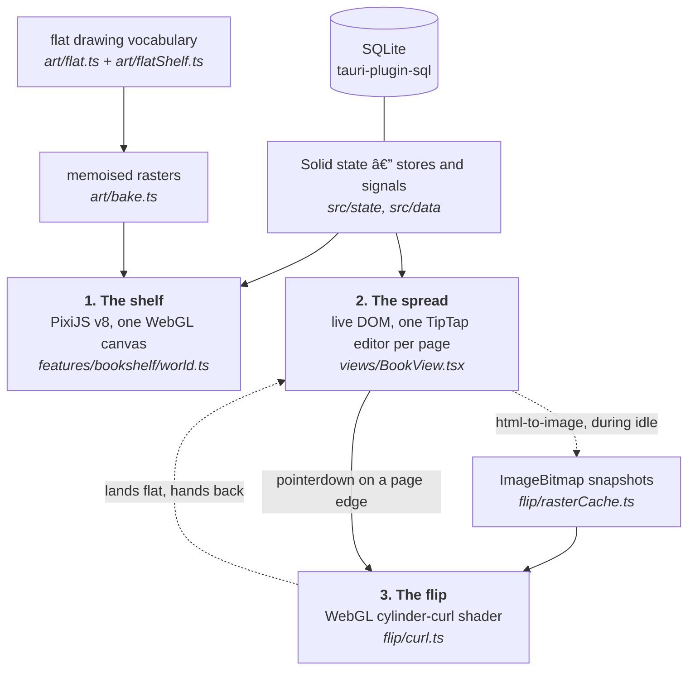

## How it's built

Bellanote is a [Tauri 2](https://tauri.app/) app: a Rust host process, a WebView2
window, and a [SolidJS](https://www.solidjs.com/) frontend built by Vite. Almost
everything interesting happens in the frontend. The Rust side is
<!--f:rustCommands-->13<!--/f--> commands — image assets, link previews, backups,
tray, PDF export, markdown import, bundle read/write — plus the SQLite migrations,
in about 2,300 lines total.

What makes the frontend unusual is that it draws itself three different ways at
once, and the three have to agree on what a page looks like.



**1. The shelf is a single WebGL canvas.** Every bookcase, spine, plaque and wall
is a Pixi sprite whose texture was drawn once into an `OffscreenCanvas` and kept.
The camera works in log-zoom space, floors outside the viewport are pooled and
recycled, and there are three LOD tiers with hysteresis so the tier cannot flicker
at a threshold ([`lod.ts`](src/features/bookshelf/lod.ts): tier 0 above zoom 0.7,
tier 1 down to 0.22, and below that whole floors collapse into a cached
render-texture stamp). The loop is render-on-demand — a settled shelf issues no
draw calls at all. Solid never diffs Pixi: components talk to the world through a
small callback surface and the world mutates its own non-reactive objects.
Rationale and the eliminated alternatives are in
[`docs/design/bookshelf-rendering.md`](docs/design/bookshelf-rendering.md).

**2. The opened book is ordinary DOM.** A two-page spread, one TipTap editor per
page, real contenteditable with a real caret and real IME. This is the reason the
flip is *not* implemented by a page-flip library: every candidate wants the pages
to be its own content, and a Notion-grade block editor cannot live inside
something that forwards clicks to `<a>` and `<button>`.

**3. The flip is a shader that borrows the DOM's pixels.** During idle time,
[`rasterCache.ts`](src/flip/rasterCache.ts) captures each page to an `ImageBitmap`
with `html-to-image` (pixel ratio capped at 2, or 1.5 when `deviceMemory` is under
8 GB; LRU of six; font-embed CSS computed once because it is the dominant
per-capture cost). On pointerdown the GL overlay appears in the same frame,
because the texture already exists. When the page lands flat, live DOM comes back.
A page may knowingly flip with a snapshot up to 300 ms stale — text is unreadable
mid-curl, and the landing swaps to the real thing.
[`docs/design/page-flip.md`](docs/design/page-flip.md) has the model.

### The stack, and why each piece is here

| Piece | Version | Why this one |
|---|---|---|
| [Tauri 2](https://tauri.app/) | 2.x | Ships the OS webview instead of bundling Chromium: a single-digit-MB installer and one process tree. Rust gets the things a webview cannot do — filesystem, SQLite, tray, an SSRF-guarded image fetcher. |
| [SolidJS](https://www.solidjs.com/) | ^1.9.3 | Fine-grained reactivity with no virtual DOM. That is not a benchmark preference here: the app mounts dozens of TipTap node views, and a VDOM diff over a node view is exactly the thing that fights ProseMirror for ownership of the DOM. |
| TypeScript + Vite | ~5.6 / ^6.0 | `strict`, plus `noUnusedLocals`/`noUnusedParameters`/`noFallthroughCasesInSwitch`. Vite's dev server is also the QA harness — see *Driving the running app*. |
| [PixiJS v8](https://pixijs.com/) | ^8.19 | Continuous zoom is the hard requirement, and it is what DOM loses on: Chromium rasterises a layer at a fixed scale, so animating `transform: scale()` on a big container gives blurry pixels during the zoom and a re-raster hitch at the end. A single SVG loses harder — filter-based linework is CPU-bound. |
| [TipTap v3](https://tiptap.dev/) | ^3.29 | `@tiptap/core` is genuinely framework-agnostic (core + `@tiptap/pm` only), so it runs under Solid with a thin binding layer. ProseMirror underneath supplies IME/composition handling and transaction-based undo against a strict schema, which is not cheaply replicable. In June 2025 Tiptap MIT-licensed ten formerly-Pro extensions, including the exact set this app needs: DragHandle, NodeRange, UniqueID, Details, Mathematics, TableOfContents. |
| Vendored Solid bindings | in-repo | [`src/editor/solid/`](src/editor/solid/) — ~300 lines based on `@vrite/tiptap-solid` (MIT), kept in the repo so upgrades are deliberate. Node-view props arrive through a `createStore`, so `update()` mutates fine-grained instead of re-rendering. |
| SQLite via `tauri-plugin-sql` | ^2.4 | Migrations are registered on the Rust side in [`src-tauri/src/lib.rs`](src-tauri/src/lib.rs). No ORM; the repos in [`src/data/`](src/data/) speak SQL directly. |
| GSAP | ^3.15 | Every plugin is free as of 2024, including Flip, which is what makes a dragged block settle into its new position instead of teleporting. Transform/opacity only in hot paths. |
| Howler | ^2.2 | <!--f:soundCues-->66<!--/f--> cues and eleven ambience beds. Every shipped file is a real recording under CC0/public domain, conditioned by [`scripts/gen-sounds.mjs`](scripts/gen-sounds.mjs); the one CC BY source is credited in-app from a manifest regenerated on every build. See [`docs/design/sound.md`](docs/design/sound.md). |
| `html-to-image` | ^1.11 | Page → `ImageBitmap` for the curl. The one library in the app with a bug worked around at length ([`svgSnapshot.ts`](src/flip/svgSnapshot.ts)). |
| `simplex-noise`, `svg-path-properties` | | Seeded noise for the drawing vocabulary; path resampling for the pre-distorted vector chrome in [`art/wobble.ts`](src/art/wobble.ts). |
| Vitest, Playwright, fast-check | ^4.1 / ^1.62 / ^4.9 | Unit, end-to-end, and property-based tests. fast-check drives the script parser's round-trip invariant and the ZIP codec. |

There is deliberately no state-management library, no CSS framework, no icon
package, no chart library and no markdown library. The parser, the ZIP codec, the
PDF writer, the fuzzy matcher and the diagram layouts are all in-repo — each is
under a few hundred lines and each has requirements a general-purpose dependency
would not meet (see [`src/features/transfer/zip.ts`](src/features/transfer/zip.ts)
for the reasoning in one concrete case).

## The map of the app

Start with the directory, then the file. Every module in the tree opens with a
docstring stating what it is responsible for and — where a decision needed
defending — why it is that way and what it replaced.

| Path | What lives there |
|---|---|
| [`src/art/`](src/art/) | The drawing vocabulary. [`flat.ts`](src/art/flat.ts) is the palette and primitives; [`flatShelf.ts`](src/art/flatShelf.ts) the case parts; [`bake.ts`](src/art/bake.ts) the memoised rasters; [`wobble.ts`](src/art/wobble.ts) the pre-distorted vector linework. |
| ↳ the three vocabularies | [`shelfDesign.ts`](src/art/shelfDesign.ts) (carpentry), [`wallpaperDesign.ts`](src/art/wallpaperDesign.ts) (the wall), [`bookDesign.ts`](src/art/bookDesign.ts) (a book's binding). Orthogonal to colour and to each other. |
| [`src/features/bookshelf/`](src/features/bookshelf/) | The Pixi world: [`world.ts`](src/features/bookshelf/world.ts) (controller), [`camera.ts`](src/features/bookshelf/camera.ts), [`gestures.ts`](src/features/bookshelf/gestures.ts) (a pure input decision matrix), [`lod.ts`](src/features/bookshelf/lod.ts), [`virtualizer.ts`](src/features/bookshelf/virtualizer.ts), [`textures.ts`](src/features/bookshelf/textures.ts), [`spineFactory.ts`](src/features/bookshelf/spineFactory.ts), [`artOffload.ts`](src/features/bookshelf/artOffload.ts) (worker pool; failure is never fatal). |
| [`src/views/`](src/views/) | The spread and the left icon rails. [`BookView.tsx`](src/views/BookView.tsx), [`rail/`](src/views/rail/) (studios and pickers), [`spread.ts`](src/views/spread.ts), [`bookmarks.ts`](src/views/bookmarks.ts). |
| [`src/editor/`](src/editor/) | TipTap setup ([`extensions.ts`](src/editor/extensions.ts)), one editor per page ([`PageEditor.tsx`](src/editor/PageEditor.tsx)), custom nodes, slash and right-click menus, [`pagination.ts`](src/editor/pagination.ts), block effects, media paste, exporters. |
| [`src/flip/`](src/flip/) | The page-curl engine: [`curl.ts`](src/flip/curl.ts) (shaders), [`math.ts`](src/flip/math.ts) (pure, node-testable), [`rasterCache.ts`](src/flip/rasterCache.ts), [`cssFallback.ts`](src/flip/cssFallback.ts). |
| [`src/script/`](src/script/) | The Notebook Script parser and printer. Total by construction: `parse()` never throws. |
| [`src/diagrams/`](src/diagrams/) | Layout algorithms (tidy tree, layered DAG, timeline) and hand-drawn SVG renderers. |
| [`src/data/`](src/data/) | SQLite access and the persisted stores: [`bookcases.ts`](src/data/bookcases.ts), [`designPrefs.ts`](src/data/designPrefs.ts), [`settings.ts`](src/data/settings.ts), [`search.ts`](src/data/search.ts). |
| [`src/features/transfer/`](src/features/transfer/) | Export/import bundles (`.nbk`), conflict resolution, restore points. |
| [`src/features/system/`](src/features/system/) | Backups, tray quick capture, launch behaviour, diagnostics, perf HUD. |
| [`src/sound/`](src/sound/) | The Howler engine, the named sound sets, and the in-app credits panel. |
| [`src-tauri/src/`](src-tauri/src/) | `media.rs`, `backup.rs`, `tray.rs`, `export.rs`, `import.rs`, `transfer.rs`, all registered in `lib.rs`. |

### What the source files document about themselves

<!--f:srcDocstrings-->222<!--/f--> of <!--f:srcFiles-->230<!--/f--> source files
open with a module docstring — <!--f:docstringLines-->3867<!--/f--> lines in total,
about one line of file-level prose for every twenty-three lines of code. That
number is not asserted here; `npm run readme:check` recomputes it from the tree and
`tests/readme.test.ts` fails if this sentence has drifted.

They are worth reading before editing anything nearby. The convention:

1. First line is `path/file.ts — one sentence.`
2. A paragraph on what the file is responsible for, and what it is *not*.
3. `## Why it is this way` — only when there is a decision worth defending.
4. `## What this replaced` — only when something was deleted.
5. `## The rules` — prohibitions stated as prohibitions.
6. The reader's verbatim words, when a report drove the design. Search the tree
   for `*"` to find them.

## The rules that fail silently

Most mistakes in this codebase announce themselves. These do not — they produce
art or behaviour that is wrong and stays wrong, on some machines and not others,
with nothing red anywhere.

### Every axis that changes a pixel must appear in the key that pixel is filed under

Baked art is cached by a string key, and **the cache validates nothing about a
hit**. A key that forgets an axis serves the wrong art forever, on any machine
that has ever drawn it once — surviving a reinstall of the app but not of the
cache directory. A specimen board cannot catch it, because a board draws fresh
every time, and neither can a screenshot on a clean profile.

There are currently five vocabularies stacked on art that was once keyed on the
colour scheme alone. The keys live in
[`libraryKey.ts`](src/features/bookshelf/libraryKey.ts) (which is split out of
`textures.ts` purely so a node test can load it without Pixi),
[`wallpaperTileKey`](src/art/wallpaperDesign.ts), and the spine factory's params
key. [`tests/design-cache-keys.test.ts`](tests/design-cache-keys.test.ts) pins all
of them.

One subtlety worth internalising before you touch a key: the wallpaper has *two*
identity strings and they answer different questions. `wallpaperAxisKey` answers
"is the reader looking at a different paper" and is compared against stored specs;
`wallpaperTileKey` answers "are these different pixels" and additionally carries
`WALLPAPER_ART_REV`, bumped whenever a motif's *drawing* changes. Putting the
revision in the axis key would make every saved room stop matching the preset it
was chosen from.

### `setFlatScheme()` must be synchronous around the draw

`flatScheme()` is module state in [`art/flat.ts`](src/art/flat.ts). Set it, draw,
restore it, with no `await` anywhere in between. An `await` inside that window
lets a second room repaint the first one mid-flight — and worse, lets a studio
preview tile repaint the room behind the panel. This applies to key construction
as well as to drawing: reading a key under the outgoing room's colours files the
new room's tile under the old room's name. See `applyWallpaper` in
[`world.ts`](src/features/bookshelf/world.ts) for the shape to copy.

### No light model — but gradients are fine

Flat colour, one ink colour on everything, rounded corners, edges that bow. Depth
is a darker flat face beside a lighter one plus `contactShadow()`. What is banned
is a *lighting model*: a highlight placed to imply a lamp, a specular, a shading
pass, a blur, a blend mode.

Gradients are **not** banned — the app icon itself carries three. An earlier
version of the rule said "no gradients" flatly and cost a pointless sweep across
`src/styles/`. [`tests/styles.test.ts`](tests/styles.test.ts) gates the
unambiguous things (blur, `backdrop-filter`, non-zero box-shadow blur radius) and
deliberately does not gate gradients. The same test gates the handwriting floor:
nothing below 13px may be set in Caveat, Patrick Hand, Kalam or Architects
Daughter.

[`CLAUDE.md`](CLAUDE.md) is the enforcement copy of this rule and is binding.

### Pages never scroll

A page is a fixed height. When content overflows, trailing blocks *leave*:
`PageEditor` measures after each transaction, peels blocks off the end in one
history-free transaction, and hands them to `onOverflow`, which `BookView`
prepends to the next page — creating one if there isn't one. The caret is carried
across the break. The arithmetic is DOM-free and unit-tested in
[`pagination.ts`](src/editor/pagination.ts). Adding `overflow: auto` to a page to
"fix" a layout bug silently disables all of it.

### A missing `bookcaseId` means the whole library, not the open case

Book queries in [`src/data/`](src/data/) take `bookcaseId` as an optional
*trailing* argument. Omitting it deliberately means every bookcase, so search and
the quick switcher keep working across the collection. If you add a query and mean
"this case", pass the id.

### A book's binding must never read `flatScheme()`

[`bookDesign.ts`](src/art/bookDesign.ts) is the one drawing module forbidden from
consulting the room's colours. A book keeps its own colours in every room, which
is the entire reason a reader can recognise it after moving it. The binding
arrives as `SpineParams.binding`; [`art/spines.ts`](src/art/spines.ts) never
imports the prefs store.

### QA bridges are handed out by `world.ts`, never imported by the probe

A probe's own `import('/src/data/…')` can resolve to a **second copy** of the
module on a dev server that has served HMR updates, and writes to that copy never
reach the shelf. Everything a probe needs is exposed on `window` by
[`world.ts`](src/features/bookshelf/world.ts) — `__shelfSaveDesign`,
`__shelfSaveSettings`, `__shelfDesign`, `__shelfBookcases`, and about a dozen
more. Probes assert on the **applied** state (what the textures and the backdrop
are actually holding), never on what was merely saved.

### `autoGenerateMipmaps: false` on the wall

The backdrop is a `TilingSprite` over a non-power-of-two, `repeat`-addressed
texture. A mip sampled on a wrapped NPOT texture bleeds across the wrap, and
`tileScale < 1` is exactly when a mip gets sampled — which is to say, at the zoom
levels where the most wall is visible. Turning mipmaps on puts the seam back.

## Adding to a design vocabulary, end to end

Three modules give the world its shape, and each is deliberately independent of
colour and of the other two — repainting a room must not straighten its arches,
and rebuilding a case must not repaint it:

| Vocabulary | Axes | Named presets |
|---|---|---|
| [`shelfDesign.ts`](src/art/shelfDesign.ts) — a bookcase's carpentry | <!--f:shelfBuilds-->52<!--/f--> builds × <!--f:shelfPatterns-->50<!--/f--> timber patterns | <!--f:shelfPresets-->113<!--/f--> |
| [`wallpaperDesign.ts`](src/art/wallpaperDesign.ts) — the wall | <!--f:wallpaperMotifs-->50<!--/f--> motifs × 5 scales × 4 reliefs × 6 ink slots × 50 tones × 4 nibs | <!--f:wallpaperPapers-->126<!--/f--> |
| [`bookDesign.ts`](src/art/bookDesign.ts) — a book's binding | <!--f:bookShapes-->50<!--/f--> spine shapes × <!--f:bookMaterials-->50<!--/f--> materials × <!--f:bookDecorations-->50<!--/f--> decorations | <!--f:bookPresets-->189<!--/f--> |

Alongside them: <!--f:roomThemes-->60<!--/f--> colour schemes
([`themes.ts`](src/art/themes.ts)), <!--f:bookCloths-->50<!--/f--> book cloths, and
<!--f:soundSets-->28<!--/f--> named sound sets. The choices are persisted in
[`designPrefs.ts`](src/data/designPrefs.ts) as a single `settings` blob: the **case**
owns its build, pattern and wallpaper; the **book** owns its binding.

These are the part of the codebase most likely to be extended, and the part with
the most places to forget. Here is every stop on the route, using "add a new
wallpaper motif" as the worked example. Adding a shelf build or a book binding is
the same walk with different filenames.

**1. Declare it.** Add the id to `WALLPAPER_PATTERNS` in
[`src/art/wallpaperDesign.ts`](src/art/wallpaperDesign.ts), and an entry to
`PLANS` (its lattice, cell size and relief factor). The array is grouped by family
with comments — put it in the right group, because the picker's sections are
derived from that grouping.

**2. Draw it,** as a `case` in `buildMarks`. This is the part with a rule attached:
every mark is emitted through `emit`, which knows the tile is a **torus** — a mark
whose ink reaches past an edge is drawn again, translated by exactly one tile, so
the part that leaves the right edge re-enters at the left as bit-identical
geometry. Marks that run the whole width or height cannot work that way (a cap
landing mid-seam is the pale band this whole module exists to avoid); those declare
`null` for the axis they run along and carry a profile that is *periodic by
construction* — a sine or triangle wave whose wavelength divides the tile.
`wobbleRect`'s quadratic bow is not periodic, so it is never used on a running
mark. Lattices are fitted to the tile, not the tile to the lattice.

**3. Hang it in the book.** Add at least one `WALLPAPER_BOOK` entry using the new
motif, with a tier (`front` / `book` / `back`), a family and mood tags. Five
constraints hold across the whole list and are all tested: no two papers agree on
all four of pattern/scale/depth/ink; no motif is hung more than three times; every
value of every axis is reachable from some paper; every mood word lands on at least
ten papers; every family leads with at least four `front` papers and no more than a
quarter of the book sits at the `back`.

**4. Bump `WALLPAPER_ART_REV`** *only* if you changed how an existing motif draws.
A new motif needs no bump — its key is new anyway. Changing an existing one without
a bump serves the old pixels forever to anyone who has drawn it.

**5. Check the key.** `wallpaperAxisKey` already interpolates every field of
`WallpaperSpec`, so a new *motif* is covered automatically — but a new **axis**
(a seventh field on the spec) must be added there by hand, and to the validator in
[`designPrefs.ts`](src/data/designPrefs.ts), which is total: junk out of SQLite has
to resolve to the house paper rather than throw inside a bake.

**6. The studio picks it up for free** — [`designOptions.ts`](src/views/rail/designOptions.ts)
builds its cards from the vocabulary arrays, and every preview tile is painted by
the *same* routine that paints the real thing (`drawWallpaperCard`, not an
approximation). If you add an axis rather than a value, its `artKey` needs the new
axis too.

**7. Run the gates, in this order:**

```bash
npx vitest run tests/art-wallpaper.test.ts      # reachability + the seam test
npx vitest run tests/design-cache-keys.test.ts  # every axis reaches every key
node scripts/probe-wallpapers.mjs               # look at it, at wall scale
node scripts/probe-vocabularies.mjs             # does it reach the running shelf?
```

The seam test is the one worth understanding. There is no canvas in Node and no
canvas package in this repo, so the tile is *recorded* rather than rasterised:
`renderWallpaperTile` is handed a proxy that captures every call and property set,
and the op list is replayed onto a real 2D context inside headless Chromium — the
same rasteriser the app draws with. It measures the browser's actual antialiasing
rather than a model of it, and it skips (rather than fails) on a machine with no
browser installed.

Step 7's last line is the one people skip and shouldn't. A specimen board proves a
module draws well in isolation and says **nothing** about whether the app can reach
it. The three vocabularies each shipped with a board, and for a while the pickers
stored and previewed truthfully while the shelf kept drawing a plain plank case
against a bare wall.

## Things that were harder than they look

Five places where the obvious implementation is wrong, each linking the docstring
that tells the story in full.

**The wall could not have a pattern.** Every earlier version had a visible repeat —
the reader reported a "weird tiling effect" and "white bands in the corners", and
the fix both times was to delete the pattern and go back to a flat tint. It got a
tile back only once seamlessness became structural rather than something to test
for: a torus-aware mark emitter, lattices fitted to the tile, and periodic profiles
for anything that runs edge to edge.
→ [`art/wallpaperDesign.ts`](src/art/wallpaperDesign.ts)

**The turning page had a shadow that wasn't drawn.** Past a half turn the sheet
lies flat *on top of* the un-deformed strip near the spine; perspective pushes the
lifted paper down by ~38px at the foot of the page. With the mesh indexed row-major
and no depth buffer, row *j*'s lifted tail was drawn before row *j+1*'s flat strip,
so the flat strip painted over the sheet lying on top of it — and what showed
through, once per mesh row, was the old lighting model's self-shadow gradient. Two
defects stacked: painter's order a lift can break, and shading rich enough to make
the break obvious. Both are gone.
→ [`flip/curl.ts`](src/flip/curl.ts)

**Diagrams snapshotted as black blobs.** `html-to-image` clones HTML by copying
each element's computed style onto the clone — but not inside an `<svg>`, where
`cloneNode()` deep-clones the subtree and returns early. Our diagrams are styled
entirely by class, and an SVG shape with no `fill` declared does not fall back to
transparent: the initial value of `fill` is black. Measured, not guessed. The fix
inlines resolved paint properties for the duration of the capture and undoes it in
a `finally`.
→ [`flip/svgSnapshot.ts`](src/flip/svgSnapshot.ts)

**The disk cache was making startup slower.** Baked art used to be PNG-encoded to
`appCacheDir`. Measured on the four flat case parts: at dpr 1, draw 23.2 ms vs
encode 38.0 ms; at dpr 2, draw 34.4 ms vs encode 62.4 ms. A cold boot with the
cache cost 2.6× a cold boot without it, the encode was awaited on the critical
path, and a warm boot saved 11 ms at dpr 1 and nothing at dpr 2 — while spending a
`mkdir` and a `readFile` over the IPC bridge per part, *before* the producer was
allowed to start. Flat art is cheaper to redraw than to talk about. Memory only,
now.
→ [`art/bake.ts`](src/art/bake.ts)

**The books looked low-res on a 150%-scaled laptop.** A spine sprite is drawn at
`world px × camera.zoom × renderer.resolution`, but the bake scales were plain
world-px multipliers — so on any display where the renderer runs above resolution
1, every spine was asked for more texels than it had been given. Measured in texels
per device pixel at dpr 2 (below 1 means magnified means blurry): 0.62 → 1.24 at
zoom 0.5, 0.40 → 0.80 at max zoom. Max zoom is still deliberately the soft spot;
covering it exactly would need 6.25× the bake area for the top sliver of the range.
→ [`features/bookshelf/spineScale.ts`](src/features/bookshelf/spineScale.ts)

**Bonus, because it is the most instructive failure in the repo.** The page-side
decoration vocabulary grew to 472 values across eleven axes, all validated, all
rendered — and 429 of them could not be picked from any menu, because the catalogue
panel built its list from the *writing language's* vocabulary while the editor
accepted its own. Nothing failed. A count of the vocabulary said 472 and a count of
what a reader could apply said 43, and no test compared the two. Now one does, and
it tests reachability rather than counts, because a number would just be a third
place to update.
→ [`tests/catalogue-reach.test.ts`](tests/catalogue-reach.test.ts)

## The design record

[`docs/design/`](docs/design/) is an ADR set: <!--f:designDocs-->14<!--/f-->
documents, of which <!--f:supersededDesignDocs-->5<!--/f--> carry an explicit
superseded banner in their first lines. The superseded ones are kept on purpose —
the diagnosis of *why* a half-simulated surface reads as cheap is what produced the
flat language, and deleting the reasoning would leave the conclusion looking
arbitrary.

Read the relevant one **before** working in its area.

| Document | Status | What it decides |
|---|---|---|
| [`RESET-render-architecture.md`](docs/design/RESET-render-architecture.md) | **Current** | The decision that deleted the runtime painting stack. Carries the measurements: 4,977 ms to first canvas paint, a 15.3 s main-thread block, 0.1 fps idle. |
| [`bookshelf-rendering.md`](docs/design/bookshelf-rendering.md) | **Current** | Pixi v8 WebGL world + DOM overlay. Camera in log-zoom space, floor virtualization, 3-tier LOD, no live SVG filters in any hot path. |
| [`page-flip.md`](docs/design/page-flip.md) | **Current** | Live DOM at rest, GPU curl during the gesture, CSS 3D rigid fold as the no-WebGL fallback only. |
| [`block-editor.md`](docs/design/block-editor.md) | **Current** | TipTap v3 with vendored Solid bindings. Document JSON *is* the storage format. |
| [`script-language.md`](docs/design/script-language.md) | **Current** | Notebook Script: Markdown subset + `:::` directives + fenced mini-languages, with a handwritten tolerant parser. |
| [`library-themes.md`](docs/design/library-themes.md) | **Current** (rewritten) | A theme is a colour scheme and nothing else. Opens with an account of what the doc *used to* say and why data describing art nobody renders is worse than no data. |
| [`sound.md`](docs/design/sound.md) | **Current** | Every cue is a real recording under CC0/PD; the one CC BY source is credited in-app from a generated manifest. |
| [`ui-audit.md`](docs/design/ui-audit.md) | **Current** | A screenshot-driven review with measured WCAG contrast against the exact token pairs the app paints. |
| [`art-pipeline.md`](docs/design/art-pipeline.md) | ⚠️ Partly superseded | Bake-once, seeded procedural spines and pre-distorted vector chrome still run. Every SVG filter recipe in it is deleted; nothing consumes them. |
| [`ART-BIBLE.md`](docs/design/ART-BIBLE.md) | ⚠️ Read the correction first | Composition, restraint and controlled randomness still hold. Lighting, materials and vegetation do not. |
| [`painted-rendering.md`](docs/design/painted-rendering.md) | ⚠️ Superseded | The runtime-painting era. Kept for the reasoning. |
| [`painterly-art-direction.md`](docs/design/painterly-art-direction.md) | ⚠️ Superseded | The reference-photograph standard that was chased and abandoned. |
| [`photoreal-assets.md`](docs/design/photoreal-assets.md) | ⚠️ Superseded | Generated photoreal materials. The diagnosis in it led directly to the flat language. |
| [`generated-assets.md`](docs/design/generated-assets.md) | ⚠️ Superseded (runtime) | No generated asset ships. The local ComfyUI setup is still a usable authoring tool, which is why it is kept. |

[`docs/ROADMAP-wave2.md`](docs/ROADMAP-wave2.md) tracks the customization and
quality-of-life features and their ownership.

## Developing

```bash
npm install
npm run tauri dev      # the real app
npm run dev            # frontend only, in a browser, on :1420
```

`npm run dev` works because [`src/data/db.ts`](src/data/db.ts) falls back to an
in-memory database stub outside Tauri — same `select`/`execute` surface, persisted
to `localStorage`, degrading to empty results rather than throwing on SQL it does
not understand. A book created in the browser survives a reload. This is not a toy
path: it is what the entire Playwright harness runs against.

### The four checks

| Command | Gates |
|---|---|
| `npx tsc --noEmit` | The frontend, in `strict` mode. Note it only covers `src/` — `tests/` is not in the `tsconfig` include. |
| `npx vitest run` | <!--f:unitTests-->51<!--/f--> unit-test files, node environment (jsdom is deliberately not installed). `tests/book-bindings.test.ts` takes ~110 s on its own; that is expected. |
| `cargo check --manifest-path src-tauri/Cargo.toml` | The Rust host. |
| `npm run e2e` | <!--f:e2eSpecs-->15<!--/f--> Playwright specs against a dev server on :1420. |

Two generated artefacts have their own verify mode, and both are wired into the
test suite so a forgotten regeneration is a red test rather than a silent
divergence: `npm run spec:check` (the AI-facing Notebook Script spec, generated
from [`src/script/vocab.ts`](src/script/vocab.ts) plus a template) and
`npm run readme:check` (this document — see below).

> [!WARNING]
> Headless Chromium runs on SwiftShader, so the app's software-renderer probe puts
> the shelf into degrade mode and you get lo-res untitled spines. **Append
> `?fx=force`** to override it. In the same environment `requestAnimationFrame` is
> throttled, so poll for state instead of waiting a fixed time — a `waitForTimeout`
> that passes on your machine will flake in CI. The override lives in
> [`features/bookshelf/env.ts`](src/features/bookshelf/env.ts) and is not to be
> removed; all visual QA depends on it.

### Looking at the art

Visual work is not done until you have captured a screenshot and *actually looked
at it*. Keep it proportionate — the surface you changed, batched into specimen
boards where it makes sense. [`specimen.html`](specimen.html) run against the dev
server shows the flat vocabulary on its own, and `BOOK_SPECIMENS=1 npx vitest run`
writes binding boards.

### Driving the running app

<!--f:probeScripts-->22<!--/f--> scripts under [`scripts/`](scripts/) named
`probe-*.mjs` drive the running app with Playwright and assert on **applied** state
through the `?fx=force` bridges. The important three:

- `probe-vocabularies.mjs` — a design choice reaches the case, the wall, *and* a
  second bookcase.
- `probe-bindings.mjs` — a binding survives the whole spine bake path.
- `probe-studio-wiring.mjs` — the studio panel, driven only by clicking.

They exist because of the failure described above: the pickers were truthful and
the shelf was not, and no board could have shown it.

### Building and releasing

```bash
npm run build          # spec:check, then vite build → dist/
npm run tauri build    # the above, then the Rust bundle
```

`npm run tauri build` writes an NSIS installer and an MSI to
`src-tauri/target/release/bundle/`. The NSIS build uses `installMode: currentUser`,
so installing does not need an administrator prompt.

Releases are tag-driven.
[`.github/workflows/release.yml`](.github/workflows/release.yml) runs on
`windows-latest` whenever a `v*` tag is pushed (or on manual dispatch with a tag),
typechecks, runs the unit tests, builds the installer, generates notes with
[`scripts/release-notes.mjs`](scripts/release-notes.mjs) by diffing against the
previous tag, and publishes a GitHub Release with the installer attached. A tag
containing `-` is published as a prerelease.

> [!NOTE]
> That is the *only* workflow, and it fires on tags — nothing runs `tsc` or
> `vitest` on an ordinary push. There is consequently no CI badge to display yet;
> the four checks above are run locally, and again inside the release job. Wiring
> a push-triggered workflow is the prerequisite for earning that badge, not the
> other way round.

## How this document stays true

Two mechanisms, both with a failing check rather than just a writer:

- **`npm run spec:check`** regenerates
  [`src-tauri/resources/notebook-script-spec.md`](src-tauri/resources/notebook-script-spec.md)
  — the file a person hands to a chatbot — from `src/script/vocab.ts` and a
  template, and fails if the checked-in copy differs. `tests/script/spec-generated.test.ts`
  runs it, and separately checks that the vocabulary the spec is generated *from*
  is the vocabulary the parser actually implements. Without it, teaching the parser
  a new container silently leaves chatbots writing script the app cannot read.
- **`npm run readme:check`** resolves every relative link in this README against
  the repo root, and recomputes every number written inside an invisible
  `<!--f:key-->…<!--/f-->` marker. `npm run readme:facts` prints the true values.
  [`tests/readme.test.ts`](tests/readme.test.ts) is the actual gate — it supplies
  the counts that need TypeScript loaded, so a vocabulary that grows and a README
  that says otherwise is a failing test. Twenty-two numbers on this page and
  a hundred-odd links are measurements, not claims.

The generator is the cheap half. The failure when someone edits a generated region
by hand is the entire value.

> [!NOTE]
> [`CLAUDE.md`](CLAUDE.md) is the binding rules file for agents working in this
> repo, and it is deliberately *not* a copy of this README. It states the
> constraints; the README tells the story once and links to the enforcement.
> Duplicating one into the other makes both worse.

## Non-goals

- **No sync and no accounts.** The database is a file on your disk. There is no
  server to sign in to and nothing to be logged out of.
- **No cloud anything.** The only outbound network traffic is image fetch and link
  preview, both explicitly requested by you and both behind an SSRF guard
  ([`src/editor/media/urlGuard.ts`](src/editor/media/urlGuard.ts) mirrors the Rust
  one).
- **No mobile, no web build.** The shelf assumes a pointer, a scroll wheel and a
  desktop-sized window.
- **No plugin API.** The vocabularies are extended by editing them; see the
  end-to-end walk above.
- **No collaborative editing.** ProseMirror could support it; the storage model,
  the pagination contract and the whole single-reader framing do not.
- **No second visual language.** One flat vocabulary, one ink colour, one small
  palette. New surfaces join it rather than bringing their own.

## Licence and credits

MIT — see [`LICENSE`](LICENSE).

**Fonts** are bundled through `@fontsource`, all under the SIL Open Font License:
Caveat (headings and book titles, 20px and up), Patrick Hand (body), Kalam
(accents), Architects Daughter (diagram labels), Nunito Sans (UI micro-copy below
13px), plus Crimson Pro, Lora, Gochi Hand and Shadows Into Light for the page-level
lettering vocabulary.

**Sound.** Every shipped cue is a real recording under a public-domain dedication
or CC0, sliced and conditioned by [`scripts/gen-sounds.mjs`](scripts/gen-sounds.mjs).
One source — the rain bed — is CC BY 4.0, and the attribution is discharged in the
UI rather than in a text file: *Settings → Sound → sound credits* reads
`public/sounds/CREDITS.json` at runtime and renders every recording, author and
licence. The manifest is rewritten from the same table that drives the audio on
every build, so a credit cannot drift from what actually shipped. Provenance for
all of it is in [`docs/design/sound.md`](docs/design/sound.md).

**Art.** [`assets/brand/icon.svg`](assets/brand/icon.svg) is the drawing reference
the whole app follows. [`assets/brand/bellanote-art.png`](assets/brand/bellanote-art.png)
is the shipped app and installer icon, supplied by the owner, and is deliberately a
different register from the app's interior — it is the source for
[`scripts/gen-icons.py`](scripts/gen-icons.py) and nothing else. Do not flatten the
mark to match the app, and do not add rendering to the app to match the mark.

**Upstream.** TipTap and ProseMirror (MIT), the Solid bindings in
[`src/editor/solid/`](src/editor/solid/) based on `@vrite/tiptap-solid` (MIT),
PixiJS (MIT), GSAP (standard licence, all plugins free), Howler (MIT), Tauri
(MIT/Apache-2.0).
