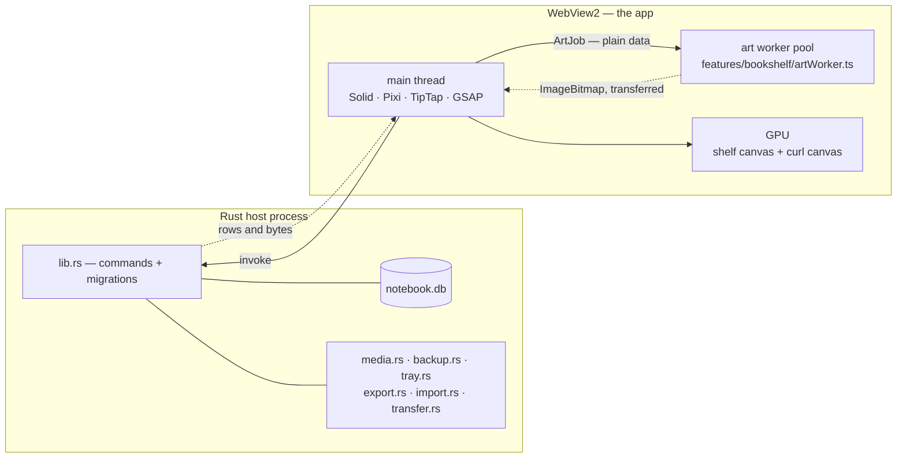

<p align="right"><i>
  <a href="../../README.md">← Alcove</a> ·
  <a href="part-1-users.md">← Part 1 — Using Alcove</a> ·
  Part 2 of 2
</i></p>

# Part 2 — Building Alcove

**This half is for a developer — or for an AI agent helping one.** The
architecture, the reason behind each dependency, the stop-by-stop walks for
adding a value or a block type, and every gate that stops a change going wrong.
Nothing in it is needed to *use* the app.

If you are an agent working in this repo, read
[`CLAUDE.md`](../../CLAUDE.md) as well: it is the binding rules file, it states
the constraints this page only describes, and it deliberately does not restate
what is here.

This page describes what the codebase actually is rather than an idealised
version of it, which means naming the bugs it has shipped. That is not
confession for its own sake — the expensive failures here share a property, they
produce no red test and nothing visible on a clean profile, and a document that
only described the intended design would leave you unable to recognise them.

For what the app *is* and how a reader uses it, read [Part 1 — Using
Alcove](part-1-users.md) first — this half assumes it.

**On this page**

<!-- gen:contents-part-2 -->
- [How it's built](#how-its-built) — The three ways the app draws itself, what runs in which execution context, and the stack table with a reason per row
- [Getting it running](#getting-it-running) — `npm run tauri dev`, the browser-only dev path, and the two bare-bones checks
- [The map of the app](#the-map-of-the-app) — Directory by directory, plus the module-docstring convention this README points at instead of copying
- [The art pipeline](#the-art-pipeline) — Bake once, draw forever: atlas packing, LOD tiers, and the cache-key rule
- [The design vocabularies](#the-design-vocabularies) — Colour, carpentry, wall and binding as four orthogonal axes — and adding a value end to end
- [The editor](#the-editor) — The vendored Solid bindings, the pagination contract, block effects, and adding a block type step by step
- [The flip](#the-flip) — The cylinder curl, the snapshot cache, and the library bug worked around at length
- [Notebook Script](#notebook-script) — Why `parse()` is total, the round-trip invariant, and the generated spec
- [The data layer](#the-data-layer) — The schema, the bookcase model, and why every read is validated
- [The failure modes this codebase has actually shipped](#the-failure-modes-this-codebase-has-actually-shipped) — The four ways work here has looked finished and been unreachable, unreadable, wrong or buttonless, with the real instances named
- [The gate](#the-gate) — The deliberately tiny smoke suite
- [Things that were harder than they look](#things-that-were-harder-than-they-look) — Five places the obvious implementation is wrong
- [The design record](#the-design-record) — The ADR set in `docs/design/`, including which documents are superseded and why they are kept
- [Building and releasing](#building-and-releasing) — The bundle artefacts, the icon pipeline, and the tag-driven release workflow
- [The generated artefacts](#the-generated-artefacts) — The `gen-*` scripts that write checked-in files, and which ones a forgotten regeneration actually fails
- [How this document stays true](#how-this-document-stays-true) — The spec check and the README check: markers recomputed, links resolved, navigation composed rather than typed
- [Non-goals](#non-goals) — No sync, no cloud, no mobile, no plugin API, no second visual language, no light model
- [Licence and credits](#licence-and-credits) — MIT, the bundled fonts, where the sound came from, and the two brand images that are not interchangeable
<!-- /gen -->

Three places to start, depending on why you are here. Changing what the app
*draws*: [The art pipeline](#the-art-pipeline), then
[The design vocabularies](#the-design-vocabularies). Changing what a page can
*hold*: [The editor](#the-editor), then [Notebook Script](#notebook-script).
Trying to work out why something that looks finished is not reachable:
[The failure modes this codebase has actually
shipped](#the-failure-modes-this-codebase-has-actually-shipped), which is the
shortest useful thing on this page.

<!--lift: build-->
## How it's built
<!--nav: The three ways the app draws itself, what runs in which execution context, and the stack table with a reason per row-->

Alcove is a [Tauri 2](https://tauri.app/) app: a Rust host process, a system
webview window, and a [SolidJS](https://www.solidjs.com/) frontend built by
Vite. Almost everything interesting happens in the frontend. The Rust side is
<!--f:rustCommands-->15<!--/f--> commands — image assets, link previews, backups,
tray, PDF export, markdown import, bundle read/write — plus the SQLite
migrations, in <!--f:rustFiles-->9<!--/f--> files and
<!--f:rustLines-->2635<!--/f--> lines.

### The shape of the thing, in four facts

These are the constraints every decision below is downstream of. They are stated
here rather than at the top of the front page on purpose: a reader deciding
whether to install Alcove does not need the storage model first, and the
one who does need it is you.

- **One SQLite file, on the reader's own disk.** `notebook.db` in the app data
  directory, opened through `tauri-plugin-sql`, with `assets/` beside it for
  pictures and `backups/` for the scheduled ZIPs. There is no server half of
  this app to write.
- **No account, no sync, no telemetry.** `telemetry` is typed as the literal
  `false` in [`src/data/types.ts`](../../src/data/types.ts), so it is not a
  setting somebody can flip — it is a type error to try. Adding a network
  dependency to a feature is therefore an architectural change, not a
  convenience.
- **Exactly two outbound calls, both reader-initiated.** Searching for an
  openly-licensed picture (`::fetch`) and previewing a pasted link. Both go
  through an SSRF guard that is written twice on purpose —
  [`src-tauri/src/media.rs`](../../src-tauri/src/media.rs) is the real one and
  [`src/editor/media/urlGuard.ts`](../../src/editor/media/urlGuard.ts) mirrors
  it — https only, private and loopback addresses refused, fast timeouts, capped
  body size.
- **The webview is the OS's, not ours.** That is what makes the installer about
  sixteen megabytes rather than ten times that, and it is also why the app
  inherits the platform's autoplay policy, its IME and its font stack rather
  than choosing them.

What makes the frontend unusual is that it draws itself three different ways at
once, and the three have to agree on what a page looks like.


**1. The shelf is a single WebGL canvas.** Every bookcase, spine, plaque and wall
is a Pixi sprite whose texture was drawn once into an `OffscreenCanvas` and kept.
The camera works in log-zoom space, floors outside the viewport are pooled and
recycled, and there are three LOD tiers with hysteresis so the tier cannot flicker
at a threshold ([`lod.ts`](../../src/features/bookshelf/lod.ts): tier 0 above zoom 0.7,
tier 1 down to 0.22, and below that whole floors collapse into a cached
render-texture stamp). The loop is render-on-demand — a settled shelf issues no
draw calls at all. Solid never diffs Pixi: components talk to the world through a
small callback surface and the world mutates its own non-reactive objects.
Rationale and the eliminated alternatives are in
[`docs/design/bookshelf-rendering.md`](../design/bookshelf-rendering.md).

**2. The opened book is ordinary DOM.** A two-page spread, one TipTap editor per
page, real contenteditable with a real caret and real IME. This is the reason the
flip is *not* implemented by a page-flip library: every candidate wants the pages
to be its own content, and a Notion-grade block editor cannot live inside
something that forwards clicks to `<a>` and `<button>`.

**3. The flip is a shader that borrows the DOM's pixels.** During idle time,
[`rasterCache.ts`](../../src/flip/rasterCache.ts) captures each page to an `ImageBitmap`
with `html-to-image` (pixel ratio capped at 2, or 1.5 when `deviceMemory` is under
8 GB; LRU of six; font-embed CSS computed once because it is the dominant
per-capture cost). On pointerdown the GL overlay appears in the same frame,
because the texture already exists. When the page lands flat, live DOM comes back.
A page may knowingly flip with a snapshot up to 300 ms stale — text is unreadable
mid-curl, and the landing swaps to the real thing.
[`docs/design/page-flip.md`](../design/page-flip.md) has the model.

### What runs where

Four execution contexts, and knowing which one you are in answers most "why can't
I just…" questions.



| Context | What lives there | The constraint it imposes |
|---|---|---|
| **Rust host** | SQLite and its migrations, the filesystem, the tray, the SSRF-guarded image fetcher, the PDF writer's file half, bundle read/write. | Everything crosses `invoke` and is therefore async and structured-clone-shaped. A command is the *only* way to touch a path outside the asset scope. |
| **Main thread** | All Solid state, all Pixi objects, every TipTap editor, GSAP timelines, the curl renderer. | It also runs the compositor for a contenteditable. A long task here is a frozen window, which is the whole reason the next row exists. |
| **Art workers** | Spine painting only. A pool sized from `hardwareConcurrency − 1`, capped at three ([`artOffload.ts`](../../src/features/bookshelf/artOffload.ts)). | Jobs are plain data, results are transferred `ImageBitmap`s (zero-copy). **Failure is never fatal** — no `Worker`, no `OffscreenCanvas`, a dead bundle or a timed-out job all resolve to `null` and the main thread draws the spine itself. |
| **GPU** | The shelf's sprite batches; the curl mesh and its ground pass. | No live SVG filters, no blend modes, no post-processing. The curl context carries a depth buffer, which is not decoration — see *the turning page had a shadow that wasn't drawn* below. |

The worker boundary is worth one more paragraph, because it is the only place
this app is genuinely concurrent. A cold shelf once measured **42.6 s of long
tasks and a single 15.5 s frozen frame** on the main thread; slicing finer could
not fix it because the atom is one spine and one spine was seconds of brush work.
Flat art made a spine cheap, but the shape stayed: the main thread's whole share
of a spine is now one `drawImage` of a finished bitmap into an atlas page. The
wire format is its own module ([`artJobs.ts`](../../src/features/bookshelf/artJobs.ts))
so neither side drags the other's dependencies in, and it carries an
`ART_PROTOCOL_VERSION` so a stale worker bundle is obvious rather than subtly
wrong.

### The stack, and why each piece is here

| Piece | Version | Why this one |
|---|---|---|
| [Tauri 2](https://tauri.app/) | 2.x | Ships the OS webview instead of bundling Chromium: a 16 MB installer rather than ten times that, and one process tree. Rust gets the things a webview cannot do — filesystem, SQLite, tray, an SSRF-guarded image fetcher. |
| [SolidJS](https://www.solidjs.com/) | ^1.9.3 | Fine-grained reactivity with no virtual DOM. That is not a benchmark preference here: the app mounts dozens of TipTap node views, and a VDOM diff over a node view is exactly the thing that fights ProseMirror for ownership of the DOM. |
| TypeScript + Vite | ~5.6 / ^6.0 | `strict`, plus `noUnusedLocals`/`noUnusedParameters`/`noFallthroughCasesInSwitch`. Vite also provides the browser-only development path on port 1420. |
| [PixiJS v8](https://pixijs.com/) | ^8.19 | Continuous zoom is the hard requirement, and it is what DOM loses on: Chromium rasterises a layer at a fixed scale, so animating `transform: scale()` on a big container gives blurry pixels during the zoom and a re-raster hitch at the end. A single SVG loses harder — filter-based linework is CPU-bound. |
| [TipTap v3](https://tiptap.dev/) | ^3.29 | `@tiptap/core` is genuinely framework-agnostic (core + `@tiptap/pm` only), so it runs under Solid with a thin binding layer. ProseMirror underneath supplies IME/composition handling and transaction-based undo against a strict schema, which is not cheaply replicable. In June 2025 Tiptap MIT-licensed ten formerly-Pro extensions, including the exact set this app needs: DragHandle, NodeRange, UniqueID, Details, Mathematics, TableOfContents. |
| Vendored Solid bindings | in-repo | [`src/editor/solid/`](../../src/editor/solid/) rather than a dependency, because there is no Solid adapter upstream worth taking and an editor binding is not a thing to upgrade by lockfile bump. Three files; see [The vendored Solid bindings](#the-vendored-solid-bindings). |
| SQLite via `tauri-plugin-sql` | ^2.4 | Migrations are registered on the Rust side in [`src-tauri/src/lib.rs`](../../src-tauri/src/lib.rs). No ORM; the repos in [`src/data/`](../../src/data/) speak SQL directly. |
| GSAP | ^3.15 | Every plugin is free as of 2024, including Flip, which is what makes a dragged block settle into its new position instead of teleporting. Transform/opacity only in hot paths. |
| [`@pixi/sound`](https://pixijs.io/sound/) | ^6.0 | <!--f:soundCues-->64<!--/f--> cues and <!--f:ambienceBeds-->10<!--/f--> ambience beds, in four categories (`ui`, `pages`, `shelf`, `ambient`) with category volumes under one master. It shares the app's Pixi runtime and provides pooled Web Audio playback without maintaining a second audio framework. Provenance and licensing are under [Licence and credits](#licence-and-credits); the design is [`docs/design/sound.md`](../design/sound.md). |
| `html-to-image` | ^1.11 | Page → `ImageBitmap` for the curl. The one library in the app with a bug worked around at length ([`svgSnapshot.ts`](../../src/flip/svgSnapshot.ts)). |
| `lowlight` | ^3.3 | Syntax highlighting inside code blocks, through `@tiptap/extension-code-block-lowlight`. |
| `simplex-noise`, `svg-path-properties` | ^4.0 / ^1.3 | Seeded noise for the drawing vocabulary; path resampling for the pre-distorted vector chrome in [`art/wobble.ts`](../../src/art/wobble.ts). |
| `@floating-ui/dom` | ^1.8 | Anchoring for the slash menu, the link suggestions, the block context menu, the drag handle and the selection toolbar. The app's *own* delegated tooltip deliberately does not use it — see [`Tooltip.tsx`](../../src/views/Tooltip.tsx). |
| Vitest | ^4.1 | Runs the single retained smoke file, [`tests/smoke.test.ts`](../../tests/smoke.test.ts), in Node. |

There is deliberately no state-management library, no CSS framework, no icon
package, no chart library and no markdown library. The parser, the ZIP codec, the
PDF writer, the fuzzy matcher and the diagram layouts are all in-repo — each is
under a few hundred lines and each has requirements a general-purpose dependency
would not meet (see [`src/features/transfer/zip.ts`](../../src/features/transfer/zip.ts)
for the reasoning in one concrete case).

## Getting it running
<!--nav: `npm run tauri dev`, the browser-only dev path, and the two bare-bones checks-->

```bash
npm install
npm run tauri dev      # the real app
npm run dev            # frontend only, in a browser, on :1420
```

`npm run dev` works because [`src/data/db.ts`](../../src/data/db.ts) falls back to an
in-memory database stub outside Tauri — the same `select`/`execute` surface,
persisted to `localStorage`, degrading to empty results rather than throwing on
SQL it does not understand. A book created in the browser survives a reload. It
is a convenient development path, not a substitute for the Tauri host.

### The bare-bones gate

The owner performs visual and audio acceptance directly. Automated verification
is deliberately limited to the two commands below.

| Command | What it checks |
|---|---|
| `npx tsc --noEmit` | Frontend type safety in strict mode. |
| `npm test` | Three smoke invariants: Notebook Script remains total, pagination keeps one block, and package/Tauri versions agree. |

The smoke suite is [`tests/smoke.test.ts`](../../tests/smoke.test.ts), selected by
[`vitest.smoke.config.ts`](../../vitest.smoke.config.ts). It does not boot a
browser, capture pixels, inspect audio, occupy port 1420 or claim anything about
what the app looks or sounds like.

## The map of the app
<!--nav: Directory by directory, plus the module-docstring convention this README points at instead of copying-->

Start with the directory, then the file. Every module in the tree opens with a
docstring stating what it is responsible for and — where a decision needed
defending — why it is that way and what it replaced.

| Path | What lives there |
|---|---|
| [`src/art/`](../../src/art/) | The drawing vocabulary. [`flat.ts`](../../src/art/flat.ts) is the palette and primitives; [`flatShelf.ts`](../../src/art/flatShelf.ts) the case parts; [`bake.ts`](../../src/art/bake.ts) the memoised rasters; [`atlas.ts`](../../src/art/atlas.ts) the sprite pages; [`wobble.ts`](../../src/art/wobble.ts) the pre-distorted vector linework; [`spines.ts`](../../src/art/spines.ts) one book's spine. |
| ↳ the vocabularies | [`shelfDesign.ts`](../../src/art/shelfDesign.ts) (carpentry), [`wallpaperDesign.ts`](../../src/art/wallpaperDesign.ts) (the wall), [`bookDesign.ts`](../../src/art/bookDesign.ts) (a book's binding), [`themes.ts`](../../src/art/themes.ts) (colour), [`covers.ts`](../../src/art/covers.ts) and [`charms.ts`](../../src/art/charms.ts). Orthogonal to colour and to each other. |
| [`src/features/bookshelf/`](../../src/features/bookshelf/) | The Pixi world: [`world.ts`](../../src/features/bookshelf/world.ts) (controller), [`camera.ts`](../../src/features/bookshelf/camera.ts), [`gestures.ts`](../../src/features/bookshelf/gestures.ts) (a pure input decision matrix), [`lod.ts`](../../src/features/bookshelf/lod.ts), [`virtualizer.ts`](../../src/features/bookshelf/virtualizer.ts), [`floorStamps.ts`](../../src/features/bookshelf/floorStamps.ts), [`textures.ts`](../../src/features/bookshelf/textures.ts), [`spineFactory.ts`](../../src/features/bookshelf/spineFactory.ts), [`artOffload.ts`](../../src/features/bookshelf/artOffload.ts) (worker pool; failure is never fatal). |
| [`src/views/`](../../src/views/) | The spread and the left icon rails. [`BookView.tsx`](../../src/views/BookView.tsx), [`rail/`](../../src/views/rail/) (studios and pickers), [`spread.ts`](../../src/views/spread.ts), [`bookmarks.ts`](../../src/views/bookmarks.ts). |
| [`src/editor/`](../../src/editor/) | TipTap setup ([`extensions.ts`](../../src/editor/extensions.ts)), one editor per page ([`PageEditor.tsx`](../../src/editor/PageEditor.tsx)), custom nodes ([`nodes/`](../../src/editor/nodes/)), slash and right-click menus, [`pagination.ts`](../../src/editor/pagination.ts), [`effects/`](../../src/editor/effects/), media paste, exporters, the vendored [`solid/`](../../src/editor/solid/) bindings. |
| [`src/flip/`](../../src/flip/) | The page-curl engine: [`curl.ts`](../../src/flip/curl.ts) (shaders), [`math.ts`](../../src/flip/math.ts) (pure, node-testable), [`rasterCache.ts`](../../src/flip/rasterCache.ts), [`gl.ts`](../../src/flip/gl.ts), [`cssFallback.ts`](../../src/flip/cssFallback.ts). |
| [`src/script/`](../../src/script/) | The Notebook Script parser and printer. Total by construction: `parse()` never throws. |
| [`src/diagrams/`](../../src/diagrams/) | Layout algorithms (tidy tree, layered DAG, timeline) and hand-drawn SVG renderers. |
| [`src/data/`](../../src/data/) | SQLite access and the persisted stores: [`bookcases.ts`](../../src/data/bookcases.ts), [`designPrefs.ts`](../../src/data/designPrefs.ts), [`settings.ts`](../../src/data/settings.ts), [`search.ts`](../../src/data/search.ts), [`keybindings.ts`](../../src/data/keybindings.ts). |
| [`src/features/transfer/`](../../src/features/transfer/) | Export/import bundles (`.nbk`), conflict resolution, restore points. |
| [`src/features/system/`](../../src/features/system/) | Backups, tray quick capture, launch behaviour, diagnostics, perf HUD. |
| [`src/features/packs/`](../../src/features/packs/), [`src/features/templates/`](../../src/features/templates/), [`src/features/tutorial/`](../../src/features/tutorial/), [`src/features/quickswitch/`](../../src/features/quickswitch/) | The reader's own uploads, the page templates, the guided tour, the `Ctrl+K` switcher. |
| [`src/sound/`](../../src/sound/) | The `@pixi/sound` engine, named sound sets, and the in-app credits panel. |
| [`src/search/`](../../src/search/) | The fuzzy matcher and the full-text index behind `Ctrl+K` and `Ctrl+Shift+F`. In-repo, because the ranking rules are the product. |
| [`src/state/`](../../src/state/) | Which scene the shell is showing, and which book is open. One file, deliberately: everything else that persists is a store under `src/data/`. |
| [`src/features/settings/`](../../src/features/settings/) | The settings sheet, the appearance rules it applies, and the drawn pointer sets. |
| [`src-tauri/src/`](../../src-tauri/src/) | `media.rs`, `backup.rs`, `tray.rs`, `export.rs`, `import.rs`, `transfer.rs`, all registered in `lib.rs`. |

### What the source files document about themselves

<!--f:srcDocstrings-->319<!--/f--> of <!--f:srcFiles-->333<!--/f--> source files
open with a module docstring — <!--f:docstringLines-->7135<!--/f--> lines of it.
That is the largest single body of prose in the repo and it is deliberately not
copied here; this README's job is to point at it. The numbers are not asserted
either: `npm run readme:check` recomputes them from the tree and reports drift.

The convention:

1. First line is `path/file.ts — one sentence.`
2. A paragraph on what the file is responsible for, and what it is *not*.
3. `## Why it is this way` — only when there is a decision worth defending.
4. `## What this replaced` — only when something was deleted.
5. `## The rules` — prohibitions stated as prohibitions.
6. The reader's verbatim words, when a report drove the design. Search the tree
   for `*"` to find them.

If you read only one, read [`src/art/bake.ts`](../../src/art/bake.ts): it is short, it
carries real measurements, and it is the clearest example of the house style of
writing down a decision *and* the thing it replaced.
<!--/lift-->

## The art pipeline
<!--nav: Bake once, draw forever: atlas packing, LOD tiers, and the cache-key rule-->

The rule is **bake once, draw forever**. Nothing in the shelf world is painted
per frame. A part is drawn into an `OffscreenCanvas`, turned into an
`ImageBitmap`, uploaded once, and thereafter it is a sprite with a transform.

```
art/flat.ts        primitives: flat fill, one ink outline, bowed edges, contactShadow()
      ↓
art/flatShelf.ts   the case parts: plank, recess, post, crown
art/spines.ts      one book's spine, from its seed + its binding
      ↓
art/bake.ts        memoised: params × dpr → Promise<ImageBitmap>
art/atlas.ts       2048² pages, shelf-order row packing, page-level LRU
      ↓
features/bookshelf/textures.ts     the case, per room
features/bookshelf/spineFactory.ts the spines, two resolution buckets
      ↓
Pixi sprites
```

### There is no disk cache, and re-adding one has already been tried

Baked art used to be PNG-encoded into `appCacheDir()/art/{hash}.png`. That was
the right trade for the runtime painting stack it was built for — seconds of
brush work per room. It is the wrong trade for flat art, and the header of
[`art/bake.ts`](../../src/art/bake.ts) carries the measurement rather than the opinion.
Chromium, d3d11 raster, the four flat case parts that `textures.ts` bakes at boot:

| | draw | PNG encode | PNG decode | size |
|---|---|---|---|---|
| dpr 1 | 23.2 ms | 38.0 ms | 12.1 ms | 30 KB |
| dpr 2 | 34.4 ms | 62.4 ms | 32.0 ms | 78 KB |

A cold boot *with* the cache paid draw + encode (61 ms / 97 ms) where redrawing
costs 23 ms / 34 ms — the cache made the first run of every room 2.6× more
expensive. The encode was awaited on the critical path, because the blob had to
exist before `transferToImageBitmap` detached the canvas. A warm boot saved 11 ms
of CPU at dpr 1 and nothing at all at dpr 2, and spent a `mkdir` plus a `readFile`
over the Tauri IPC bridge per part to do it — *before* the producer was allowed to
start, because the disk read was awaited first. Removing it also took
`@tauri-apps/plugin-fs` off the eager startup module graph; it was the app's only
static import of that plugin.

So the cache is memory only: a `Map` keyed by `params|dpr`, **promise-valued** so
concurrent misses for the same key share one bake, plus a cooperative pump so a
storm of misses does not land in one task. Resolved bitmaps are shared and
callers must never `close()` them. The key is the full parameter string rather
than a hash of it — the map is in-process and a few dozen entries deep, so there
is nothing to gain from shortening it and a small correctness risk in a 32-bit
collision serving one room's plank to another.

### Atlas packing and the two spine buckets

Spines go into 2048×2048 atlas pages ([`art/atlas.ts`](../../src/art/atlas.ts)) with
shelf-order row packing: rects of similar height, left to right, top to bottom.
That ordering is not incidental — spines arrive in shelf order, so rows pack
tight for free. Space inside a page is never reclaimed per rect; when the budget
is exceeded the whole least-recently-used *page* is dropped, an evict callback
fires so consumers can destroy the GPU texture, and its spines re-bake on demand.

[`spineFactory.ts`](../../src/features/bookshelf/spineFactory.ts) keeps two buckets: a
lo-res one (≈0.62×, effectively permanent — two pages hold about 1500 spines) and
a hi-res one (2×, title text baked in, capped at four pages ≈ 64 MB). The default
path ships the recipe to the worker pool; the inline path is still there as the
fallback, chunked through `requestIdleCallback` with a per-slice time budget and
prioritised by distance to the viewport.

One measured subtlety lives in
[`spineScale.ts`](../../src/features/bookshelf/spineScale.ts): a sprite is drawn at
`world px × camera.zoom × renderer.resolution`, but the bake scales were plain
world-px multipliers, so on any display where the renderer runs above resolution 1
every spine was asked for more texels than it had. In texels per device pixel at
dpr 2 (below 1 means magnified means blurry): 0.62 → 1.24 at zoom 0.5, 0.40 → 0.80
at max zoom. Max zoom is still deliberately the soft spot; covering it exactly
would need 6.25× the bake area for the top sliver of the range.

### The LOD tiers

| Tier | Zoom | What is drawn |
|---|---|---|
| 0 | ≥ 0.7 | Hi-res spines with baked titles; hover enabled. |
| 1 | 0.22 – 0.7 | Lo-res spine textures; hover off. |
| 2 | < 0.22 | Whole floors collapse into a cached render-texture stamp ([`floorStamps.ts`](../../src/features/bookshelf/floorStamps.ts)). |

Switches carry ±0.03 hysteresis so the tier cannot flicker while the zoom sits on
a threshold, and a multi-tier jump (2 → 0 on a fast zoom-in) resolves in one call.
[`lod.ts`](../../src/features/bookshelf/lod.ts) is deliberately Pixi-free so the
decision logic remains independent of rendering.

### The cache-key rule

**Every axis that changes a pixel must appear in the key that pixel is filed
under.** This is the one class of bug in the art pipeline that cannot be seen: the
cache validates nothing about a hit, so a key that forgets an axis serves the
wrong art to everyone who already has the right art under that key, and keeps
doing it until the app is reloaded. A specimen board cannot catch it, because a
board draws fresh every time. Neither can a screenshot on a clean profile.

The keys, and what has to be in them:

| Key | Lives in | Must carry |
|---|---|---|
| `themeKeyOf` | [`libraryKey.ts`](../../src/features/bookshelf/libraryKey.ts) | the room id, every colour in the scheme, and `shelfDesignTag()`. |
| the four case bakes | [`textures.ts`](../../src/features/bookshelf/textures.ts) | `flatSchemeTag()` and `shelfDesignTag()`. |
| `wallpaperTileKey` | [`wallpaperDesign.ts`](../../src/art/wallpaperDesign.ts) | every axis (through `wallpaperAxisKey`, so a new one cannot be added without entering the key), plus `flatSchemeTag()`, the tile size, the dpr **and** `WALLPAPER_ART_REV`. |
| the spine params key | [`spineFactory.ts`](../../src/features/bookshelf/spineFactory.ts) | the seed, the resolved style, and the binding. |

[`libraryKey.ts`](../../src/features/bookshelf/libraryKey.ts) is split out of
`textures.ts` so key construction stays independent of Pixi and can be reviewed
alongside the persisted axes it represents.

One subtlety worth internalising before you touch a key: the wallpaper has *two*
identity strings and they answer different questions. `wallpaperAxisKey` answers
"is the reader looking at a different paper" and is compared against stored specs;
`wallpaperTileKey` answers "are these different pixels" and additionally carries
`WALLPAPER_ART_REV`, bumped whenever a motif's *drawing* changes. Putting the
revision in the axis key would make every saved room stop matching the preset it
was chosen from.

Two more silent rules attach to drawing:

**`setFlatScheme()` must be synchronous around the draw.** `flatScheme()` is
module state in [`art/flat.ts`](../../src/art/flat.ts). Set it, draw, restore it, with
no `await` anywhere in between. An `await` inside that window lets a second room
repaint the first one mid-flight — and worse, lets a studio preview tile repaint
the room behind the panel. This applies to key construction as well as to
drawing: reading a key under the outgoing room's colours files the new room's tile
under the old room's name. See `applyWallpaper` in
[`world.ts`](../../src/features/bookshelf/world.ts) for the shape to copy.

**`autoGenerateMipmaps: false` on the wall.** The backdrop is a `TilingSprite`
over a non-power-of-two, `repeat`-addressed texture. A mip sampled on a wrapped
NPOT texture bleeds across the wrap, and `tileScale < 1` is exactly when a mip
gets sampled — which is to say, at the zoom levels where the most wall is visible.
Turning mipmaps on puts the seam back.

## The design vocabularies
<!--nav: Colour, carpentry, wall and binding as four orthogonal axes — and adding a value end to end-->

Colour is not the only axis a room varies on. There are four vocabularies, and
each is deliberately independent of the others: repainting a room must not
straighten its arches, and rebuilding a case must not repaint it.

| Vocabulary | Axes | Named presets |
|---|---|---|
| [`themes.ts`](../../src/art/themes.ts) — a room's **colour** | timber, timberDark, recess, wall, and exactly six book cloths | <!--f:roomThemes-->60<!--/f--> |
| [`shelfDesign.ts`](../../src/art/shelfDesign.ts) — a bookcase's **carpentry** | <!--f:shelfBuilds-->52<!--/f--> builds × <!--f:shelfPatterns-->50<!--/f--> timber patterns | <!--f:shelfPresets-->113<!--/f--> |
| [`wallpaperDesign.ts`](../../src/art/wallpaperDesign.ts) — the **wall** | <!--f:wallpaperMotifs-->50<!--/f--> motifs × 5 scales × 4 reliefs × 6 ink slots × 50 tones × 4 edges (`WALLPAPER_EDGES`, the nib: etched, crisp, soft, blotted) | <!--f:wallpaperPapers-->126<!--/f--> |
| [`bookDesign.ts`](../../src/art/bookDesign.ts) — a book's **binding** | <!--f:bookShapes-->3<!--/f--> straight shapes, <!--f:bookMaterials-->18<!--/f--> construction-led materials and <!--f:bookDecorations-->59<!--/f--> authored spine programmes | <!--f:bookPresets-->67<!--/f--> |

A fifth, [`editor/effects/vocabulary.ts`](../../src/editor/effects/vocabulary.ts), does
the same job for the page rather than the room; it is covered under *The editor*.

### A preset is not a theme

The distinction trips people up, so it is worth stating flatly.

- A **theme** is a colour scheme and nothing else. `FlatScheme` in
  [`art/flat.ts`](../../src/art/flat.ts), `ColourScheme` in
  [`art/themes.ts`](../../src/art/themes.ts): timber, timberDark, recess, wall, six
  cloths.
- A **room preset** (the studio's top axis, <!--f:roomPresets-->69<!--/f--> of
  them in [`designOptions.ts`](../../src/views/rail/designOptions.ts)) bundles colour
  *and* carpentry *and* paper into one named room. Every pointer inside it points
  into a different vocabulary and every one of those pointers fails **silently** —
  `getWallpaper` answers an unknown id with the bare wall, `resolveShelfDesign`
  answers an unknown build with the house plank case. That is why preset work
  must exercise the studio through the running app as well as checking each
  resolver: a well-formed pointer can still resolve to the wrong room silently.

### Two cloth lists, and confusing them is the mistake to avoid

A scheme's `cloths` are the ROOM's six. `flat.CLOTHS` is the HOUSE palette and
there are <!--f:bookCloths-->50<!--/f--> — that is what a spine reads, never
`flatScheme()`. `flat.HOUSE_CLOTHS` is the icon's original six, and is what the
default room is pinned against. The house palette went to fifty because
`spines.clothForPalette` folds the pigment *names* onto it, and at six "oxblood",
"rust" and "clay" all painted the same terracotta. A name that lies is worse than
a name you do not have.

Relatedly: **a book's binding must never read `flatScheme()`.**
[`bookDesign.ts`](../../src/art/bookDesign.ts) is the one drawing module forbidden from
consulting the room's colours, because a book keeps its own colours in every room
and that is the entire reason a reader can recognise it after moving it. The
binding arrives as `SpineParams.binding`; [`art/spines.ts`](../../src/art/spines.ts)
never imports the prefs store.

### Two defaults, not one

Each vocabulary declares its opening choice and its junk-resolves-to choice
separately — `DEFAULT_SHELF_DESIGN` vs `FALLBACK_SHELF_DESIGN`,
`DEFAULT_WALLPAPER_ID` vs `FALLBACK_WALLPAPER_ID`. They were merged once, and
merging them meant that choosing a handsome default also made corrupt rows paint
it, so a reader could not tell a fallback from their own choice. Resolution is
**total** in both directions: junk out of SQLite gives the house case, never a
throw inside a bake.

### Curated books, and the rule that a gate needs a caller

The binding reset deliberately stopped treating a 50×50×50 cross-product as a
virtue. Three straight shelf-legible silhouettes, eighteen construction-led
coverings and fifty-nine authored spine programmes form 67 named bindings.
Retired ids normalize into that system instead of
preserving malformed outlines, wallpaper fields or empty title furniture.

`bookSurprise.ts` is a composition search, not an independent-axis dice roll.
It spends one focal-programme budget, pairs a single shelf-legible spine emblem
with the cover, caps automatic bands and exposes 24 locks across eight named
directions. Manual cover vocabulary carries sixteen emblems, twelve continuous
frames, fifteen complete-title treatments, ten lettering hands, six page-edge
finishes and three endband constructions—but charms, hardware, corner
protectors and inset plates are not applied state.

The wallpapers and carpentry still carry their own roll pools
(`WALLPAPER_ROLL` / `isRollableWallpaper`, `ROLLABLE_BUILDS` /
`ROLLABLE_PATTERNS`).

**A curation helper with no caller changes nothing.** `isRollableWallpaper`,
`WALLPAPER_ROLL` and `rollWallpaper` were authored and exported, and
a `grep` over `src/` found no caller: the studio's "surprise me" was still rolling
the whole table, demoted papers included. The lesson remains: review the caller
as well as the pool, then try the studio. A correct table is not evidence that
the button uses it.

### Where the choices live

[`data/designPrefs.ts`](../../src/data/designPrefs.ts), one `settings` blob:
`{ rooms: {[bookcaseId]: RoomDesign}, books: {[bookId]: BookPresetId} }`. The
**case** owns its build, pattern and wallpaper; the **book** owns its binding.
Non-Solid readers use `snapshotRoomDesign()` / `subscribeRoomDesign()` /
`subscribeBookBindings()`. The store keeps its own book of choices rather than
widening `libraryPrefs` (which validates its blob down to three fields and would
silently drop a build id) or `normalizeBookStyleOverrides`.

### Adding a value, end to end

These are the part of the codebase most likely to be extended, and the part with
the most places to forget. Here is every stop, using "add a new wallpaper motif"
as the worked example. Adding a shelf build or a book binding is the same walk
with different filenames.

**1. Declare it.** Add the id to `WALLPAPER_PATTERNS` in
[`src/art/wallpaperDesign.ts`](../../src/art/wallpaperDesign.ts), and an entry to
`PLANS` (its lattice, cell size and relief factor). The array is grouped by family
with comments — put it in the right group, because the picker's sections are
derived from that grouping.

**2. Draw it,** as a `case` in `buildMarks`. This is the part with a rule attached:
every mark is emitted through `emit`, which knows the tile is a **torus** — a mark
whose ink reaches past an edge is drawn again, translated by exactly one tile, so
the part that leaves the right edge re-enters at the left as bit-identical
geometry. Marks that run the whole width or height cannot work that way (a cap
landing mid-seam is the pale band this whole module exists to avoid); those declare
`null` for the axis they run along and carry a profile that is *periodic by
construction* — a sine or triangle wave whose wavelength divides the tile.
`wobbleRect`'s quadratic bow is not periodic, so it is never used on a running
mark. Lattices are fitted to the tile, not the tile to the lattice.

**3. Hang it in the book.** Add at least one `WALLPAPER_BOOK` entry using the new
motif, with a tier (`front` / `book` / `back`), a family and mood tags. Five
constraints hold across the whole list: no two papers agree on
all four of pattern/scale/depth/ink; no motif is hung more than three times; every
value of every axis is reachable from some paper; every mood word lands on at least
ten papers; every family leads with at least four `front` papers and no more than a
quarter of the book sits at the `back`.

**4. Bump `WALLPAPER_ART_REV`** *only* if you changed how an existing motif draws.
A new motif needs no bump — its key is new anyway. Changing an existing one without
a bump serves the old pixels forever to anyone who has drawn it.

**5. Check the key.** `wallpaperAxisKey` already interpolates every field of
`WallpaperSpec`, so a new *motif* is covered automatically — but a new **axis**
(a seventh field on the spec) must be added there by hand, and to the validator in
[`designPrefs.ts`](../../src/data/designPrefs.ts), which is total: junk out of SQLite has
to resolve to the house paper rather than throw inside a bake.

**6. The studio picks it up for free** — [`designOptions.ts`](../../src/views/rail/designOptions.ts)
builds its cards from the vocabulary arrays, and every preview tile is painted by
the *same* routine that paints the real thing (`drawWallpaperCard`, not an
approximation). If you add an axis rather than a value, its `artKey` needs the new
axis too.

**7. Run the bare-bones checks, then inspect the changed surface yourself:**

```bash
npx tsc --noEmit
npm test
```

Those commands do not judge appearance or reachability. Open the affected studio
and shelf in the real app, apply the new value, and inspect the result directly.

## The editor
<!--nav: The vendored Solid bindings, the pagination contract, block effects, and adding a block type step by step-->

One TipTap v3 editor per page. `@tiptap/core` plus `@tiptap/pm` only — no
framework adapter from upstream, because there isn't a Solid one worth taking.

### The vendored Solid bindings

[`src/editor/solid/`](../../src/editor/solid/) is about 330 lines, based on
`@vrite/tiptap-solid` (MIT), kept in the repo so an upgrade is a deliberate act
rather than a lockfile bump. Three pieces:

- [`createTiptapEditor.ts`](../../src/editor/solid/createTiptapEditor.ts) — an accessor
  over an `Editor` instance, created in `onMount` and destroyed in `onCleanup`.
- [`createEditorTransaction.ts`](../../src/editor/solid/createEditorTransaction.ts) — a
  signal that recomputes on ProseMirror transactions, which is how the toolbars
  know what is active without polling.
- [`SolidNodeViewRenderer.tsx`](../../src/editor/solid/SolidNodeViewRenderer.tsx) — the
  important one. Node-view props arrive through a `createStore`, so ProseMirror's
  `update()` mutates fields fine-grained instead of re-rendering a component into
  the DOM ProseMirror is trying to own. This is the concrete reason the app is on
  Solid rather than React.

### Document JSON *is* the storage format

`editor.getJSON()` is what goes into `pages.doc_json`. There is no separate
serialisation step and therefore no schema drift between what the editor accepts
and what the database holds. `getSchema()` exposes the same storage schema
without mounting an editor, so importers and migrations do not need a DOM.

Custom blocks are registered in [`editor/nodes/index.ts`](../../src/editor/nodes/index.ts)
and pulled wholesale by [`extensions.ts`](../../src/editor/extensions.ts), so a new
block needs no edit there. UI-coupled extensions (drag handle, slash menu,
placeholder) are opt-in, which is what lets a pure-logic test build the schema
without a DOM.

### The pagination contract, end to end

**Pages never scroll.** This is the rule the whole editor is built around, and it
is a contract between two files rather than a CSS property.

1. `PageEditor` is mounted with `paginated` and a `pageCapacityPx`.
2. After each transaction it measures the prose root's `scrollHeight`.
3. While that exceeds capacity **and** more than one top-level block exists, it
   computes `trailingOverflowCount(blockBottoms, capacityPx, paddingBottomPx)` —
   the largest kept prefix whose projected height fits, always leaving at least
   one block on the page.
4. Those blocks are removed in one transaction with `addToHistory: false`, so the
   drain does not become an undo step of its own.
5. `onOverflow(removedBlocksJson, cursorCarried, caretOffset)` hands them up.
6. [`BookView`](../../src/views/BookView.tsx) prepends them to the next page, creating
   one if there isn't one, and restores the caret at `caretOffset` inside the
   carried content.

The caret arithmetic is the fiddly half and lives in
`accumulateCarriedCaret`. The drain runs pass by pass, last blocks first, and
removed blocks accumulate in document order via `unshift` — so blocks from later
passes sit *before* earlier passes' blocks in the carried array. Once the caret is
carried it can never be "found" again (its old position maps into the shrunken
doc), so every subsequent pass shifts the offset by that pass's removed size.

The pure arithmetic lives in [`pagination.ts`](../../src/editor/pagination.ts).
Adding `overflow: auto` to a page to "fix" a layout bug silently disables the
entire mechanism.

### Block effects, and how an axis reaches the stylesheet

[`effects/vocabulary.ts`](../../src/editor/effects/vocabulary.ts) is the page's design
vocabulary: <!--f:effectAxes-->11<!--/f--> axes carrying
<!--f:effectValues-->472<!--/f--> named values, in three shelves — trim (tape,
washi, lift, frame, paper, underline), lettering (hand, ink, size, ranging) and
colour (tint). [`effects/blockEffects.ts`](../../src/editor/effects/blockEffects.ts)
promotes them to real TipTap global attributes on
<!--f:blockEffectTypes-->35<!--/f--> block types, written out as `data-<key>`.

Rendering is pure CSS in `src/styles/effects.css`, keyed off those attributes. No
per-block JS, nothing that rasterises, and no filters, animations or blurs
anywhere in the axis values — an earlier round found roughly 85% of an edit window
inside `html-to-image` driven by a hover loop, so an effect that costs a repaint
on hover is not an effect, it is a regression.

The stylesheet half of three axes is **generated**, between BEGIN/END markers,
because the failure mode is silent: a value named in the vocabulary with no rule
is not an error in CSS, it just quietly does nothing.

| Generator | Writes | Why it exists |
|---|---|---|
| [`scripts/gen-tints.mjs`](../../scripts/gen-tints.mjs) | the `color` pigment rules | Each pigment retargets `--fx-light / --fx-base / --fx-deep`, which every piece of stationery already reads — one new pigment is a new look on everything at once. It shipped with none of those rules written, so every pigment was inert. |
| [`scripts/gen-underlines.mjs`](../../scripts/gen-underlines.mjs) | the `underline` rules | `[data-underline]` set `position: relative` for a pseudo-element that was never written. Underlines are text properties (`text-decoration-*`, `text-emphasis-*`) because `::before`/`::after` already belong to tape, washi and frame, and a block can carry all of them at once. |
| [`scripts/gen-lettering.mjs`](../../scripts/gen-lettering.mjs) | `font`, `ink`, `size`, `align` | The catalogue's lettering shelf offered every hand, ink, size and ranging with no CSS at all; the reported symptom, "every hand specimen renders an identical Aa", was the shelf telling the truth. It is also where the 13px handwriting floor is *enforced* — `size` and `font` scales multiply, so the shared rule clamps with `max(13px, …)` for every combination rather than for the ones someone thought of. |

Generating from the vocabulary is what makes "named" and "works" the same fact.

The vocabulary also has one rule about *naming* that is easy to trip over: the
script attr parser fuzzy-matches with Levenshtein ≤ 2 within a domain, so **a new
value must be more than two edits away from every value in the script's own list
for that key**. A new `tape=tops` would be silently rewritten to `tape=top` on the
way in from a pasted script. `nearestScriptEdit` is the check and
`fuzzyCollisions()` prints the offenders.

### Adding a new block type, step by step

The worked example is a container block — a new piece of stationery. Six steps;
skip any of the first five and the block still exists, still validates and still
round-trips, while no reader can reach it or see it.

**1. Name it in the script vocabulary.** Add the canonical name to
`CONTAINER_NAMES` in [`src/script/vocab.ts`](../../src/script/vocab.ts), with its doc
metadata (the spec generator's types will refuse an entry without it) and any
aliases in `CONTAINER_ALIASES`. There are currently
<!--f:scriptContainers-->24<!--/f--> containers and
<!--f:scriptContainerAliases-->87<!--/f--> aliases.

**2. Write the node.** Add it to
[`editor/nodes/containers.ts`](../../src/editor/nodes/containers.ts). **The node name
must match the script's canonical name verbatim** — `'sticky-note'`, not
`'stickyNote'` — because the script bridge's `hasNode()` lookup wires them
automatically and there is deliberately no per-name mapping table to update.

**3. Register it** in [`editor/nodes/index.ts`](../../src/editor/nodes/index.ts). If it
is a top-level block that a reader should be able to decorate, add it to
`BLOCK_EFFECT_TYPES` in
[`blockEffects.ts`](../../src/editor/effects/blockEffects.ts) as well. An inline
node still has to say out loud why it is excluded from block decoration.

**4. Paint it.** Add a selector in `src/styles/effects.css`. An attribute nobody
styles is not an error in CSS, it is ordinary markup, so inspect the inserted
block in the app. Only reach for a Solid node view if the block is genuinely
interactive (the spoiler is the one that is).

**5. Make it reachable.** Add a slash command in
[`editor/slash/registry.ts`](../../src/editor/slash/registry.ts) — there are
<!--f:slashCommands-->110<!--/f--> — and put it on a shelf in
[`CataloguePanel.tsx`](../../src/views/rail/CataloguePanel.tsx). The catalogue is not
optional: the panel is what a reader browses when they do not know the name yet.

**6. Regenerate the spec and run the bare-bones checks.**

```bash
npm run spec                              # rebuild the AI-facing spec
npm run spec:check                        # checked-in copies match the vocabulary
npx tsc --noEmit                          # strict frontend types
npm test                                  # the retained smoke suite
```

A rewrite of `effects.css` once dropped the container section for four commits.
Every sticky note, polaroid, washi box, card, quote card, banner, index card,
envelope, stamp, tag and margin note rendered as a bare `<div>` while their nodes
and script forms still existed. The final check is therefore direct: insert the
block and look at the page.

## The flip
<!--nav: The cylinder curl, the snapshot cache, and the library bug worked around at length-->

At rest a page is live DOM. During a gesture it is a WebGL cylinder-curl mesh fed
by pre-rasterised snapshots. The swap is the whole design, and
[`docs/design/page-flip.md`](../design/page-flip.md) is the blueprint.

**The curl.** [`curl.ts`](../../src/flip/curl.ts) implements the classic cylinder
deformation: a signed distance from a fold line (swept by `p`, tilted for corner
grips), vertices past the fold wrapping a cylinder of radius `r`, fixed
perspective with the camera distance chosen so the `z = 0` plane is pixel-exact.
One deviation from the design doc's sketch: the fold sweeps to the **gutter** and
stops, not to `x = −W`. A fold past the spine drags the leaf's inner edge onto the
cylinder and the page visibly comes away from the book; stopping at the gutter
leaves the inner strip undeformed, and because the radius goes to zero at both
ends the wrap degenerates at `p = 1` into a reflection about the gutter — exactly
the mirrored page the landing swap needs, with no separate rigid-rotation blend to
fight the cylinder.

**There is no lighting model, and that is a bug fix.** The turning sheet used to
carry the design doc's full rig: a warm crest highlight, a curvature darkening
band, a quarter-page self-shadow on the still-flat paper, and a 26px-soft cast
shadow. All four are what the flat language forbids, and the self-shadow is the
one a reader actually saw. Past a half turn the sheet lies back flat at `z = 2r`,
*on top of* the undeformed strip between the spine and the fold; perspective
scales that lifted paper outward, pushing it down about 38px at the foot of the
page. The mesh is indexed row-major, so row *j*'s lifted tail was drawn before row
*j+1*'s flat strip — and with no depth buffer, the flat strip painted over the
sheet lying on top of it. What showed through, once per mesh row, was the
self-shadow's gradient. Two defects stacked: painter's order a lift can break, and
shading rich enough to make the break obvious. The context now has a depth buffer
([`gl.ts`](../../src/flip/gl.ts)) and the lighting is down to one flat contact shadow at
the crease.

**The snapshots.** [`rasterCache.ts`](../../src/flip/rasterCache.ts) is a scheduling
state machine as much as a cache: a 300 ms debounce after an edit, then
rasterisation inside `requestIdleCallback`; `ensureAdjacent()` eagerly captures
neighbours when a spread settles so both directions are instant; an LRU of six,
with evicted bitmaps `close()`d; monotonic version stamps so a flip can knowingly
use a frame up to 300 ms stale. Chrome elements are filtered out of the clone,
`.snapshotting` hides the caret, and images that cannot inline fall back to a
transparent placeholder rather than rejecting the whole capture — which is why the
shader treats a transparent texel as paper cream and never as black.

**The one library bug worked around at length.** `html-to-image` clones HTML by
copying each element's computed style onto the clone — but not inside an `<svg>`,
where `cloneNode()` deep-clones the subtree and returns early. The diagrams are
styled entirely by class, and an SVG shape with no `fill` declared does not fall
back to transparent: the initial value of `fill` is black. So diagrams
snapshotted as black blobs. [`svgSnapshot.ts`](../../src/flip/svgSnapshot.ts) inlines
resolved paint properties for the duration of the capture and undoes it in a
`finally`.

[`math.ts`](../../src/flip/math.ts) keeps the fold sweep, radius easing and
snapshot-ratio decisions independent of the renderer. After changing the curl,
turn pages in both directions and inspect the moving and landed states. The CSS
3D rigid fold in
[`cssFallback.ts`](../../src/flip/cssFallback.ts) is the no-WebGL path only.

## Notebook Script
<!--nav: Why `parse()` is total, the round-trip invariant, and the generated spec-->

A Markdown subset plus `:::name {attrs}` directives plus fenced mini-languages,
handwritten in [`src/script/`](../../src/script/). The blueprint is
[`docs/design/script-language.md`](../design/script-language.md).

**`parse()` is total.** Not "usually returns something" — total. The block parser
recovers from every malformed construct with a diagnostic, and
[`index.ts`](../../src/script/index.ts) wraps the whole call in a `try/catch` that
degrades even an internal parser bug to a plain-text document with an
`internal-error` warning. There is no input that throws, and no diagnostic of
severity `error`.

The second invariant is round-trip: `parse(print(doc))` deep-equals `doc` modulo
spans and diagnostics.

Tolerance is deliberate and bounded. `normalize.ts` fuzzy-matches names with
Levenshtein ≤ 2, *within a value domain only* — never across domains, so a
misspelt paper cannot become a colour. That is the behaviour Part 1 describes as
[it does not fail](part-1-users.md#it-does-not-fail), and the bound is not a
detail: it is exactly the constraint the editor's vocabulary has to respect when
it adds a name (above), because a new value within two edits of an existing one
is silently rewritten to the existing one on the way in.

**The spec is generated, and the generation is gated.**
[`src-tauri/resources/notebook-script-spec.md`](../../src-tauri/resources/notebook-script-spec.md)
is the file a person copies into a chatbot — <!--f:specLines-->1196<!--/f--> lines,
built by [`scripts/gen-spec.mjs`](../../scripts/gen-spec.mjs) from
[`src/script/vocab.ts`](../../src/script/vocab.ts), the live domains in
[`src/editor/effects/vocabulary.ts`](../../src/editor/effects/vocabulary.ts) and
[`scripts/spec-template.md`](../../scripts/spec-template.md), and inlined a second time
into [`src/editor/script/spec.ts`](../../src/editor/script/spec.ts) so the rail's *copy
spec* button needs no file read. Creative Direction prepends a structured mood,
latitude and quality brief at copy/download time without modifying the parser
authority or the plain Insert Script dialog. The vocabulary tables carry doc metadata whose
*types* make an undocumented name a compile error rather than a silent gap, and
`npm run spec:check` regenerates in memory and fails if the checked-in copies
differ. Without that,
teaching the parser a new container leaves every chatbot writing script the app
cannot read.

Current surface, counted from the vocabulary:
<!--f:scriptContainers-->24<!--/f--> containers with
<!--f:scriptContainerAliases-->87<!--/f--> aliases,
<!--f:scriptAttrKeys-->28<!--/f--> attribute keys, and
<!--f:scriptDiagrams-->5<!--/f--> diagram fences (`tree`, `mindmap`, `graph`,
`flowchart`, `timeline`; a ` ```mermaid ` fence is accepted as a compatibility
ramp and warned).

## The data layer
<!--nav: The schema, the bookcase model, and why every read is validated-->

SQLite through `tauri-plugin-sql`, no ORM, migrations registered on the Rust side
in [`src-tauri/src/lib.rs`](../../src-tauri/src/lib.rs). There are
<!--f:dbMigrations-->2<!--/f--> of them.

| Table | Columns that matter | Notes |
|---|---|---|
| `books` | `id`, `title`, `floor`, `slot`, `spine_seed`, `cover_meta`, `bookcase_id` | `spine_seed` is a 32-bit integer and is the *only* persisted state behind a book's look — everything else is derived. `cover_meta` is an opaque JSON blob validated on the JS side. |
| `pages` | `id`, `book_id`, `ord`, `doc_json`, `script_source`, `source_dirty` | `doc_json` is `editor.getJSON()` verbatim. `script_source` keeps the Notebook Script a page was made from, so it can be re-edited and re-run. |
| `bookcases` | `id`, `name`, `ord`, `room`, `floors` | `room` is a LibraryPrefs JSON blob or NULL to follow the app default. `floors` starts at <!--f:defaultFloors-->10<!--/f--> and the reader can grow it to <!--f:maxFloors-->60<!--/f-->; the DDL default and `DEFAULT_FLOOR_COUNT` have to agree. |
| `settings` | `key`, `value` | Every keyed preference, including the design-prefs blob. |
| `assets` | `id`, `rel_path`, `kind`, `meta` | Images live on disk under the asset-protocol scope; this is the index. |

Indexes: `(book_id, ord)` on pages, `(floor, slot)` and
`(bookcase_id, floor, slot)` on books.

### The bookcase model

A library is a **collection of bookcases**. Migration 2 is the one that must never
lose a library, so the assignment is done by SQLite itself rather than by a sweep
the frontend has to remember to run: `ALTER TABLE books ADD COLUMN bookcase_id
TEXT NOT NULL DEFAULT 'case-default'` back-fills every existing row in the same
statement that adds the column, atomically, inside the migrator's transaction.
There is no window in which a book has no case. The `'case-default'` id is spelled
in two places — the migration and `DEFAULT_BOOKCASE_ID` in `src/data/books.ts` —
and a comment in `lib.rs` says so, because a disagreement splits a library across
two cases with one of them invisible.

`ensureBookcases()` re-checks the same invariants on every start anyway, since the
browser-dev stub has no DDL at all.

**A missing `bookcaseId` means the whole library, not the open case.** Book
queries in [`src/data/`](../../src/data/) take `bookcaseId` as an optional *trailing*
argument, and omitting it deliberately means every bookcase — so search and the
quick switcher keep working across the collection, and a book never vanishes from
search because the reader is standing somewhere else. If you add a query and mean
"this case", pass the id; then drive the cross-case result in the running app.

### Everything read back out is validated, or it is a crash inside a bake

Nothing in SQLite has a schema the frontend can trust: a `settings` value is a
string. So every store that reads one is **total** — `resolveShelfDesign`,
`getWallpaper`, `resolveBookStyle`, `mergeSettings`, the `designPrefs` validators.
Junk resolves to the house choice; it never throws.
That boundary belongs in the resolver itself, because the alternative is an
exception raised in the middle of drawing a room.

## The failure modes this codebase has actually shipped
<!--nav: The four ways work here has looked finished and been unreachable, unreadable, wrong or buttonless, with the real instances named-->

Four shapes, each with real instances. They are worth knowing by name because
none of them produces a red test, an exception, or anything visible on a clean
profile — and because a newcomer's first instinct on all three is "surely
something would have caught that".

### 1. Authored, exported, unit-tested, and read by nobody

The most common one, five times before it got an alarm of its own:

1. the `color` effect axis — fifty tints, in the vocabulary, in the CSS, offered
   by no menu;
2. the whole lettering shelf — hand, ink, size and ranging, likewise;
3. all fifty underlines;
4. the wallpaper roll gate — `WALLPAPER_ROLL` / `isRollableWallpaper` /
   `rollWallpaper`, authored and exported while "surprise me" still rolled the
   whole paper table;
5. `ROLLABLE_SHAPES` / `ROLLABLE_MATERIALS` / `ROLLABLE_DECORATIONS`.

…and a sixth, found by the test written for the other five: the settings sheet's
Appearance section offered four themes, three hands and three inks while fifty
named inks, fifty named papers and nine loaded type families sat one import away.

The canonical instance is the page-decoration vocabulary. It had grown, at the
time, to 472 values across eleven axes — all validated, all rendered — and 429 of
them could not be picked from any menu, because the catalogue panel built its list
from the *writing language's* vocabulary while the editor accepted its own. A
count of the vocabulary said 472 and a count of what a reader could apply said 43,
and no test compared the two. (The present counts are in *The editor* above, and
they are markers; those two are the historical measurement.)

A new vocabulary or roll pool needs its caller reviewed and the running UI tried
directly. Reachability is a behaviour, not a count of exports.

### 2. A cache key missing an axis

Covered in full under *The art pipeline*. The property that makes it nasty: a
cache validates nothing about a hit, so the wrong art is served to exactly the
people who already have the right art under that key, forever, and only on
machines that have drawn it once. It survives a reinstall of the app but not of
the cache directory, which is why it reads as "works on my machine" in both
directions.

### 3. A document asserting a property the code does not have

The design docs are load-bearing here, which makes a wrong one expensive.

- `CLAUDE.md` once said "no gradients" flatly. The rule is *no light model*;
  gradients are fine and the app icon itself carries three. The overbroad wording
  cost a pointless sweep across `src/styles/`. The corrected rule names the
  forbidden light model precisely and deliberately does **not** ban gradients.
- [`docs/design/art-pipeline.md`](../design/art-pipeline.md) still contains SVG
  filter recipes. Nothing consumes them; the doc carries a banner saying so.
- [`docs/design/library-themes.md`](../design/library-themes.md) has been
  rewritten twice and opens by naming both things it used to claim — eight
  simulated worlds, then four rooms — and why each was wrong, rather than quietly
  replacing them.
- The `.ico` container investigation in
  [`docs/packaging-icons.md`](../packaging-icons.md) ends with a section titled
  *What this did not explain*, because the defects it found were real and were
  **not** the cause of the reported symptom. That section is the most useful part
  of the document.

The mitigation is the same in all four of those: state what is true, name what
was believed, and where the property is mechanical, gate it.

### 4. A finished feature with no button

Shape 1's louder cousin, and the one this README itself was wrong about for a
release. Four flows — the templates gallery, the PDF chooser, the page picture
and the Markdown import — were written and reachable only by typing
`window.__nbGroupD` into a console. The code existed, and
[`features/templates/groupD.ts`](../../src/features/templates/groupD.ts)
re-exported all four, which gave each of them a "consumer" in `src/`.

They have buttons now — the gallery on the shelf dock, the other three on the
rail's *In and out* sheet
([`views/rail/SharePanel.tsx`](../../src/views/rail/SharePanel.tsx)). When changing
these flows, use those visible entry points; a console bridge is not product
reachability.

The README lesson is separate and worth stating: this page carried an
`[!IMPORTANT]` caveat about those four for as long as they were inert, which was
right — and the caveat outlived the fix, which was not. A warning is a fact with
an expiry date on it. This README is under the same rule as all four shapes —
state what is true, name what was believed, gate what is mechanical. See *How
this document stays true*.

## The gate
<!--nav: The deliberately tiny smoke suite-->

The repository retains one unit-test file:
[`tests/smoke.test.ts`](../../tests/smoke.test.ts). `npm test` runs it through
[`vitest.smoke.config.ts`](../../vitest.smoke.config.ts); `npx tsc --noEmit`
runs beside it. Visual and audio quality are owner-reviewed rather than inferred
from automated harnesses.

## Things that were harder than they look
<!--nav: Five places the obvious implementation is wrong-->

Five places where the obvious implementation is wrong, each linking the docstring
that tells the story in full.

**The wall could not have a pattern.** Every earlier version had a visible repeat —
the reader reported a "weird tiling effect" and "white bands in the corners", and
the fix both times was to delete the pattern and go back to a flat tint. It got a
tile back only once seamlessness became structural rather than something to test
for: a torus-aware mark emitter, lattices fitted to the tile, and periodic profiles
for anything that runs edge to edge.
→ [`art/wallpaperDesign.ts`](../../src/art/wallpaperDesign.ts)

**The turning page had a shadow that wasn't drawn.** Painter's order that a lift
can break, plus shading rich enough to make the break obvious. Told in full under
*The flip* above.
→ [`flip/curl.ts`](../../src/flip/curl.ts)

**Diagrams snapshotted as black blobs.** `html-to-image` clones HTML by copying
each element's computed style onto the clone — but not inside an `<svg>`, where
`cloneNode()` deep-clones the subtree and returns early. Our diagrams are styled
entirely by class, and an SVG shape with no `fill` declared does not fall back to
transparent: the initial value of `fill` is black. Measured, not guessed.
→ [`flip/svgSnapshot.ts`](../../src/flip/svgSnapshot.ts)

**The disk cache was making startup slower.** The numbers are in *The art
pipeline* above. Flat art is cheaper to redraw than to talk about.
→ [`art/bake.ts`](../../src/art/bake.ts)

**The books looked low-res on a 150%-scaled laptop.** A sprite is drawn at
`world px × camera.zoom × renderer.resolution` and the bake scales were plain
world-px multipliers, so every spine was asked for more texels than it had. The
texels-per-device-pixel measurements are under *The art pipeline* above.
→ [`features/bookshelf/spineScale.ts`](../../src/features/bookshelf/spineScale.ts)

**Bonus, because it is the most instructive failure in the repo.** Most of the
page-decoration vocabulary was validated, rendered, and pickable from no menu at
all. Told in full under *The failure modes this codebase has actually shipped*
above, along with the five siblings that led to a standing alarm.
→ [`views/rail/CataloguePanel.tsx`](../../src/views/rail/CataloguePanel.tsx)

## The design record
<!--nav: The ADR set in `docs/design/`, including which documents are superseded and why they are kept-->

[`docs/design/`](../design/) is an ADR set: <!--f:designDocs-->15<!--/f-->
documents, of which <!--f:supersededDesignDocs-->5<!--/f--> carry an explicit
superseded banner in their first lines. The superseded ones are kept on purpose —
the diagnosis of *why* a half-simulated surface reads as cheap is what produced the
flat language, and deleting the reasoning would leave the conclusion looking
arbitrary.

Read the relevant one **before** working in its area.

| Document | Status | What it decides |
|---|---|---|
| [`RESET-render-architecture.md`](../design/RESET-render-architecture.md) | **Current** | The decision that deleted the runtime painting stack. Carries the measurements: 4,977 ms to first canvas paint, a 15.3 s main-thread block, 0.1 fps idle. |
| [`bookshelf-rendering.md`](../design/bookshelf-rendering.md) | **Current** | Pixi v8 WebGL world + DOM overlay. Camera in log-zoom space, floor virtualization, 3-tier LOD, no live SVG filters in any hot path. |
| [`page-flip.md`](../design/page-flip.md) | **Current** | Live DOM at rest, GPU curl during the gesture, CSS 3D rigid fold as the no-WebGL fallback only. |
| [`block-editor.md`](../design/block-editor.md) | **Current** | TipTap v3 with vendored Solid bindings. Document JSON *is* the storage format. |
| [`script-language.md`](../design/script-language.md) | **Current** | Notebook Script: Markdown subset + `:::` directives + fenced mini-languages, with a handwritten tolerant parser. |
| [`library-themes.md`](../design/library-themes.md) | **Current** (rewritten) | Colour, carpentry, paper and binding are four orthogonal vocabularies; a "theme" is only the colour one. Opens with an account of the two things the doc used to say — eight simulated worlds, then four rooms — and why each was wrong. |
| [`sound.md`](../design/sound.md) | **Current** | Every cue is a real recording under CC0/PD; the one CC BY source is credited in-app from a generated manifest. |
| [`packs.md`](../design/packs.md) | **Current** | The reader's own uploads — what a pack may contain, what is refused, and the AI prompt the app hands out for building one. |
| [`ui-audit.md`](../design/ui-audit.md) | **Current** | A screenshot-driven review with measured WCAG contrast against the exact token pairs the app paints. |
| [`art-pipeline.md`](../design/art-pipeline.md) | ⚠️ Partly superseded | Bake-once, seeded procedural spines and pre-distorted vector chrome still run. Every SVG filter recipe in it is deleted; nothing consumes them. |
| [`ART-BIBLE.md`](../design/ART-BIBLE.md) | ⚠️ Read the correction first | Composition, restraint and controlled randomness still hold. Lighting, materials and vegetation do not. |
| [`painted-rendering.md`](../design/painted-rendering.md) | ⚠️ Superseded | The runtime-painting era. Kept for the reasoning. |
| [`painterly-art-direction.md`](../design/painterly-art-direction.md) | ⚠️ Superseded | The reference-photograph standard that was chased and abandoned. |
| [`photoreal-assets.md`](../design/photoreal-assets.md) | ⚠️ Superseded | Generated photoreal materials. The diagnosis in it led directly to the flat language. |
| [`generated-assets.md`](../design/generated-assets.md) | ⚠️ Superseded (runtime) | No generated asset ships. The local ComfyUI setup is still a usable authoring tool, which is why it is kept. |

[`docs/ROADMAP-wave2.md`](../ROADMAP-wave2.md) tracks the customization and
quality-of-life features and their ownership. [`docs/packaging-icons.md`](../packaging-icons.md) and
[`docs/packaging-mac-linux.md`](../packaging-mac-linux.md) are operational rather
than architectural, and both are worth reading before packaging work.

<!--lift: releasing-->
## Building and releasing
<!--nav: The bundle artefacts, the icon pipeline, and the tag-driven release workflow-->

```bash
npm run build          # spec:check, then vite build → dist/
npm run tauri build    # the above, then the Rust bundle
```

`npm run tauri build` writes to `src-tauri/target/release/bundle/`:

| Artefact | Notes |
|---|---|
| `Alcove_<version>_x64-setup.exe` | NSIS, and the one a reader downloads. `installMode: currentUser`, so installing needs no administrator prompt. |
| `Alcove_<version>_x64-setup.exe.sig` | The updater signature for that exact NSIS installer. |
| `Alcove_<version>_x64_en-US.msi` | WiX. For policy deployment. |
| `alcove.exe` | The app itself, with the icon group compiled in by `tauri_winres`. |

`bundle.targets` is `"all"`, so the target list follows the host platform: on
Windows the two installers above, on macOS a `.app` and a `.dmg`, on Linux a
`.deb`, an `.rpm` and an `.AppImage`. CI builds all three — see
[Releases](#releases). The version in those filenames comes
from `package.json`, and `src-tauri/tauri.conf.json` has to carry the same one —
`scripts/gen-readme.mjs` refuses to compose the front page when the two
disagree, because the badge is written from the first and the filename from the
second.

### The icon pipeline

The master art is [`assets/brand/alcove-art.png`](../../assets/brand/alcove-art.png), a
rendered illustration supplied by the owner. It is **not** the drawing reference
for the app's interior — that is [`assets/brand/icon.svg`](../../assets/brand/icon.svg),
and confusing the two will send you the wrong way.

```bash
python scripts/gen-icons.py              # every PNG size, the .ico and the .icns
python scripts/gen-icons.py --ico-only   # repack just icon.ico
python scripts/gen-icons.py --icns-only  # repack just icon.icns
python scripts/gen-icons.py --check      # audit both containers, exit 1 if bad
```

[`scripts/gen-icons.py`](../../scripts/gen-icons.py) does two things a plain resize does
not. It **cuts the frame** — the artwork is painted inside a black rounded
rectangle, and an OS icon must not carry its own, so black is flooded in from the
corners (the surround is pure black and the darkest paint inside measures 11–19,
so the shape lifts exactly, with no radius fitting and no drift if the art is
replaced). And it **treats small sizes differently** — straight-downscaled to
32px the illustration is a dark square with one red speck, so every size at or
below `SMALL_AT` crops past the scene onto the book, lifts brightness and
contrast, and re-applies a rounded mask.

It also writes **both** OS containers by hand, `icon.ico` and `icon.icns`,
because the frame set is a decision and a library that takes one image and
downscales it cannot express it. For the `.ico` that is because Pillow's encoder
PNG-compresses every frame and always writes `wPlanes = 0`;
[`docs/packaging-icons.md`](../packaging-icons.md) is the long version, and it
is worth reading before touching any of this: `tauri_winres` quietly repairs
`wPlanes` for the app exe and **NSIS does not**, so the installer once shipped a
worse icon directory than the app did. That document also records, honestly, that
the defects it found were *not* the cause of the symptom that prompted the
investigation.

The `.icns` was added when CI grew a macOS build, and it was added because of
what that build would otherwise have shipped: the container had been generated
once by the Tauri CLI and never again, so it still carried the artwork from two
renames ago — 75/255 mean absolute difference from the master, a different
picture rather than a stale encode. `--check` now compares the largest `.icns`
frame against the master, so *old* fails as loudly as *malformed*.
[`docs/packaging-mac-linux.md`](../packaging-mac-linux.md) has the frame set, the
run-length encoding, and how the encoder was verified without a Mac to hand.

> [!NOTE]
> `npx @tauri-apps/cli icon` is no longer part of the pipeline — this one script
> writes every icon `bundle.icon` names. If you ever do run it, run it **before**
> `scripts/gen-icons.py`, never after: it regenerates the PNGs as plain
> downscales and clobbers the close-crops.

### Releases

Tag-driven, and now on all three platforms.
[`.github/workflows/release.yml`](../../.github/workflows/release.yml) fires when a
`v*` tag is pushed, or on manual dispatch against a tag that already exists. It
is three jobs rather than one matrix:

| Job | Runner | What it does |
|---|---|---|
| `gates` | `ubuntu-latest` | `tsc --noEmit`, `npm test`, `spec:check`, `readme:check`, `gen-icons.py --check` |
| `build` ×3 | `windows-latest`, `macos-15`, `ubuntu-22.04` | the bundle, and nothing else |
| `release` | `ubuntu-latest` | notes, signed `latest.json`, checksums, one GitHub Release |

**The gates run once.** None of them can fail differently on a different
operating system, so running them on all three runners would triple their cost
and buy three copies of the same red X — and putting them *before* the matrix
means a typo fails in two minutes rather than after three parallel Rust builds.
`build` is `fail-fast: false` so one broken platform still reports on the other
two; `release` needs all three, so a partial matrix never publishes with a
platform quietly missing.

macOS builds **one universal `.dmg`** carrying both arm64 and x86_64
(`--target universal-apple-darwin` on an Apple-silicon runner), rather than
making the reader choose. Linux builds on `ubuntu-22.04` deliberately: a `.deb`
and an AppImage link against the builder's glibc, so building on 24.04 would
produce packages that refuse to start on 22.04.
[`docs/packaging-mac-linux.md`](../packaging-mac-linux.md) is the operational
document — the system packages Linux needs and why each one, what a first run
should produce, and what to check when it does.

Notes come from [`scripts/release-notes.mjs`](../../scripts/release-notes.mjs) by
diffing against the previous tag. A tag containing `-` publishes as a prerelease.

The main build receives `TAURI_SIGNING_PRIVATE_KEY` from a GitHub Actions secret
and emits the NSIS, AppImage and universal macOS updater payloads with their
signatures. The release job writes `latest.json` with immutable tag URLs and the
signature contents, then uploads it beside those files. Installed copies check
that stable endpoint after launch; **Update now** downloads the matching payload,
verifies it, installs it and relaunches Alcove. The private key is ignored locally
and never belongs in git; [`docs/packaging-mac-linux.md`](../packaging-mac-linux.md)
has the one-time secret setup.

One bootstrap is unavoidable: v0.4.0 predates the updater, so a v0.4.0 install
must take the first updater-enabled release manually. Every release after that
can use the in-app path.

Two honest edges remain. The updater payloads are signed, but the applications
are not Authenticode-signed or Apple-notarised, so Windows can still show a
SmartScreen warning and macOS can still quarantine a manual download. And this
is still the *only* workflow: it fires on tags, so nothing runs `tsc` or `npm
test` on an ordinary push. Check the first cross-platform run against the
predicted artefact names in `docs/packaging-mac-linux.md` before quoting one at a
reader.

> [!NOTE]
> There is consequently no CI badge to display yet. The gates run locally, and
> again at the tag — not on every commit. Wiring a push-triggered workflow is the
> prerequisite for earning that badge, not the other way round.
<!--/lift-->

## The generated artefacts
<!--nav: The `gen-*` scripts that write checked-in files, and which ones a forgotten regeneration actually fails-->

<!--f:generatorScripts-->7<!--/f--> scripts under [`scripts/`](../../scripts/) named
`gen-*` write checked-in files. They use explicit verify commands and
change-shaped gates rather than relying on a catch-all suite.

| Generator | Writes | Verified by |
|---|---|---|
| [`gen-spec.mjs`](../../scripts/gen-spec.mjs) | the AI-facing Notebook Script spec, twice (Tauri resource + inlined TS) | `npm run spec:check` — fails on a forgotten regeneration |
| [`gen-readme.mjs`](../../scripts/gen-readme.mjs) | the front page's body — the badge strip and download table from `package.json`, whole sections lifted out of these halves with their links retargeted, and a navigation table of only what it did not lift | `npm run readme:check` |
| [`gen-tints.mjs`](../../scripts/gen-tints.mjs) | the tint rules in `effects.css` | regenerate deliberately, then `npx tsc --noEmit` and `npm test` |
| [`gen-underlines.mjs`](../../scripts/gen-underlines.mjs) | the underline rules | as above |
| [`gen-lettering.mjs`](../../scripts/gen-lettering.mjs) | the hand / ink / size / ranging rules | as above; inspect the 13px handwriting floor in the app |
| [`gen-sounds.mjs`](../../scripts/gen-sounds.mjs) | every shipped WAV and `CREDITS.json` | regenerate deliberately, then audition the affected cues directly |
| [`gen-icons.py`](../../scripts/gen-icons.py) | the PNG set, `icon.ico`, `icon.icns` | `--check`, run by the tag release workflow |

`python scripts/gen-icons.py --check` parses the bytes on disk rather than
trusting the writer, and against the file it replaced it reported 13 problems.
It stays out of the everyday fast gate because Pillow is a release-tool
dependency, but every tagged build runs it before the platform matrix.

## How this document stays true
<!--nav: The spec check and the README check: markers recomputed, links resolved, navigation composed rather than typed-->

Two mechanisms, both with a failing check rather than just a writer:

- **`npm run spec:check`** regenerates
  [`src-tauri/resources/notebook-script-spec.md`](../../src-tauri/resources/notebook-script-spec.md)
  — the file a person hands to a chatbot — from `src/script/vocab.ts` and a
  template, and fails if either checked-in copy differs. Without it, teaching
  the parser a new container silently leaves chatbots writing script the app
  cannot read.
- **`npm run readme:check`** covers all four pages — the front door
  [`README.md`](../../README.md), the two halves in [`docs/readme/`](.) and the
  [release notes](releases.md) beside them. It recomputes every number written
  inside an invisible `<!--f:key-->…<!--/f-->` marker, which GitHub renders as
  the number and nothing else; `npm run readme:facts` prints the true values. It
  resolves every relative link **from the directory of the file the link is
  written in**, which is what a browser does, so the front door's root-relative
  paths and the halves' `../../` paths are each checked the way their reader will
  follow them. It rebuilds every generated region and says so when a checked-in
  copy differs. And it names what is **missing**: a number it can compute that no
  page quotes, a design document nothing links, a directory of the app the map
  never names, a screenshot no page shows, a section with no summary written
  beside it.

  **It reports; it does not write prose or make editorial decisions.** That is
  the reader's instruction — *"the check exists to say that hey something is
  missing from readme, but final editing of readme is left in the hands of the
  dev/ai"* — and it is also the right division: whether the page ought to mention
  something is an editorial judgement, and a script that made it would be wrong
  about half of them. The raw checker can print that grouped report, while `npm
  run readme:check` uses strict mode so mechanical drift blocks the gate.

  The composition is newer than the other two and exists because the front
  page rotted exactly once, as a signpost: two tables of anchor links, typed by
  hand, one row per section. Rename a heading and the row still rendered, still
  looked right, and landed the reader at the top of the page — and
  `checkLinks()` could not see it, because it splits `#` off and stats the file.
  So nothing on the front page is typed twice any more.
  [`scripts/gen-readme.mjs`](../../scripts/gen-readme.mjs) **lifts** whole runs of
  sections out of these halves — a half wraps them in `<!--lift: name-->` and
  the front page places `<!-- gen:lift-name -->` where it wants them — and
  composes every contents list on every page from the invisible `<!--nav: …-->`
  summary written under each heading, and the *Deeper reading* table from the
  same summaries — listing only the sections it did *not* lift, so the front
  page cannot offer a link to something the reader has already read three inches
  higher up. The version on the badge and the filenames in the download table
  are composed the same way, from `package.json`.

  Lifting is what a naive concatenation could never be. These halves write most
  of their relative links as `../../src/…`, which resolve from `docs/readme/`
  and would 404 from the repo root; pasting a half into the front page breaks
  every one of them *silently*, because the link checker resolves each link from
  the directory of the file it is written in and would go on passing. So the
  lift retargets every relative link through `path.posix.join`, leaves fenced
  and inline code alone, and resolves bare `#fragment` links against the front
  page's own headings — keeping the ones whose heading came with the text and
  pointing the rest back here. And because *both* halves carry a
  `## Notebook Script` section, which would collide into `#notebook-script` and
  `#notebook-script-1` the moment they shared a page, the composer refuses to
  build a front page with two headings that slug the same way and names both
  lines. It also resolves every `#fragment` on all three pages against the real
  headings of the file it points into.

Every file-derived number on these pages and every relative link is checked by
[`scripts/check-readme.mjs`](../../scripts/check-readme.mjs). If you write a new
number it can derive from disk, wrap it in a marker and register the fact there.
TypeScript-only product counts remain deferred and are reported as such by the
standalone checker.

The generator is the cheap half. The failure when someone edits a generated region
by hand is the entire value.

> [!NOTE]
> [`CLAUDE.md`](../../CLAUDE.md) is the binding rules file for agents working in this
> repo, and it is deliberately *not* a copy of this README. It states the
> constraints; the README tells the story once and links to the enforcement.
> Duplicating one into the other makes both worse.

<!--lift: nongoals-->
## Non-goals
<!--nav: No sync, no cloud, no mobile, no plugin API, no second visual language, no light model-->

- **No sync and no accounts.** The database is a file on your disk. There is no
  server to sign in to and nothing to be logged out of.
- **No cloud anything.** The only outbound network traffic is image fetch and link
  preview, both explicitly requested by you and both behind an SSRF guard
  ([`src/editor/media/urlGuard.ts`](../../src/editor/media/urlGuard.ts) mirrors the Rust
  one in [`src-tauri/src/media.rs`](../../src-tauri/src/media.rs)).
- **No mobile, no web build.** Touch, small viewports and a shelf you cannot
  hover are three separate redesigns, not a media query. The browser dev server
  is a test harness, not a product.
- **No plugin API.** The vocabularies are extended by editing them; see
  [Adding a value, end to end](#adding-a-value-end-to-end).
- **No collaborative editing.** ProseMirror could support it; the storage model,
  the pagination contract and the whole single-reader framing do not.
- **No second visual language.** One flat vocabulary, one ink colour, one small
  palette. New surfaces join it rather than bringing their own.
- **No light model.** Flat colour, one ink colour on everything, rounded corners,
  edges that bow, and `contactShadow()` where an object meets a surface. Gradients
  are fine; a highlight placed to imply a lamp is not.
<!--/lift-->

<!--lift: credits-->
## Licence and credits
<!--nav: MIT, the bundled fonts, where the sound came from, and the two brand images that are not interchangeable-->

MIT — see [`LICENSE`](../../LICENSE).

**Fonts** are bundled through `@fontsource`, all under the SIL Open Font License:
Caveat (headings and book titles, 20px and up), Patrick Hand (body), Kalam
(accents), Architects Daughter (diagram labels), Nunito Sans (UI micro-copy below
13px), plus Crimson Pro, Lora, Gochi Hand and Shadows Into Light for the page-level
lettering vocabulary.

**Sound.** Every shipped cue is a real recording under a public-domain dedication
or CC0, sliced and conditioned by [`scripts/gen-sounds.mjs`](../../scripts/gen-sounds.mjs).
One source — the rain bed — is CC BY 4.0, and the attribution is discharged in the
UI rather than in a text file: *Settings → Sound → sound credits* reads
`public/sounds/CREDITS.json` at runtime and renders every recording, author and
licence. The manifest is rewritten from the same table that drives the audio on
every build, so a credit cannot drift from what actually shipped. Provenance for
all of it is in [`docs/design/sound.md`](../design/sound.md).

**Art.** [`assets/brand/icon.svg`](../../assets/brand/icon.svg) is the drawing reference
the whole app follows. [`assets/brand/alcove-art.png`](../../assets/brand/alcove-art.png)
is the shipped app and installer icon, supplied by the owner, and is deliberately a
different register from the app's interior — it is the source for
[`scripts/gen-icons.py`](../../scripts/gen-icons.py) and nothing else. Do not flatten the
mark to match the app, and do not add rendering to the app to match the mark.

**Upstream.** TipTap and ProseMirror (MIT), the Solid bindings in
[`src/editor/solid/`](../../src/editor/solid/) based on `@vrite/tiptap-solid` (MIT),
PixiJS and `@pixi/sound` (MIT), GSAP (standard licence, all plugins free), lowlight
and the `highlight.js` grammars (BSD-3-Clause / MIT), Tauri (MIT/Apache-2.0).
<!--/lift-->

---

<p align="center">
  <a href="../../README.md">← Back to the front page</a> ·
  <b><a href="part-1-users.md">← Part 1 — Using Alcove</a></b>
</p>
